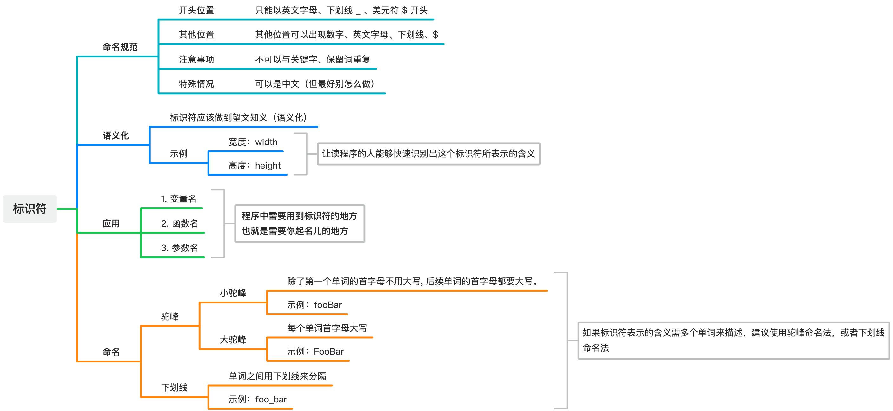

# [0014. 标识符](https://github.com/Tdahuyou/html-css-js/tree/main/0014.%20%E6%A0%87%E8%AF%86%E7%AC%A6)


<!-- region:toc -->
- [1. 📒 标识符](#1--标识符)
- [2. 💼 面试题.1 - 以下哪些标识符是合法的？](#2--面试题1---以下哪些标识符是合法的)
<!-- endregion:toc -->
- 知识点：
  - 标识符是什么
  - 标识符的命名规范
- 标识符其实就是一个名字。程序中需要你指定名字的地方有很多，比如：变量名、函数名、参数名。需要掌握标识符的命名规则，可以拿笔记中的面试题练练手。

## 1. 📒 标识符

- 思维导图
  - 
- **标识符（identifier）指的是用来识别各种值的合法名称。**
- 最常见的标识符就是 **变量名**，以及后面要提到的 **函数名、参数名**。
- JavaScript 语言的标识符对大小写敏感，所以 `a` 和 `A` 是两个不同的标识符。
- 标识符应该做到 **望文知义（语义化）**，比如：
  - 宽度：width
  - 高度：height
  - 尺寸：size
  - 性别：gender、sex、isMale
  - 横坐标：x
  - …… 等等
  - 一个完整的程序中，会涉及成百上千的标识符，好的名称不仅可以减少名称冲突，更有利于程序的阅读和维护。
- **标识符命名规范**
  - **开头位置：只能以英文字母、下划线 _ 、美元符 $ 开头**
  - **其他位置：其他位置可以出现数字、英文字母、下划线、$**
  - **注意事项：标识符不可以与关键字、保留词重复**
  - **特殊情况：标识符可以是中文（但最好别怎么做）**

## 2. 💼 面试题.1 - 以下哪些标识符是合法的？

```javascript
// 问：以下哪些标识符是合法的？
// var a1 = $
// var a2 = _
// var a3 = 1$
// var a4 = list-style
// var a5 = list_style
// var a6 = list style
// var a7 = $$
// var a8 = $emit
// var a9 = var
```


```javascript
// var a1 = $ // ✅
// var a2 = _ // ✅
// var a5 = list_style // ✅
// var a7 = $$ // ✅
// var a8 = $emit // ✅

// var a3 = 1$
// ❌
// 必须以字母或下划线打头

// var a4 = list-style
// var a6 = list style
// ❌
// 开头位置：只能以英文字母、下划线 _ 、美元符 $ 开头
// 其他位置：其他位置可以出现数字、英文字母、下划线、$
// 其他任何符号都是非法的

// var a9 = var
// ❌
// 标识符不可以与关键字、保留词重复
```
