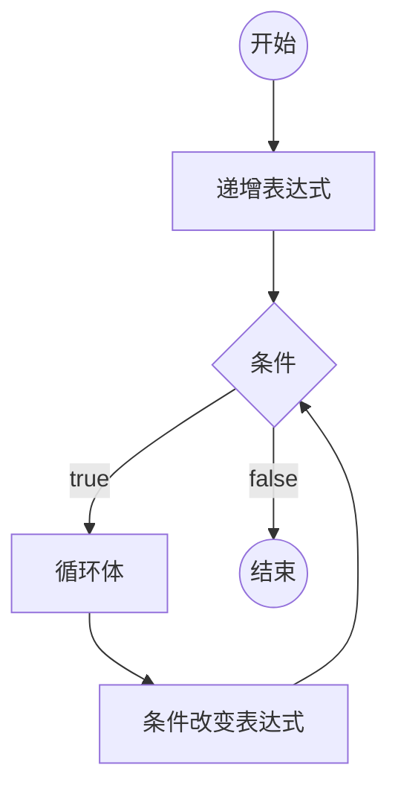

# [0015. 循环语句 - for 循环](https://github.com/Tdahuyou/TNotes.html-css-js/tree/main/notes/0015.%20%E5%BE%AA%E7%8E%AF%E8%AF%AD%E5%8F%A5%20-%20for%20%E5%BE%AA%E7%8E%AF)

<!-- region:toc -->

- [1. 📝 概述](#1--概述)
- [2. 📒 for 循环](#2--for-循环)
- [3. 💻 demos.1 - for 循环的基本使用](#3--demos1---for-循环的基本使用)
- [4. 💻 demos.2 - 使用 while 循环来替代 for 循环](#4--demos2---使用-while-循环来替代-for-循环)
- [5. 💻 demos.3 - 死循环](#5--demos3---死循环)
- [6. 🤔 问：应该使用 `for` 循环还是 `while` 循环？](#6--问应该使用-for-循环还是-while-循环)

<!-- endregion:toc -->

## 1. 📝 概述

- 知识点：
  - for 循环的基本结构
  - 死循环
  - 对比 for 循环和 while 循环

## 2. 📒 for 循环

- `for` 语句是循环命令的另一种形式，可以很直观地看到循环的 **起点** 和 **终止条件**，以及 **循环变量的在开始下一次循环时的变化情况**。
- **for 循环基本结构**

```javascript
for (初始化表达式; 条件; 递增表达式) 语句

// 或者

for (初始化表达式; 条件; 递增表达式) {
  语句
}
```

- `for` 语句后面的括号里面，有三个表达式，分别是：
  - **初始化表达式（initialize）：** 确定循环变量的初始值，只在循环开始时执行一次。
  - **条件表达式（test）：** 每轮循环开始时，都要执行这个条件表达式，只有值为真，才继续进行循环。
  - **递增表达式（increment）：** 每轮循环的最后一个操作，通常用来递增循环变量。
- `for` 语句的三个部分（initialize、test、increment），可以省略任何一个，也可以全部省略。



## 3. 💻 demos.1 - for 循环的基本使用

```javascript
var x = 3
for (var i = 0; i < x; i++) {
  console.log(i)
}

// 初始化表达式是 var i = 0 即初始化一个变量 i。
// 条件表达式是 i < x 即只要 i 小于 x，就会执行循环。
// 递增表达式是 i++，即每次循环结束后，i 增大 1。

// 最终输出结果：
// 0
// 1
// 2
```

## 4. 💻 demos.2 - 使用 while 循环来替代 for 循环

```javascript
var x = 3
var i = 0

while (i < x) {
  console.log(i)
  i++
}

// demos.1 中的 for 循环，也可以改为 while 的写法来实现。

// 最终输出结果：
// 0
// 1
// 2
```

## 5. 💻 demos.3 - 死循环

```javascript
for (;;) {
  console.log('Hello World')
}

// 该 demo 省略了 for 语句表达式的三个部分，结果就导致了一个无限循环。
```

## 6. 🤔 问：应该使用 `for` 循环还是 `while` 循环？

- A：都行
- 在前端领域，`for` 会更加常见一些。
- 所有 `for` 循环，都可以改写成 `while` 循环。同样的，所有的 `while` 循环也都可以改为 `for` 循环。其实，在流程控制语句中，用哪种写法并没有强制规定，大多都是可以替换着来的。比如 `if...else` 可以和 `switch` 替换，甚至可以和三目运算符 `?:` 替换。
- 初学阶段，不必纠结到底应该用哪个，只要能够把逻辑给实现了就行。等有了一定的撸代码经验之后，在遇到一些场景时，你会很自然地想到优先使用什么写法来实现。比如：
  - 使用 `for` 循环当你知道确切的迭代次数，或者需要遍历数组/列表时。
  - 使用 `while` 循环当循环次数不确定，或者需要等待某个条件满足时。
