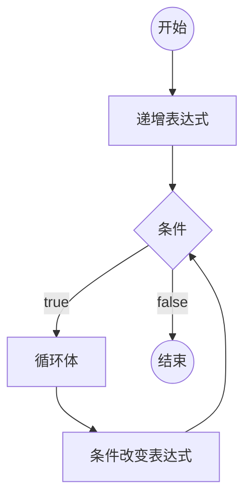

# [0015. 循环语句 - for 循环](https://github.com/Tdahuyou/TNotes.html-css-js/tree/main/notes/0015.%20%E5%BE%AA%E7%8E%AF%E8%AF%AD%E5%8F%A5%20-%20for%20%E5%BE%AA%E7%8E%AF)

<!-- region:toc -->

- [1. 🎯 本节内容](#1--本节内容)
- [2. 🫧 评价](#2--评价)
- [3. 📒 for 循环](#3--for-循环)
- [4. 💻 demos.1 - for 循环的基本使用](#4--demos1---for-循环的基本使用)
- [5. 💻 demos.2 - 使用 while 循环来替代 for 循环](#5--demos2---使用-while-循环来替代-for-循环)
- [6. 💻 demos.3 - 死循环](#6--demos3---死循环)
- [7. 🤔 应该使用 `for` 循环还是 `while` 循环？](#7--应该使用-for-循环还是-while-循环)

<!-- endregion:toc -->

## 1. 🎯 本节内容

- 掌握 for 循环的基本使用

## 2. 🫧 评价

- 在 JS 中，循环结构可以使用 for 或者 while 来实现，具体使用哪种写法其实都 ok，从使用频率来看，for 循环的使用频率会更高一些。

## 3. 📒 for 循环

- **JS 中的循环语句：**
  1. for
  2. while
  3. do-while
  - 根据常见程度来排名，最常见的是 for 循环，最不常见的是 do-while 循环。
- **循环相关的一些概念：**
  - **循环**：在循环条件满足的情况下，重复的运行循环体。
  - **循环体**：在循环条件成立后执行的一段代码，可以是一条语句，也可以是多条语句。
  - **死循环**：循环条件永远满足，永远无法退出循环。
- **循环中的关键字：**
  - `break` 跳出当前循环。
  - `continue` 停止当前循环体，继续下一次循环。

::: code-group

```javascript [for 循环基本结构]
for (初始化表达式; 条件; 递增表达式) 语句

// 或者

for (初始化表达式; 条件; 递增表达式) {
  语句
}
```

:::

- `for` 可以很直观地看到循环的 **起点** 和 **终止条件**，以及 **循环变量的在开始下一次循环时的变化情况**。
- `for` 语句后面的括号里面，有三个表达式，分别是：
  - **初始化表达式（initialize）：** 确定循环变量的初始值，只在循环开始时执行一次。
  - **条件表达式（test）：** 每轮循环开始时，都要执行这个条件表达式，只有值为真，才继续进行循环。
  - **递增表达式（increment）：** 每轮循环的最后一个操作，通常用来递增循环变量。
- `for` 语句的三个部分（initialize、test、increment），可以省略任何一个，也可以全部省略。



## 4. 💻 demos.1 - for 循环的基本使用

::: code-group

<<< ./demos/1/1.js

:::

## 5. 💻 demos.2 - 使用 while 循环来替代 for 循环

::: code-group

<<< ./demos/2/1.js

:::

## 6. 💻 demos.3 - 死循环

::: code-group

<<< ./demos/3/1.js

:::

## 7. 🤔 应该使用 `for` 循环还是 `while` 循环？

- A：都行
- 在前端领域，`for` 会更加常见一些。
- 所有 `for` 循环，都可以改写成 `while` 循环。同样的，所有的 `while` 循环也都可以改为 `for` 循环。其实，在流程控制语句中，用哪种写法并没有强制规定，大多都是可以替换着来的。比如 `if...else` 可以和 `switch` 替换，甚至可以和三目运算符 `?:` 替换。
- 初学阶段，不必纠结到底应该用哪个，只要能够把逻辑给实现了就行。等有了一定的撸代码经验之后，在遇到一些场景时，你会很自然地想到优先使用什么写法来实现。比如：
  - 使用 `for` 循环当你知道确切的迭代次数，或者需要遍历数组/列表时。
  - 使用 `while` 循环当循环次数不确定，或者需要等待某个条件满足时。
