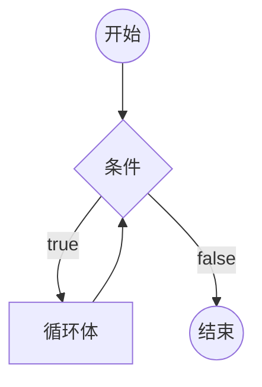

## 1. 本节内容

- 掌握 while 循环的基本使用

## 2. while 循环

- **while 循环：**
  - `while` 语句包括一个循环条件和一段代码块，只要条件为真，就不断循环执行代码块。
  - `while` 语句的循环条件是一个表达式，必须放在圆括号中。代码块部分，如果只有一条语句，可以省略大括号，否则就必须加上大括号。
- **while 循环基本结构**

```javascript
while (条件) 循环体
```



## 3. demos.1 - while 循环的基本使用

::: code-group

```js [1.js]
let i = 0

while (i < 100) {
  console.log('i 当前为：' + i)
  i = i + 1
}
// 上面的代码将循环 100 次，直到条件 i < 100 不成立为止。
```

:::

## 4. demos.3 - 使用 break 跳出循环体

::: code-group

```js [1.js]
let i = 0

while (i < 100) {
  if (i === 10) break // 当 i 等于 10 的时候，跳出循环。
  console.log('i 当前为：' + i)
  i = i + 1
}

// 输出结果：
// i 当前为：0
// i 当前为：1
// i 当前为：2
// i 当前为：3
// i 当前为：4
// i 当前为：5
// i 当前为：6
// i 当前为：7
// i 当前为：8
// i 当前为：9
```

:::

## 5. demos.2 - 死循环

::: code-group

```js [1.js]
while (true) {
  console.log('Hello, world')
}
// 这是一个无限循环，因为循环条件总是为真。
// 因此，这段程序将一直输出 "Hello, world"。
```

:::
