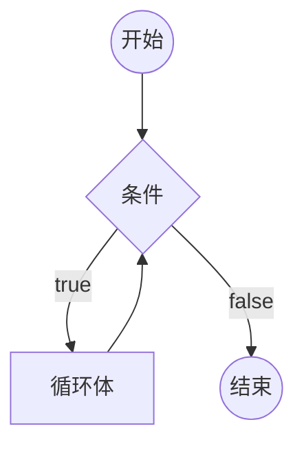

# [0016. 循环语句 - while 循环](https://github.com/Tdahuyou/TNotes.html-css-js/tree/main/notes/0016.%20%E5%BE%AA%E7%8E%AF%E8%AF%AD%E5%8F%A5%20-%20while%20%E5%BE%AA%E7%8E%AF)

<!-- region:toc -->

- [1. 📝 概述](#1--概述)
- [2. 📒 while 循环](#2--while-循环)
- [3. 💻 demos.1 - while 循环的基本使用](#3--demos1---while-循环的基本使用)
- [4. 💻 demos.3 - 使用 break 跳出循环体](#4--demos3---使用-break-跳出循环体)
- [5. 💻 demos.2 - 死循环](#5--demos2---死循环)

<!-- endregion:toc -->

## 1. 📝 概述

- 知识点：
  - 掌握 while 循环的基本使用

## 2. 📒 while 循环

- **while 循环：**
  - `while` 语句包括一个循环条件和一段代码块，只要条件为真，就不断循环执行代码块。
  - `while` 语句的循环条件是一个表达式，必须放在圆括号中。代码块部分，如果只有一条语句，可以省略大括号，否则就必须加上大括号。
- **while 循环基本结构**

```javascript
while (条件) 循环体
```



## 3. 💻 demos.1 - while 循环的基本使用

::: code-group

<<< ./demos/1/1.js {}

:::

## 4. 💻 demos.3 - 使用 break 跳出循环体

::: code-group

<<< ./demos/3/1.js {}

:::

## 5. 💻 demos.2 - 死循环

::: code-group

<<< ./demos/2/1.js {}

:::
