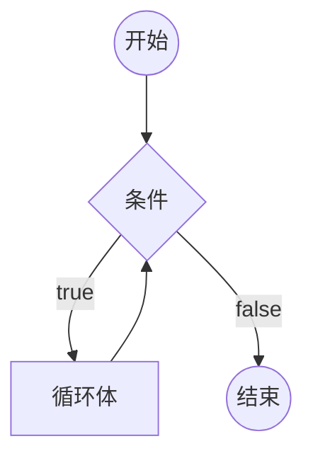

# [0016. 循环语句 - while 循环](https://github.com/Tdahuyou/TNotes.html-css-js/tree/main/notes/0016.%20%E5%BE%AA%E7%8E%AF%E8%AF%AD%E5%8F%A5%20-%20while%20%E5%BE%AA%E7%8E%AF)

<!-- region:toc -->

- [1. 📝 概述](#1--概述)
- [2. 📒 while 循环](#2--while-循环)
- [3. 💻 demos.1 - while 循环的基本使用](#3--demos1---while-循环的基本使用)
- [4. 💻 demos.2 - 使用 break 跳出循环体](#4--demos2---使用-break-跳出循环体)
- [5. 💻 demos.3 - 死循环](#5--demos3---死循环)

<!-- endregion:toc -->

## 1. 📝 概述

- 知识点：
  - while 循环的基本结构

## 2. 📒 while 循环

- **JS 中的循环语句：**
  1. for
  2. while
  3. do-while
- 根据常见程度来排名，最常见的是 for 循环，最不常见的是 do-while 循环。
- **循环相关的一些概念：**
  - **循环：**
    - 在循环条件满足的情况下，重复的运行循环体。
  - **循环体：**
    - 在循环条件成立后执行的一段代码，可以是一条语句，也可以是多条语句。
  - **死循环：**
    - 循环条件永远满足，永远无法退出循环。
- **循环中的关键字：**
  - `break` 跳出当前循环。
  - `continue` 停止当前循环体，继续下一次循环。
- **while 循环：**
  - `while` 语句包括一个循环条件和一段代码块，只要条件为真，就不断循环执行代码块。
  - `while` 语句的循环条件是一个表达式，必须放在圆括号中。代码块部分，如果只有一条语句，可以省略大括号，否则就必须加上大括号。
- **while 循环基本结构**

```javascript
while (条件) 循环体
```



## 3. 💻 demos.1 - while 循环的基本使用

```javascript
var i = 0

while (i < 100) {
  console.log('i 当前为：' + i)
  i = i + 1
}
// 上面的代码将循环 100 次，直到条件 i < 100 不成立为止。
```

## 4. 💻 demos.2 - 使用 break 跳出循环体

```javascript
var i = 0

while (i < 100) {
  if (i === 10) break // 当 i 等于 10 的时候，跳出循环。
  console.log('i 当前为：' + i)
  i = i + 1
}

// 输出结果：
// i 当前为：0
// i 当前为：1
// i 当前为：2
// i 当前为：3
// i 当前为：4
// i 当前为：5
// i 当前为：6
// i 当前为：7
// i 当前为：8
// i 当前为：9
```

## 5. 💻 demos.3 - 死循环

```javascript
while (true) {
  console.log('Hello, world')
}
// 这是一个无限循环，因为循环条件总是为真。
// 因此，这段程序将一直输出 "Hello, world"。
```
