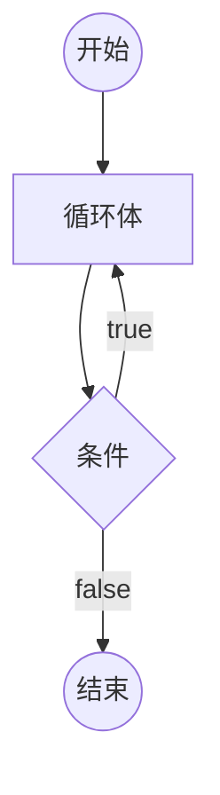

# [0017. 循环语句 - do...while 循环](https://github.com/Tdahuyou/TNotes.javascript/tree/main/notes/0017.%20%E5%BE%AA%E7%8E%AF%E8%AF%AD%E5%8F%A5%20-%20do...while%20%E5%BE%AA%E7%8E%AF)

<!-- region:toc -->

- [1. 🎯 本节内容](#1--本节内容)
- [2. 🫧 评价](#2--评价)
- [3. 📒 do...while 循环](#3--dowhile-循环)
- [4. 💻 demos.1 - 理解 do...while 循环的执行流程](#4--demos1---理解-dowhile-循环的执行流程)
- [5. 💻 demos.2 - 对比 do...while 和 while 之间的差异](#5--demos2---对比-dowhile-和-while-之间的差异)

<!-- endregion:toc -->

## 1. 🎯 本节内容

- 了解 do...while 循环的基本语法，知道它和 while 循环之间的差异。

## 2. 🫧 评价

- do...while 循环不常用，快速过有个印象，确保能读懂程序即可。

## 3. 📒 do...while 循环

- 在大多数代码库和开发者社区中，for 和 while 循环更为常见，do...while 循环很少会见到。
- `do...while` 循环与 `while` 循环类似，唯一的区别就是先运行一次循环体，然后判断循环条件。

::: code-group

```javascript [do...while 循环基本结构]
do 语句
while (条件)

// 或者
do {
  语句
} while (条件)
```

:::



- 不管条件是否为真，`do...while` 循环至少运行一次，这是这种结构最大的特点。另外需要注意不要省略 `while` 语句后面的分号。

## 4. 💻 demos.1 - 理解 do...while 循环的执行流程

::: code-group

<<< ./demos/1/1.js {}

:::

## 5. 💻 demos.2 - 对比 do...while 和 while 之间的差异

::: code-group

<<< ./demos/2/1.js {}

<<< ./demos/2/2.js {}

:::
