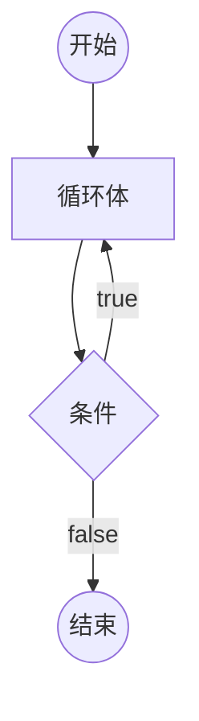

# [0017. 循环语句 - do...while 循环](https://github.com/Tdahuyou/html-css-js/tree/main/0017.%20%E5%BE%AA%E7%8E%AF%E8%AF%AD%E5%8F%A5%20-%20do...while%20%E5%BE%AA%E7%8E%AF)


<!-- region:toc -->
- [1. 📒 do...while 循环](#1--dowhile-循环)
- [2. 💻 demos.1 - 理解 do...while 循环的执行流程](#2--demos1---理解-dowhile-循环的执行流程)
- [3. 💻 demos.2 - 对比 do...while 和 while 之间的差异](#3--demos2---对比-dowhile-和-while-之间的差异)
<!-- endregion:toc -->
- 知识点：
  - 掌握 do...while 循环的基本语法
- do...while 循环不常用，快速过有个印象即可。

## 1. 📒 do...while 循环

- 掌握 do...while 循环的语法，知道它和 while 循环之间的差异。在大多数代码库和开发者社区中，for 和 while 循环更为常见，do...while 循环很少会见到。
- `do...while` 循环与 `while` 循环类似，唯一的区别就是先运行一次循环体，然后判断循环条件。
- **do...while 循环基本结构**

```javascript
do
  语句
while (条件);

// 或者
do {
  语句
} while (条件);
```



- 不管条件是否为真，`do...while` 循环至少运行一次，这是这种结构最大的特点。另外需要注意不要省略 `while` 语句后面的分号。

## 2. 💻 demos.1 - 理解 do...while 循环的执行流程

```javascript
var x = 3
var i = 0

do {
  console.log(i)
  i++
} while (i < x)

// 最终输出结果：
// 0
// 1
// 2
```

## 3. 💻 demos.2 - 对比 do...while 和 while 之间的差异

```js
let count = 0;
while (count > 0) {
    console.log("当前计数: " + count);
    count++;
}

// 没有任何输出
```

```js
let count = 0;
do {
    console.log("当前计数: " + count);
    count++;

    if (count > 10) break; // 以防死循环
} while (count > 0);

// 输出：
// 当前计数: 0
// 当前计数: 1
// 当前计数: 2
// 当前计数: 3
// 当前计数: 4
// 当前计数: 5
// 当前计数: 6
// 当前计数: 7
// 当前计数: 8
// 当前计数: 9
// 当前计数: 10
```