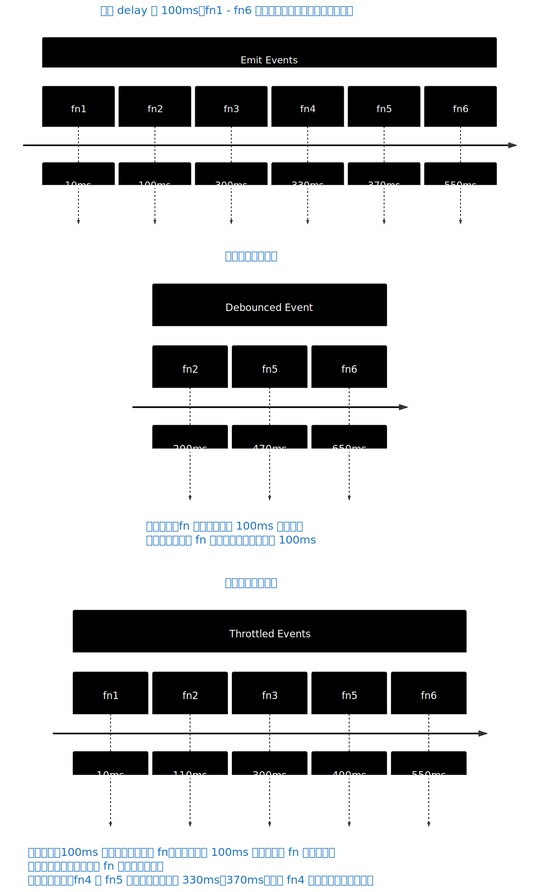

# [0037. 防抖、节流](https://github.com/tnotesjs/TNotes.javascript/tree/main/notes/0037.%20%E9%98%B2%E6%8A%96%E3%80%81%E8%8A%82%E6%B5%81)

<!-- region:toc -->

::: details 📚 相关资源

- [📂 TNotes.yuque（笔记附件资源）](https://www.yuque.com/tdahuyou/tnotes.yuque/)
  - [TNotes.yuque.javascript.0037](https://www.yuque.com/tdahuyou/tnotes.yuque/javascript.0037)

:::

- [1. 🎯 本节内容](#1--本节内容)
- [2. 🫧 评价](#2--评价)
- [3. 💡 一张图说明防抖和节流的事件触发差异](#3--一张图说明防抖和节流的事件触发差异)
- [4. 📒 防抖](#4--防抖)
- [5. 📒 节流](#5--节流)
- [6. 🆚 防抖、节流](#6--防抖节流)
- [7. 💻 demos.1 - 输入框内容校验 - 防抖](#7--demos1---输入框内容校验---防抖)
- [8. 💻 demos.2 - 窗口尺寸变化 - 节流](#8--demos2---窗口尺寸变化---节流)
- [9. 🔗 引用](#9--引用)

<!-- endregion:toc -->

## 1. 🎯 本节内容

- 理解防抖
- 理解节流
- 完成 leetcode 算法题

## 2. 🫧 评价

- 防抖（debouncing）和节流（throttling）都是用来控制函数调用频率的技术解决方案。
- 笔记中对防抖和节流的区别做了详细的说明，可以结合说明图片来辅助理解。
- 在开发中根据实际需求选择适合的方案（防抖 or 节流）即可，最终目的基本上都是为了解决由于事件高频触发导致的一些问题。（可能是性能优化，也可能是用户体验优化 ……）
- 在笔记的结尾，记录了 leetcode 上两道算法题 - 防抖、节流，可以顺带着把这两题给刷了。
- 注意：
  - 你可能会发现在不同的文章中，对于防抖和节流的介绍会有所不同，主要差异点无非就是第一次和最后一次的触发问题。
  - 没有哪个正宗，哪个冒牌的说法，它们的核心原理都是一样的。
  - 重要的是，如果你的业务场景对第一次和最后一次触发有严格要求，需要知道这些细微的差异，应该如何通过编码来实现。

## 3. 💡 一张图说明防抖和节流的事件触发差异

- 
- 从中文语义角度来理解：
  - 防抖：停止抖动才会触发，如果不停地抖，那么永远不会触发。
  - 节流：调整好水龙头的流速，在指定的时间间隔到了之后，才会流出一滴水。

## 4. 📒 防抖

- **防抖是什么**
  - 防抖是指短时间内大量触发同一事件，只会在 **最后一次事件完成后** 延迟执行一次函数。
- **防抖的应用场景**
  - 例如，在输入用户名的过程中，需要反复验证用户名。此时应该等待用户停止输入，然后进行验证，否则将影响用户体验及程序性能。
- **防抖的实现**
  - **防抖实现的原理是在每次触发事件后，清空之前的计时器，并重启一个新的计时器。**
  - **在 delay 时间内，若事件触发多次，只有最有一次的事件会在延迟 delay 时间后被执行。**

```javascript
var debounce = function (fn, delay) {
  let timer
  return function (...args) {
    clearTimeout(timer)
    timer = setTimeout((_) => fn(...args), delay)
  }
}
```

## 5. 📒 节流

- **节流是什么**
  - 可以通过类比来理解“节流”这个词，它就好比未拧紧的水龙头一样，水龙头每隔一段时间就会滴水（节流是每隔一段时间就执行一次函数）。即使在这段时间管道里有更多的水，水龙头也不会掉更多的水。
- **节流的一些细节**
  - 节流是有分类的，可以来思考一个问题：如果我们设定的延迟时间是 50ms，某个事件 fn 在 10ms、30ms 触发，那么这个事件的分别会在什么时刻被执行呢？
- **🤔 首次触发时，也就是 10ms 时，是否需要执行？**
  - 答：都行，看具体要求。比如 LeetCode 上的题目就要求在首次触发的时候，立刻执行一遍 fn。但是，也有很多时候并不是这么处理的，而是直接采取延迟处理的方式。
  - 其实，防抖也有这么一个首次触发的细节问题，具体要如何处理，看具体的需求而定。不过，首次不触发的情况会更加常见一些。
- **🤔 在 fn 被触发时（即 10ms 时，记作 fn1），需要进入延迟等待阶段，在这个阶段中再去触发 fn（记作 fn2），这个 fn2 的调用是否需要被记录下来，等上一个阶段的 fn1 调用结束后再调用延迟 50ms 调用 fn2？**
  - 答：还是都行，得看具体要求。
  - 比如 LeetCode 上的题目就要求在要把那些在延迟期间触发的事件以及参数都给记录下来，等待延迟结束后，再拿来执行。
  - 但是，也有很多时候我们会在有计时器的情况下直接 return，不去管那些在 delay 期间触发的事件。这种情况甚至可以不使用计时器，直接将 delay 期间的所有事件都忽略掉。示例见笔记中的 demos.2。
- **节流的实现**
  - **节流的原理是在触发事件后设置计时器。**
  - 注意，这里说的是重置计时器，并不是直接清空计时器，这一点跟防抖是不同的。
  - 这里的重置，是重置计时器的时间。
  - 每当事件触发之后，都要计算下次这个事件再允许被触发的时刻是什么时候，只要计算的时刻还没到，即便再次之前触发 n 次，也只会在计算的时刻被执行一次。

```javascript
var throttle = function (fn, delay) {
  const now = Date.now

  let timer
  let nextTimeToCallFn = 0
  return (...args) => {
    // 首次调用 fn，会立刻触发一次。
    const duration = Math.max(0, nextTimeToCallFn - now())
    clearTimeout(timer)
    timer = setTimeout(() => {
      fn(...args)
      // 每次 fn 触发后，都会重新计算下一次 fn 触发的延迟时间。
      nextTimeToCallFn = now() + delay
    }, duration)
  }
}
```

- 下面是对上述这个节流版本的说明：
- 

## 6. 🆚 防抖、节流

- **防抖**：
  - 确保在一段时间内没有新的事件触发后，才执行一次函数。
  - 它适用于用户停止频繁操作后才需要执行函数的场景。
- **节流**：
  - 限制函数在一定时间间隔内最多执行一次，适用于高频率触发但希望在指定时间间隔内执行固定次数的场景。
- **应用场景举例**

```javascript
// 【debounce】
// 搜索框输入
// 用户输入时实时搜索，但希望只在用户停止输入后一段时间才发起搜索请求。
input.addEventListener('input', debounce(handleSearch, 300))

// 窗口大小调整
// 用户调整浏览器窗口大小时，重新布局或渲染页面，只在用户停止调整窗口大小后进行操作。
window.addEventListener('resize', debounce(handleResize, 200))

// 表单验证
// 用户输入表单内容时，实时验证但希望只在用户停止输入后进行验证。
input.addEventListener('input', debounce(validateInput, 300))

// 【throttle】
// 滚动事件
// 页面滚动时，每隔一段时间执行一次函数，避免因为高频率滚动事件导致性能问题。
window.addEventListener('scroll', throttle(handleScroll, 100))

// 窗口大小调整
// 用户调整浏览器窗口大小时，每隔一段时间执行一次重新布局或渲染操作。
window.addEventListener('resize', throttle(handleResize, 200))

// 按钮点击
// 防止用户在短时间内多次点击按钮，确保在规定时间内按钮点击事件只触发一次。
button.addEventListener('click', throttle(handleClick, 500))

// 拖拽事件
// 用户拖拽元素时，每隔一段时间更新一次位置，避免频繁计算导致性能问题。
element.addEventListener('drag', throttle(handleDrag, 100))
```

## 7. 💻 demos.1 - 输入框内容校验 - 防抖

::: code-group

<<< ./demos/1/1.js

<<< ./demos/1/1.html

:::

- 
- 当用户在输入框中输入内容时，输入事件会被防抖函数处理，只有在用户停止输入 300 毫秒后，才会更新显示的内容。这样可以避免频繁的事件触发，提高性能。

## 8. 💻 demos.2 - 窗口尺寸变化 - 节流

::: code-group

<<< ./demos/2/1.js

<<< ./demos/2/1.html

:::

- 

## 9. 🔗 引用

- [leetcode - 实现函数防抖][1]
- [leetcode - 实现函数节流][2]

[1]: /TNotes.leetcode/notes/2627
[2]: /TNotes.leetcode/notes/2676
