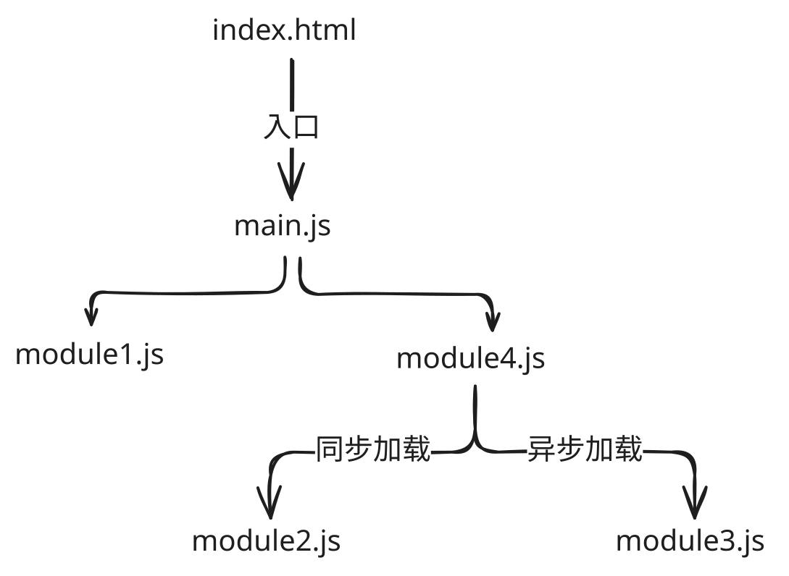

## 1. 本节内容

- CMD 规范

## 2. 评论

和 AMD 一样，CMD 也可以说几乎完全退出历史舞台了，很少场景会使用到它，简单了解一下它的导入导出写法，能读懂程序即可。

## 3. CMD 是什么？

### 3.1. CMD

CMD（Common Module Definition）是一种通用模块定义规范，由中国程序员玉伯提出，专为浏览器端设计。

- 就近依赖，按需加载，加载时机更符合 CommonJS 语法习惯
- 延迟执行，只在使用时才下载和执行模块
- 语法更接近 CommonJS，符合开发者习惯
- 代表实现：Sea.js
- 依赖无法并行加载，可能导致级联网络请求，弱网环境性能不如 AMD
- 目前（2025）AMD 和 CMD 都已退出历史舞台，主流规范是 CommonJS 和 ES Module

### 3.2. Sea.js 简介

Sea.js 是遵循 CMD 规范的模块加载器，由阿里前工程师 [玉伯][7] 开发。

Sea.js 包下载地址：[Sea.js 官网][2]

::: tip Sea.js 的作者“玉伯” 同时也是“语雀”的作者


图片来源：[yuque garden][4]

:::

### 3.3. 基本用法

引入 Sea.js：

```html
<!-- AMD 写法对比 -->
<!-- <script data-main="./index.js" src="./require.js"></script> -->

<!-- CMD 写法 -->
<script src="./sea.js"></script>
<script>
  seajs.use('./index.js')
</script>
```

定义模块：

```js
define(function (require, exports, module) {
  // 模块内部代码
  // 导入和导出必须在 define 函数中
})
```

### 3.4. 🆚 AMD vs CMD

| 对比项   | AMD                      | CMD                        |
| -------- | ------------------------ | -------------------------- |
| 依赖声明 | 依赖前置，提前声明       | 就近依赖，按需声明         |
| 加载时机 | 并行加载所有依赖         | 按需加载，延迟执行         |
| 语法风格 | 早期不支持 CommonJS 风格 | 更早支持 CommonJS 风格写法 |
| 历史地位 | 已退出历史舞台           | 已退出历史舞台             |

- 早期观点：CMD 更好用，因为更接近 CommonJS 规范
- 后期发展：RequireJS 也支持了类 CommonJS 写法，差异缩小
- 现状：两者都已被 ES Module 取代

## 4. demos.1 - Sea.js 的基本使用

::: code-group

```bash [目录结构]
# 目录结构
├── index.html
├── libs
│   └── sea.js # 需要手动下载后引入
└── modules
    ├── main.js
    ├── module1.js
    ├── module2.js
    ├── module3.js
    └── module4.js
```

```html [index.html]
<!-- ./index.html -->
<!DOCTYPE html>
<html>
  <head>
    <meta charset="utf-8" />
    <title>CMD test</title>
  </head>
  <body></body>
  <script src="libs/sea.js"></script>
  <script>
    seajs.use('./modules/main')
  </script>
</html>
```

```js [main.js]
// ./js/modules/main.js
define(function (require) {
  var m1 = require('./module1');
  var m4 = require('./module4');
  m1.show();
  m4.show();
});
```

```js [module1.js]
// ./js/modules/module1.js
define(function (require, exports, module) {
  // 内部变量数据
  var data = 'module1 data';
  // 内部函数
  function show() {
    console.log('[module1]: ' + data);
  }

  // 向外暴露
  exports.show = show;
});
```

```js [module2.js]
// ./js/modules/module2.js
define(function (require, exports, module) {
  module.exports = {
    msg: 'module2 msg',
  };
});
```

```js [module3.js]
// ./js/modules/module3.js
define(function (require, exports, module) {
  const API_KEY = 'abc123';
  exports.API_KEY = API_KEY;
});
```

```js [module4.js]
// ./js/modules/module4.js
define(function (require, exports, module) {
  // 引入依赖模块（同步）
  var module2 = require('./module2');

  function show() {
    console.log('[module4]: ' + module2.msg);
  }

  exports.show = show;
  // 引入依赖模块（异步），最后执行，因为是异步的，主线的先执行完才会执行这
  require.async('./module3', function (m3) {
    console.log('异步引入依赖模块3：' + m3.API_KEY);
  });
});
```

:::

依赖关系：



打开 index.html 控制台输出结果：


## 5. 引用

- [Common Module Definition / draft][3]
  - CMD 规范草案
- [Sea.js 官网][2]
- [Sea.js github][5]
- Sea.js 作者
  - [微博 - 玉伯也叫黑侠][1]
  - [github - lifesinger][7]
  - [x - lifesinger][6]
- [yuque garden][4]

[1]: https://weibo.com/lifesinger
[2]: https://seajs.github.io/seajs/docs/#intro
[3]: https://github.com/cmdjs/specification/blob/master/draft/module.md
[4]: https://www.yuque.com/yuquegarden
[5]: https://github.com/seajs/seajs/
[6]: https://x.com/lifesinger
[7]: https://github.com/lifesinger
