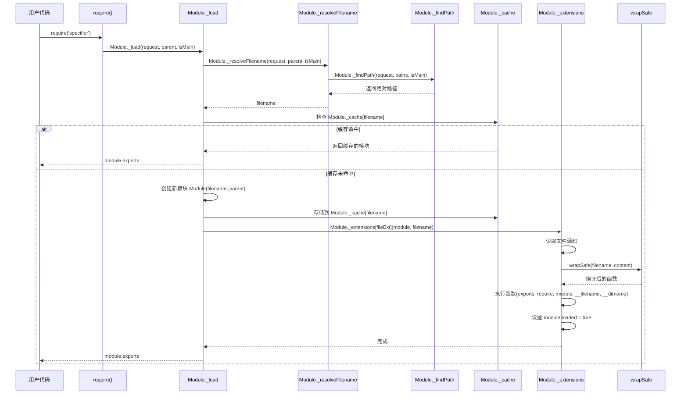

# [0070. CommonJS](https://github.com/tnotesjs/TNotes.javascript/tree/main/notes/0070.%20CommonJS)

<!-- region:toc -->

::: details 📚 相关资源

- [📂 TNotes.yuque（笔记附件资源）](https://www.yuque.com/tdahuyou/tnotes.yuque/)
  - [TNotes.yuque.javascript.0070](https://www.yuque.com/tdahuyou/tnotes.yuque/javascript.0070)

:::

- [1. 🎯 本节内容](#1--本节内容)
- [2. 🫧 评价](#2--评价)
- [3. 💡 思维导图](#3--思维导图)
- [4. 🤔 CommonJS 是什么？](#4--commonjs-是什么)
- [5. 🤔 CommonJS 规范的具体内容是？](#5--commonjs-规范的具体内容是)
  - [5.1. Modules/1.0](#51-modules10)
  - [5.2. CommonJS 模块](#52-commonjs-模块)
  - [5.3. `require` 函数](#53-require-函数)
  - [5.4. `exports` 对象](#54-exports-对象)
- [6. 🤔 入口文件是什么？](#6--入口文件是什么)
- [7. 🤔 CommonJS 模块加载流程是？](#7--commonjs-模块加载流程是)
  - [7.1. 时序图](#71-时序图)
  - [7.2. 模块的加载和执行](#72-模块的加载和执行)
  - [7.3. 核心包装逻辑](#73-核心包装逻辑)
  - [7.4. `exports` vs `module.exports`](#74-exports-vs-moduleexports)
  - [7.5. 模块隔离机制](#75-模块隔离机制)
  - [7.6. 按需加载机制](#76-按需加载机制)
  - [7.7. 模块缓存机制](#77-模块缓存机制)
- [8. 💻 demos.1 - 模块入口](#8--demos1---模块入口)
- [9. 💻 demos.2 - 模块导出](#9--demos2---模块导出)
  - [9.1. demos.2.1 - 模块导出的两种写法](#91-demos21---模块导出的两种写法)
  - [9.2. demos.2.2 - `exports` 和 `module.exports` 共存的情况](#92-demos22---exports-和-moduleexports-共存的情况)
- [10. 💻 demos.3 - 模块导入](#10--demos3---模块导入)
- [11. 💻 demos.4 - 模块缓存](#11--demos4---模块缓存)
  - [11.1. demos.4.1 - 缓存机制](#111-demos41---缓存机制)
  - [11.2. demos.4.2 - 缓存位置 `require.cache`](#112-demos42---缓存位置-requirecache)
- [12. 💻 demos.5 - 模拟 `require`](#12--demos5---模拟-require)
- [13. 💻 demos.6 - 小练习 - 实现斗地主洗牌发牌逻辑](#13--demos6---小练习---实现斗地主洗牌发牌逻辑)
- [14. 🔗 引用](#14--引用)

<!-- endregion:toc -->

## 1. 🎯 本节内容

- CommonJS 规范的原文
- 入口文件的概念和书写位置
- CommonJS 模块导出的基本写法
- CommonJS 模块路径解析细节
- CommonJS 模块的同步加载机制
- CommonJS 模块的缓存机制
- `require` 的实现原理简介

## 2. 🫧 评价

源码层面的一些实现细节，可以参考 [DeepWiki - NodeJS][5] 文档。

cjs loader 的核心原理封装在了 NodeJS 的 [lib/internal/modules/cjs/loader.js][4] 模块中，对具体的细节感兴趣的话，可以打开瞅瞅，代码量一共 `2k+` 行左右。

## 3. 💡 思维导图

```markmap

<<< ./assets/1.md

```

## 4. 🤔 CommonJS 是什么？

::: tip 💡 维基百科的定义

CommonJS 是一个项目，其目标是为 JavaScript 在网页浏览器之外创建模块约定。创建这个项目的主要原因是当时缺乏普遍可接受形式的 JavaScript 脚本模块单元，模块在与运行 JavaScript 脚本的常规网页浏览器所提供的不同的环境下可以重复使用。

:::

CommonJS 是一套为服务器端 JavaScript 应用（NodeJS 应用）设计的模块化标准。

可以说 CommonJS 是一种 JavaScript 环境中模块化编程的规范，它定义了一套模块化导入和导出的语法和机制，旨在解决 JavaScript 在模块化方面的缺陷。

为了方便，我们会将 CommonJS 简称为 CJS。

## 5. 🤔 CommonJS 规范的具体内容是？

### 5.1. Modules/1.0

[Modules/1.0][2] 这是维基百科上记录的关于 CommonJS 规范的具体描述，NodeJS 的 `require` / `module.exports` 就是基于它实现的。


维基百科上记录的这些内容应该算是最权威的了，CommonJS 是一个社区提出的规范，并没有类似 ECMAScript 那样的官方组织。在写这篇笔记时，并没在网上找到对应的官方文档。

通过查看 Modules/1.0 中的内容，你会发现，类似这样的一些技术规范，你很少会看到什么代码块，因为它们只负责描述应该如何如何，而不负责具体实现。落地这些规范，就是 NodeJS 要干的事儿了。

以下内容是对 CommonJS 规范中的一些要点的记录，其中核心有 3 个：

1. 模块 -> 一个个文件
2. 导入 -> 模块中的 `require` 函数
3. 导出 -> 模块中的 `exports` 对象

### 5.2. CommonJS 模块

在 CommonJS 规范中，一个文件默认就是一个模块，因此，在 NodeJS 中，对于 Module 的定义，也是一样的 👉 一个文件就是一个 Module。


在 CommonJS 模块中，文件内定义的变量和函数都是局部的，不会污染全局作用域。这意味着模块内部的变量、函数等不会影响到其他模块或全局作用域，彼此之间是相互隔离的。

### 5.3. `require` 函数

`require` 是一个函数，用于导入其他模块的导出内容。当你调用 `require` 并传入一个模块标识符（可以是模块的名称、相对路径或绝对路径），它会返回所请求模块的 `exports` 对象或 `module.exports` 指定的值。

### 5.4. `exports` 对象

`exports` 是一个特殊的对象，用于导出模块要暴露出去的 API。模块可以将其内部的函数、对象或值添加到 `exports` 对象中，使得其他模块可以通过 require 函数访问这些导出的内容。除了使用 `exports`，还可以使用 `module.exports` 直接导出一个值，这将覆盖 `exports` 对象。

## 6. 🤔 入口文件是什么？

入口文件通常是 index.js 或者由 package.json 中的 main 字段指定的文件，这个入口文件是启动应用时 NodeJS 运行的第一个文件。

一个复杂的应用通常不会把所有的业务逻辑都写在一个文件里，因此入口文件确实就是一个根，它里边儿的代码量其实并不会很多，CommonJS 会根据这个根去分析依赖关系，生成依赖树结构，这棵树的不同分支上存储着不同的不同的业务逻辑，这棵树整体构成了我们所谓的应用。


在 NodeJS 中，有且仅有一个入口文件（启动文件），而开发一个应用肯定会涉及到多个文件配合，因此 NodeJS 需要一套模块化规范来各个模块的导入、导出问题。由于 NodeJS 刚刚发布的时候，前端没有统一的、官方的模块化规范，因此，它选择使用社区提供的 CommonJS 作为模块化规范。

## 7. 🤔 CommonJS 模块加载流程是？

通过熟悉 CommonJS 模块的加载流程，可以帮助我们理清关于 CommonJS 中的诸多细节。

### 7.1. 时序图



这个时序图展示了 CommonJS 模块从 `require()` 调用到最终返回 `module.exports` 的完整过程，核心步骤：

1. 路径解析 - 将模块标识符解析为绝对路径（模块的唯一标识）
2. 缓存检查 - 检查 `Module._cache` 是否已加载过该模块
   - 命中：直接返回缓存的 `module.exports`
   - 未命中：继续后续步骤
3. 创建模块 - 实例化新的 `Module` 对象并存入缓存
4. 读取编译 - 读取源码并用 `wrapSafe` 包装成函数
5. 执行导出 - 执行包装函数，设置 `module.loaded = true`，返回 `module.exports`

### 7.2. 模块的加载和执行

CommonJS 在加载模块时是同步的。

模块的加载和执行对应上述时序图中的第 4、5 步骤，在这个阶段中，模块内容的读取、包装、执行都是同步进行的。

当调用 `require()` 函数加载模块时，NodeJS 会阻塞当前代码的执行，直到目标模块被完整地读取、编译、执行完毕并返回 `module.exports`。

同步加载的优缺点：

- 优点（服务器端）：文件系统 IO 速度快，机会不会影响用户体验
- 缺点（浏览器端）：会阻塞 UI 渲染，导致页面卡死，对用户体验影响很大

这就是为什么 CommonJS 只适用于 NodeJS 环境，而不适用于浏览器环境的根本原因。也正因如此，后来 ECMAScript 官方推出了支持异步加载的 ES Module 规范。

### 7.3. 核心包装逻辑

下面我们将通过一段伪代码片段来了解 NodeJS 内部的实现逻辑，截取其中一些必要的包装逻辑来做一个简要的说明。

为了实现 CommonJS 规范，NodeJS 对 module（模块，也就是一个个文件） 做了以下处理：

```js
;(function (module) {
  // step1.
  // 在模块开始执行前
  // 初始化一个值 module.exports = {}
  // 这个值就是需要导出的玩意儿
  module.exports = {}

  // step2.
  // 为了方便开发者便捷的导出
  // NodeJS 在初始化完 module.exports 后
  // 又声明了一个变量 exports 并将其赋值为 module.exports
  // 这就是为什么在模块中使用 exports 也可以导出模块中内容的原因
  var exports = module.exports

  // step3.
  // ... 文件内容
  // 这部分是从指定模块中读取到的代码
  // 这些内容都是封装到一个函数中去执行的
  // 这就是为什么 CommonJS 模块中的内容不会污染全局的原因

  // step4.
  // 最终导出的是 module.exports
  return module.exports
})()
```

### 7.4. `exports` vs `module.exports`

推荐使用 `module.exports`

虽然 `module.exports` 和 `exports` 都可以实现导出，但建议优先使用 `module.exports`，原因如下：

1. `module.exports` 是最终导出值 - 它是模块真正返回的内容
2. `exports` 只是引用 - 它仅仅是指向 `module.exports` 的一个便捷引用
3. `module.exports` 更灵活 - 可以直接导出任何类型的值

为什么 `exports` 可能失效？

```js
;(function (module) {
  // step1. NodeJS 初始化 module.exports
  module.exports = {}

  // step2. 创建 exports 引用
  var exports = module.exports

  // step3. 模块代码执行
  // ❌ 危险：对 module.exports 重新赋值会导致 exports 失效
  exports.a = 1 // 设置在旧对象上
  exports.b = 2 // 设置在旧对象上

  // ⚠️ 重新赋值
  // 这一步会切断与 exports 的联系
  module.exports = {
    c: 3,
  }

  exports.d = 4 // 这个赋值毫无意义，因为 exports 已经不指向最终导出的对象了

  // step4. 返回 module.exports (而不是 exports)
  return module.exports // 最终只会导出 { c: 3 }
})()
```

使用建议：

- ✅ 推荐：`module.exports = { ... }` 或 `module.exports.xxx = xxx`
- ⚠️ 谨慎：`exports.xxx = xxx`（仅在确定不会重新赋值 `module.exports` 时使用）
- ❌ 避免：同时混用 `exports` 和 `module.exports` 重新赋值

示例对比：

```js
// ✅ 安全的做法
module.exports = {
  name: 'Tdahuyou',
  age: 26,
}

// ✅ 也可以这样
module.exports.name = 'Tdahuyou'
module.exports.age = 26

// ⚠️ 这样可以，但不推荐（容易出错）
exports.name = 'Tdahuyou'
exports.age = 26

// ❌ 错误示范：exports 会失效
exports.name = 'Tdahuyou'
module.exports = { age: 26 } // name 不会被导出
```

### 7.5. 模块隔离机制

为什么模块中的代码不会污染全局？

因为 NodeJS 在执行模块时，会将模块代码包装在一个函数中执行，这样模块内部声明的变量和函数都成为了该函数的局部变量，从而实现了作用域隔离。

### 7.6. 按需加载机制

NodeJS 只有在执行到 `require()` 函数时才会加载并执行对应的模块，这种按需加载的策略保证了高效执行，避免加载不必要的模块。

### 7.7. 模块缓存机制

同一个模块被多次引用时不会重复执行。

NodeJS 默认开启了模块缓存机制，当模块第一次被加载后，会将其导出结果缓存到 `Module._cache` 中。后续再次引用该模块时，直接返回缓存的结果，不会重新执行模块代码。

## 8. 💻 demos.1 - 模块入口

demos.1 的目录结构

```txt
.
├── entry-file-1
│   ├── index.js
│   ├── main.js
│   └── package.json
├── entry-file-2
│   ├── index.js
│   ├── main.js
│   └── package.json
├── index.js
└── package.json
```

`demos/1/entry-file-1` 文件夹内容：

::: code-group

<<< ./demos/1/entry-file-1/package.json {4}

<<< ./demos/1/entry-file-1/index.js {}

<<< ./demos/1/entry-file-1/main.js {}

:::

`demos/1/entry-file-2` 文件夹内容：

::: code-group

<<< ./demos/1/entry-file-2/package.json {4}

<<< ./demos/1/entry-file-2/index.js {}

<<< ./demos/1/entry-file-2/main.js {}

:::

::: code-group

```bash [测试]
node index.js
# ./entry-file-1/index.js called
# ./entry-file-2/main.js called
```

<<< ./demos/1/index.js {} [index.js]

:::

- 通过对应目录下的 `package.json` 文件的 `main` 字段查看。
  - 在 `entry-file-1` 中，入口文件是 `index.js`
  - 在 `entry-file-2` 中，入口文件是 `main.js`
- `require('./entry-file-1')` 这种写法相当于直接引用 `'entry-file-1'` 下面的入口文件 index.js
- `require('./entry-file-2')` 这种写法相当于直接引用 `'entry-file-2'` 下面的入口文件 main.js

## 9. 💻 demos.2 - 模块导出

### 9.1. demos.2.1 - 模块导出的两种写法

::: code-group

<<< ./demos/2/1/module1.js

<<< ./demos/2/1/module2.js

<<< ./demos/2/1/module3.js

:::

导出的写法有两种：

- `exports.xxx = xxx`
- `module.exports = xxx`

不同模块中的内容是互相隔离的，不会互相污染，一个模块中未导出的成员，对于另一个模块来说是完全隐藏的。

### 9.2. demos.2.2 - `exports` 和 `module.exports` 共存的情况

::: code-group

<<< ./demos/2/2/index.js

<<< ./demos/2/2/module1.js

<<< ./demos/2/2/module2.js

<<< ./demos/2/2/module3.js

<<< ./demos/2/2/module4.js

:::

```bash
$ node index.js
# module1: { a: 123, b: 456 }
# module2: { a: 123, b: 456 }
# module3: { a: 123, b: 456 }
# module4: { b: 456 }
```

`module1`、`module2`、`module3` 完全等效，因为没有破坏 `module.exports` 的指向。`module4` 对 `module.exports` 进行了重新赋值，而最终导出的就是 `module.exports`，因此所有的 `exports.xxx = xxx` 都是无意义的。

## 10. 💻 demos.3 - 模块导入

::: code-group

<<< ./demos/3/module1.js

<<< ./demos/3/module2.js

<<< ./demos/3/module3.js

:::

在中导入模块，可以使用相对路径，但是，相对路径必须以 `./` 或者 `../` 开头。`require('./module1.js')` 和 `require('module1.js')`，在 NodeJS 中，这两种写法所表示的含义是不同的。

`require('./module1.js')` 这种写法使用了相对路径（以 `./` 开头），表示要加载的模块文件位于当前文件所在目录下。NodeJS 会根据提供的相对路径查找 `module1.js` 文件并加载它。

`require('module1.js')` 这种写法没有使用相对路径或绝对路径，而是直接给出了模块的名称。在这种情况下，NodeJS 会按照以下顺序查找模块。

1. 首先，NodeJS 会检查是否有内置的核心模块名为 `module1.js`
2. 如果没有找到内置模块，NodeJS 接着会在本地 `node_modules` 目录中查找名为 `module1.js` 的模块
3. 如果在 `node_modules` 中仍然没有找到，NodeJS 会继续在上层目录的 `node_modules` 中查找，直到到达文件系统的根目录

通常来说，当你想要加载自己项目中的一个模块文件时，你应该使用相对路径（如 `./module1.js` 或 `../someOtherDir/module2.js`）。而当你想要加载一个第三方库或者内置模块时，你应该直接使用模块名称（如 `require('express')` 或 `require('http')`）。

## 11. 💻 demos.4 - 模块缓存

### 11.1. demos.4.1 - 缓存机制

一个模块被引入之后，NodeJS 会记录这个模块的导出结果并缓存起来，下次再引入该模块时，会直接使用之前的缓存结果。

::: code-group

<<< ./demos/4/1/module1.js

<<< ./demos/4/1/module2.js

:::

在 `module2.js` 中，当执行到 require 函数时，会同时执行 `module1.js` 文件中的代码。如果一个模块被同时导入多次，那么该模块也只会被执行一次。因此，如果你的目的仅仅是想要把某个脚本运行一遍，并不需要依赖这个模块导出的任何内容，那么直接 `require` 一下即可。

### 11.2. demos.4.2 - 缓存位置 `require.cache`

`require.cache` 指向缓存对象，必要的时候可以通过读写这个对象来管理模块缓存数据。

::: code-group

<<< ./demos/4/2/myModule.js

<<< ./demos/4/2/1.js

<<< ./demos/4/2/2.js

<<< ./demos/4/2/3.js

<<< ./demos/4/2/4.js

<<< ./demos/4/2/5.js

<<< ./demos/4/2/6.js

:::

## 12. 💻 demos.5 - 模拟 `require`

::: code-group

<<< ./demos/5/module1.js

<<< ./demos/5/module2.js

<<< ./demos/5/module3.js

:::

3 个 module 之间的关系：`module1 + module2 = module3` => module2 导入 module1，就相当于是 module3。

`node module2.js` 和 `node module3.js` 将得到相同的输出结果：

```bash
node module2.js # 或者 node module3.js
# module1 called
# 1
# 2
# 3
# { name: 'Tdahuyou', bilibili: 'https://space.bilibili.com/407241004' }
# 100
# undefined
```

## 13. 💻 demos.6 - 小练习 - 实现斗地主洗牌发牌逻辑

制作一个斗地主洗牌发牌的程序，练习 CommonJS 模块的导入、导出。

::: code-group

<<< ./demos/6/index.js

<<< ./demos/6/util.js

<<< ./demos/6/poker.js

:::

测试结果：

```bash
node index.js
# user1 ♥10  ♥2  ♥J  ♠3  ♠8  ♣2  ♦6  ♥K  ♣7  ♣6  ♥7  ♠A  ♣5  ♠9  ♣A  JOKER  ♥Q
# user2 ♣8  ♠7  ♥3  ♦8  ♥9  ♠J  ♠K  ♦3  ♦9  ♥8  ♠5  ♠6  ♣J  ♦A  ♥A  ♦K  ♠Q
# user3 joker  ♥5  ♠2  ♣3  ♠10  ♣Q  ♠4  ♥6  ♣9  ♦2  ♣K  ♦4  ♦Q  ♦7  ♣10  ♣4  ♦10
# desk ♦J  ♥4  ♦5
```

各模块核心逻辑：

- 入口模块（入口文件）
  - 创建 54 张扑克牌
  - 洗牌
  - 发牌
- 工具模块
  - 导出一个函数，用于将一个数组中的所有内容乱序排列
- 扑克牌构造函数（类）
  - 属性：花色（1 ~ 4，♣、♥、♦、♠）、牌面（1 ~ 15，14 小王，15 大王）
  - 方法 - toString：得到该扑克牌的字符串

::: warning 🤔 模块为什么要这么划分？

模块的划分并没有固定的标准，每个人写出来的可能都不一样，根据个人习惯来写就好。

:::

## 14. 🔗 引用

- [NodeJS doc - modules][1]
  - NodeJS 官方文档 modules - 介绍了 CommonJS 规范的相关内容
- [CommonJS][3]
  - 维基百科
- [Modules/1.0][2]
  - 维基百科
  - CommonJS 规范具体内容，NodeJS 的 `require` / `module.exports` 就是基于它实现的。
  - Modules/1.1 / 1.1.1（对 1.0 的补充）
- [lib/internal/modules/cjs/loader.js][4]
- [DeepWiki - NodeJS][5]

[1]: https://NodeJS.org/api/modules.html
[2]: https://wiki.commonjs.org/wiki/Modules/1.0
[3]: https://wiki.commonjs.org/wiki/CommonJS
[4]: https://github.com/nodejs/node/blob/eb6cb5b8/lib/internal/modules/cjs/loader.js
[5]: https://deepwiki.com/nodejs/node
