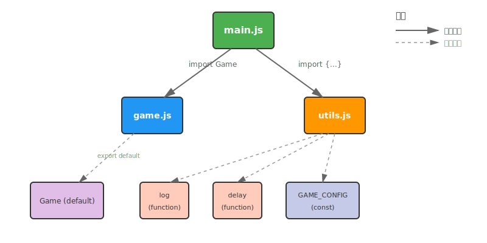

# [0071. ESM](https://github.com/tnotesjs/TNotes.javascript/tree/main/notes/0071.%20ESM)

<!-- region:toc -->

- [1. 🎯 本节内容](#1--本节内容)
- [2. 🫧 评价](#2--评价)
- [3. 💡 思维导图](#3--思维导图)
- [4. 🤔 # ESM 是什么？](#4---esm-是什么)
- [5. 🤔 在浏览器与 NodeJS 中如何使用 ESM？](#5--在浏览器与-nodejs-中如何使用-esm)
  - [5.1. 浏览器](#51-浏览器)
  - [5.2. NodeJS](#52-nodejs)
    - [🤔 NodeJS 默认是 CJS 吗？](#-nodejs-默认是-cjs-吗)
- [6. 🤔 ESM 的导出与导入有哪些写法？](#6--esm-的导出与导入有哪些写法)
  - [6.1. 导出](#61-导出)
    - [🤔 绑定再导出怎么写与何时用？](#-绑定再导出怎么写与何时用)
  - [6.2. 导入](#62-导入)
    - [🆚 依赖预加载 vs 依赖延迟加载](#-依赖预加载-vs-依赖延迟加载)
    - [缓存机制示例](#缓存机制示例)
    - [不导入仅运行示例](#不导入仅运行示例)
    - [默认导入等价写法示例](#默认导入等价写法示例)
- [7. 🤔 为什么 ESM 是静态的并且具有实时绑定？](#7--为什么-esm-是静态的并且具有实时绑定)
- [8. 🆚 ESM vs CommonJS](#8--esm-vs-commonjs)
- [9. 🤔 与 CommonJS 互操作有哪些常见坑？](#9--与-commonjs-互操作有哪些常见坑)
- [10. 🤔 循环依赖与顶层 await 的行为是什么？](#10--循环依赖与顶层-await-的行为是什么)
- [11. 💻 demos.1 - 命名导出与命名导入](#11--demos1---命名导出与命名导入)
- [12. 💻 demos.2 - 默认导出与默认导入](#12--demos2---默认导出与默认导入)
- [13. 💻 demos.3 - 混合导出与混合导入](#13--demos3---混合导出与混合导入)
- [14. 💻 demos.4 - 重命名导出与导入](#14--demos4---重命名导出与导入)
- [15. 💻 demos.5 - 整体导入命名空间](#15--demos5---整体导入命名空间)
- [16. 💻 demos.6 - 动态导入按需加载](#16--demos6---动态导入按需加载)
- [17. 💻 demos.7 - 在浏览器中使用 ESM](#17--demos7---在浏览器中使用-esm)
- [18. 💻 demos.8 - 聚合导出再导出](#18--demos8---聚合导出再导出)
- [19. 💻 demos.9 - 实时绑定演示](#19--demos9---实时绑定演示)
- [20. 💻 demos.10 - 小练习 综合示例](#20--demos10---小练习-综合示例)
- [21. 💻 demos.16 - 推箱子小游戏](#21--demos16---推箱子小游戏)
- [22. 🔗 引用](#22--引用)

<!-- endregion:toc -->

## 1. 🎯 本节内容

- ESM 的基本语法导入导出
- 命名导出默认导出整体导入重命名导出聚合导出
- 动态导入按需加载
- 实时绑定静态分析树摇优化
- 浏览器与 NodeJS 中的使用方式
- CommonJS 互操作常见坑
- 循环依赖与顶层 await 的行为
- 目录实践与综合小练习

## 2. 🫧 评价

ESM 是前端开发必须掌握的模块化标准，在浏览器与 NodeJS 中均可原生使用。

ESM 支持静态分析与树摇优化，能够显著提升构建效果，相较于 CommonJS，ESM 具有实时绑定与更强的语法能力。

建议在所有新项目中优先使用 ESM，在旧项目中逐步迁移。

## 3. 💡 思维导图

```markmap

<<< ./assets/1.md

```

## 4. 🤔 # ESM 是什么？

ESM 即 ES Module，是 JavaScript 官方的模块化标准，同时支持浏览器与 NodeJS 环境。

ESM 规范是 JS 语言内置支持的语法，使用 `import` 导入和 `export` 导出，不需要像 AMD、CMD 这些社区方案那样引入额外的包。

核心特性包括：

- 静态分析：可在编译阶段确定依赖关系，便于 Tree Shaking 优化
- 异步与按需加载：支持动态 `import()`，便于优化加载性能
- 实时绑定机制：导入的是不可变的绑定（immutable binding），与导出值保持动态引用关系
- 严格模式：顶层模块自动启用严格模式
- 模块作用域：每个模块拥有独立作用域，避免全局污染
- 单例缓存：同一模块 URL 只会被执行一次并缓存结果

## 5. 🤔 在浏览器与 NodeJS 中如何使用 ESM？

### 5.1. 浏览器

- 使用 `script` 的 `type` 属性，`type="module"`。
- 模块脚本默认异步，不会阻塞页面渲染。
- 相对路径必须包含文件扩展名，例如 `./utils.js`。
- 模块中的变量不会污染全局，顶层 `this` 为 `undefined`。

```html
<script type="module" src="./app.js"></script>
```

对比演示未开启模块化与开启模块化两种方式：

::: code-group

<<< ./demos/7/no-module.html

<<< ./demos/7/plain.js

<<< ./demos/7/with-module.html

<<< ./demos/7/module/index.js

:::

控制台测试：

- 未开启模块化，页面中输入 `a` 可以访问，说明污染了全局，不建议。
- 开启模块化，页面中输入 `a` 会提示 `a is not defined`，说明模块作用域隔离，是正确的引入方式。

### 5.2. NodeJS

- 在 `package.json` 中设置 `type` 为 `module`，或者使用 `.mjs` 扩展名。
- 使用 `import` 与 `export` 语法进行模块化。
- 对于第三方包，使用包的导出字段进行解析，例如 `exports` 与 `module` 字段。

```json
{
  "type": "module"
}
```

#### 🤔 NodeJS 默认是 CJS 吗？

- 默认是 CJS，`.js` 按 CJS 解析，除非使用 `.mjs` 或设置 `type` 为 `module`。
- 在 CJS 文件中不能使用静态 `import`，可以使用动态导入 `import()`。
- 在 ESM 文件中不能使用 `require`，可通过 `createRequire` 加载 CJS 模块。
- 在 ESM 中导入本地文件需写完整扩展名，例如 `./util.js`。

示例 `.mjs` 方式启用 ESM

```js
// calc.mjs
export function add(a b) {
  return a + b
}

// main.mjs
import { add } from './calc.mjs'
console.log(add(1 2))
```

示例在 CJS 中使用动态导入

```js
// app.cjs 或普通 .js
async function run() {
  const m = await import('./util.mjs')
  console.log(m)
}
run()
```

示例在 ESM 中加载 CJS 模块

```js
// app.mjs 或开启了 type 为 module 的 .js
import { createRequire } from 'node:module'
const require = createRequire(import.meta.url)
const pkg = require('some-cjs')
console.log(pkg)
```

## 6. 🤔 ESM 的导出与导入有哪些写法？

### 6.1. 导出

- 命名导出，`export const a = 1`，`export function f(){}`。
- 统一导出，`export { a b f }`。
- 重命名导出，`export { a as x }`。
- 默认导出，`export default 值或标识符`。
- 聚合导出再导出，`export { a as x } from './mod.js'` 或 `export * from './mod.js'`。
- 一个模块可以有多个基本导出，默认导出只能有一个。
- 默认导出的等价写法，`export { 标识符 as default }`。
- 基本导出与默认导出可以并存，默认导出通常承载核心功能，基本导出常用于辅助函数或常量。

#### 🤔 绑定再导出怎么写与何时用？

- 写法，`export * from './mod.js'` 与 `export { 标识符 } from './mod.js'`。
- 应用场景，通过目录入口文件统一组织导出接口，方便外部只写一条导入语句。
- 优点，统一出口，重组并重命名接口，减少导入路径分散。
- 缺点，注意命名冲突，聚合入口会使被再导出的模块在初始化阶段全部执行一次。

绑定再导出的浏览器演示

::: code-group

<<< ./demos/15/index.html

<<< ./demos/15/main.js

<<< ./demos/15/utils/index.js

<<< ./demos/15/utils/add.js

<<< ./demos/15/utils/constants.js

<<< ./demos/15/utils/getRandom.js

<<< ./demos/15/utils/sayHello.js

:::

### 6.2. 导入

- 命名导入，`import { a f } from './mod.js'`。
- 默认导入，`import x from './mod.js'`。
- 混合导入，`import x, { a } from './mod.js'`。
- 整体导入命名空间，`import * as ns from './mod.js'`。
- 动态导入按需加载，`const m = await import('./mod.js')`。
- 无绑定导入用于执行初始化代码，`import './init.js'`。
- 使用 `*` 导入时必须提供命名空间标识符，例如 `as ns`。
- 命名空间导入的默认导出位于 `ns.default`。
- 花括号内对应具名导入，花括号外对应默认导入。
- 静态导入必须是顶层语句，在执行前会被预解析与提升；动态导入可在任意位置调用，用于依赖延迟加载。
- 默认导入的变量名可自行定义，不支持 `as` 别名语法；同时导入默认与具名成员可使用混合导入或 `default as`。

#### 🆚 依赖预加载 vs 依赖延迟加载

| 特性 | 预加载 静态导入 | 延迟加载 动态导入 |
| --- | --- | --- |
| 加载时机 | 解析阶段预先加载 | 运行时按需加载 |
| 依赖关系 | 清晰可分析便于树摇 | 难以静态分析更灵活 |
| 使用场景 | 基础依赖公共工具 | 大型应用按需优化首屏 |
| 语法 | `import { a } from './mod.js'` | `const m = await import('./mod.js')` |

对比演示静态导入与动态导入的写法。

::: code-group

<<< ./demos/14/index.html

<<< ./demos/14/index-static.js

<<< ./demos/14/index-dynamic.js

<<< ./demos/14/dynamicModule1.js

<<< ./demos/14/dynamicModule2.js

:::

#### 缓存机制示例

重复导入同一个模块只会执行一次，后续导入使用缓存结果。

::: code-group

<<< ./demos/11/b.js

<<< ./demos/11/a.js

<<< ./demos/11/index.js

<<< ./demos/11/package.json

:::

#### 不导入仅运行示例

当不需要使用导出的内容，只想运行一次指定脚本，可以使用无绑定导入。

::: code-group

<<< ./demos/12/xxx.js

<<< ./demos/12/index.js

<<< ./demos/12/package.json

:::

#### 默认导入等价写法示例

默认导入可以与具名导入并存，也可以通过 `default as` 或命名空间方式访问默认导出。

::: code-group

<<< ./demos/13/a.js

<<< ./demos/13/index.js

<<< ./demos/13/package.json

:::

## 7. 🤔 为什么 ESM 是静态的并且具有实时绑定？

- 静态分析编译阶段即可确定依赖结构便于构建工具进行树摇优化删除未使用的导出
- 实时绑定导入的是对导出绑定的引用当导出值在模块内部发生变化导入处能够实时反映

⚠️ 注意导入的绑定在导入方是只读的，不可重新赋值，需要通过被导入模块提供的接口进行修改。

## 8. 🆚 ESM vs CommonJS

| 对比项 | ESM | CommonJS |
| --- | --- | --- |
| 加载时机 | 异步加载支持浏览器与 NodeJS | 同步加载主要用于 NodeJS |
| 依赖分析 | 静态分析便于树摇优化 | 运行时解析难以树摇 |
| 导出语义 | 实时绑定导入的是引用 | 值拷贝导入的是快照 |
| 顶层语义 | 自动严格模式顶层 `this` 为 `undefined` | 顶层 `this` 指向 `exports` |
| 语法能力 | 支持聚合导出动态导入顶层 await | 不支持语言级动态导入顶层 await |
| 互操作 | 可通过转换或桥接与 CJS 互操作 | 原生使用 `require` 与 `module.exports` |

## 9. 🤔 与 CommonJS 互操作有哪些常见坑？

- 默认导出与命名导出的对应关系需要明确，某些 CommonJS 包可能不包含默认导出，使用 `import * as pkg from 'pkg'` 更稳妥。
- 在 NodeJS 中混用 `require` 与 `import` 时，需要注意文件类型与包配置；可以通过 `createRequire` 在 ESM 中加载 CJS 模块。
- CommonJS 的导出是对象的值拷贝，不具备实时绑定特性，与 ESM 的导入行为不同。

示例桥接思路仅说明，不在此处展开实现。

## 10. 🤔 循环依赖与顶层 await 的行为是什么？

- 循环依赖，ESM 的静态绑定使得彼此能够引用到对方的导出，但在初始化阶段可能是未完全赋值，需要在运行时谨慎访问。
- 顶层 await 在 ESM 中允许使用，模块初始化将变为异步，依赖方会等待其完成，这对异步初始化很有帮助。

## 11. 💻 demos.1 - 命名导出与命名导入

::: code-group

<<< ./demos/1/math.js

<<< ./demos/1/main.js

<<< ./demos/1/package.json

:::

## 12. 💻 demos.2 - 默认导出与默认导入

::: code-group

<<< ./demos/2/calculator.js

<<< ./demos/2/main.js

<<< ./demos/2/package.json

:::

## 13. 💻 demos.3 - 混合导出与混合导入

::: code-group

<<< ./demos/3/utils.js

<<< ./demos/3/main.js

<<< ./demos/3/package.json

:::

## 14. 💻 demos.4 - 重命名导出与导入

::: code-group

<<< ./demos/4/moduleA.js

<<< ./demos/4/main.js

<<< ./demos/4/package.json

:::

## 15. 💻 demos.5 - 整体导入命名空间

::: code-group

<<< ./demos/5/tools.js

<<< ./demos/5/main.js

<<< ./demos/5/package.json

:::

## 16. 💻 demos.6 - 动态导入按需加载

::: code-group

<<< ./demos/6/feature.js

<<< ./demos/6/main.js

<<< ./demos/6/package.json

:::

## 17. 💻 demos.7 - 在浏览器中使用 ESM

::: code-group

<<< ./demos/7/index.html

<<< ./demos/7/app.js

<<< ./demos/7/utils.js

:::

## 18. 💻 demos.8 - 聚合导出再导出

::: code-group

<<< ./demos/8/index.js

<<< ./demos/8/math.js

<<< ./demos/8/string.js

<<< ./demos/8/main.js

<<< ./demos/8/package.json

:::

## 19. 💻 demos.9 - 实时绑定演示

::: code-group

<<< ./demos/9/counter.js

<<< ./demos/9/main.js

<<< ./demos/9/package.json

:::

## 20. 💻 demos.10 - 小练习 综合示例



::: code-group

<<< ./demos/10/game.js

<<< ./demos/10/utils.js

<<< ./demos/10/main.js

<<< ./demos/10/package.json

:::

## 21. 💻 demos.16 - 推箱子小游戏

::: code-group

<<< ./demos/16/index.html

<<< ./demos/16/module/index.js

<<< ./demos/16/module/game.js

<<< ./demos/16/module/ui.js

<<< ./demos/16/module/play.js

<<< ./demos/16/module/map.js

:::

## 22. 🔗 引用

- [MDN ES Modules][1]
- [NodeJS ECMAScript Modules][2]
- [script 元素的 type 属性][3]
- [Vite 文档 ES 模块与依赖优化][4]

[1]: https://developer.mozilla.org/zh-CN/docs/Web/JavaScript/Guide/Modules
[2]: https://nodejs.org/api/esm.html
[3]: ../0111.%20script%20%E5%85%83%E7%B4%A0%E7%9A%84%20type%20%E5%B1%9E%E6%80%A7/README.md
[4]: https://vitejs.dev/guide/dep-pre-bundling
