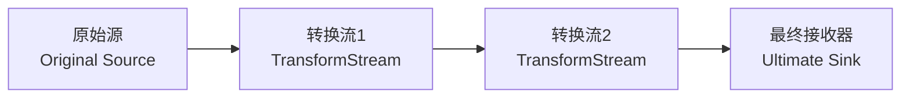
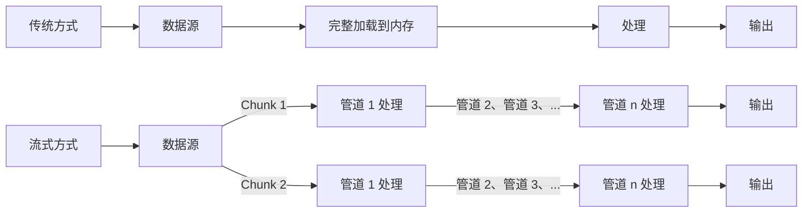

# [0073. Web Streams 核心概念](https://github.com/tnotesjs/TNotes.javascript/tree/main/notes/0073.%20Web%20Streams%20%E6%A0%B8%E5%BF%83%E6%A6%82%E5%BF%B5)

<!-- region:toc -->

- [1. 🎯 本节内容](#1--本节内容)
- [2. 🫧 评价](#2--评价)
- [3. 🔍 术语表](#3--术语表)
  - [3.1. 流类型](#31-流类型)
  - [3.2. 角色与组件](#32-角色与组件)
  - [3.3. 底层概念](#33-底层概念)
  - [3.4. 数据处理](#34-数据处理)
  - [3.5. 背压相关](#35-背压相关)
- [4. 🤔 Stream 是什么？](#4--stream-是什么)
- [5. 🤔 Web Streams API 是什么？](#5--web-streams-api-是什么)
  - [5.1. 基础 Stream 类型](#51-基础-stream-类型)
  - [5.2. 核心特点](#52-核心特点)
  - [5.3. 典型应用场景](#53-典型应用场景)
- [6. 🤔 Streams 中的核心概念都有哪些？](#6--streams-中的核心概念都有哪些)
  - [6.1. Readable streams - 可读流](#61-readable-streams---可读流)
    - [Underlying Source - 底层源](#underlying-source---底层源)
    - [Chunks - 数据块](#chunks---数据块)
    - [Stream 状态](#stream-状态)
    - [Reader, Consumer, Controller - 读取器、消费者、控制器](#reader-consumer-controller---读取器消费者控制器)
    - [Locking - 锁定](#locking---锁定)
    - [Readable streams and byte streams - 可读流和字节流](#readable-streams-and-byte-streams---可读流和字节流)
  - [6.2. Teeing - 分流](#62-teeing---分流)
    - [`tee()`](#tee)
    - [分流的必要性](#分流的必要性)
  - [6.3. Writable streams - 可写流](#63-writable-streams---可写流)
    - [Underlying Sink - 底层接收器](#underlying-sink---底层接收器)
    - [Writer, Producer, Controller - 写入器、生产者、控制器](#writer-producer-controller---写入器生产者控制器)
    - [Locking - 锁定](#locking---锁定)
  - [6.4. Pipe chains - 管道链](#64-pipe-chains---管道链)
  - [6.5. Backpressure - 背压机制](#65-backpressure---背压机制)
  - [6.6. Internal queues and queuing strategies - 内部队列和排队策略](#66-internal-queues-and-queuing-strategies---内部队列和排队策略)
- [7. 🆚 传统处理方式 vs 流式处理方式](#7--传统处理方式-vs-流式处理方式)
- [8. 🤔 为什么说 Web Streams 是“响应式数据管道”的基础，而不仅是“大数据处理工具”？](#8--为什么说-web-streams-是响应式数据管道的基础而不仅是大数据处理工具)
  - [8.1. 数据流（Stream）的响应式数据管道](#81-数据流stream的响应式数据管道)
  - [8.2. 核心应用场景](#82-核心应用场景)
  - [8.3. 与大数据处理的区别](#83-与大数据处理的区别)
- [9. 🤔 为什么一个流不能被多个消费者同时消费？](#9--为什么一个流不能被多个消费者同时消费)
- [10. 🤔 一个流被消费后为何不能再次被消费？](#10--一个流被消费后为何不能再次被消费)
- [11. 🆚 Stream vs Promise](#11--stream-vs-promise)
  - [11.1. 相似点 - 单次、单相向消费](#111-相似点---单次单相向消费)
  - [11.2. 核心点 - 关注点不同](#112-核心点---关注点不同)
- [12. 🤔 如果不关注背压机制，流处理可能会导致什么实际问题？](#12--如果不关注背压机制流处理可能会导致什么实际问题)
- [13. 🤔 Fetch 的 Response.body 为什么是 ReadableStream 而不是直接返回整个数据？](#13--fetch-的-responsebody-为什么是-readablestream-而不是直接返回整个数据)
- [14. 💻 demos.1 - 对比传统 `fetch().json()` 与流式处理响应体](#14--demos1---对比传统-fetchjson-与流式处理响应体)
- [15. 🆚 `Web Streams` vs `RxJS` vs `Node.js Streams`](#15--web-streams-vs-rxjs-vs-nodejs-streams)
- [16. 💻 demos.2 - 消费一个自定义可读流](#16--demos2---消费一个自定义可读流)
- [17. 🔗 引用](#17--引用)

<!-- endregion:toc -->

## 1. 🎯 本节内容

- 流的相关术语
- 流的核心概念
- 传统处理方式 vs 流处理方式
- Stream vs Promise
- Web Streams vs RxJS vs Node.js Streams

## 2. 🫧 评价

这篇笔记介绍了 Web Streams API 的核心概念，包括可读流、可写流、转换流的基本原理和使用方法，以及流式处理相较于传统数据处理方式的优势。并通过多组对比示例，来深入了解流的一些特性。

从学习曲线看，流的概念本身不难，但锁定机制、背压控制、管道链设计需要实践才能深刻理解。在后续的学习中，建议先掌握基本的读写操作，再逐步深入背压机制和 TransformStream 的应用。重点关注流的不可重用性和锁定特性，这两个设计决策影响整个 API 的使用方式。

## 3. 🔍 术语表

在学习 Web Streams 相关知识点时，会遇到很多和 Streams 相关的专业术语。

这一部分主要用于记录和 Streams 相关的常见术语对照表。

笔记中提到的这些相关术语及其相关概念会在后续的学习中多次出现。

### 3.1. 流类型

| 中文   | 英文             |
| ------ | ---------------- |
| 可读流 | Readable Stream  |
| 可写流 | Writable Stream  |
| 转换流 | Transform Stream |
| 字节流 | Byte Stream      |

### 3.2. 角色与组件

| 中文       | 英文          |
| ---------- | ------------- |
| 读取器     | Reader        |
| 写入器     | Writer        |
| 控制器     | Controller    |
| 生产者     | Producer      |
| 消费者     | Consumer      |
| 活动读取器 | Active Reader |
| 活动写入器 | Active Writer |

### 3.3. 底层概念

| 中文       | 英文              |
| ---------- | ----------------- |
| 底层源     | Underlying Source |
| 底层接收器 | Underlying Sink   |
| 推送源     | Push Source       |
| 拉取源     | Pull Source       |
| 原始源     | Original Source   |
| 接收源     | Ultimate Sink     |

### 3.4. 数据处理

| 中文     | 英文           |
| -------- | -------------- |
| 数据块   | Chunk          |
| 入队     | Enqueued       |
| 管道链   | Pipe Chain     |
| 分流     | Teeing         |
| 锁定     | Locking        |
| 内部队列 | Internal Queue |

### 3.5. 背压相关

| 中文       | 英文                         |
| ---------- | ---------------------------- |
| 背压       | Backpressure                 |
| 排队策略   | Queuing Strategy             |
| 高水位线   | High Water Mark              |
| 期望大小   | Desired Size                 |
| 自带缓冲区 | BYOB (Bring Your Own Buffer) |

## 4. 🤔 Stream 是什么？

在 Web Streams API 中，Stream 是一种用于高效、渐进式处理（如读取或写入）大数据（如网络响应、文件）的异步数据流抽象。

流式传输（Streaming）是指将网络资源分解成小块（chunks），然后逐块进行处理。浏览器在接收媒体资源时就已经使用了这种机制 —— 视频会边下载边缓冲播放，图片也会随着加载进度逐渐显示。

但在过去，JavaScript 从未拥有过这种能力。以前如果我们想处理某种资源（视频、文本文件等），必须先下载整个文件，等待它被反序列化为合适的格式，然后再处理接收到的全量数据。

有了 Streams API，你可以在原始数据可用时立即开始逐块处理，无需生成完整的缓冲区、字符串或 blob 对象。

Streams 的核心用法是让响应数据以流的形式提供。例如，成功的 `fetch` 请求返回的响应体就是一个 `ReadableStream`，可以通过 `ReadableStream.getReader()` 创建读取器来读取。

```js
// 使用 fetch 获取流式响应
const response = await fetch('https://jsonplaceholder.typicode.com/comments')
const reader = response.body.getReader()

while (true) {
  const { done, value } = await reader.read()
  if (done) break

  // value 是 Uint8Array，逐块处理数据
  console.log('接收到数据块:', value)
}
```


更复杂的用法包括使用 `ReadableStream()` 构造函数创建自定义流，例如在 Service Worker 中处理数据。

除了读取流数据之外，你也可以使用 `WritableStream` 向流中写入数据，或者使用 `TransformStream` 对流数据进行转换处理。

## 5. 🤔 Web Streams API 是什么？

Web Streams API 是浏览器提供的一套用于处理流式数据的标准接口，它允许 JavaScript 以分块（chunk）的方式逐步处理数据，而不需要一次性将所有数据加载到内存中。

### 5.1. 基础 Stream 类型

1. ReadableStream（可读流）
2. WritableStream（可写流）
3. TransformStream（转换流）

### 5.2. 核心特点

| 特点     | 说明                                               |
| -------- | -------------------------------------------------- |
| 分块处理 | 数据以小块的形式传输和处理，避免大文件占用过多内存 |
| 背压控制 | 自动管理数据流速，防止生产者速度过快导致消费者崩溃 |
| 可组合性 | 通过管道（pipe）将多个流连接起来，形成处理链       |
| 异步操作 | 基于 Promise，天然支持异步数据处理                 |
| 流程控制 | 检测流的开始和结束时机，按需处理错误和取消流       |
| 速度响应 | 根据流的读取速度做出响应，实现动态调整             |

### 5.3. 典型应用场景

| 场景 | 说明 |
| --- | --- |
| 大文件上传/下载 | 分块传输，显示进度，避免内存溢出 |
| 网络数据传输 | 流式处理 API 响应、SSE（Server-Sent Events）、实时数据推送 |
| 数据转换 | 文本编解码、数据压缩/解压、加密/解密等管道式处理 |
| 硬件通信 | 通过 Web Serial API、Web USB API、Web Bluetooth API 与底层设备通信 |
| 媒体处理 | 音视频流处理、实时转码 |
| Service Worker | 流式响应生成、缓存策略优化 |
| 数据聚合 | 从多个源读取数据并合并处理 |

## 6. 🤔 Streams 中的核心概念都有哪些？

### 6.1. Readable streams - 可读流


- 可读流是 JavaScript 中由 `ReadableStream` 对象表示的数据源，数据从底层源（underlying source）流出。

#### Underlying Source - 底层源

底层源是网络上或你的域中某个位置的资源，你希望从中获取数据。

底层源有两种类型：

- 推送源（Push sources）：在你访问它们时会持续向你推送数据，由你来决定何时开始、暂停或取消对流的访问。例如视频流和 TCP/WebSocket。
- 拉取源（Pull sources）：需要你在连接后显式请求数据。例如通过 `fetch()` 请求进行的文件访问操作。

注意：推送/拉取 ≠ 全双工/半双工

```js
// 推送源 vs 拉取源（数据流动的主动性）：
// 推送源：数据源主动向你推送数据（服务端主动）
// 拉取源：你需要主动请求数据（客户端主动）

// 全双工 vs 半双工（通信方向）：
// 全双工：双方可以同时发送和接收数据（如 WebSocket、电话）
// 半双工：同一时刻只能单向通信（如对讲机）

// 推送/拉取关注"谁主动发起数据传输"
// 全双工/半双工关注"能否同时双向通信"

// -------------------------------
// WebSocket - 推送源 + 全双工
// -------------------------------
const ws = new WebSocket('ws://example.com')
ws.onmessage = (e) => console.log(e.data) // 服务器主动推送
ws.send('hello') // 客户端也可以同时发送

// -------------------------------
// fetch - 拉取源 + 半双工
// -------------------------------
const response = await fetch('/api/data') // 客户端主动请求
const data = await response.json() // 等待响应（请求时不能同时接收）

// -------------------------------
// SSE (Server-Sent Events) - 推送源 + 半双工
// -------------------------------
const eventSource = new EventSource('/events')
eventSource.onmessage = (e) => console.log(e.data) // 服务器主动推送
// 但客户端不能通过这个连接发送数据（单向）

// -------------------------------
// 通过 Web Serial API 实现的 MicroPython Serial REPL 协议
// 推送源 + 全双工
// 类似 WebSocket
// -------------------------------
const port = await navigator.serial.requestPort()
await port.open({ baudRate: 115200 })
// 1. 读取流 - 推送源
// MicroPython 板子会主动推送数据（如 REPL 输出、print 语句等）
const reader = port.readable.getReader()
while (true) {
  const { value, done } = await reader.read()
  if (done) break
  console.log('收到数据:', new TextDecoder().decode(value))
  // MicroPython 主动推送，不需要你请求就会发送
}
// 2. 写入流 - 全双工的另一半
// 同时可以向 MicroPython 发送命令
const writer = port.writable.getWriter()
await writer.write(new TextEncoder().encode('print("hello")\r\n'))
// 可以同时读和写，互不阻塞
```

#### Chunks - 数据块

数据以称为“数据块（chunks）”的小片段顺序读取。一个数据块可以是单个字节，也可以是更大的内容（如特定大小的类型化数组）。单个流可以包含不同大小和类型的数据块。

放入流中的数据块被称为“入队（enqueued）”，这意味着它们在队列中等待被读取。内部队列会跟踪尚未被读取的数据块（详见下文的"内部队列和排队策略"部分）。

#### Stream 状态

可读流有三种状态：

| 状态     | 说明                 |
| -------- | -------------------- |
| readable | 流中有数据可读       |
| closed   | 流已关闭，不再有数据 |
| errored  | 流发生错误           |

#### Reader, Consumer, Controller - 读取器、消费者、控制器

流中的数据块由读取器（reader）读取，它每次处理一个数据块，允许你对其执行任何你想要的操作。读取器加上与之配套的其他处理代码被称为消费者（consumer）。

还有一个你会用到的结构叫做控制器（controller），每个读取器都有一个关联的控制器，允许你控制流（例如，如果需要可以关闭它）。

- reader 读取器，用于读取流中的数据
- consumer 消费者 = 读取器 + 数据处理逻辑
- controller 控制器，用于控制流（如关闭流）

#### Locking - 锁定

一次只能有一个读取器读取一个流；

- 当创建读取器 A 并开始读取流 B 时，这个读取器 A 就是一个活动的读取器（active reader），当读取器 A 读取流中的数据时，流 B 被锁定（Locked）到了读取器 A
- 如果你想让另一个读取器 C 开始读取你的流 B，通常需要先取消或释放之前的读取器 A，然后再使用读取器 C 来读取流 B 中的数据
- 如果你想要让读取器 A、C 可以同时读取同一个流中的数据，你可以对流进行分叉（或者说是拷贝），详见下文的"Teeing（数据流分路）"部分

#### Readable streams and byte streams - 可读流和字节流

注意，可读流有两种不同的类型。除了常规可读流之外，还有一种叫做字节流（byte stream）的类型。字节流是常规流的扩展版本，用于读取底层字节源。与常规可读流相比，字节流允许通过 BYOB 读取器（BYOB，"bring your own buffer"，自带缓冲区）进行读取。这种读取器允许将流直接读入开发者提供的缓冲区，最大程度地减少所需的复制操作。你的代码将使用哪种底层流（以及相应的读取器和控制器）取决于流最初是如何创建的（详见 `ReadableStream()` 构造函数）。

你可以通过诸如 `fetch` 请求返回的 `Response.body` 等机制使用现成的可读流，也可以使用 `ReadableStream()` 构造函数创建自己的流。

### 6.2. Teeing - 分流


尽管一次只能有一个读取器读取一个流，但可以将一个流分割成两个相同的副本，然后由两个独立的读取器分别读取。这称为分流（teeing）。

#### `tee()`

在 JavaScript 中，你可以通过 `ReadableStream.tee()` 方法实现分流，它会返回一个数组，包含原始可读流的两个相同副本，然后可以由两个独立的读取器分别读取。

例如，在 Service Worker 中，如果你想从服务器获取响应并将其流式传输到浏览器，同时也将其流式传输到 Service Worker 缓存，你就需要这样做。由于响应体不能被消费多次，并且一个流不能同时被多个读取器读取，因此你需要两个副本来完成此操作。

#### 分流的必要性

这一部分，我们将以前文提到的 Service Worker 场景为例来认识分流的必要性，来深入了解为何在这样的场景中需要使用分流机制来处理。

1. 💻 Service Worker 中的流分叉示例
2. 🤔 为什么这里必须分流？
3. 🆚 传统方式 vs 分流方式
4. 🤔 为什么不直接拷贝从流中流出的数据，而是拷贝流？
5. 🤔 可以采用分块拷贝流数据的方案吗？
6. 🆚 手动分块 vs `tee()` 分流

::: code-group

<<< ./assets/teeing/1.js [1]

<<< ./assets/teeing/2.js [2]

<<< ./assets/teeing/3.js [3]

<<< ./assets/teeing/4.js [4]

<<< ./assets/teeing/5.js [5]

<<< ./assets/teeing/6.js [6]

:::

### 6.3. Writable streams - 可写流


可写流是一个你可以向其中写入数据的目标，在 JavaScript 中由 `WritableStream` 对象表示，你可以使用 `WritableStream()` 构造函数来创建可写流。

#### Underlying Sink - 底层接收器

可写流是底层接收器（underlying sink）之上的抽象层，底层接收器是一个 I/O 接收器，原始数据会被写入其中。

注意：写入流 ≠ 实际写入底层，中间还有一层缓冲区。

内部队列（可写流内部维护的数据缓冲区）会跟踪已写入流 `writer.write(chunk)` 中的但尚未被底层接收器处理（还没有被最终目标（如文件、网络）真正消费）的 chunk。

内部队列用于缓冲生产者和消费者之间的速度差异。无论使用并发写入还是串行写入，队列都会自动管理数据流，确保底层接收器按顺序处理。

```js
const fileStream = new WritableStream({
  write(chunk) {
    // 模拟慢速 I/O（底层接收器处理慢）
    return new Promise((resolve) => {
      setTimeout(() => {
        console.log('实际写入磁盘:', chunk)
        resolve()
      }, 1000) // 每秒只能写入1个chunk块
    })
  },
})

const writer = fileStream.getWriter()

// 上层快速写入 3 个chunk块
// 但底层接收器处理慢（1 秒/个）

// 场景1. 不使用 await，让写入并发进行
// writer.write('chunk1') // 立即开始处理
// writer.write('chunk2') // 进入队列
// writer.write('chunk3') // 进入队列
// 总耗时：瞬间完成，小于 1s
// 执行过程：
// 0s:   chunk1 开始写入底层
//       chunk2、3 进入内部队列等待
// 1s:   chunk1 完成，chunk2 开始写入
//       chunk3 仍在队列
// 2s:   chunk2 完成，chunk3 开始写入
// 3s:   全部完成

// 场景2. 使用 await，等待写入完成
await writer.write('chunk1')
await writer.write('chunk2')
await writer.write('chunk3')
// 总耗时：3s（串行）
// 执行过程：
// 0s:   chunk1 开始写入底层
// 1s:   chunk1 完成，chunk2 开始写入
// 2s:   chunk2 完成，chunk3 开始写入
// 3s:   全部完成
```

#### Writer, Producer, Controller - 写入器、生产者、控制器

数据通过写入器（writer）写入流中，每次写入一个数据块（chunk）。数据块可以有多种形式，就像读取器中的数据块一样。

你可以使用任何代码来生成准备写入的数据块；写入器加上与之关联的代码被称为生产者（producer）。

每个写入器都有一个关联的控制器，允许你控制流（例如，如果需要可以中止它）。

- writer 写入器，用于向流中写入数据
- producer 生产者 = 写入器 + 数据生成逻辑
- controller 控制器，用于控制流（如关闭流）

#### Locking - 锁定

一次只能有一个写入器向可写流中写入数据：

- 当创建写入器 A 并开始向流 B 中写入数据时，这个写入器 A 被称为活动写入器（active writer），当写入器 A 往流 B 中写入数据时，流 B 被锁定（Locked）到了写入器 A
- 如果你想让另一个写入器 C 开始向你的流 B 中写入数据，必须先（通过中止、关闭或释放锁）释放当前写入器 A，然后再附加另一个写入器 C
- 注意：可写流不支持 `tee()` 分流操作（与可读流不同）

### 6.4. Pipe chains - 管道链




Streams API 使得通过一种称为管道链（pipe chain）的结构将流相互连接成为可能。有两个方法可以实现这一点:

1. `ReadableStream.pipeThrough()` 将流通过转换流进行传输，可能会在传输过程中转换数据格式。例如，这可以用于编解码视频帧、压缩或解压缩数据，或以其他方式将数据从一种形式转换为另一种形式。
   - 转换流由一对流组成：一个可读流（从中读取数据）和一个可写流（向其中写入数据），并配有适当的机制来确保一旦数据被写入，新数据就可以立即被读取。
   - `TransformStream` 是转换流的具体实现，但任何具有相同可读流和可写流属性的对象都可以传递给 `pipeThrough()`。
2. `ReadableStream.pipeTo()` 将流传输到充当管道链终点的可写流。

管道链的起点称为原始源（original source），终点称为最终接收器（ultimate sink）。

### 6.5. Backpressure - 背压机制

流中的一个重要概念是背压（backpressure），这是单个流或管道链调节读取/写入速度的过程。当链中后面的流仍在忙碌且尚未准备好接受更多数据块时，它会向链的上游发送信号，告诉较早的转换流（或原始源）减慢传输速度，从而避免在任何地方出现瓶颈。

要在可读流中使用背压，我们可以通过查询控制器上的 `ReadableStreamDefaultController.desiredSize` 属性来向控制器询问消费者所需的数据块大小。如果该值过低，我们的可读流可以告诉其底层源停止发送数据，从而沿着流链实施背压。

如果稍后消费者再次想要接收数据，我们可以在创建流时使用 `pull` 方法来告诉底层源向流提供数据。

### 6.6. Internal queues and queuing strategies - 内部队列和排队策略

如前所述，流中尚未被处理和完成的数据块会被内部队列跟踪。

- 对于可读流，这些是已入队但尚未被读取的数据块
- 对于可写流，这些是已写入但尚未被底层接收器处理的数据块

内部队列采用排队策略（queuing strategy），该策略决定了如何根据内部队列状态发出背压信号。

通常，该策略会将队列中数据块的大小与一个称为高水位线（high water mark）的值进行比较，高水位线是队列希望管理的最大数据块总大小。

执行的计算公式为：`高水位线 - 队列中数据块的总大小 = 期望大小`

期望大小（desired size）是流还能接受的数据块数量，以保持流继续流动但总大小低于高水位线。数据块生成速度会根据需要减慢或加快，以尽可能快地保持流的流动，同时保持期望大小大于零。如果该值降至零（或以下），则意味着数据块的生成速度超过了流的处理能力，这可能会导致问题。

举个例子，假设队列中数据块总大小为 0，单个数据块大小为 1，高水位线为 3。这意味着在达到高水位线并应用背压之前，最多可以入队 3 个数据块。

## 7. 🆚 传统处理方式 vs 流式处理方式

| 特性     | 传统处理方式           | 流式处理方式         |
| -------- | ---------------------- | -------------------- |
| 内存占用 | 需要一次性加载全部数据 | 只保留当前处理的分块 |
| 处理时机 | 等待数据完全到达后处理 | 数据到达即可开始处理 |
| 用户体验 | 长时间等待             | 可以实时显示进度     |
| 错误处理 | 全部失败               | 可以部分成功         |

::: code-group

```js [传统方式]
// ❌ 问题：大文件会占用大量内存
async function downloadFile(url) {
  const response = await fetch(url)
  const blob = await response.blob() // 等待全部数据
  // 处理 blob...
}
```

```js [流式处理]
// ✅ 优势：边下载边处理
async function downloadFile(url) {
  const response = await fetch(url)
  const reader = response.body.getReader()

  while (true) {
    const { done, value } = await reader.read()
    if (done) break
    // 立即处理当前分块 value
  }
}
```

:::

## 8. 🤔 为什么说 Web Streams 是“响应式数据管道”的基础，而不仅是“大数据处理工具”？

提到“流”，你可能首先会想到用它来处理大数据的分块传输，以缓解内存压力，但 Web Streams 的设计理念远不止于此。它更强调数据的“响应式”处理能力，即数据在生产、传输和消费过程中能够实时协调和适应各方需求。

### 8.1. 数据流（Stream）的响应式数据管道

Web Streams 实现了 `数据生产者（Producer）→ 管道（Pipeline）→ 数据消费者（Consumer）` 的异步流动模型，数据可以逐块（chunk）生成、转换和消费，而不是一次性加载到内存。

```js
// 传统方式：一次性获取全部数据
const data = await fetch(url).then((r) => r.json())
processData(data) // 必须等待全部数据到达

// 流式管道：数据到达即处理
fetch(url)
  .then((r) => r.body)
  .pipeThrough(new TextDecoderStream())
  .pipeThrough(jsonLineParser) // 逐行解析
  .pipeThrough(dataValidator) // 实时验证
  .pipeThrough(transformer) // 边收边转换
  .pipeTo(uiRenderer) // 渐进式渲染
```

背压（Backpressure）机制是响应式系统的核心特征之一。当消费者处理速度跟不上数据生产速度时，系统会自动反向通知生产者降速，实现流量控制，避免内存溢出。这种“实时协调”的能力是响应式管道的典型特征。

### 8.2. 核心应用场景

| 场景          | 流的价值           | 传统方式的局限   |
| ------------- | ------------------ | ---------------- |
| 实时日志      | 边收边显示，无延迟 | 必须等待完整响应 |
| 大文件上传    | 边读边压缩边发送   | 内存溢出风险     |
| CSV 导出      | 逐行生成，内存恒定 | 需要缓存所有行   |
| 视频转码      | 流式转换，即转即播 | 需要完整文件     |
| SSE/WebSocket | 天然管道化处理     | 手动拼接数据块   |

### 8.3. 与大数据处理的区别



流让你可以通过不同的管道来组合异步操作逐步处理一个个数据块。

## 9. 🤔 为什么一个流不能被多个消费者同时消费？

流被读取时会被锁定（locked），被锁定之后这个流就不能再被其他 reader 使用了。

```js
const stream = new ReadableStream({
  start(controller) {
    controller.enqueue('chunk1')
    controller.enqueue('chunk2')
    controller.close()
  },
})

const reader1 = stream.getReader()
await reader1.read() // { value: 'chunk1', done: false }

const reader2 = stream.getReader() // ❌ TypeError: This stream is locked to a reader
```

需要锁定的原因：

1. 数据顺序保证：避免多个 reader 交错读取导致数据乱序
2. 背压控制：只有一个消费者才能正确发送背压信号
3. 资源管理：底层源（如文件句柄）只能被一个消费者持有

多消费者的解决方案：使用 `tee()` 进行分流

```js
const [stream1, stream2] = originalStream.tee()

// 两个独立的流，可以分别读取
const reader1 = stream1.getReader()
const reader2 = stream2.getReader()
```

`tee()` 方法就是对“多消费者需求”的响应，它创建了两个独立的流，每个都有自己的内部缓冲区。

## 10. 🤔 一个流被消费后为何不能再次被消费？

```javascript
// 像水流一样，流过了就不能倒流
const waterStream = getWaterFromPipe()
drinkFrom(waterStream) // 水被喝掉了
drinkFromAgain(waterStream) // 管道里已经没有水了
```

真实世界的数据源（网络响应、文件读取、用户输入）通常就是一次性的，Stream 忠实地反映了这一现实。

如果可以重复读取，需要：

1. 缓存所有已读取的数据（内存问题）
2. 或者让数据源支持重播（并非所有源都支持）

对比两种不同的设计方案：

- 支持重读 → 需要缓存 → 内存开销大 + 复杂的状态管理
- 禁止重读 → 简单明确 + 内存开销小 + 符合多数真实场景

如果想要用多个消费者消费同一个流中的数据，可以在可读的数据源头做分流 `tee()` 分流处理而不是让同一个源同时被多个消费者消费。

```javascript
// 分流
const [stream1, stream2] = originalStream.tee()

// 或者使用 TransformStream 复制数据
const transform = new TransformStream({
  transform(chunk, controller) {
    controller.enqueue(cloneChunk(chunk))
    // 可以发送到多个地方
  },
})
```

## 11. 🆚 Stream vs Promise

### 11.1. 相似点 - 单次、单相向消费

相同的“状态转换”模型：

```js
// Promise 的状态变化（单向）：
pending → fulfilled ✅ 或 pending → rejected ❌

// ReadableStream 的状态变化（单向）：
readable → closed ✅ 或 readable → errored ❌
```

两者都遵循单次状态转换的模式：

- Promise：一旦 resolved/rejected，值就被“消费”，后续的 `then()` 只能获取相同结果
- Stream：一旦被 reader 锁定并开始消费，数据就被顺序读取，无法倒带重读

```js
// Promise 的“一次性值”
const promise = fetch('/api/data') // 只能 resolve 一次

// Stream 的“一次性序列”
const stream = response.body // 数据只能被顺序消费一次
```

两者都代表了异步计算的单次结果：

- Promise：单个值的一次性产出
- Stream：值序列的一次性产出

### 11.2. 核心点 - 关注点不同

- Promise 的值是已完成的结果，可以被多次访问 - 关注的是最终结果
- Stream 的值是正在流动的数据，一旦被消费完就消失了 - 关注的是流动过程

| 特性 | Promise | Stream |
| --- | --- | --- |
| 消费单位 | 单值（once-resolution） | 多值序列（chunks） |
| 多消费者 | 可以多次 `.then()` | 一个流只能有一个 reader，可以通过 `tee()` 分流，让多个 reader 接入同一个流 |
| 状态变化 | pending → fulfilled/rejected | readable → locked → closed |
| 状态锁定 | 隐式（resolved 后状态固定） | 显式（locked 标志） |
| 消费方式 | 一次性原子消费，消费后多个 `.then()` 共享同一个结果 | 渐进式顺序消费，消费时锁定并独占数据流，消费后无法被重复消费 |
| 时间维度 | 时间点上的快照 | 时间线上的序列 |

1. 消费粒度层面
2. 时间维度层面
3. 取消机制层面
4. ……

::: code-group

```js [1]
// Promise：原子性消费（全有或全无）
promise.then((data) => console.log(data)) // 一次性获取全部

// Stream：渐进式消费
const reader = stream.getReader()
reader.read().then(({ value, done }) => {
  /* 逐块处理 */
})

// Promise 的消费是原子的：要么拿到完整结果，要么失败。
// Stream 的消费是渐进的：每次 read() 获取一个 chunk，消费过程可以被暂停、恢复，并且可以提前取消。
```

```js [2]
// Promise：时间点上的结果
async function fetchData() {
  return await promise // 等待结果完成
}

// Stream：时间线上的序列
async function processStream() {
  while (true) {
    const { value, done } = await reader.read()
    if (done) break
    processChunk(value) // 每个chunk在不同时间点到达
  }
}

// Promise 是时间点上的快照。
// Stream 是时间线上的流动，体现了 时间作为第一类公民 的响应式思想。
```

```js [3]
// Promise：原生无法取消（需要AbortController配合）
const controller = new AbortController()
fetch(url, { signal: controller.signal })

// Stream：内置取消机制
const reader = stream.getReader()
// 可以通过 reader.cancel() 或不再调用 read() 来中断

// Promise 的取消是暴力的（直接拒绝）
// Stream 的取消是优雅的（可以通知上游停止生产）
```

:::

两者内部状态机的伪代码示例：

1. Promise 的内部状态机
2. Stream 的内部状态机

::: code-group

```js [1]
class SimplifiedPromise {
  state = 'pending'
  value = undefined
  then(onFulfilled) {
    if (this.state === 'fulfilled') {
      // 已经resolved，直接返回值
      queueMicrotask(() => onFulfilled(this.value))
    }
  }
}
```

```js [2]
class SimplifiedReadableStream {
  state = 'readable'
  locked = false // 关键区别：锁定标志
  reader = null

  getReader() {
    if (this.locked) throw new TypeError('Stream already locked')
    this.locked = true
    return new Reader(this)
  }
}
```

:::

## 12. 🤔 如果不关注背压机制，流处理可能会导致什么实际问题？

典型问题：内存溢出。比如下面这个例子：

```js
// ❌ 没有背压控制的流
const fastProducer = new ReadableStream({
  start(controller) {
    setInterval(() => {
      // 快速生成大量数据
      controller.enqueue(new Uint8Array(1024 * 1024)) // 每次 1MB
    }, 10) // 每 10ms 一次
  },
})

// 慢速消费者
fastProducer.pipeTo(
  new WritableStream({
    async write(chunk) {
      await new Promise((r) => setTimeout(r, 1000)) // 处理需要 1s
      // ⚠️ 内部队列会无限增长，最终内存溢出
    },
  })
)
```

实际应用场景：

| 场景 | 无背压的后果 | 正确做法 |
| --- | --- | --- |
| 大文件上传 | 浏览器内存占满，页面卡死 | 控制读取速度，等待网络准备好 |
| 实时日志流 | 缓冲区爆满，数据丢失 | 暂停生产者生产数据，直到消费者追上 |
| 视频流转码 | CPU/内存飙升，浏览器崩溃 | 根据解码速度控制读取 |
| WebSocket 消息 | 消息堆积，延迟越来越高 | 发送背压信号给服务器 |

背压的作用：协调流的生产和消费速度，避免数据丢失和延迟

```js
// ✅ 有背压控制
const stream = new ReadableStream(
  {
    async pull(controller) {
      // 只有当消费者准备好时才生成数据
      if (controller.desiredSize > 0) {
        controller.enqueue(generateData())
      }
      // 如果 desiredSize <= 0，说明消费者处理不过来，暂停生产
    },
  },
  new CountQueuingStrategy({ highWaterMark: 10 })
) // 队列最多 10 个 chunk
// 背压让生产速度自动匹配消费速度，避免内存无限增长。
```

## 13. 🤔 Fetch 的 Response.body 为什么是 ReadableStream 而不是直接返回整个数据？

Response.body 是流，让你可以在数据传输过程中就开始处理，而不是被动等待。这么设计可以支持大文件或实时数据的流式处理，避免内存溢出，同时允许边接收边处理，提升性能和用户体验。

::: code-group

```js [传统方式]
// 传统方式：必须等待完整响应
// ⚠️ 如果使用这种做法，在接收大文件时，往往需要等待数秒甚至数分钟
const data = await fetch(url).then((r) => r.json())
console.log(data)
// 💡 提示：
// r.json() 内部的实现其实就是对流式处理的封装，将所有数据都接收到之后再统一返回。
// 对于大量数据，很可能不只有一个 chunk
// 你可以通过 reader 来读取 response.body 中的这些 chunk 逐个处理
```

```js [流式方式]
// 流式方式：数据到达即处理
const response = await fetch(url)
const reader = response.body.getReader()
while (true) {
  const { done, value } = await reader.read()
  if (done) break
  renderChunk(value) // 增量渲染 - 边下载边渲染，体验更高
}
// 💡 提示：二进制的 Chunk 是原始数据片段，需要经过“解包/处理层”才能变成业务可用的数据。
// 实际增量渲染需要：
//   解码：二进制数据 → 文本（TextDecoder）
//   解析：文本 → 结构化数据（JSON.parse等）
//   边界处理：处理不完整的数据块（保留在buffer中）
//   渐进更新：分批次更新 UI，而不是一次性全部渲染
```

:::

| 对比项     | 传统方式            | 流式处理           |
| ---------- | ------------------- | ------------------ |
| 首屏时间   | 等待全部数据        | 立即显示第一块     |
| 内存占用   | 等于文件大小        | 恒定（缓冲区大小） |
| 下载中断   | 前功尽弃            | 已处理部分保留     |
| 进度显示   | 需要 Content-Length | 实时计算           |
| 大文件处理 | 可能内存溢出        | 流式处理无压力     |

典型应用场景：

- 场景 1：带进度的文件下载
- 场景 2：增量更新 UI

::: code-group

```js [1]
const response = await fetch('/large-file.zip')
const contentLength = response.headers.get('Content-Length')
let loaded = 0

const stream = new ReadableStream({
  async start(controller) {
    const reader = response.body.getReader()
    while (true) {
      const { done, value } = await reader.read()
      if (done) break
      loaded += value.length
      updateProgress((loaded / contentLength) * 100) // 实时进度
      controller.enqueue(value)
    }
    controller.close()
  },
})
```

```js [2]
response.body
  .pipeThrough(new TextDecoderStream())
  .pipeThrough(jsonLineParser)
  .pipeTo(
    new WritableStream({
      write(obj) {
        updateUI(obj) // 每条数据到达即更新 UI
      },
    })
  )
// 网络数据流      → 解码为文本         → 解析为JSON对象  → 实时更新UI
//      ↓              ↓                  ↓                ↓
// ReadableStream → TextDecoderStream → jsonLineParser → WritableStream
```

:::

## 14. 💻 demos.1 - 对比传统 `fetch().json()` 与流式处理响应体

::: code-group

<<< ./demos/1/traditionalFetch.js

<<< ./demos/1/streamFetch.js

<<< ./demos/1/index.html

<<< ./demos/1/common.js

:::


测试说明：

1. 关闭缓存
2. 可以切换低速网络环境，效果会更加明显
3. 接收到所有包的耗时
4. 接收到第一个包的耗时
5. 分包接收数据，具体的分包大小和包的数量，跟网络环境息息相关

## 15. 🆚 `Web Streams` vs `RxJS` vs `Node.js Streams`

Web Streams 是浏览器原生的字节流处理标准，与 RxJS/Node.js 定位不同，各有擅长领域。

| 对比维度 | `Web Streams` | `RxJS` | `Node.js Streams` |
| --- | --- | --- | --- |
| 定位 | 浏览器标准，Web API 集成 | 函数式响应式编程库 | Node.js 核心 I/O 抽象 |
| 设计理念 | 专注于字节流处理（Uint8Array），强调锁定和独占，内存安全优先 | 专注于值的序列（任意类型），丰富的组合操作符，函数式编程范式 | 专注于服务端 I/O，继承自 EventEmitter，与文件系统深度集成，高吞吐量优化 |
| 背压机制 | 标准化，自动传播 | 手动实现（operators） | 基于事件（pause/resume） |
| 错误处理 | Promise-based | Observable error | EventEmitter-based |
| API 风格 | 简洁，Web 标准 | 丰富操作符（100+） | 类继承，事件驱动 |
| 适用场景 | 浏览器文件/网络处理 | 前端事件流，状态管理 | 服务端文件/网络 I/O |

代码风格对比：

```js
// Web Streams：管道化
fetch(url)
  .then((r) => r.body)
  .pipeThrough(decompressor)
  .pipeThrough(decoder)
  .pipeTo(destination)

// RxJS：操作符链
fromFetch(url)
  .pipe(
    switchMap((r) => r.body),
    map(decompress),
    map(decode),
    tap(destination)
  )
  .subscribe()

// Node.js Streams：事件驱动
const readable = fs.createReadStream(file)
readable.pipe(decompressor).pipe(decoder).pipe(destination)
```

在 Web 领域，何时选择 Web Streams，何时选择 RxJS：

```js
// 字节流处理 - 适合 Web Streams
fetch('/large-file').then((r) => r.body.pipeTo(destination))
blob.stream().pipeThrough(compressor)
new Response(stream)

// 事件流处理 - 不适合 Web Streams，推荐用 RxJS
button.clicks.pipe(debounceTime(300))
state$.pipe(map, filter, distinctUntilChanged)
// 💡 提示：`$` 是 Observable 变量的常见命名约定
```

小结：

- RxJS 提供的是函数式响应式编程范式，侧重于事件流和操作符组合
- Node.js Streams 专注服务端场景，API 设计更贴近 I/O 操作
- Web Streams 作为浏览器标准，强调与 Web API 的深度集成、内存安全和规范化的背压机制，是浏览器环境下处理流式数据的首选方案

## 16. 💻 demos.2 - 消费一个自定义可读流

下面是一个简单的字符串流和字节流的转换示例：

::: code-group

<<< ./demos/2/1.js

<<< ./demos/2/1.html

:::


## 17. 🔗 引用

- [mdn - Streams API][1]
- [github - rxjs][2]

[1]: https://developer.mozilla.org/en-US/docs/Web/API/Streams_API
[2]: https://github.com/ReactiveX/rxjs
