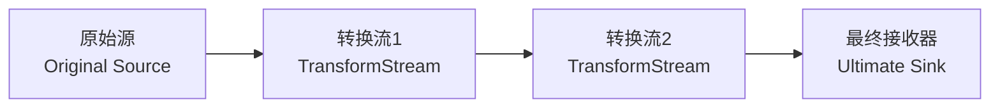

# [0073. Web Streams 核心概念](https://github.com/tnotesjs/TNotes.javascript/tree/main/notes/0073.%20Web%20Streams%20%E6%A0%B8%E5%BF%83%E6%A6%82%E5%BF%B5)

<!-- region:toc -->

- [1. 🎯 本节内容](#1--本节内容)
- [2. 🫧 评价](#2--评价)
- [3. 🔍 术语表](#3--术语表)
  - [3.1. 流类型](#31-流类型)
  - [3.2. 角色与组件](#32-角色与组件)
  - [3.3. 底层概念](#33-底层概念)
  - [3.4. 数据处理](#34-数据处理)
  - [3.5. 背压相关](#35-背压相关)
- [4. 🤔 Stream 是什么？](#4--stream-是什么)
- [5. 🤔 Web Streams API 是什么？](#5--web-streams-api-是什么)
  - [5.1. 基础 Stream 类型](#51-基础-stream-类型)
  - [5.2. 核心特点](#52-核心特点)
  - [5.3. 典型应用场景](#53-典型应用场景)
- [6. 🤔 Streams 中的核心概念都有哪些？](#6--streams-中的核心概念都有哪些)
  - [6.1. Readable streams - 可读流](#61-readable-streams---可读流)
    - [Underlying Source - 底层源](#underlying-source---底层源)
    - [Chunks - 数据块](#chunks---数据块)
    - [Stream 状态](#stream-状态)
    - [Reader, Consumer, Controller - 读取器、消费者、控制器](#reader-consumer-controller---读取器消费者控制器)
    - [Locking - 锁定](#locking---锁定)
    - [Readable streams and byte streams - 可读流和字节流](#readable-streams-and-byte-streams---可读流和字节流)
  - [6.2. Teeing - 分流](#62-teeing---分流)
    - [`tee()`](#tee)
    - [分流的必要性](#分流的必要性)
  - [6.3. Writable streams - 可写流](#63-writable-streams---可写流)
    - [Underlying Sink - 底层接收器](#underlying-sink---底层接收器)
    - [Writer, Producer, Controller - 写入器、生产者、控制器](#writer-producer-controller---写入器生产者控制器)
    - [Locking - 锁定](#locking---锁定)
  - [6.4. Pipe chains - 管道链](#64-pipe-chains---管道链)
  - [6.5. Backpressure - 背压机制](#65-backpressure---背压机制)
  - [6.6. Internal queues and queuing strategies - 内部队列和排队策略](#66-internal-queues-and-queuing-strategies---内部队列和排队策略)
- [7. 🆚 传统处理方式 vs. 流式处理方式](#7--传统处理方式-vs-流式处理方式)
- [8. 🔗 引用](#8--引用)

<!-- endregion:toc -->

## 1. 🎯 本节内容

- 流的相关术语
- 流的核心概念
- 传统处理方式 vs. 流处理方式

## 2. 🫧 评价

这篇笔记介绍了 Web Streams API 的核心概念，包括可读流、可写流、转换流的基本原理和使用方法，以及流式处理相较于传统数据处理方式的优势。

笔记中提到的这些相关术语和概念会在后续的学习中多次出现。

## 3. 🔍 术语表

在学习 Web Streams 相关知识点时，会遇到很多和 Streams 相关的专业术语。

这一部分主要用于记录和 Streams 相关的常见术语对照表。

### 3.1. 流类型

| 中文   | 英文             |
| ------ | ---------------- |
| 可读流 | Readable Stream  |
| 可写流 | Writable Stream  |
| 转换流 | Transform Stream |
| 字节流 | Byte Stream      |

### 3.2. 角色与组件

| 中文       | 英文          |
| ---------- | ------------- |
| 读取器     | Reader        |
| 写入器     | Writer        |
| 控制器     | Controller    |
| 生产者     | Producer      |
| 消费者     | Consumer      |
| 活动读取器 | Active Reader |
| 活动写入器 | Active Writer |

### 3.3. 底层概念

| 中文       | 英文              |
| ---------- | ----------------- |
| 底层源     | Underlying Source |
| 底层接收器 | Underlying Sink   |
| 推送源     | Push Source       |
| 拉取源     | Pull Source       |
| 原始源     | Original Source   |
| 接收源     | Ultimate Sink     |

### 3.4. 数据处理

| 中文     | 英文           |
| -------- | -------------- |
| 数据块   | Chunk          |
| 入队     | Enqueued       |
| 管道链   | Pipe Chain     |
| 分流     | Teeing         |
| 锁定     | Locking        |
| 内部队列 | Internal Queue |

### 3.5. 背压相关

| 中文       | 英文                         |
| ---------- | ---------------------------- |
| 背压       | Backpressure                 |
| 排队策略   | Queuing Strategy             |
| 高水位线   | High Water Mark              |
| 期望大小   | Desired Size                 |
| 自带缓冲区 | BYOB (Bring Your Own Buffer) |

## 4. 🤔 Stream 是什么？

在 Web Streams API 中，Stream 是一种用于高效、渐进式处理（如读取或写入）大数据（如网络响应、文件）的异步数据流抽象。

流式传输（Streaming）是指将网络资源分解成小块（chunks），然后逐块进行处理。浏览器在接收媒体资源时就已经使用了这种机制 —— 视频会边下载边缓冲播放，图片也会随着加载进度逐渐显示。

但在过去，JavaScript 从未拥有过这种能力。以前如果我们想处理某种资源（视频、文本文件等），必须先下载整个文件，等待它被反序列化为合适的格式，然后再处理接收到的全量数据。

有了 Streams API，你可以在原始数据可用时立即开始逐块处理，无需生成完整的缓冲区、字符串或 blob 对象。

Streams 的核心用法是让响应数据以流的形式提供。例如，成功的 `fetch` 请求返回的响应体就是一个 `ReadableStream`，可以通过 `ReadableStream.getReader()` 创建读取器来读取。

```js
// 使用 fetch 获取流式响应
const response = await fetch('https://jsonplaceholder.typicode.com/comments')
const reader = response.body.getReader()

while (true) {
  const { done, value } = await reader.read()
  if (done) break

  // value 是 Uint8Array，逐块处理数据
  console.log('接收到数据块:', value)
}
```


更复杂的用法包括使用 `ReadableStream()` 构造函数创建自定义流，例如在 Service Worker 中处理数据。

除了读取流数据之外，你也可以使用 `WritableStream` 向流中写入数据，或者使用 `TransformStream` 对流数据进行转换处理。

## 5. 🤔 Web Streams API 是什么？

Web Streams API 是浏览器提供的一套用于处理流式数据的标准接口，它允许 JavaScript 以分块（chunk）的方式逐步处理数据，而不需要一次性将所有数据加载到内存中。

### 5.1. 基础 Stream 类型

1. ReadableStream（可读流）
2. WritableStream（可写流）
3. TransformStream（转换流）

### 5.2. 核心特点

| 特点     | 说明                                               |
| -------- | -------------------------------------------------- |
| 分块处理 | 数据以小块的形式传输和处理，避免大文件占用过多内存 |
| 背压控制 | 自动管理数据流速，防止生产者速度过快导致消费者崩溃 |
| 可组合性 | 通过管道（pipe）将多个流连接起来，形成处理链       |
| 异步操作 | 基于 Promise，天然支持异步数据处理                 |
| 流程控制 | 检测流的开始和结束时机，按需处理错误和取消流       |
| 速度响应 | 根据流的读取速度做出响应，实现动态调整             |

### 5.3. 典型应用场景

| 场景 | 说明 |
| --- | --- |
| 大文件上传/下载 | 分块传输，显示进度，避免内存溢出 |
| 网络数据传输 | 流式处理 API 响应、SSE（Server-Sent Events）、实时数据推送 |
| 数据转换 | 文本编解码、数据压缩/解压、加密/解密等管道式处理 |
| 硬件通信 | 通过 Web Serial API、Web USB API、Web Bluetooth API 与底层设备通信 |
| 媒体处理 | 音视频流处理、实时转码 |
| Service Worker | 流式响应生成、缓存策略优化 |
| 数据聚合 | 从多个源读取数据并合并处理 |

## 6. 🤔 Streams 中的核心概念都有哪些？

### 6.1. Readable streams - 可读流


- 可读流是 JavaScript 中由 `ReadableStream` 对象表示的数据源，数据从底层源（underlying source）流出。

#### Underlying Source - 底层源

底层源是网络上或你的域中某个位置的资源，你希望从中获取数据。

底层源有两种类型：

- 推送源（Push sources）：在你访问它们时会持续向你推送数据，由你来决定何时开始、暂停或取消对流的访问。例如视频流和 TCP/WebSocket。
- 拉取源（Pull sources）：需要你在连接后显式请求数据。例如通过 `fetch()` 请求进行的文件访问操作。

注意：推送/拉取 ≠ 全双工/半双工

```js
// 推送源 vs 拉取源（数据流动的主动性）：
// 推送源：数据源主动向你推送数据（服务端主动）
// 拉取源：你需要主动请求数据（客户端主动）

// 全双工 vs 半双工（通信方向）：
// 全双工：双方可以同时发送和接收数据（如 WebSocket、电话）
// 半双工：同一时刻只能单向通信（如对讲机）

// 推送/拉取关注"谁主动发起数据传输"
// 全双工/半双工关注"能否同时双向通信"

// -------------------------------
// WebSocket - 推送源 + 全双工
// -------------------------------
const ws = new WebSocket('ws://example.com')
ws.onmessage = (e) => console.log(e.data) // 服务器主动推送
ws.send('hello') // 客户端也可以同时发送

// -------------------------------
// fetch - 拉取源 + 半双工
// -------------------------------
const response = await fetch('/api/data') // 客户端主动请求
const data = await response.json() // 等待响应（请求时不能同时接收）

// -------------------------------
// SSE (Server-Sent Events) - 推送源 + 半双工
// -------------------------------
const eventSource = new EventSource('/events')
eventSource.onmessage = (e) => console.log(e.data) // 服务器主动推送
// 但客户端不能通过这个连接发送数据（单向）

// -------------------------------
// 通过 Web Serial API 实现的 MicroPython Serial REPL 协议
// 推送源 + 全双工
// 类似 WebSocket
// -------------------------------
const port = await navigator.serial.requestPort()
await port.open({ baudRate: 115200 })
// 1. 读取流 - 推送源
// MicroPython 板子会主动推送数据（如 REPL 输出、print 语句等）
const reader = port.readable.getReader()
while (true) {
  const { value, done } = await reader.read()
  if (done) break
  console.log('收到数据:', new TextDecoder().decode(value))
  // MicroPython 主动推送，不需要你请求就会发送
}
// 2. 写入流 - 全双工的另一半
// 同时可以向 MicroPython 发送命令
const writer = port.writable.getWriter()
await writer.write(new TextEncoder().encode('print("hello")\r\n'))
// 可以同时读和写，互不阻塞
```

#### Chunks - 数据块

数据以称为“数据块（chunks）”的小片段顺序读取。一个数据块可以是单个字节，也可以是更大的内容（如特定大小的类型化数组）。单个流可以包含不同大小和类型的数据块。

放入流中的数据块被称为“入队（enqueued）”，这意味着它们在队列中等待被读取。内部队列会跟踪尚未被读取的数据块（详见下文的"内部队列和排队策略"部分）。

#### Stream 状态

可读流有三种状态：

| 状态     | 说明                 |
| -------- | -------------------- |
| readable | 流中有数据可读       |
| closed   | 流已关闭，不再有数据 |
| errored  | 流发生错误           |

#### Reader, Consumer, Controller - 读取器、消费者、控制器

流中的数据块由读取器（reader）读取，它每次处理一个数据块，允许你对其执行任何你想要的操作。读取器加上与之配套的其他处理代码被称为消费者（consumer）。

还有一个你会用到的结构叫做控制器（controller），每个读取器都有一个关联的控制器，允许你控制流（例如，如果需要可以关闭它）。

- reader 读取器，用于读取流中的数据
- consumer 消费者 = 读取器 + 数据处理逻辑
- controller 控制器，用于控制流（如关闭流）

#### Locking - 锁定

一次只能有一个读取器读取一个流；

- 当创建读取器 A 并开始读取流 B 时，这个读取器 A 就是一个活动的读取器（active reader），当读取器 A 读取流中的数据时，流 B 被锁定（Locked）到了读取器 A
- 如果你想让另一个读取器 C 开始读取你的流 B，通常需要先取消或释放之前的读取器 A，然后再使用读取器 C 来读取流 B 中的数据
- 如果你想要让读取器 A、C 可以同时读取同一个流中的数据，你可以对流进行分叉（或者说是拷贝），详见下文的"Teeing（数据流分路）"部分

#### Readable streams and byte streams - 可读流和字节流

注意，可读流有两种不同的类型。除了常规可读流之外，还有一种叫做字节流（byte stream）的类型。字节流是常规流的扩展版本，用于读取底层字节源。与常规可读流相比，字节流允许通过 BYOB 读取器（BYOB，"bring your own buffer"，自带缓冲区）进行读取。这种读取器允许将流直接读入开发者提供的缓冲区，最大程度地减少所需的复制操作。你的代码将使用哪种底层流（以及相应的读取器和控制器）取决于流最初是如何创建的（详见 `ReadableStream()` 构造函数）。

你可以通过诸如 `fetch` 请求返回的 `Response.body` 等机制使用现成的可读流，也可以使用 `ReadableStream()` 构造函数创建自己的流。

### 6.2. Teeing - 分流


尽管一次只能有一个读取器读取一个流，但可以将一个流分割成两个相同的副本，然后由两个独立的读取器分别读取。这称为分流（teeing）。

#### `tee()`

在 JavaScript 中，你可以通过 `ReadableStream.tee()` 方法实现分流，它会返回一个数组，包含原始可读流的两个相同副本，然后可以由两个独立的读取器分别读取。

例如，在 Service Worker 中，如果你想从服务器获取响应并将其流式传输到浏览器，同时也将其流式传输到 Service Worker 缓存，你就需要这样做。由于响应体不能被消费多次，并且一个流不能同时被多个读取器读取，因此你需要两个副本来完成此操作。

#### 分流的必要性

这一部分，我们将以前文提到的 Service Worker 场景为例来认识分流的必要性，来深入了解为何在这样的场景中需要使用分流机制来处理。

1. 💻 Service Worker 中的流分叉示例
2. 🤔 为什么这里必须分流？
3. 🆚 传统方式 vs. 分流方式
4. 🤔 为什么不直接拷贝从流中流出的数据，而是拷贝流？
5. 🤔 可以采用分块拷贝流数据的方案吗？
6. 🆚 手动分块 vs. `tee()` 分流

::: code-group

<<< ./assets/teeing/1.js [1]

<<< ./assets/teeing/2.js [2]

<<< ./assets/teeing/3.js [3]

<<< ./assets/teeing/4.js [4]

<<< ./assets/teeing/5.js [5]

<<< ./assets/teeing/6.js [6]

:::

### 6.3. Writable streams - 可写流


可写流是一个你可以向其中写入数据的目标，在 JavaScript 中由 `WritableStream` 对象表示，你可以使用 `WritableStream()` 构造函数来创建可写流。

#### Underlying Sink - 底层接收器

可写流是底层接收器（underlying sink）之上的抽象层，底层接收器是一个 I/O 接收器，原始数据会被写入其中。

注意：写入流 ≠ 实际写入底层，中间还有一层缓冲区。

内部队列（可写流内部维护的数据缓冲区）会跟踪已写入流 `writer.write(chunk)` 中的但尚未被底层接收器处理（还没有被最终目标（如文件、网络）真正消费）的 chunk。

内部队列用于缓冲生产者和消费者之间的速度差异。无论使用并发写入还是串行写入，队列都会自动管理数据流，确保底层接收器按顺序处理。

```js
const fileStream = new WritableStream({
  write(chunk) {
    // 模拟慢速 I/O（底层接收器处理慢）
    return new Promise((resolve) => {
      setTimeout(() => {
        console.log('实际写入磁盘:', chunk)
        resolve()
      }, 1000) // 每秒只能写入1个chunk块
    })
  },
})

const writer = fileStream.getWriter()

// 上层快速写入 3 个chunk块
// 但底层接收器处理慢（1 秒/个）

// 场景1. 不使用 await，让写入并发进行
// writer.write('chunk1') // 立即开始处理
// writer.write('chunk2') // 进入队列
// writer.write('chunk3') // 进入队列
// 总耗时：瞬间完成，小于 1s
// 执行过程：
// 0s:   chunk1 开始写入底层
//       chunk2、3 进入内部队列等待
// 1s:   chunk1 完成，chunk2 开始写入
//       chunk3 仍在队列
// 2s:   chunk2 完成，chunk3 开始写入
// 3s:   全部完成

// 场景2. 使用 await，等待写入完成
await writer.write('chunk1')
await writer.write('chunk2')
await writer.write('chunk3')
// 总耗时：3s（串行）
// 执行过程：
// 0s:   chunk1 开始写入底层
// 1s:   chunk1 完成，chunk2 开始写入
// 2s:   chunk2 完成，chunk3 开始写入
// 3s:   全部完成
```

#### Writer, Producer, Controller - 写入器、生产者、控制器

数据通过写入器（writer）写入流中，每次写入一个数据块（chunk）。数据块可以有多种形式，就像读取器中的数据块一样。

你可以使用任何代码来生成准备写入的数据块；写入器加上与之关联的代码被称为生产者（producer）。

每个写入器都有一个关联的控制器，允许你控制流（例如，如果需要可以中止它）。

- writer 写入器，用于向流中写入数据
- producer 生产者 = 写入器 + 数据生成逻辑
- controller 控制器，用于控制流（如关闭流）

#### Locking - 锁定

一次只能有一个写入器向可写流中写入数据：

- 当创建写入器 A 并开始向流 B 中写入数据时，这个写入器 A 被称为活动写入器（active writer），当写入器 A 往流 B 中写入数据时，流 B 被锁定（Locked）到了写入器 A
- 如果你想让另一个写入器 C 开始向你的流 B 中写入数据，必须先（通过中止、关闭或释放锁）释放当前写入器 A，然后再附加另一个写入器 C
- 注意：可写流不支持 `tee()` 分流操作（与可读流不同）

### 6.4. Pipe chains - 管道链




Streams API 使得通过一种称为管道链（pipe chain）的结构将流相互连接成为可能。有两个方法可以实现这一点:

1. `ReadableStream.pipeThrough()` 将流通过转换流进行传输，可能会在传输过程中转换数据格式。例如，这可以用于编解码视频帧、压缩或解压缩数据，或以其他方式将数据从一种形式转换为另一种形式。
   - 转换流由一对流组成：一个可读流（从中读取数据）和一个可写流（向其中写入数据），并配有适当的机制来确保一旦数据被写入，新数据就可以立即被读取。
   - `TransformStream` 是转换流的具体实现，但任何具有相同可读流和可写流属性的对象都可以传递给 `pipeThrough()`。
2. `ReadableStream.pipeTo()` 将流传输到充当管道链终点的可写流。

管道链的起点称为原始源（original source），终点称为最终接收器（ultimate sink）。

### 6.5. Backpressure - 背压机制

流中的一个重要概念是背压（backpressure），这是单个流或管道链调节读取/写入速度的过程。当链中后面的流仍在忙碌且尚未准备好接受更多数据块时，它会向链的上游发送信号，告诉较早的转换流（或原始源）减慢传输速度，从而避免在任何地方出现瓶颈。

要在可读流中使用背压，我们可以通过查询控制器上的 `ReadableStreamDefaultController.desiredSize` 属性来向控制器询问消费者所需的数据块大小。如果该值过低，我们的可读流可以告诉其底层源停止发送数据，从而沿着流链实施背压。

如果稍后消费者再次想要接收数据，我们可以在创建流时使用 `pull` 方法来告诉底层源向流提供数据。

### 6.6. Internal queues and queuing strategies - 内部队列和排队策略

如前所述，流中尚未被处理和完成的数据块会被内部队列跟踪。

- 对于可读流，这些是已入队但尚未被读取的数据块
- 对于可写流，这些是已写入但尚未被底层接收器处理的数据块

内部队列采用排队策略（queuing strategy），该策略决定了如何根据内部队列状态发出背压信号。

通常，该策略会将队列中数据块的大小与一个称为高水位线（high water mark）的值进行比较，高水位线是队列希望管理的最大数据块总大小。

执行的计算公式为：`高水位线 - 队列中数据块的总大小 = 期望大小`

期望大小（desired size）是流还能接受的数据块数量，以保持流继续流动但总大小低于高水位线。数据块生成速度会根据需要减慢或加快，以尽可能快地保持流的流动，同时保持期望大小大于零。如果该值降至零（或以下），则意味着数据块的生成速度超过了流的处理能力，这可能会导致问题。

举个例子，假设队列中数据块总大小为 0，单个数据块大小为 1，高水位线为 3。这意味着在达到高水位线并应用背压之前，最多可以入队 3 个数据块。

## 7. 🆚 传统处理方式 vs. 流式处理方式

| 特性     | 传统处理方式           | 流式处理方式         |
| -------- | ---------------------- | -------------------- |
| 内存占用 | 需要一次性加载全部数据 | 只保留当前处理的分块 |
| 处理时机 | 等待数据完全到达后处理 | 数据到达即可开始处理 |
| 用户体验 | 长时间等待             | 可以实时显示进度     |
| 错误处理 | 全部失败               | 可以部分成功         |

::: code-group

```js [传统方式]
// ❌ 问题：大文件会占用大量内存
async function downloadFile(url) {
  const response = await fetch(url)
  const blob = await response.blob() // 等待全部数据
  // 处理 blob...
}
```

```js [流式处理]
// ✅ 优势：边下载边处理
async function downloadFile(url) {
  const response = await fetch(url)
  const reader = response.body.getReader()

  while (true) {
    const { done, value } = await reader.read()
    if (done) break
    // 立即处理当前分块 value
  }
}
```

:::

## 8. 🔗 引用

- [Streams API][1]

[1]: https://developer.mozilla.org/en-US/docs/Web/API/Streams_API
