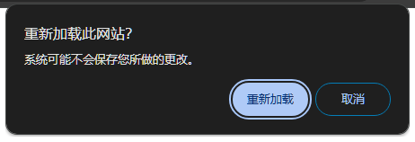

# [0079. window.onbeforeunload](https://github.com/Tdahuyou/TNotes.html-css-js/tree/main/notes/0079.%20window.onbeforeunload)

<!-- region:toc -->

- [1. 🔗 mdn - window.onbeforeunload](#1--mdn---windowonbeforeunload)
- [2. 💻 demos.1 - window.onbeforeunload 基本使用](#2--demos1---windowonbeforeunload-基本使用)

<!-- endregion:toc -->
- `window.onbeforeunload` 是一个事件处理器，它用于在窗口、页面或标签即将卸载时触发。
- **当用户尝试关闭浏览器窗口、刷新页面、导航到另一个页面或者通过其他方式离开当前页面时**，这个事件会被触发。
- 使用 `onbeforeunload` 事件可以显示一个确认对话框给用户，询问他们是否真的要离开页面。
- **这在用户正在编辑表单或其他数据而尚未保存的情况下特别有用**，因为它提供了一种防止意外丢失工作的方式。
- 滥用 `onbeforeunload` 可能会导致糟糕的用户体验，应谨慎使用，仅在必要时提醒用户。

## 1. 🔗 mdn - window.onbeforeunload

- https://developer.mozilla.org/zh-CN/docs/Web/API/Window/beforeunload_event

## 2. 💻 demos.1 - window.onbeforeunload 基本使用

- 在页面上插入以下脚本，当页面要被关闭或者刷新的时候，会弹出确认提示框。
  - 

```javascript
window.onbeforeunload = function (event) {
    // 设置对话框中的消息（注意：现代浏览器可能忽略自定义消息）
    event.returnValue = '您确定要离开此页面吗？未保存的数据将会丢失。';
    // 返回相同的字符串也是必需的，以确保兼容性
    return event.returnValue;
};
// 以 chrome 为例，我们配置的文案并不会生效，而是使用浏览器预设好的固定文案。
```

- 其实只需要让 window.onbeforeunload 绑定的函数返回一个字符串，它就能够正常工作。

```js
window.onbeforeunload = () => ''
// 这么写，也会在页面被关闭或者刷新之前，触发一个确认对话框。
```

- **应用场景：**
  - 可以用于检查是否有未保存的工作。

```javascript
window.addEventListener('beforeunload', function (event) {
  if (thereIsUnsavedWork()) {
    const message = '您确定要离开此页面吗？未保存的数据将会丢失。'
    event.returnValue = message
    return message
  }
})

function thereIsUnsavedWork() {
  console.log('检查是否有未保存的工作')

  // 有未保存的工作
  // return true

  // 没有未保存的工作
  return false
}
```
