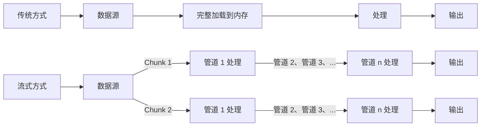

# [0124. Web Streams API 概览](https://github.com/tnotesjs/TNotes.javascript/tree/main/notes/0124.%20Web%20Streams%20API%20%E6%A6%82%E8%A7%88)

<!-- region:toc -->

- [1. 🎯 本节内容](#1--本节内容)
- [2. 🫧 评价](#2--评价)
- [3. 🤔 为什么说 Web Streams 是“响应式数据管道”的基础，而不仅是“大数据处理工具”？](#3--为什么说-web-streams-是响应式数据管道的基础而不仅是大数据处理工具)
  - [3.1. 数据流（Stream）的响应式数据管道](#31-数据流stream的响应式数据管道)
  - [3.2. 核心应用场景](#32-核心应用场景)
  - [3.3. 与大数据处理的区别](#33-与大数据处理的区别)
- [4. 🤔 为什么一个流不能被多个消费者同时消费？](#4--为什么一个流不能被多个消费者同时消费)
- [5. 🤔 一个流被消费后为何不能再次被消费？](#5--一个流被消费后为何不能再次被消费)
- [6. 🆚 Stream vs Promise](#6--stream-vs-promise)
  - [6.1. 相似点 - 单次、单相向消费](#61-相似点---单次单相向消费)
  - [6.2. 核心点 - 关注点不同](#62-核心点---关注点不同)
- [7. 🤔 如果不关注背压机制，流处理可能会导致什么实际问题？](#7--如果不关注背压机制流处理可能会导致什么实际问题)
  - [7.1. 典型问题：内存溢出](#71-典型问题内存溢出)
  - [7.2. 实际场景的问题](#72-实际场景的问题)
  - [7.3. 背压的作用](#73-背压的作用)
- [8. 🤔 Fetch 的 Response.body 为什么是 ReadableStream 而不是直接返回整个数据？](#8--fetch-的-responsebody-为什么是-readablestream-而不是直接返回整个数据)
  - [8.1. 核心原因：用户体验和资源效率](#81-核心原因用户体验和资源效率)
  - [8.2. 实际优势对比](#82-实际优势对比)
  - [8.3. 典型应用场景](#83-典型应用场景)
- [9. 🤔 Web Streams 与 RxJS / Node.js Streams 的设计理念主要差异在哪里？](#9--web-streams-与-rxjs--nodejs-streams-的设计理念主要差异在哪里)
  - [9.1. 核心对比](#91-核心对比)
  - [9.2. 代码风格对比](#92-代码风格对比)
  - [9.3. 设计理念差异](#93-设计理念差异)
  - [9.4. 何时选择 Web Streams](#94-何时选择-web-streams)
- [10. 💻 demos.1 - 对比传统 fetch().json() 与流式处理响应体](#10--demos1---对比传统-fetchjson-与流式处理响应体)
- [11. 💻 demos.2 - 用三行代码创建并消费一个自定义可读流](#11--demos2---用三行代码创建并消费一个自定义可读流)
- [12. 🔗 引用](#12--引用)

<!-- endregion:toc -->

## 1. 🎯 本节内容

- Web Streams API 的三大核心接口
- 流式数据处理的设计理念
- 流的锁定机制与不可重用性
- 流与 Promise 的关系对比
- 背压机制的核心概念
- 流在 Web 标准中的应用场景
- 浏览器兼容性与 Polyfill 方案

## 2. 🫧 评价

Web Streams API 是现代前端架构中一项极其重要但容易被低估的技术。它不仅解决了大文件处理问题，更是响应式数据管道、实时数据流、渐进式渲染的基石。Fetch API、File API、Compression Streams 等标准都依赖它构建，是浏览器原生异步数据处理的核心抽象。

从学习曲线看，流的概念本身不难，但锁定机制、背压控制、管道链设计需要实践才能深刻理解。建议先掌握基本的读写操作，再逐步深入背压机制和 TransformStream 的应用。重点关注流的不可重用性和锁定特性，这两个设计决策影响整个 API 的使用方式。

与其他流技术对比：RxJS 提供的是函数式响应式编程范式，侧重于事件流和操作符组合；Node.js Streams 专注服务端场景，API 设计更贴近 I/O 操作。而 Web Streams 作为浏览器标准，强调与 Web API 的深度集成、内存安全和规范化的背压机制，是浏览器环境下处理流式数据的首选方案。

## 3. 🤔 为什么说 Web Streams 是“响应式数据管道”的基础，而不仅是“大数据处理工具”？

提到“流”，你可能首先会想到用它来处理大数据的分块传输，以缓解内存压力，但 Web Streams 的设计理念远不止于此。它更强调数据的“响应式”处理能力，即数据在生产、传输和消费过程中能够实时协调和适应各方需求。

### 3.1. 数据流（Stream）的响应式数据管道

Web Streams 实现了 `数据生产者（Producer）→ 管道（Pipeline）→ 数据消费者（Consumer）` 的异步流动模型，数据可以逐块（chunk）生成、转换和消费，而不是一次性加载到内存。

```js
// 传统方式：一次性获取全部数据
const data = await fetch(url).then((r) => r.json())
processData(data) // 必须等待全部数据到达

// 流式管道：数据到达即处理
fetch(url)
  .then((r) => r.body)
  .pipeThrough(new TextDecoderStream())
  .pipeThrough(jsonLineParser) // 逐行解析
  .pipeThrough(dataValidator) // 实时验证
  .pipeThrough(transformer) // 边收边转换
  .pipeTo(uiRenderer) // 渐进式渲染
```

背压（Backpressure）机制是响应式系统的核心特征之一。当消费者处理速度跟不上数据生产速度时，系统会自动反向通知生产者降速，实现流量控制，避免内存溢出。这种“实时协调”的能力是响应式管道的典型特征。

### 3.2. 核心应用场景

| 场景          | 流的价值           | 传统方式的局限   |
| ------------- | ------------------ | ---------------- |
| 实时日志      | 边收边显示，无延迟 | 必须等待完整响应 |
| 大文件上传    | 边读边压缩边发送   | 内存溢出风险     |
| CSV 导出      | 逐行生成，内存恒定 | 需要缓存所有行   |
| 视频转码      | 流式转换，即转即播 | 需要完整文件     |
| SSE/WebSocket | 天然管道化处理     | 手动拼接数据块   |

### 3.3. 与大数据处理的区别



流让你可以通过不同的管道来组合异步操作逐步处理一个个数据块。

## 4. 🤔 为什么一个流不能被多个消费者同时消费？

流被读取时会被锁定（locked），被锁定之后这个流就不能再被其他 reader 使用了。

```js
const stream = new ReadableStream({
  start(controller) {
    controller.enqueue('chunk1')
    controller.enqueue('chunk2')
    controller.close()
  },
})

const reader1 = stream.getReader()
await reader1.read() // { value: 'chunk1', done: false }

const reader2 = stream.getReader() // ❌ TypeError: This stream is locked to a reader
```

需要锁定的原因：

1. 数据顺序保证：避免多个 reader 交错读取导致数据乱序
2. 背压控制：只有一个消费者才能正确发送背压信号
3. 资源管理：底层源（如文件句柄）只能被一个消费者持有

多消费者的解决方案：使用 `tee()` 进行分流

```js
const [stream1, stream2] = originalStream.tee()

// 两个独立的流，可以分别读取
const reader1 = stream1.getReader()
const reader2 = stream2.getReader()
```

`tee()` 方法就是对“多消费者需求”的响应，它创建了两个独立的流，每个都有自己的内部缓冲区。

## 5. 🤔 一个流被消费后为何不能再次被消费？

```javascript
// 像水流一样，流过了就不能倒流
const waterStream = getWaterFromPipe()
drinkFrom(waterStream) // 水被喝掉了
drinkFromAgain(waterStream) // 管道里已经没有水了
```

真实世界的数据源（网络响应、文件读取、用户输入）通常就是一次性的，Stream 忠实地反映了这一现实。

如果可以重复读取，需要：

1. 缓存所有已读取的数据（内存问题）
2. 或者让数据源支持重播（并非所有源都支持）

对比两种不同的设计方案：

- 支持重读 → 需要缓存 → 内存开销大 + 复杂的状态管理
- 禁止重读 → 简单明确 + 内存开销小 + 符合多数真实场景

如果想要用多个消费者消费同一个流中的数据，可以在可读的数据源头做分流 `tee()` 分流处理而不是让同一个源同时被多个消费者消费。

```javascript
// 分流
const [stream1, stream2] = originalStream.tee()

// 或者使用 TransformStream 复制数据
const transform = new TransformStream({
  transform(chunk, controller) {
    controller.enqueue(cloneChunk(chunk))
    // 可以发送到多个地方
  },
})
```

## 6. 🆚 Stream vs Promise

### 6.1. 相似点 - 单次、单相向消费

相同的“状态转换”模型：

```js
// Promise 的状态变化（单向）：
pending → fulfilled ✅ 或 pending → rejected ❌

// ReadableStream 的状态变化（单向）：
readable → closed ✅ 或 readable → errored ❌
```

两者都遵循单次状态转换的模式：

- Promise：一旦 resolved/rejected，值就被“消费”，后续的 `then()` 只能获取相同结果
- Stream：一旦被 reader 锁定并开始消费，数据就被顺序读取，无法倒带重读

```js
// Promise 的“一次性值”
const promise = fetch('/api/data') // 只能 resolve 一次

// Stream 的“一次性序列”
const stream = response.body // 数据只能被顺序消费一次
```

两者都代表了异步计算的单次结果：

- Promise：单个值的一次性产出
- Stream：值序列的一次性产出

### 6.2. 核心点 - 关注点不同

- Promise 的值是已完成的结果，可以被多次访问 - 关注的是最终结果
- Stream 的值是正在流动的数据，一旦被消费完就消失了 - 关注的是流动过程

| 特性 | Promise | Stream |
| --- | --- | --- |
| 消费单位 | 单值（once-resolution） | 多值序列（chunks） |
| 多消费者 | 可以多次 `.then()` | 一个流只能有一个 reader，可以通过 `tee()` 分流，让多个 reader 接入同一个流 |
| 状态变化 | pending → fulfilled/rejected | readable → locked → closed |
| 状态锁定 | 隐式（resolved 后状态固定） | 显式（locked 标志） |
| 消费方式 | 一次性原子消费，消费后多个 `.then()` 共享同一个结果 | 渐进式顺序消费，消费时锁定并独占数据流，消费后无法被重复消费 |
| 时间维度 | 时间点上的快照 | 时间线上的序列 |

1. 消费粒度层面
2. 时间维度层面
3. 取消机制层面
4. ……

::: code-group

```js [1]
// Promise：原子性消费（全有或全无）
promise.then((data) => console.log(data)) // 一次性获取全部

// Stream：渐进式消费
const reader = stream.getReader()
reader.read().then(({ value, done }) => {
  /* 逐块处理 */
})

// Promise 的消费是原子的：要么拿到完整结果，要么失败。
// Stream 的消费是渐进的：每次 read() 获取一个 chunk，消费过程可以被暂停、恢复，并且可以提前取消。
```

```js [2]
// Promise：时间点上的结果
async function fetchData() {
  return await promise // 等待结果完成
}

// Stream：时间线上的序列
async function processStream() {
  while (true) {
    const { value, done } = await reader.read()
    if (done) break
    processChunk(value) // 每个chunk在不同时间点到达
  }
}

// Promise 是时间点上的快照。
// Stream 是时间线上的流动，体现了 时间作为第一类公民 的响应式思想。
```

```js [3]
// Promise：原生无法取消（需要AbortController配合）
const controller = new AbortController()
fetch(url, { signal: controller.signal })

// Stream：内置取消机制
const reader = stream.getReader()
// 可以通过 reader.cancel() 或不再调用 read() 来中断

// Promise 的取消是暴力的（直接拒绝）
// Stream 的取消是优雅的（可以通知上游停止生产）
```

:::

两者内部状态机的伪代码示例：

1. Promise 的内部状态机
2. Stream 的内部状态机

::: code-group

```js [1]
class SimplifiedPromise {
  state = 'pending'
  value = undefined
  then(onFulfilled) {
    if (this.state === 'fulfilled') {
      // 已经resolved，直接返回值
      queueMicrotask(() => onFulfilled(this.value))
    }
  }
}
```

```js [2]
class SimplifiedReadableStream {
  state = 'readable'
  locked = false // 关键区别：锁定标志
  reader = null

  getReader() {
    if (this.locked) throw new TypeError('Stream already locked')
    this.locked = true
    return new Reader(this)
  }
}
```

:::

## 7. 🤔 如果不关注背压机制，流处理可能会导致什么实际问题？

### 7.1. 典型问题：内存溢出

```js
// ❌ 没有背压控制的流
const fastProducer = new ReadableStream({
  start(controller) {
    setInterval(() => {
      // 快速生成大量数据
      controller.enqueue(new Uint8Array(1024 * 1024)) // 每次 1MB
    }, 10) // 每 10ms 一次
  },
})

// 慢速消费者
fastProducer.pipeTo(
  new WritableStream({
    async write(chunk) {
      await new Promise((r) => setTimeout(r, 1000)) // 处理需要 1s
      // ⚠️ 内部队列会无限增长，最终内存溢出
    },
  })
)
```

### 7.2. 实际场景的问题

| 场景           | 无背压的后果             | 正确做法                     |
| -------------- | ------------------------ | ---------------------------- |
| 大文件上传     | 浏览器内存占满，页面卡死 | 控制读取速度，等待网络准备好 |
| 实时日志流     | 缓冲区爆满，数据丢失     | 暂停生产者直到消费者追上     |
| 视频流转码     | CPU/内存飙升，浏览器崩溃 | 根据解码速度控制读取         |
| WebSocket 消息 | 消息堆积，延迟越来越高   | 发送背压信号给服务器         |

### 7.3. 背压的作用

```js
// ✅ 有背压控制
const stream = new ReadableStream(
  {
    async pull(controller) {
      // 只有当消费者准备好时才生成数据
      if (controller.desiredSize > 0) {
        controller.enqueue(generateData())
      }
      // 如果 desiredSize <= 0，说明消费者处理不过来，暂停生产
    },
  },
  new CountQueuingStrategy({ highWaterMark: 10 })
) // 队列最多 10 个 chunk
```

关键：背压让生产速度自动匹配消费速度，避免内存无限增长。

## 8. 🤔 Fetch 的 Response.body 为什么是 ReadableStream 而不是直接返回整个数据？

### 8.1. 核心原因：用户体验和资源效率

```js
// 传统方式：必须等待完整响应
const data = await fetch(url).then((r) => r.json())
console.log(data) // ❌ 大文件需要等待数秒甚至数分钟

// 流式方式：数据到达即处理
const response = await fetch(url)
const reader = response.body.getReader()
while (true) {
  const { done, value } = await reader.read()
  if (done) break
  renderChunk(value) // ✅ 边下载边渲染
}
```

### 8.2. 实际优势对比

| 对比项     | 完整加载            | 流式处理           |
| ---------- | ------------------- | ------------------ |
| 首屏时间   | 等待全部数据        | 立即显示第一块     |
| 内存占用   | 等于文件大小        | 恒定（缓冲区大小） |
| 下载中断   | 前功尽弃            | 已处理部分保留     |
| 进度显示   | 需要 Content-Length | 实时计算           |
| 大文件处理 | 可能内存溢出        | 流式处理无压力     |

### 8.3. 典型应用场景

```js
// 场景1：带进度的文件下载
const response = await fetch('/large-file.zip')
const contentLength = response.headers.get('Content-Length')
let loaded = 0

const stream = new ReadableStream({
  async start(controller) {
    const reader = response.body.getReader()
    while (true) {
      const { done, value } = await reader.read()
      if (done) break
      loaded += value.length
      updateProgress((loaded / contentLength) * 100) // ✅ 实时进度
      controller.enqueue(value)
    }
    controller.close()
  },
})

// 场景2：流式 JSON 解析（如 SSE）
response.body
  .pipeThrough(new TextDecoderStream())
  .pipeThrough(jsonLineParser)
  .pipeTo(
    new WritableStream({
      write(obj) {
        updateUI(obj) // ✅ 每条数据到达即更新 UI
      },
    })
  )
```

Response.body 是流，让你可以在数据传输过程中就开始处理，而不是被动等待。

## 9. 🤔 Web Streams 与 RxJS / Node.js Streams 的设计理念主要差异在哪里？

### 9.1. 核心对比

| 对比维度 | Web Streams | RxJS | Node.js Streams |
| --- | --- | --- | --- |
| 定位 | 浏览器标准，Web API 集成 | 函数式响应式编程库 | Node.js 核心 I/O 抽象 |
| 设计目标 | 字节流处理，内存安全 | 事件流，操作符组合 | 服务端 I/O，高吞吐量 |
| 背压机制 | 标准化，自动传播 | 手动实现（operators） | 基于事件（pause/resume） |
| 错误处理 | Promise-based | Observable error | EventEmitter-based |
| API 风格 | 简洁，Web 标准 | 丰富操作符（100+） | 类继承，事件驱动 |
| 适用场景 | 浏览器文件/网络处理 | 前端事件流，状态管理 | 服务端文件/网络 I/O |

### 9.2. 代码风格对比

```js
// Web Streams：管道化
fetch(url)
  .then((r) => r.body)
  .pipeThrough(decompressor)
  .pipeThrough(decoder)
  .pipeTo(destination)

// RxJS：操作符链
fromFetch(url)
  .pipe(
    switchMap((r) => r.body),
    map(decompress),
    map(decode),
    tap(destination)
  )
  .subscribe()

// Node.js Streams：事件驱动
const readable = fs.createReadStream(file)
readable.pipe(decompressor).pipe(decoder).pipe(destination)
```

### 9.3. 设计理念差异

Web Streams：

- 专注于字节流（Uint8Array）
- 强调锁定和独占
- 与 Fetch/File API 深度集成
- 内存安全优先

RxJS：

- 专注于值的序列（任意类型）
- 丰富的组合操作符
- 适合事件流和状态管理
- 函数式编程范式

Node.js Streams：

- 专注于服务端 I/O
- 高吞吐量优化
- 与文件系统深度集成
- 继承自 EventEmitter

### 9.4. 何时选择 Web Streams

```js
// ✅ 适合 Web Streams
fetch('/large-file').then((r) => r.body.pipeTo(destination))
blob.stream().pipeThrough(compressor)
new Response(stream)

// ❌ 不适合 Web Streams（用 RxJS）
button.clicks.pipe(debounceTime(300))
state$.pipe(map, filter, distinctUntilChanged)
```

Web Streams 是浏览器原生的字节流处理标准，与 RxJS/Node.js 定位不同，各有擅长领域。

## 10. 💻 demos.1 - 对比传统 fetch().json() 与流式处理响应体

::: code-group

<<< ./demos/1/1.html

<<< ./demos/1/1.js

:::

## 11. 💻 demos.2 - 用三行代码创建并消费一个自定义可读流

::: code-group

<<< ./demos/2/1.html

<<< ./demos/2/1.js

:::

## 12. 🔗 引用

- [Streams API][1]
- [Using readable streams][2]
- [ReadableStream.from()][3]
- [Streams API concepts][4]

[1]: https://developer.mozilla.org/en-US/docs/Web/API/Streams_API
[2]: https://developer.mozilla.org/en-US/docs/Web/API/Streams_API/Using_readable_streams
[3]: https://developer.mozilla.org/en-US/docs/Web/API/ReadableStream/from_static
[4]: https://developer.mozilla.org/en-US/docs/Web/API/Streams_API/Concepts
