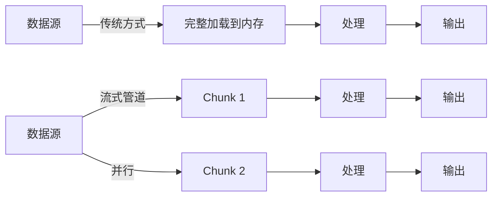

# [0124. Web Streams API 概览](https://github.com/tnotesjs/TNotes.javascript/tree/main/notes/0124.%20Web%20Streams%20API%20%E6%A6%82%E8%A7%88)

<!-- region:toc -->

- [1. 🎯 本节内容](#1--本节内容)
- [2. 🫧 评价](#2--评价)
- [3. 🤔 为什么说 Web Streams 是“响应式数据管道”的基础，而不仅是“大数据处理工具”？](#3--为什么说-web-streams-是响应式数据管道的基础而不仅是大数据处理工具)
  - [3.1. 响应式数据管道的特性](#31-响应式数据管道的特性)
  - [3.2. 核心应用场景](#32-核心应用场景)
  - [3.3. 与大数据处理的区别](#33-与大数据处理的区别)
- [4. 🤔 一个流被读取后为何不能再被其他 reader 使用？这与 Promise 的 once-resolution 有何异同？](#4--一个流被读取后为何不能再被其他-reader-使用这与-promise-的-once-resolution-有何异同)
  - [4.1. 流的锁定机制](#41-流的锁定机制)
  - [4.2. 为什么需要锁定](#42-为什么需要锁定)
  - [4.3. 解决方案：tee() 分流](#43-解决方案tee-分流)
  - [4.4. 与 Promise 的对比](#44-与-promise-的对比)
- [5. 🤔 如果不关注背压机制,流处理可能会导致什么实际问题？](#5--如果不关注背压机制流处理可能会导致什么实际问题)
  - [5.1. 典型问题：内存溢出](#51-典型问题内存溢出)
  - [5.2. 实际场景的问题](#52-实际场景的问题)
  - [5.3. 背压的作用](#53-背压的作用)
- [6. 🤔 Fetch 的 Response.body 为什么是 ReadableStream 而不是直接返回整个数据？](#6--fetch-的-responsebody-为什么是-readablestream-而不是直接返回整个数据)
  - [6.1. 核心原因：用户体验和资源效率](#61-核心原因用户体验和资源效率)
  - [6.2. 实际优势对比](#62-实际优势对比)
  - [6.3. 典型应用场景](#63-典型应用场景)
- [7. 🤔 Web Streams 与 RxJS / Node.js Streams 的设计理念主要差异在哪里？](#7--web-streams-与-rxjs--nodejs-streams-的设计理念主要差异在哪里)
  - [7.1. 核心对比](#71-核心对比)
  - [7.2. 代码风格对比](#72-代码风格对比)
  - [7.3. 设计理念差异](#73-设计理念差异)
  - [7.4. 何时选择 Web Streams](#74-何时选择-web-streams)
- [8. 💻 demos.1 - 对比传统 fetch().json() 与流式处理响应体](#8--demos1---对比传统-fetchjson-与流式处理响应体)
- [9. 💻 demos.2 - 用三行代码创建并消费一个自定义可读流](#9--demos2---用三行代码创建并消费一个自定义可读流)
- [10. 🔗 引用](#10--引用)

<!-- endregion:toc -->

## 1. 🎯 本节内容

- Web Streams API 的三大核心接口
- 流式数据处理的设计理念
- 流的锁定机制与不可重用性
- 流与 Promise 的关系对比
- 背压机制的核心概念
- 流在 Web 标准中的应用场景
- 浏览器兼容性与 Polyfill 方案

## 2. 🫧 评价

Web Streams API 是现代前端架构中一项极其重要但容易被低估的技术。它不仅解决了大文件处理问题，更是响应式数据管道、实时数据流、渐进式渲染的基石。Fetch API、File API、Compression Streams 等标准都依赖它构建，是浏览器原生异步数据处理的核心抽象。

从学习曲线看，流的概念本身不难，但锁定机制、背压控制、管道链设计需要实践才能深刻理解。建议先掌握基本的读写操作，再逐步深入背压机制和 TransformStream 的应用。重点关注流的不可重用性和锁定特性，这两个设计决策影响整个 API 的使用方式。

与其他流技术对比：RxJS 提供的是函数式响应式编程范式，侧重于事件流和操作符组合；Node.js Streams 专注服务端场景，API 设计更贴近 I/O 操作。而 Web Streams 作为浏览器标准，强调与 Web API 的深度集成、内存安全和规范化的背压机制，是浏览器环境下处理流式数据的首选方案。

## 3. 🤔 为什么说 Web Streams 是“响应式数据管道”的基础，而不仅是“大数据处理工具”？

Web Streams 的核心价值在于数据流转的编排能力，而非单纯的大数据处理。

### 3.1. 响应式数据管道的特性

```js
// 传统方式：一次性获取全部数据
const data = await fetch(url).then((r) => r.json())
processData(data) // ❌ 必须等待全部数据到达

// 流式管道：数据到达即处理
fetch(url)
  .then((r) => r.body)
  .pipeThrough(new TextDecoderStream())
  .pipeThrough(jsonLineParser) // ✅ 逐行解析
  .pipeThrough(dataValidator) // ✅ 实时验证
  .pipeThrough(transformer) // ✅ 边收边转换
  .pipeTo(uiRenderer) // ✅ 渐进式渲染
```

### 3.2. 核心应用场景

| 场景          | 流的价值           | 传统方式的局限   |
| ------------- | ------------------ | ---------------- |
| 实时日志      | 边收边显示，无延迟 | 必须等待完整响应 |
| 大文件上传    | 边读边压缩边发送   | 内存溢出风险     |
| CSV 导出      | 逐行生成，内存恒定 | 需要缓存所有行   |
| 视频转码      | 流式转换，即转即播 | 需要完整文件     |
| SSE/WebSocket | 天然管道化处理     | 手动拼接数据块   |

### 3.3. 与大数据处理的区别



流让你组合异步操作，而不只是处理大数据。

## 4. 🤔 一个流被读取后为何不能再被其他 reader 使用？这与 Promise 的 once-resolution 有何异同？

### 4.1. 流的锁定机制

流被读取时会锁定（locked），这是为了保证数据的顺序性和一致性。

```js
const stream = new ReadableStream({
  start(controller) {
    controller.enqueue('chunk1')
    controller.enqueue('chunk2')
    controller.close()
  },
})

const reader1 = stream.getReader()
await reader1.read() // { value: 'chunk1', done: false }

const reader2 = stream.getReader() // ❌ TypeError: This stream is locked to a reader
```

### 4.2. 为什么需要锁定

1. 数据顺序保证：避免多个 reader 交错读取导致数据乱序
2. 背压控制：只有一个消费者才能正确发送背压信号
3. 资源管理：底层源（如文件句柄）只能被一个消费者持有

### 4.3. 解决方案：tee() 分流

```js
const [stream1, stream2] = originalStream.tee()

// 两个独立的流，可以分别读取
const reader1 = stream1.getReader()
const reader2 = stream2.getReader()
```

### 4.4. 与 Promise 的对比

| 特性       | Promise                       | Stream                     |
| ---------- | ----------------------------- | -------------------------- |
| 值的数量   | 单值（once-resolution）       | 多值序列                   |
| 可重复使用 | ✅ 可以多次 `.then()`         | ❌ 只能一个 reader         |
| 状态       | pending → fulfilled/rejected  | readable → locked → closed |
| 消费方式   | 多个 `.then()` 共享同一个结果 | 锁定后独占数据流           |
| 分支       | 天然支持多个 `.then()`        | 需要显式 `.tee()`          |

核心差异：Promise 的值是已完成的结果，可以被多次访问；Stream 的值是正在流动的数据，一旦被消费就消失了。

## 5. 🤔 如果不关注背压机制,流处理可能会导致什么实际问题？

### 5.1. 典型问题：内存溢出

```js
// ❌ 没有背压控制的流
const fastProducer = new ReadableStream({
  start(controller) {
    setInterval(() => {
      // 快速生成大量数据
      controller.enqueue(new Uint8Array(1024 * 1024)) // 每次 1MB
    }, 10) // 每 10ms 一次
  },
})

// 慢速消费者
fastProducer.pipeTo(
  new WritableStream({
    async write(chunk) {
      await new Promise((r) => setTimeout(r, 1000)) // 处理需要 1s
      // ⚠️ 内部队列会无限增长，最终内存溢出
    },
  })
)
```

### 5.2. 实际场景的问题

| 场景           | 无背压的后果             | 正确做法                     |
| -------------- | ------------------------ | ---------------------------- |
| 大文件上传     | 浏览器内存占满，页面卡死 | 控制读取速度，等待网络准备好 |
| 实时日志流     | 缓冲区爆满，数据丢失     | 暂停生产者直到消费者追上     |
| 视频流转码     | CPU/内存飙升，浏览器崩溃 | 根据解码速度控制读取         |
| WebSocket 消息 | 消息堆积，延迟越来越高   | 发送背压信号给服务器         |

### 5.3. 背压的作用

```js
// ✅ 有背压控制
const stream = new ReadableStream(
  {
    async pull(controller) {
      // 只有当消费者准备好时才生成数据
      if (controller.desiredSize > 0) {
        controller.enqueue(generateData())
      }
      // 如果 desiredSize <= 0，说明消费者处理不过来，暂停生产
    },
  },
  new CountQueuingStrategy({ highWaterMark: 10 })
) // 队列最多 10 个 chunk
```

关键：背压让生产速度自动匹配消费速度，避免内存无限增长。

## 6. 🤔 Fetch 的 Response.body 为什么是 ReadableStream 而不是直接返回整个数据？

### 6.1. 核心原因：用户体验和资源效率

```js
// 传统方式：必须等待完整响应
const data = await fetch(url).then((r) => r.json())
console.log(data) // ❌ 大文件需要等待数秒甚至数分钟

// 流式方式：数据到达即处理
const response = await fetch(url)
const reader = response.body.getReader()
while (true) {
  const { done, value } = await reader.read()
  if (done) break
  renderChunk(value) // ✅ 边下载边渲染
}
```

### 6.2. 实际优势对比

| 对比项     | 完整加载            | 流式处理           |
| ---------- | ------------------- | ------------------ |
| 首屏时间   | 等待全部数据        | 立即显示第一块     |
| 内存占用   | 等于文件大小        | 恒定（缓冲区大小） |
| 下载中断   | 前功尽弃            | 已处理部分保留     |
| 进度显示   | 需要 Content-Length | 实时计算           |
| 大文件处理 | 可能内存溢出        | 流式处理无压力     |

### 6.3. 典型应用场景

```js
// 场景1：带进度的文件下载
const response = await fetch('/large-file.zip')
const contentLength = response.headers.get('Content-Length')
let loaded = 0

const stream = new ReadableStream({
  async start(controller) {
    const reader = response.body.getReader()
    while (true) {
      const { done, value } = await reader.read()
      if (done) break
      loaded += value.length
      updateProgress((loaded / contentLength) * 100) // ✅ 实时进度
      controller.enqueue(value)
    }
    controller.close()
  },
})

// 场景2：流式 JSON 解析（如 SSE）
response.body
  .pipeThrough(new TextDecoderStream())
  .pipeThrough(jsonLineParser)
  .pipeTo(
    new WritableStream({
      write(obj) {
        updateUI(obj) // ✅ 每条数据到达即更新 UI
      },
    })
  )
```

Response.body 是流，让你可以在数据传输过程中就开始处理，而不是被动等待。

## 7. 🤔 Web Streams 与 RxJS / Node.js Streams 的设计理念主要差异在哪里？

### 7.1. 核心对比

| 对比维度 | Web Streams | RxJS | Node.js Streams |
| --- | --- | --- | --- |
| 定位 | 浏览器标准，Web API 集成 | 函数式响应式编程库 | Node.js 核心 I/O 抽象 |
| 设计目标 | 字节流处理，内存安全 | 事件流，操作符组合 | 服务端 I/O，高吞吐量 |
| 背压机制 | 标准化，自动传播 | 手动实现（operators） | 基于事件（pause/resume） |
| 错误处理 | Promise-based | Observable error | EventEmitter-based |
| API 风格 | 简洁，Web 标准 | 丰富操作符（100+） | 类继承，事件驱动 |
| 适用场景 | 浏览器文件/网络处理 | 前端事件流，状态管理 | 服务端文件/网络 I/O |

### 7.2. 代码风格对比

```js
// Web Streams：管道化
fetch(url)
  .then((r) => r.body)
  .pipeThrough(decompressor)
  .pipeThrough(decoder)
  .pipeTo(destination)

// RxJS：操作符链
fromFetch(url)
  .pipe(
    switchMap((r) => r.body),
    map(decompress),
    map(decode),
    tap(destination)
  )
  .subscribe()

// Node.js Streams：事件驱动
const readable = fs.createReadStream(file)
readable.pipe(decompressor).pipe(decoder).pipe(destination)
```

### 7.3. 设计理念差异

Web Streams：

- 专注于字节流（Uint8Array）
- 强调锁定和独占
- 与 Fetch/File API 深度集成
- 内存安全优先

RxJS：

- 专注于值的序列（任意类型）
- 丰富的组合操作符
- 适合事件流和状态管理
- 函数式编程范式

Node.js Streams：

- 专注于服务端 I/O
- 高吞吐量优化
- 与文件系统深度集成
- 继承自 EventEmitter

### 7.4. 何时选择 Web Streams

```js
// ✅ 适合 Web Streams
fetch('/large-file').then((r) => r.body.pipeTo(destination))
blob.stream().pipeThrough(compressor)
new Response(stream)

// ❌ 不适合 Web Streams（用 RxJS）
button.clicks.pipe(debounceTime(300))
state$.pipe(map, filter, distinctUntilChanged)
```

Web Streams 是浏览器原生的字节流处理标准，与 RxJS/Node.js 定位不同，各有擅长领域。

## 8. 💻 demos.1 - 对比传统 fetch().json() 与流式处理响应体

::: code-group

<<< ./demos/1/1.html

<<< ./demos/1/1.js

:::

## 9. 💻 demos.2 - 用三行代码创建并消费一个自定义可读流

::: code-group

<<< ./demos/2/1.html

<<< ./demos/2/1.js

:::

## 10. 🔗 引用

- [Streams API][1]
- [Using readable streams][2]
- [ReadableStream.from()][3]
- [Streams API concepts][4]

[1]: https://developer.mozilla.org/en-US/docs/Web/API/Streams_API
[2]: https://developer.mozilla.org/en-US/docs/Web/API/Streams_API/Using_readable_streams
[3]: https://developer.mozilla.org/en-US/docs/Web/API/ReadableStream/from_static
[4]: https://developer.mozilla.org/en-US/docs/Web/API/Streams_API/Concepts
