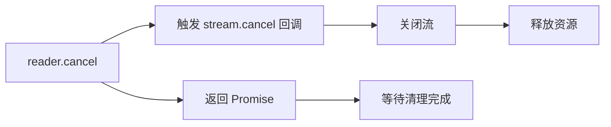

# [0125. ReadableStream](https://github.com/tnotesjs/TNotes.javascript/tree/main/notes/0125.%20ReadableStream)

<!-- region:toc -->

- [1. 🎯 本节内容](#1--本节内容)
- [2. 🫧 评价](#2--评价)
- [3. 🤔 ReadableStream 是什么？](#3--readablestream-是什么)
- [4. 🤔 从一个可读流中读取 `read()` 数据，会得到哪些可能的结果？](#4--从一个可读流中读取-read-数据会得到哪些可能的结果)
- [5. 🤔 如何手动控制 ReadableStream 的数据生产速度？](#5--如何手动控制-readablestream-的数据生产速度)
- [6. 🆚 `start()` vs `pull()`](#6--start-vs-pull)
- [7. 🤔 当多个读取器尝试读取同一个流时会发生什么？](#7--当多个读取器尝试读取同一个流时会发生什么)
- [8. 🤔 如何使用异步迭代器遍历流数据？](#8--如何使用异步迭代器遍历流数据)
- [9. 🤔 流的取消操作 `cancel()` 会触发哪些回调？](#9--流的取消操作-cancel-会触发哪些回调)
- [10. 🆚 `cancel()` vs `close()` vs `error()`](#10--cancel-vs-close-vs-error)
- [11. 🤔 实际开发中都有哪些值得注意的事项？](#11--实际开发中都有哪些值得注意的事项)
- [12. 💻 demos.1 - 从数组创建 ReadableStream 并逐个读取元素](#12--demos1---从数组创建-readablestream-并逐个读取元素)
- [13. 💻 demos.2 - 实现一个无限数据生成器流](#13--demos2---实现一个无限数据生成器流)

<!-- endregion:toc -->

## 1. 🎯 本节内容

- `ReadableStreamDefaultController` 控制器
- `controller.enqueue()` 的基本用法
- 流的按需生产操作
- 流的锁定机制
- 流的解锁操作（释放锁）
- 流的取消操作
- 流的关闭操作
- 异步迭代器遍历流数据的写法

## 2. 🫧 评价

这篇笔记介绍了 `ReadableStream` 相关的核心概念及一些常见的基本操作。

## 3. 🤔 ReadableStream 是什么？

ReadableStream 是 Web Streams API 的核心接口，代表可读取的数据源。它抽象了数据的生产过程，让开发者可以控制数据何时产生、如何分块、何时停止。这种设计让流可以适配各种场景：从简单的数组转换，到复杂的网络响应处理。

学习 ReadableStream 的关键在于理解三个概念：

- 控制器（controller）负责数据入队
- 读取器（reader）负责数据消费
- 锁定机制（locked）保证数据顺序

ReadableStream 的 3 个生命周期方法：

- `start()` 方法在流创建时调用一次
- `pull()` 在消费者需要数据时调用
- `cancel()` 在流被取消时调用

ReadableStream 构造函数：

```js
const stream = new ReadableStream(
  {
    // start 阶段只调用一次 用于准备资源或少量预填充
    start(controller) {},
    // pull 在下游需要数据时触发 与背压联动 按需生产
    pull(controller) {},
    // cancel 在下游取消时触发 用于释放文件句柄 网络连接等资源
    cancel() {},
    // 下列两项仅在字节流场景可用 普通默认流不要设置
    // type 设置为 bytes 启用字节流 与 BYOB 读取配合使用
    // type: 'bytes',
    // 浏览器为每次 pull 预分配的缓冲区大小 单位字节 仅字节流可用
    // autoAllocateChunkSize: 16 * 1024,
  },
  {
    // 队列策略对象 用于控制背压
    // 高水位线 队列允许的最大排队量 超过会向上游施加背压
    highWaterMark: 3,
    // size 返回每个入队分块的体积估算值 与高水位线共同决定背压
    size: () => 1,
  }
)
```

## 4. 🤔 从一个可读流中读取 `read()` 数据，会得到哪些可能的结果？

```js
const { done, value } = await reader.read()
// 结果可能是以下 3 种不同的情况：
// 1. 如果有分块可用 - 返回 { value: theChunk, done: false }
// 2. 如果流已经关闭 - 返回 { value: undefined, done: true }
// 3. 如果流发生错误 - 拒绝访问，抛出错误
```

## 5. 🤔 如何手动控制 ReadableStream 的数据生产速度？

可以通过 `pull()` 方法实现按需生产，只在消费者请求时才生成数据。

```js
const stream = new ReadableStream({
  async pull(controller) {
    // 只有当消费者调用 read() 时才执行
    const data = await fetchData()
    controller.enqueue(data)
  },
})
```

`pull()` 让数据生产速度自动匹配消费速度，避免内存浪费。

实际应用场景示例：从数据库分页读取数据

```js
const dbStream = new ReadableStream({
  async pull(controller) {
    const page = await db.fetchNextPage()
    if (page.length === 0) {
      controller.close()
    } else {
      for (const record of page) {
        controller.enqueue(record)
      }
    }
  },
})

// 消费者读取速度决定了数据库查询频率
const reader = dbStream.getReader()
while (true) {
  const { done, value } = await reader.read()
  if (done) break
  await processRecord(value) // 处理完一条再读下一条
}
```

## 6. 🆚 `start()` vs `pull()`

```js
// start() 中同步入队：无法控制速度
const fastStream = new ReadableStream({
  start(controller) {
    for (let i = 0; i < 1000000; i++) {
      controller.enqueue(i) // 立即全部入队
    }
    controller.close()
  },
})

// pull() 按需生成：消费多快，生产多快
let count = 0
const controlledStream = new ReadableStream({
  pull(controller) {
    if (count < 1000000) {
      controller.enqueue(count++) // 消费者请求时才生产
    } else {
      controller.close()
    }
  },
})
```

## 7. 🤔 当多个读取器尝试读取同一个流时会发生什么？

流会被第一个读取器锁定，后续尝试获取读取器会抛出错误。

```js
const stream = new ReadableStream({
  start(controller) {
    controller.enqueue('data')
    controller.close()
  },
})

const reader1 = stream.getReader()
console.log(stream.locked) // true

const reader2 = stream.getReader() // ❌ TypeError: ReadableStream is locked
```

需要锁定的原因：

| 原因         | 说明                                     |
| ------------ | ---------------------------------------- |
| 数据顺序保证 | 避免多个 reader 交错读取导致数据乱序     |
| 背压信号唯一 | 只有一个消费者才能正确传递背压           |
| 资源管理     | 底层资源（文件句柄、网络连接）只能独占   |
| 状态一致性   | 流的状态（已读位置、是否结束）必须单一化 |

解决方案：释放锁或分流

```js
// 方案1：释放锁后再获取新 reader
const reader1 = stream.getReader()
await reader1.read()
reader1.releaseLock() // 释放锁

const reader2 = stream.getReader() // ✅ 可以获取

// 方案2：使用 tee() 创建多个独立流
const [stream1, stream2] = originalStream.tee()
const reader1 = stream1.getReader() // ✅ 各自独立
const reader2 = stream2.getReader() // ✅ 各自独立
```

常见错误示例：

```js
const response = await fetch(url)

// ❌ 错误：尝试多次读取同一个 body
const reader1 = response.body.getReader()
const reader2 = response.body.getReader() // 报错
// 一个流同时只能有一个活跃的读取器，确保数据消费的确定性。

// ✅ 正确：先分流再读取
const [body1, body2] = response.body.tee()
const reader1 = body1.getReader()
const reader2 = body2.getReader()
```

## 8. 🤔 如何使用异步迭代器遍历流数据？

ReadableStream 实现了异步迭代协议（Async Iteration Protocol），可以直接使用 for await...of 遍历，比手动 Promise 链更清晰简洁。

1. 基本用法
2. 异步迭代器 vs 传统 reader 方式
3. 实际应用场景示例
4. 一些注意事项

::: code-group

```js [1]
const stream = new ReadableStream({
  start(controller) {
    controller.enqueue('chunk1')
    controller.enqueue('chunk2')
    controller.enqueue('chunk3')
    controller.close()
  },
})

// 使用 for await...of
for await (const chunk of stream) {
  console.log(chunk)
}
// 输出：
// chunk1
// chunk2
// chunk3
```

```js [2]
// 传统方式：手动循环
const reader = stream.getReader()
while (true) {
  const { done, value } = await reader.read()
  if (done) break
  console.log(value)
}

// 异步迭代器：更简洁
for await (const value of stream) {
  console.log(value)
}
```

```js [3]
// 场景1：流式处理服务端响应
const response = await fetch('/api/logs')
for await (const chunk of response.body) {
  const text = new TextDecoder().decode(chunk)
  appendToUI(text) // 边接收边显示
}

// 场景2：处理文件流
const file = document.querySelector('input[type=file]').files[0]
const stream = file.stream()

let totalBytes = 0
for await (const chunk of stream) {
  totalBytes += chunk.length
  updateProgress(totalBytes / file.size)
}
```

```js [4]
// ⚠️ for await...of 会自动锁定流
for await (const chunk of stream) {
  console.log(stream.locked) // true
}
console.log(stream.locked) // false（循环结束后自动释放）

// ⚠️ 无法在循环中途获取其他 reader
for await (const chunk of stream) {
  const reader = stream.getReader() // ❌ 报错：流已被锁定
}
```

:::

## 9. 🤔 流的取消操作 `cancel()` 会触发哪些回调？

调用 `cancel()` 会触发 ReadableStream 的 `cancel()` 回调，并传入取消原因。

```js
const stream = new ReadableStream({
  start(controller) {
    controller.enqueue('data')
  },
  cancel(reason) {
    console.log('流被取消:', reason)
    // 清理资源：关闭文件、断开连接等
  },
})

const reader = stream.getReader()
await reader.cancel('用户主动取消')
// 输出：
// 流被取消: 用户主动取消
```

`cancel()` 的传播路径：



实际应用场景示例：

```js
// 场景1：中断文件上传
const fileStream = new ReadableStream({
  async start(controller) {
    const chunks = await readFileInChunks(file)
    for (const chunk of chunks) {
      controller.enqueue(chunk)
    }
  },
  cancel(reason) {
    // 取消上传，通知服务器
    fetch('/api/cancel-upload', {
      method: 'POST',
      body: JSON.stringify({ reason }),
    })
  },
})

// 用户点击取消按钮
cancelButton.onclick = () => {
  reader.cancel('用户取消上传')
}

// 场景2：超时中断
const timeoutStream = new ReadableStream({
  start(controller) {
    const interval = setInterval(() => {
      controller.enqueue(Date.now())
    }, 1000)

    this.interval = interval // 保存引用
  },
  cancel(reason) {
    clearInterval(this.interval) // ✅ 清理定时器
    console.log('超时取消:', reason)
  },
})

setTimeout(() => {
  reader.cancel('请求超时')
}, 5000)
```

## 10. 🆚 `cancel()` vs `close()` vs `error()`

| 操作       | 触发方式             | 回调        | 数据状态       |
| ---------- | -------------------- | ----------- | -------------- |
| `cancel()` | `reader.cancel()`    | cancel 回调 | 所有数据丢弃   |
| `close()`  | `controller.close()` | 无          | 已入队数据可读 |
| `error()`  | `controller.error()` | 无          | 流进入错误状态 |

```js
// close：正常结束
controller.close()
const { done } = await reader.read() // done: true

// cancel：强制中断
await reader.cancel()
const { done } = await reader.read() // done: true，但数据可能未读完
```

`cancel()` 回调是清理资源的关键点，确保及时释放文件句柄、网络连接等。

## 11. 🤔 实际开发中都有哪些值得注意的事项？

实践中最常见的误区是忘记 `close()` 流，导致消费者永远等待。另一个常见问题是在 `start()` 中同步入队大量数据，忽略了背压机制。建议优先使用 `pull()` 方法按需生产数据，只在数据量确定且较小时才在 `start()` 中一次性入队。

除了操作层面的一些注意事项之外，还需要注意浏览器兼容性：


备注：上图截于 25.12，如有需要，可自行访问 MDN 查看最新的兼容性数据。

## 12. 💻 demos.1 - 从数组创建 ReadableStream 并逐个读取元素

::: code-group

<<< ./demos/1/demo1.js

<<< ./demos/1/demo2.js

<<< ./demos/1/demo3.js

<<< ./demos/1/index.html

<<< ./demos/1/common.js

:::

::: swiper


:::

## 13. 💻 demos.2 - 实现一个无限数据生成器流

::: code-group

<<< ./demos/2/common.js

<<< ./demos/2/counter.js

<<< ./demos/2/random.js

<<< ./demos/2/index.html

:::

::: swiper


:::
