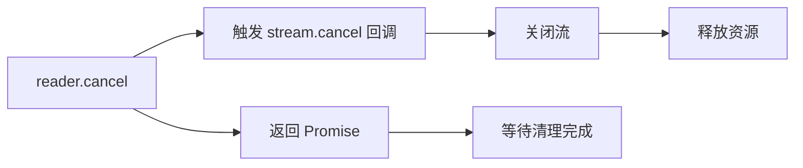

# [0125. ReadableStream](https://github.com/tnotesjs/TNotes.javascript/tree/main/notes/0125.%20ReadableStream)

<!-- region:toc -->

- [1. 🎯 本节内容](#1--本节内容)
- [2. 🫧 评价](#2--评价)
- [3. 🤔 如何手动控制 ReadableStream 的数据生产速度？](#3--如何手动控制-readablestream-的数据生产速度)
  - [3.1. 基本原理](#31-基本原理)
  - [3.2. 对比 start() 和 pull()](#32-对比-start-和-pull)
  - [3.3. 实际应用场景](#33-实际应用场景)
- [4. 🤔 当多个读取器尝试读取同一个流时会发生什么？](#4--当多个读取器尝试读取同一个流时会发生什么)
  - [4.1. 锁定机制演示](#41-锁定机制演示)
  - [4.2. 为什么需要锁定](#42-为什么需要锁定)
  - [4.3. 解决方案：释放锁或分流](#43-解决方案释放锁或分流)
  - [4.4. 常见错误示例](#44-常见错误示例)
- [5. 🤔 如何使用异步迭代器遍历流数据？](#5--如何使用异步迭代器遍历流数据)
  - [5.1. 基本用法](#51-基本用法)
  - [5.2. 对比传统 reader 方式](#52-对比传统-reader-方式)
  - [5.3. 实际应用场景](#53-实际应用场景)
  - [5.4. 注意事项](#54-注意事项)
- [6. 🤔 流的取消操作会触发哪些回调？](#6--流的取消操作会触发哪些回调)
  - [6.1. 基本用法](#61-基本用法)
  - [6.2. 取消的传播路径](#62-取消的传播路径)
  - [6.3. 实际应用场景](#63-实际应用场景)
  - [6.4. 取消 vs 关闭](#64-取消-vs-关闭)
- [7. 💻 demos.1 - 从数组创建 ReadableStream 并逐个读取元素](#7--demos1---从数组创建-readablestream-并逐个读取元素)
- [8. 💻 demos.2 - 实现一个无限数据生成器流](#8--demos2---实现一个无限数据生成器流)

<!-- endregion:toc -->

## 1. 🎯 本节内容

- ReadableStreamDefaultController 控制器
- 读取器（Reader）的类型与获取方式
- 流锁定机制与 locked 状态
- controller.enqueue() 的基本用法
- cancel() 方法的基础调用
- 异步迭代器遍历流数据

## 2. 🫧 评价

ReadableStream 是 Web Streams API 的核心接口，代表可读取的数据源。它抽象了数据的生产过程，让开发者可以控制数据何时产生、如何分块、何时停止。这种设计让流可以适配各种场景：从简单的数组转换，到复杂的网络响应处理。

学习 ReadableStream 的关键在于理解三个概念：控制器（controller）负责数据入队，读取器（reader）负责数据消费，锁定机制（locked）保证数据顺序。start() 方法在流创建时调用一次，pull() 在消费者需要数据时调用，cancel() 在流被取消时调用。掌握这三个生命周期方法，就能灵活控制数据流转。

实践中最常见的误区是忘记 close() 流，导致消费者永远等待。另一个常见问题是在 start() 中同步入队大量数据，忽略了背压机制。建议优先使用 pull() 方法按需生产数据，只在数据量确定且较小时才在 start() 中一次性入队。

## 3. 🤔 如何手动控制 ReadableStream 的数据生产速度？

通过 pull() 方法实现按需生产，只在消费者请求时才生成数据。

### 3.1. 基本原理

```js
const stream = new ReadableStream({
  async pull(controller) {
    // ✅ 只有当消费者调用 read() 时才执行
    const data = await fetchData()
    controller.enqueue(data)
  },
})
```

### 3.2. 对比 start() 和 pull()

```js
// ❌ start() 中同步入队：无法控制速度
const fastStream = new ReadableStream({
  start(controller) {
    for (let i = 0; i < 1000000; i++) {
      controller.enqueue(i) // 立即全部入队
    }
    controller.close()
  },
})

// ✅ pull() 按需生成：消费多快，生产多快
let count = 0
const controlledStream = new ReadableStream({
  pull(controller) {
    if (count < 1000000) {
      controller.enqueue(count++) // 消费者请求时才生产
    } else {
      controller.close()
    }
  },
})
```

### 3.3. 实际应用场景

```js
// 场景：从数据库分页读取数据
const dbStream = new ReadableStream({
  async pull(controller) {
    const page = await db.fetchNextPage()
    if (page.length === 0) {
      controller.close()
    } else {
      for (const record of page) {
        controller.enqueue(record)
      }
    }
  },
})

// 消费者读取速度决定了数据库查询频率
const reader = dbStream.getReader()
while (true) {
  const { done, value } = await reader.read()
  if (done) break
  await processRecord(value) // 处理完一条再读下一条
}
```

关键：pull() 让数据生产速度自动匹配消费速度，避免内存浪费。

## 4. 🤔 当多个读取器尝试读取同一个流时会发生什么？

流会被第一个读取器锁定，后续尝试获取读取器会抛出错误。

### 4.1. 锁定机制演示

```js
const stream = new ReadableStream({
  start(controller) {
    controller.enqueue('data')
    controller.close()
  },
})

const reader1 = stream.getReader()
console.log(stream.locked) // true

const reader2 = stream.getReader() // ❌ TypeError: ReadableStream is locked
```

### 4.2. 为什么需要锁定

| 原因         | 说明                                     |
| ------------ | ---------------------------------------- |
| 数据顺序保证 | 避免多个 reader 交错读取导致数据乱序     |
| 背压信号唯一 | 只有一个消费者才能正确传递背压           |
| 资源管理     | 底层资源（文件句柄、网络连接）只能独占   |
| 状态一致性   | 流的状态（已读位置、是否结束）必须单一化 |

### 4.3. 解决方案：释放锁或分流

```js
// 方案1：释放锁后再获取新 reader
const reader1 = stream.getReader()
await reader1.read()
reader1.releaseLock() // 释放锁

const reader2 = stream.getReader() // ✅ 可以获取

// 方案2：使用 tee() 创建多个独立流
const [stream1, stream2] = originalStream.tee()
const reader1 = stream1.getReader() // ✅ 各自独立
const reader2 = stream2.getReader() // ✅ 各自独立
```

### 4.4. 常见错误示例

```js
const response = await fetch(url)

// ❌ 错误：尝试多次读取同一个 body
const reader1 = response.body.getReader()
const reader2 = response.body.getReader() // 报错

// ✅ 正确：先分流再读取
const [body1, body2] = response.body.tee()
const reader1 = body1.getReader()
const reader2 = body2.getReader()
```

核心：一个流同时只能有一个活跃的读取器，确保数据消费的确定性。

## 5. 🤔 如何使用异步迭代器遍历流数据？

ReadableStream 实现了异步迭代协议，可以直接使用 for await...of 遍历。

### 5.1. 基本用法

```js
const stream = new ReadableStream({
  start(controller) {
    controller.enqueue('chunk1')
    controller.enqueue('chunk2')
    controller.enqueue('chunk3')
    controller.close()
  },
})

// ✅ 使用 for await...of
for await (const chunk of stream) {
  console.log(chunk)
}
// 输出：
// chunk1
// chunk2
// chunk3
```

### 5.2. 对比传统 reader 方式

```js
// 传统方式：手动循环
const reader = stream.getReader()
while (true) {
  const { done, value } = await reader.read()
  if (done) break
  console.log(value)
}

// 异步迭代器：更简洁
for await (const value of stream) {
  console.log(value)
}
```

### 5.3. 实际应用场景

```js
// 场景1：流式处理服务端响应
const response = await fetch('/api/logs')
for await (const chunk of response.body) {
  const text = new TextDecoder().decode(chunk)
  appendToUI(text) // 边接收边显示
}

// 场景2：处理文件流
const file = document.querySelector('input[type=file]').files[0]
const stream = file.stream()

let totalBytes = 0
for await (const chunk of stream) {
  totalBytes += chunk.length
  updateProgress(totalBytes / file.size)
}
```

### 5.4. 注意事项

```js
// ⚠️ for await...of 会自动锁定流
for await (const chunk of stream) {
  console.log(stream.locked) // true
}
console.log(stream.locked) // false（循环结束后自动释放）

// ⚠️ 无法在循环中途获取其他 reader
for await (const chunk of stream) {
  const reader = stream.getReader() // ❌ 报错：流已被锁定
}
```

异步迭代器简化了流的消费代码，是处理流数据的首选方式。

## 6. 🤔 流的取消操作会触发哪些回调？

调用 cancel() 会触发 ReadableStream 的 cancel() 回调，并传入取消原因。

### 6.1. 基本用法

```js
const stream = new ReadableStream({
  start(controller) {
    controller.enqueue('data')
  },
  cancel(reason) {
    console.log('流被取消:', reason)
    // 清理资源：关闭文件、断开连接等
  },
})

const reader = stream.getReader()
await reader.cancel('用户主动取消')
// 输出：流被取消: 用户主动取消
```

### 6.2. 取消的传播路径



### 6.3. 实际应用场景

```js
// 场景1：中断文件上传
const fileStream = new ReadableStream({
  async start(controller) {
    const chunks = await readFileInChunks(file)
    for (const chunk of chunks) {
      controller.enqueue(chunk)
    }
  },
  cancel(reason) {
    // 取消上传，通知服务器
    fetch('/api/cancel-upload', {
      method: 'POST',
      body: JSON.stringify({ reason }),
    })
  },
})

// 用户点击取消按钮
cancelButton.onclick = () => {
  reader.cancel('用户取消上传')
}

// 场景2：超时中断
const timeoutStream = new ReadableStream({
  start(controller) {
    const interval = setInterval(() => {
      controller.enqueue(Date.now())
    }, 1000)

    this.interval = interval // 保存引用
  },
  cancel(reason) {
    clearInterval(this.interval) // ✅ 清理定时器
    console.log('超时取消:', reason)
  },
})

setTimeout(() => {
  reader.cancel('请求超时')
}, 5000)
```

### 6.4. 取消 vs 关闭

| 操作     | 触发方式           | 回调        | 数据状态       |
| -------- | ------------------ | ----------- | -------------- |
| close()  | controller.close() | 无          | 已入队数据可读 |
| cancel() | reader.cancel()    | cancel 回调 | 所有数据丢弃   |
| 错误     | controller.error() | 无          | 流进入错误状态 |

```js
// close：正常结束
controller.close()
const { done } = await reader.read() // done: true

// cancel：强制中断
await reader.cancel()
const { done } = await reader.read() // done: true，但数据可能未读完
```

cancel() 回调是清理资源的关键点，确保及时释放文件句柄、网络连接等。

## 7. 💻 demos.1 - 从数组创建 ReadableStream 并逐个读取元素

::: code-group

<<< ./demos/1/1.html

<<< ./demos/1/1.js

:::

::: swiper


:::

## 8. 💻 demos.2 - 实现一个无限数据生成器流

::: code-group

<<< ./demos/2/1.html

<<< ./demos/2/1.js

:::

::: swiper


:::
