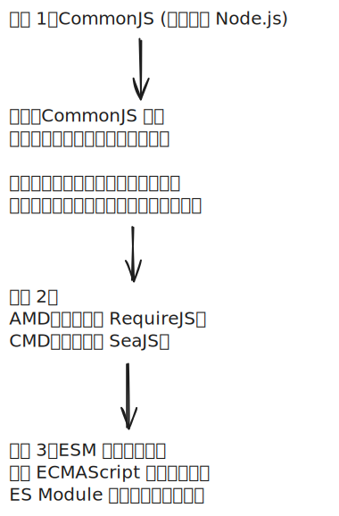

# [0126. 模块化](https://github.com/tnotesjs/TNotes.javascript/tree/main/notes/0126.%20%E6%A8%A1%E5%9D%97%E5%8C%96)

<!-- region:toc -->

- [1. 🎯 本节内容](#1--本节内容)
- [2. 🫧 评价](#2--评价)
- [3. 🔍 章节速览](#3--章节速览)
- [4. ⌛️ 模块化发展时间线](#4-️-模块化发展时间线)
  - [4.1. CommonJS（2009 左右）](#41-commonjs2009-左右)
  - [4.2. AMD / RequireJS（2009 \~ 2010）](#42-amd--requirejs2009--2010)
  - [4.3. CMD / SeaJS（2011 左右，中国社区提出）](#43-cmd--seajs2011-左右中国社区提出)
  - [4.4. ES Modules（2015，ES6 标准化）](#44-es-modules2015es6-标准化)

<!-- endregion:toc -->

## 1. 🎯 本节内容

- 前端模块化

## 2. 🫧 评价

在接下来的内容中，主要会介绍：

- 前端模块化发展简史
- CommonJS、AMD、CMD、ES Module 模块化规范的相关知识点

## 3. 🔍 章节速览

<N :ids='["0115", "0124", "0070", "0071", "0072", "0073", "0125", "0068", "0067", "0128", "0061", "0062", "0063", "0064", "0065", "0066", "0069", "0127"]' />

## 4. ⌛️ 模块化发展时间线

### 4.1. CommonJS（2009 左右）

- 场景：最初为 Node.js 服务。
- 特点：同步加载（`require`）、导出（`module.exports`）。
- 局限：浏览器环境中无法直接使用（因为网络加载是异步的）。

### 4.2. AMD / RequireJS（2009 \~ 2010）

- 背景：为了解决浏览器端的异步加载问题。
- 代表：RequireJS。
- 特点：依赖前置（在 `define([...], function(...){})` 中先声明依赖），异步加载，适合浏览器环境。

### 4.3. CMD / SeaJS（2011 左右，中国社区提出）

- 背景：觉得 AMD 的写法不够直观，依赖必须前置。
- 代表：SeaJS（玉伯开发）。
- 特点：依赖就近（在代码需要时再 `require`），更贴近 CommonJS 的风格，延迟执行。
- 和 AMD 的关系：不是演进关系，而是并行的另一种方案。

### 4.4. ES Modules（2015，ES6 标准化）

- 背景：JavaScript 官方终于在语言层面统一了模块化标准。
- 特点：`import` / `export`，静态依赖分析，可同时支持浏览器和 Node。
- 影响：逐渐替代 AMD/CMD/CommonJS 成为标准方案。
