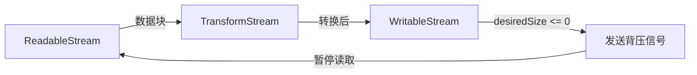

## 1. 本节内容

- WritableStreamDefaultWriter 写入器
- 写入策略参数（queuingStrategy）
- desiredSize 的基本使用
- TransformStream 的双向特性
- transform 和 flush 回调函数
- 多个 TransformStream 的链接

## 2. 评价

理解这两个接口（WritableStream 与 TransformStream）的关键在于掌握背压传播机制和错误处理流程。

## 3. 相关 API

1. `WritableStream` 构造函数
2. `writer` 写入器
3. `TransformStream` 构造函数

::: code-group

```js [1.js]
// 语法：
// const writable = new WritableStream(underlyingSink)
// const writable = new WritableStream(underlyingSink, queuingStrategy)

// 两个参数都是可选的：
// 参数1：underlyingSink（可选）
// 参数2：queuingStrategy（可选）

// underlyingSink
// underlyingSink 是一个包含方法和属性的对象，这些方法和属性定义了构造的流的实例的具体行为
// underlyingSink 对象身上的所有成员都是可选的

// queuingStrategy
// queuingStrategy 是一个可选的定义流的队列策略的对象
// queuingStrategy 对象身上的所有成员都是可选的
// 你也可以只用 ByteLengthQueuingStrategy 或 CountQueuingStrategy 实例来作为 queuingStrategy
// 如果没有提供 queuingStrategy，则使用的默认值与 CountQueuingStrategy 相同，其 highWaterMark 为 1

// 示例：
const writable = new WritableStream(
  // underlyingSink
  {
    start(controller) {
      // start 在写入开始前调用一次
      // 可用于打开文件句柄或初始化网络连接
      // 通常用于做一些初始化操作
      // 比如分配资源或设置状态
    },
    write(chunk, controller) {
      // write 在每个分块到达时调用
      // 可返回 Promise 以配合背压与异步写入
      // 通常用于处理分块
      // 比如写入文件或推送到服务器
    },
    close(controller) {
      // close 在上游结束时调用
      // 通常用于正常收尾与资源释放
      // 比如关闭文件或连接
    },
    abort(reason) {
      // abort 在异常中止时调用
      // 通常用于异常情况下的清理
      // 比如：记录原因 + 释放资源
    },
  },

  // queuingStrategy
  {
    // highWaterMark
    // 非负整数
    // 这定义了在应用背压之前可以包含在内部队列中的分块的最大数量
    // 控制背压触发阈值
    highWaterMark: 3,

    size(chunk) {
      // size
      // 返回每个分块的体积估算值
      // 与高水位线共同决定背压
      return 1
    },
  }
)

// 获取写入器 独占锁定写入端
const writer = writable.getWriter()

// desiredSize 表示队列剩余容量 小于等于 0 表示应当等待
console.log(writer.desiredSize)
// writer.desiredSize 的取值边界说明：
// writer.desiredSize > 0     表示仍有空间 可以继续写入
// writer.desiredSize = 0     表示达到高水位线 建议等待 writer.ready
// writer.desiredSize < 0     表示队列超载 必须等待 writer.ready
// writer.desiredSize = null  表示写入端不可用 比如已关闭或出错

// 避免压垮下游
await writer.ready // 1. 先等待就绪
await writer.write('data') // 2. 再继续写入
```

```js [2.js]
// 写入器 writer 是一个 WritableStreamDefaultWriter 实例对象，也就是 WritableStream.getWriter() 的返回结果
const writable = new WritableStream({
  // ...
})
const writer = writable.getWriter()
// 这个 writer 就是写入器
// 它是一个 WritableStreamDefaultWriter 实例对象

/* 
实例属性：
  WritableStreamDefaultWriter.closed
    只读
    允许你编写当流结束时执行的代码
    返回一个流关闭时兑现的 promise，或者在抛出错误或者 writer 的锁释放时被拒绝
  WritableStreamDefaultWriter.desiredSize
    只读
    返回填充满流的内部队列所需要的大小
  WritableStreamDefaultWriter.ready
    只读
    返回一个 Promise
    当流填充内部队列的所需大小从非正数变为正数时兑现，表明它不再应用背压
*/

/* 
实例方法：
  WritableStreamDefaultWriter.abort()
    中止流
    表示生产者不能再向流写入数据（会立刻返回一个错误状态），并丢弃所有已入队的数据
  WritableStreamDefaultWriter.close()
    关闭关联的可写流
  WritableStreamDefaultWriter.releaseLock()
    释放 writer 对相应流的锁定
    释放锁后，writer 将不再处于锁定状态
    如果释放锁时关联流出错，writer 随后也会以同样的方式发生错误；此外，writer 将关闭
  WritableStreamDefaultWriter.write()
    将传递的数据块写入 WritableStream 和它的底层接收器，然后返回一个 Promise
    Promise 的状态由写入操作是否成功来决定
*/
```

```js [3.js]
/* 
语法：

const ts1 = new TransformStream()
const ts2 = new TransformStream(transformer)
const ts3 = new TransformStream(transformer, writableStrategy)
const ts4 = new TransformStream(transformer, writableStrategy, readableStrategy)


参数说明：

transformer - 可选
  一个定义转换流式数据逻辑的对象
  如果未提供，则生成的流将是一个恒等转换流，它将所有写入可写端的分块转发到可读端，不会有任何改变
  transformer 对象可以包含以下任何方法 - 每个方法的 controller 都是一个 TransformStreamDefaultController 实例 
    start(controller) - 可选
      当 TransformStream 被构造时调用
      它通常用于使用 TransformStreamDefaultController.enqueue() 对分块进行排队
    transform(chunk, controller) - 可选
      当一个写入可写端的分块准备好转换时调用，并且执行转换流的工作
      如果没有提供 transform() 方法，则使用恒等变换，并且分块将在没有更改的情况下排队
    flush(controller) - 可选
      当所有写入可写端的分块成功转换后被调用，并且可写端将会关闭

writableStrategy - 可选
  一个定义了队列策略的可选对象 
  它需要两个参数：
    highWaterMark - 可选
      一个非负整数
      它定义了在应用背压之前内部队列包含的分块的总数 
    size(chunk) - 可选
      一个包含参数 chunk 的方法
      它表示用于每一个块的大小，以字节为单位 

readableStrategy - 可选
  一个定义了队列策略的可选对象
  它需要两个参数：
    highWaterMark - 可选
      一个非负整数
      它定义了在应用背压之前内部队列包含的分块的总数 
    size(chunk) - 可选
      一个包含参数 chunk 的方法
      它表示用于每一个块的大小，以字节为单位 
*/

// 示例：
const ts5 = new TransformStream(
  {
    // 初始化阶段 - 当 TransformStream 被构造时调用
    start(controller) {
      // 初始化状态或资源
    },
    // 转换每个分块 - 可同步或异步
    transform(chunk, controller) {
      // controller.enqueue 输出转换后的分块
    },
    // 流结束时调用一次 适合输出缓冲尾块或做最后清理
    flush(controller) {
      // 若有残余缓冲 可在此输出
    },
  },
  // 写入端队列策略
  // 影响上游背压
  {
    highWaterMark: 1,
    size() {
      return 1
    },
  },
  // 读取端队列策略
  // 影响下游背压
  {
    highWaterMark: 1,
    size() {
      return 1
    },
  }
)
// 注意事项：
// flush 仅在正常结束时调用 当上游发生错误时不会触发 flush 需要在上游或管道处统一处理错误
// 异步 transform 的返回链路会参与背压传播 较慢的转换会自动抑制上游生产速度
```

:::

## 4. WritableStream 是什么？

WritableStream 是浏览器中用于将流式数据写入接收端（如文件、网络或其他流）的 Web Streams API。

WritableStream 作为数据写入的终点，通过写入器 `WritableStreamDefaultWriter` 与队列策略共同实现背压控制。

WritableStream 的核心是 `desiredSize` 属性，它反映了内部队列的状态。当 `desiredSize <= 0` 时，说明队列已满，此时 `write()` 返回的 Promise 会等待，直到队列有空间再写入。这种内置的自动背压机制确保了生产者不会压垮消费者。实践中最常见的错误是忘记等待 `await writer.ready` Promise，导致背压信号丢失。

```js
// 获取可写流和写入器
const stream = new WritableStream(...);
const writer = stream.getWriter();

try {
  while (chunk) {
    // 等待 ready 确保背压信号被处理
    await writer.ready;
    // 如果不 await writer.ready，可能会在流无法处理时继续写入
    // 进而导致背压信号丢失，可能引发内存问题或数据丢失
    writer.write(chunk);
  }
} finally {
  writer.close();
}
```

## 5. TransformStream 是什么？

TransformStream 是一种用于在数据流经时转换或修改数据的流式处理接口，它在可读和可写之间架起桥梁，实现数据转换。

TransformStream 的精妙之处在于它同时暴露了 `readable` 和 `writable` 两个属性，可以无缝插入管道链中。transform() 方法处理每个数据块，flush() 方法在流结束时调用，适合做最后的清理或输出缓冲数据。多个 TransformStream 可以通过 pipeThrough() 链接，形成强大的数据处理管道。

TransformStream 构造函数与队列策略

TransformStream 同时暴露 `readable` 与 `writable` 可作为管道中的中间处理环节 支持在末尾 `flush` 做收尾工作。

## 6. WritableStream 如何处理背压信号？

WritableStream 通过 `desiredSize` 属性和 `writer.ready` Promise 来处理背压。

### 6.1. 背压信号的产生

```js
const writable = new WritableStream(
  {
    write(chunk) {
      console.log('写入:', chunk)
    },
  },
  new CountQueuingStrategy({ highWaterMark: 2 }),
) // 队列最多容纳 2 个 chunk

const writer = writable.getWriter()

console.log(writer.desiredSize) // 2（队列为空）

writer.write('A')
console.log(writer.desiredSize) // 1（还能容纳 1 个）

writer.write('B')
console.log(writer.desiredSize) // 0（队列已满）

writer.write('C')
console.log(writer.desiredSize) // -1（超出容量，产生背压）
```

### 6.2. 背压信号的响应

```js
const writer = writable.getWriter()

// ✅ 正确：等待 ready Promise
async function writeWithBackpressure(data) {
  for (const chunk of data) {
    await writer.ready // 等待队列有空间
    writer.write(chunk)
  }
}

// ❌ 错误：忽略背压信号
async function writeWithoutBackpressure(data) {
  for (const chunk of data) {
    writer.write(chunk) // 可能导致内存溢出
  }
}
```

### 6.3. 背压的传播路径



### 6.4. 实际应用场景

```js
// 场景：流式上传大文件
async function uploadLargeFile(file) {
  const readable = file.stream()
  const writable = new WritableStream({
    async write(chunk) {
      // 模拟网络上传（慢速）
      await fetch('/upload', {
        method: 'POST',
        body: chunk,
      })
    },
  })

  // pipeTo 自动处理背压
  await readable.pipeTo(writable)
  // ✅ 文件读取速度会自动匹配网络上传速度
}
```

关键：writer.ready Promise 确保写入速度不超过处理能力。

## 7. TransformStream 的 transform 和 flush 方法何时被调用？

transform() 在每个数据块到达时调用，flush() 在流结束时调用一次。

### 7.1. 调用时机演示

```js
const transform = new TransformStream({
  transform(chunk, controller) {
    console.log('transform 被调用:', chunk)
    controller.enqueue(chunk.toUpperCase())
  },
  flush(controller) {
    console.log('flush 被调用')
    controller.enqueue('END') // 可以输出最后的数据
  },
})

const readable = new ReadableStream({
  start(controller) {
    controller.enqueue('hello')
    controller.enqueue('world')
    controller.close() // 触发 flush
  },
})

await readable.pipeThrough(transform).pipeTo(
  new WritableStream({
    write(chunk) {
      console.log('输出:', chunk)
    },
  }),
)

// 输出顺序：
// transform 被调用: hello
// 输出: HELLO
// transform 被调用: world
// 输出: WORLD
// flush 被调用
// 输出: END
```

### 7.2. 方法对比

| 方法      | 调用时机          | 参数              | 用途                   |
| --------- | ----------------- | ----------------- | ---------------------- |
| transform | 每个 chunk 到达时 | chunk, controller | 转换单个数据块         |
| flush     | 流结束时（一次）  | controller        | 输出缓冲数据、最后清理 |
| start     | 流创建时（可选）  | controller        | 初始化资源             |

### 7.3. flush 的典型用法

```js
// 场景1：行缓冲处理器
const lineBuffer = new TransformStream({
  buffer: '',
  transform(chunk, controller) {
    this.buffer += chunk
    const lines = this.buffer.split('\n')
    this.buffer = lines.pop() // 保留未完成的行

    for (const line of lines) {
      controller.enqueue(line)
    }
  },
  flush(controller) {
    // ✅ 输出最后一行（可能没有换行符）
    if (this.buffer) {
      controller.enqueue(this.buffer)
    }
  },
})

// 场景2：数据压缩
const compressor = new TransformStream({
  chunks: [],
  transform(chunk, controller) {
    this.chunks.push(chunk)
    // 每 10 个 chunk 压缩一次
    if (this.chunks.length >= 10) {
      controller.enqueue(compress(this.chunks))
      this.chunks = []
    }
  },
  flush(controller) {
    // ✅ 压缩剩余的 chunk
    if (this.chunks.length > 0) {
      controller.enqueue(compress(this.chunks))
    }
  },
})
```

### 7.4. 不需要 flush 的情况

```js
// 简单的一对一转换，不需要 flush
const upperCase = new TransformStream({
  transform(chunk, controller) {
    controller.enqueue(chunk.toUpperCase())
  },
  // 无需 flush
})
```

transform 处理流中数据，flush 处理流末尾收尾工作。

## 8. 如何将多个 TransformStream 链接在一起？

使用 pipeThrough() 方法串联多个 TransformStream，形成处理管道。

### 8.1. 基本链接方式

```js
const input = new ReadableStream({
  start(controller) {
    controller.enqueue('hello world')
    controller.close()
  },
})

const upperCase = new TransformStream({
  transform(chunk, controller) {
    controller.enqueue(chunk.toUpperCase())
  },
})

const reverse = new TransformStream({
  transform(chunk, controller) {
    controller.enqueue(chunk.split('').reverse().join(''))
  },
})

// 链接多个转换流
const output = input
  .pipeThrough(upperCase) // hello world → HELLO WORLD
  .pipeThrough(reverse) // HELLO WORLD → DLROW OLLEH

const reader = output.getReader()
const { value } = await reader.read()
console.log(value) // DLROW OLLEH
```

### 8.2. 内置转换流的链接

```js
// 场景：压缩文本文件
const fileStream = file.stream()

const compressed = fileStream
  .pipeThrough(new TextEncoderStream()) // 文本 → 字节
  .pipeThrough(new CompressionStream('gzip')) // 压缩

// 场景：解压并解码
const decompressed = compressedStream
  .pipeThrough(new DecompressionStream('gzip')) // 解压
  .pipeThrough(new TextDecoderStream()) // 字节 → 文本
```

### 8.3. 自定义管道组合

```js
// 创建可复用的转换流
function createJSONLineParser() {
  return new TransformStream({
    buffer: '',
    transform(chunk, controller) {
      this.buffer += chunk
      const lines = this.buffer.split('\n')
      this.buffer = lines.pop()

      for (const line of lines) {
        if (line.trim()) {
          controller.enqueue(JSON.parse(line))
        }
      }
    },
    flush(controller) {
      if (this.buffer.trim()) {
        controller.enqueue(JSON.parse(this.buffer))
      }
    },
  })
}

function createDataFilter(predicate) {
  return new TransformStream({
    transform(chunk, controller) {
      if (predicate(chunk)) {
        controller.enqueue(chunk)
      }
    },
  })
}

// 组合使用
const response = await fetch('/api/data')
response.body
  .pipeThrough(new TextDecoderStream())
  .pipeThrough(createJSONLineParser())
  .pipeThrough(createDataFilter((obj) => obj.status === 'active'))
  .pipeTo(
    new WritableStream({
      write(obj) {
        updateUI(obj)
      },
    }),
  )
```

### 8.4. 管道的优势

| 对比项   | 传统方式             | 管道方式           |
| -------- | -------------------- | ------------------ |
| 代码组织 | 嵌套回调或临时变量   | 链式调用，清晰直观 |
| 背压处理 | 手动实现             | 自动传播           |
| 错误处理 | 每层单独 try-catch   | 统一在 pipeTo 处理 |
| 内存占用 | 可能缓存所有中间结果 | 流式处理，恒定内存 |
| 可复用性 | 难以抽象             | 每个转换流独立复用 |

pipeThrough() 让数据像流水线一样经过多道工序，每个环节专注单一职责。

## 9. 流处理过程中出现错误时如何正确清理资源？

使用 pipeTo() 的 signal 选项或在流的回调中处理错误，确保资源释放。

### 9.1. 基本错误处理

```js
const readable = new ReadableStream({
  start(controller) {
    controller.enqueue('data')
    controller.error(new Error('读取失败')) // 触发错误
  },
  cancel(reason) {
    console.log('流被取消:', reason)
    // ✅ 清理资源
  },
})

const writable = new WritableStream({
  write(chunk) {
    console.log(chunk)
  },
  abort(reason) {
    console.log('写入中止:', reason)
    // ✅ 清理资源
  },
})

try {
  await readable.pipeTo(writable)
} catch (error) {
  console.log('管道错误:', error.message)
}
// 输出：
// data
// 流被取消: Error: 读取失败
// 写入中止: Error: 读取失败
// 管道错误: 读取失败
```

### 9.2. 使用 AbortController 取消流

```js
const controller = new AbortController()

const readable = new ReadableStream({
  async start(ctrl) {
    for (let i = 0; i < 100; i++) {
      if (controller.signal.aborted) {
        return // 停止生产
      }
      ctrl.enqueue(i)
      await new Promise((r) => setTimeout(r, 100))
    }
    ctrl.close()
  },
  cancel(reason) {
    console.log('取消原因:', reason)
  },
})

// 3 秒后取消
setTimeout(() => {
  controller.abort('用户超时')
}, 3000)

try {
  await readable.pipeTo(writable, { signal: controller.signal })
} catch (error) {
  console.log('已取消')
}
```

### 9.3. TransformStream 中的错误处理

```js
const riskyTransform = new TransformStream({
  transform(chunk, controller) {
    try {
      const result = JSON.parse(chunk) // 可能抛出错误
      controller.enqueue(result)
    } catch (error) {
      // ❌ 错误做法：吞掉错误
      console.error('解析失败，跳过')

      // ✅ 正确做法：传播错误
      controller.error(error)
    }
  },
})

// 捕获管道中的错误
try {
  await readable.pipeThrough(riskyTransform).pipeTo(writable)
} catch (error) {
  console.log('管道中断:', error.message)
}
```

### 9.4. 确保资源清理的模式

```js
// 管理外部资源的流
class FileWriterStream {
  constructor(filePath) {
    this.filePath = filePath
    this.fileHandle = null

    this.writable = new WritableStream({
      start: async () => {
        this.fileHandle = await openFile(this.filePath)
      },
      write: async (chunk) => {
        await this.fileHandle.write(chunk)
      },
      close: async () => {
        await this.fileHandle?.close()
        console.log('✅ 文件已关闭')
      },
      abort: async (reason) => {
        await this.fileHandle?.close()
        console.log('✅ 异常时也关闭了文件:', reason)
      },
    })
  }
}

// 使用
const fileWriter = new FileWriterStream('/path/to/file')
try {
  await readable.pipeTo(fileWriter.writable)
} catch (error) {
  // abort() 会被自动调用，文件句柄会被释放
  console.error('写入失败，但资源已清理')
}
```

关键：在 cancel() 和 abort() 回调中释放资源，即使发生错误也能正确清理。

## 10. demos.1 - 实现文本编码转换流

::: code-group

```js [common.js]
// 创建文本转 Base64 的转换流
function createBase64Encoder() {
  return new TransformStream({
    transform(chunk, controller) {
      // 文本 → Uint8Array → Base64
      const encoder = new TextEncoder()
      const bytes = encoder.encode(chunk)
      const base64 = btoa(String.fromCharCode(...bytes))
      controller.enqueue(base64)
    },
  })
}

// 创建 Base64 转文本的转换流
function createBase64Decoder() {
  return new TransformStream({
    transform(chunk, controller) {
      try {
        // Base64 → Uint8Array → 文本
        const binaryString = atob(chunk)
        const bytes = new Uint8Array(binaryString.length)
        for (let i = 0; i < binaryString.length; i++) {
          bytes[i] = binaryString.charCodeAt(i)
        }
        const decoder = new TextDecoder()
        const text = decoder.decode(bytes)
        controller.enqueue(text)
      } catch (error) {
        controller.error(new Error('Base64 解码失败: ' + error.message))
      }
    },
  })
}

// 创建大写转换流
function createUpperCaseTransform() {
  return new TransformStream({
    transform(chunk, controller) {
      controller.enqueue(chunk.toUpperCase())
    },
  })
}
```

```js [demo1.js]
// 示例1：文本转 Base64
async function demo1() {
  const input = document.getElementById('input1').value
  const output = document.getElementById('output1')

  const readable = new ReadableStream({
    start(controller) {
      controller.enqueue(input)
      controller.close()
    },
  })

  const transformed = readable.pipeThrough(createBase64Encoder())

  const reader = transformed.getReader()
  const { value } = await reader.read()

  output.textContent = '编码结果: ' + value
}
```

```js [demo2.js]
// 示例2：Base64 转文本
async function demo2() {
  const input = document.getElementById('input2').value
  const output = document.getElementById('output2')

  const readable = new ReadableStream({
    start(controller) {
      controller.enqueue(input)
      controller.close()
    },
  })

  try {
    const transformed = readable.pipeThrough(createBase64Decoder())

    const reader = transformed.getReader()
    const { value } = await reader.read()

    output.textContent = '解码结果: ' + value
  } catch (error) {
    output.textContent = '错误: ' + error.message
  }
}
```

```js [demo3.js]
// 示例3：链式转换
async function demo3() {
  const input = document.getElementById('input3').value
  const output = document.getElementById('output3')
  output.innerHTML = ''

  const readable = new ReadableStream({
    start(controller) {
      controller.enqueue(input)
      controller.close()
    },
  })

  // 链式转换：大写 → Base64 → 解码
  const step1 = readable.pipeThrough(createUpperCaseTransform())

  const reader1 = step1.getReader()
  const { value: upperValue } = await reader1.read()
  output.innerHTML += '步骤1 (大写): ' + upperValue + '<br>'

  // 继续下一步
  const readable2 = new ReadableStream({
    start(controller) {
      controller.enqueue(upperValue)
      controller.close()
    },
  })

  const step2 = readable2.pipeThrough(createBase64Encoder())
  const reader2 = step2.getReader()
  const { value: base64Value } = await reader2.read()
  output.innerHTML += '步骤2 (Base64): ' + base64Value + '<br>'

  // 解码回来
  const readable3 = new ReadableStream({
    start(controller) {
      controller.enqueue(base64Value)
      controller.close()
    },
  })

  const step3 = readable3.pipeThrough(createBase64Decoder())
  const reader3 = step3.getReader()
  const { value: finalValue } = await reader3.read()
  output.innerHTML += '步骤3 (解码): ' + finalValue
}
```

```html [index.html]
<!DOCTYPE html>
<html lang="zh-CN">
  <head>
    <meta charset="UTF-8" />
    <meta name="viewport" content="width=device-width, initial-scale=1.0" />
    <title>文本编码转换流</title>
    <style>
      body {
        max-width: 900px;
        margin: 20px auto;
        padding: 20px;
      }
      .demo {
        margin: 20px 0;
        padding: 15px;
        border: 1px solid #ccc;
      }
      textarea {
        width: 100%;
        height: 80px;
        margin: 10px 0;
      }
      .output {
        border: 1px solid #ddd;
        padding: 10px;
        margin-top: 10px;
        min-height: 50px;
      }
    </style>
  </head>
  <body>
    <h1>文本编码转换流</h1>

    <div class="demo">
      <h3>示例1：文本转 Base64</h3>
      <textarea id="input1" placeholder="输入文本...">
Hello, Web Streams!</textarea
      >
      <button onclick="demo1()">转换为 Base64</button>
      <div class="output" id="output1"></div>
    </div>

    <div class="demo">
      <h3>示例2：Base64 转文本</h3>
      <textarea id="input2" placeholder="输入 Base64...">
SGVsbG8sIFdlYiBTdHJlYW1zIQ==</textarea
      >
      <button onclick="demo2()">解码为文本</button>
      <div class="output" id="output2"></div>
    </div>

    <div class="demo">
      <h3>示例3：链式转换（大写 → Base64 → 解码）</h3>
      <textarea id="input3" placeholder="输入文本...">
transform stream</textarea
      >
      <button onclick="demo3()">链式转换</button>
      <div class="output" id="output3"></div>
    </div>

    <script src="./common.js"></script>
    <script src="./demo1.js"></script>
    <script src="./demo2.js"></script>
    <script src="./demo3.js"></script>
  </body>
</html>
```

:::

## 11. demos.2 - 创建一个数据压缩流

::: code-group

```js [common.js]
// 辅助函数：将字节数组转为十六进制字符串
function arrayToHex(array) {
  return Array.from(array)
    .map((b) => b.toString(16).padStart(2, '0'))
    .join(' ')
}
```

```js [demo1.js]
// 示例1：使用内置 CompressionStream 压缩
async function demo1() {
  const input = document.getElementById('input1').value
  const output = document.getElementById('output1')

  const originalSize = new Blob([input]).size

  // 创建文本流
  const readable = new ReadableStream({
    start(controller) {
      controller.enqueue(input)
      controller.close()
    },
  })

  // 压缩管道：文本 → 字节 → 压缩
  const compressed = readable
    .pipeThrough(new TextEncoderStream())
    .pipeThrough(new CompressionStream('gzip'))

  // 收集压缩后的数据
  const chunks = []
  const reader = compressed.getReader()
  while (true) {
    const { done, value } = await reader.read()
    if (done) break
    chunks.push(value)
  }

  // 计算压缩后大小
  const compressedBlob = new Blob(chunks)
  const compressedSize = compressedBlob.size

  output.innerHTML = `
    <div class="stats">
      原始大小: ${originalSize} 字节<br>
      压缩后大小: ${compressedSize} 字节<br>
      压缩率: ${((1 - compressedSize / originalSize) * 100).toFixed(1)}%
    </div>
    <div>压缩后的数据（前 50 字节，十六进制）:</div>
    <div>${arrayToHex(chunks[0].slice(0, 50))}</div>
  `
}
```

```js [demo2.js]
// 示例2：压缩后解压
async function demo2() {
  const input = document.getElementById('input2').value
  const output = document.getElementById('output2')

  // 步骤1：压缩
  const readable1 = new ReadableStream({
    start(controller) {
      controller.enqueue(input)
      controller.close()
    },
  })

  const compressed = readable1
    .pipeThrough(new TextEncoderStream())
    .pipeThrough(new CompressionStream('gzip'))

  // 收集压缩数据
  const compressedChunks = []
  const reader1 = compressed.getReader()
  while (true) {
    const { done, value } = await reader1.read()
    if (done) break
    compressedChunks.push(value)
  }

  output.innerHTML = '压缩完成，开始解压...<br>'

  // 步骤2：解压
  const readable2 = new ReadableStream({
    start(controller) {
      for (const chunk of compressedChunks) {
        controller.enqueue(chunk)
      }
      controller.close()
    },
  })

  const decompressed = readable2
    .pipeThrough(new DecompressionStream('gzip'))
    .pipeThrough(new TextDecoderStream())

  const reader2 = decompressed.getReader()
  const { value: result } = await reader2.read()

  output.innerHTML += `
    <div class="stats">
      原始文本: ${input}<br>
      解压结果: ${result}<br>
      匹配: ${input === result ? '✅ 成功' : '❌ 失败'}
    </div>
  `
}
```

```js [demo3.js]
// 示例3：自定义批量处理流
async function demo3() {
  const output = document.getElementById('output3')
  output.innerHTML = '开始批量处理...<br>'

  // 创建批量处理转换流
  const batchTransform = new TransformStream({
    batch: [],
    batchSize: 3,

    transform(chunk, controller) {
      this.batch.push(chunk)
      output.innerHTML += `收到数据块: ${chunk}<br>`

      // 每收集 3 个块就处理一次
      if (this.batch.length >= this.batchSize) {
        const combined = this.batch.join(', ')
        output.innerHTML += `📦 批量处理: [${combined}]<br>`
        controller.enqueue(combined)
        this.batch = []
      }
    },

    flush(controller) {
      // 处理剩余的数据
      if (this.batch.length > 0) {
        const combined = this.batch.join(', ')
        output.innerHTML += `📦 最后批次: [${combined}]<br>`
        controller.enqueue(combined)
      }
      output.innerHTML += '✅ 处理完成<br>'
    },
  })

  // 创建数据流
  const readable = new ReadableStream({
    start(controller) {
      const items = ['A', 'B', 'C', 'D', 'E', 'F', 'G']
      for (const item of items) {
        controller.enqueue(item)
      }
      controller.close()
    },
  })

  // 通过批处理流
  const processed = readable.pipeThrough(batchTransform)

  // 收集结果
  const results = []
  const reader = processed.getReader()
  while (true) {
    const { done, value } = await reader.read()
    if (done) break
    results.push(value)
  }

  output.innerHTML += '<br>最终输出:<br>'
  results.forEach((r, i) => {
    output.innerHTML += `批次 ${i + 1}: ${r}<br>`
  })
}
```

```html [index.html]
<!DOCTYPE html>
<html lang="zh-CN">
  <head>
    <meta charset="UTF-8" />
    <meta name="viewport" content="width=device-width, initial-scale=1.0" />
    <title>数据压缩流</title>
    <style>
      body {
        max-width: 900px;
        margin: 20px auto;
        padding: 20px;
      }
      .demo {
        margin: 20px 0;
        padding: 15px;
        border: 1px solid #ccc;
      }
      textarea {
        width: 100%;
        height: 100px;
        margin: 10px 0;
      }
      .output {
        border: 1px solid #ddd;
        padding: 10px;
        margin-top: 10px;
        min-height: 60px;
      }
      .stats {
        background: #f0f0f0;
        padding: 8px;
        margin-top: 5px;
      }
    </style>
  </head>
  <body>
    <h1>数据压缩流示例</h1>

    <div class="demo">
      <h3>示例1：使用内置 CompressionStream 压缩</h3>
      <textarea id="input1" placeholder="输入要压缩的文本...">
Web Streams API 提供了强大的流式数据处理能力。通过 ReadableStream、WritableStream 和 TransformStream，我们可以高效地处理大量数据，而不会占用过多内存。这段文本将被压缩以演示流的强大功能。</textarea
      >
      <button onclick="demo1()">压缩文本</button>
      <div class="output" id="output1"></div>
    </div>

    <div class="demo">
      <h3>示例2：压缩后解压</h3>
      <textarea id="input2" placeholder="输入文本...">
Hello World! 这是一段测试文本。</textarea
      >
      <button onclick="demo2()">压缩并解压</button>
      <div class="output" id="output2"></div>
    </div>

    <div class="demo">
      <h3>示例3：自定义批量压缩流</h3>
      <p>模拟将多个小数据块合并后再处理（简化的批处理流）</p>
      <button onclick="demo3()">批量处理演示</button>
      <div class="output" id="output3"></div>
    </div>

    <script src="./common.js"></script>
    <script src="./demo1.js"></script>
    <script src="./demo2.js"></script>
    <script src="./demo3.js"></script>
  </body>
</html>
```

:::

## 12. `close()` vs `abort()` vs `error()`（写入侧）

| 操作      | 触发方式         | 回调    | 语义                            |
| --------- | ---------------- | ------- | ------------------------------- |
| `close()` | 上游正常结束     | `close` | 已入队数据仍会写完 然后收尾关闭 |
| `abort()` | 写入侧异常中止   | `abort` | 中断写入并清理资源 传递异常原因 |
| `error()` | 转换或读取侧错误 | 无      | 将流置为错误状态 管道抛出异常   |

示例一 正常结束与写入收尾

```js
const writable = new WritableStream({
  write: async (chunk) => save(chunk),
  close: async () => finalize(),
})

await readable.pipeTo(writable)
```

示例二 异常中止的清理

```js
const writable = new WritableStream({
  write: async (chunk) => save(chunk),
  abort: async (reason) => cleanup(reason),
})

try {
  await readable.pipeTo(writable)
} catch (e) {
  // abort 会被调用 用于异常清理
}
```

## 13. `pipeTo` 的选项如何选择？

`pipeTo` 提供了几个常用选项 用于控制三端的关闭与取消传播 以及与外部取消信号配合。

| 选项 | 说明 |
| --- | --- |
| `preventClose` | 阻止在写入端自动调用 `close` 保持写入端开启 用于复用或延迟收尾 |
| `preventAbort` | 阻止在写入端自动调用 `abort` 错误不向写入端传播 |
| `preventCancel` | 阻止在读取端自动调用 `cancel` 错误不向读取端传播 |
| `signal` | 传入外部取消信号 如 `AbortController` 的 `signal` 用于统一取消 |

常见组合示例：

- 需要统一收尾时 保持默认传播 即不设置 `preventClose` 等选项
- 上游数据源需保留时 可设置 `preventCancel` 防止读取端被取消
- 写入端为共享资源时 可设置 `preventClose` 避免自动关闭 由外部手动 `close`
