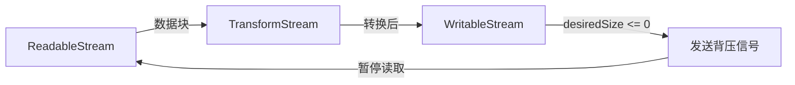

# [0130. WritableStream 与 TransformStream](https://github.com/tnotesjs/TNotes.javascript/tree/main/notes/0130.%20WritableStream%20%E4%B8%8E%20TransformStream)

<!-- region:toc -->

- [1. 🎯 本节内容](#1--本节内容)
- [2. 🫧 评价](#2--评价)
- [3. 🤔 WritableStream 如何处理背压信号？](#3--writablestream-如何处理背压信号)
  - [3.1. 背压信号的产生](#31-背压信号的产生)
  - [3.2. 背压信号的响应](#32-背压信号的响应)
  - [3.3. 背压的传播路径](#33-背压的传播路径)
  - [3.4. 实际应用场景](#34-实际应用场景)
- [4. 🤔 TransformStream 的 transform 和 flush 方法何时被调用？](#4--transformstream-的-transform-和-flush-方法何时被调用)
  - [4.1. 调用时机演示](#41-调用时机演示)
  - [4.2. 方法对比](#42-方法对比)
  - [4.3. flush 的典型用法](#43-flush-的典型用法)
  - [4.4. 不需要 flush 的情况](#44-不需要-flush-的情况)
- [5. 🤔 如何将多个 TransformStream 链接在一起？](#5--如何将多个-transformstream-链接在一起)
  - [5.1. 基本链接方式](#51-基本链接方式)
  - [5.2. 内置转换流的链接](#52-内置转换流的链接)
  - [5.3. 自定义管道组合](#53-自定义管道组合)
  - [5.4. 管道的优势](#54-管道的优势)
- [6. 🤔 流处理过程中出现错误时如何正确清理资源？](#6--流处理过程中出现错误时如何正确清理资源)
  - [6.1. 基本错误处理](#61-基本错误处理)
  - [6.2. 使用 AbortController 取消流](#62-使用-abortcontroller-取消流)
  - [6.3. TransformStream 中的错误处理](#63-transformstream-中的错误处理)
  - [6.4. 确保资源清理的模式](#64-确保资源清理的模式)
- [7. 💻 demos.1 - 实现文本编码转换流](#7--demos1---实现文本编码转换流)
- [8. 💻 demos.2 - 创建一个数据压缩流](#8--demos2---创建一个数据压缩流)

<!-- endregion:toc -->

## 1. 🎯 本节内容

- WritableStreamDefaultWriter 写入器
- 写入策略参数（queuingStrategy）
- desiredSize 的基本使用
- TransformStream 的双向特性
- transform 和 flush 回调函数
- 多个 TransformStream 的链接

## 2. 🫧 评价

WritableStream 和 TransformStream 是流处理的两个关键接口。WritableStream 提供数据写入的目标端，TransformStream 则在可读和可写之间架起桥梁，实现数据转换。理解这两个接口的关键在于掌握背压传播机制和错误处理流程。

WritableStream 的核心是 desiredSize 属性，它反映了内部队列的状态。当 desiredSize 小于等于 0 时，说明队列已满，此时 write() 返回的 Promise 会等待，直到队列有空间。这种自动背压机制确保了生产者不会压垮消费者。实践中最常见的错误是忘记等待 writer.ready Promise，导致背压信号丢失。

TransformStream 的精妙之处在于它同时暴露了 readable 和 writable 两个属性，可以无缝插入管道链中。transform() 方法处理每个数据块，flush() 方法在流结束时调用，适合做最后的清理或输出缓冲数据。多个 TransformStream 可以通过 pipeThrough() 链接，形成强大的数据处理管道。

## 3. 🤔 WritableStream 如何处理背压信号？

WritableStream 通过 desiredSize 属性和 writer.ready Promise 来处理背压。

### 3.1. 背压信号的产生

```js
const writable = new WritableStream(
  {
    write(chunk) {
      console.log('写入:', chunk)
    },
  },
  new CountQueuingStrategy({ highWaterMark: 2 })
) // 队列最多容纳 2 个 chunk

const writer = writable.getWriter()

console.log(writer.desiredSize) // 2（队列为空）

writer.write('A')
console.log(writer.desiredSize) // 1（还能容纳 1 个）

writer.write('B')
console.log(writer.desiredSize) // 0（队列已满）

writer.write('C')
console.log(writer.desiredSize) // -1（超出容量，产生背压）
```

### 3.2. 背压信号的响应

```js
const writer = writable.getWriter()

// ✅ 正确：等待 ready Promise
async function writeWithBackpressure(data) {
  for (const chunk of data) {
    await writer.ready // 等待队列有空间
    writer.write(chunk)
  }
}

// ❌ 错误：忽略背压信号
async function writeWithoutBackpressure(data) {
  for (const chunk of data) {
    writer.write(chunk) // 可能导致内存溢出
  }
}
```

### 3.3. 背压的传播路径



### 3.4. 实际应用场景

```js
// 场景：流式上传大文件
async function uploadLargeFile(file) {
  const readable = file.stream()
  const writable = new WritableStream({
    async write(chunk) {
      // 模拟网络上传（慢速）
      await fetch('/upload', {
        method: 'POST',
        body: chunk,
      })
    },
  })

  // pipeTo 自动处理背压
  await readable.pipeTo(writable)
  // ✅ 文件读取速度会自动匹配网络上传速度
}
```

关键：writer.ready Promise 确保写入速度不超过处理能力。

## 4. 🤔 TransformStream 的 transform 和 flush 方法何时被调用？

transform() 在每个数据块到达时调用，flush() 在流结束时调用一次。

### 4.1. 调用时机演示

```js
const transform = new TransformStream({
  transform(chunk, controller) {
    console.log('transform 被调用:', chunk)
    controller.enqueue(chunk.toUpperCase())
  },
  flush(controller) {
    console.log('flush 被调用')
    controller.enqueue('END') // 可以输出最后的数据
  },
})

const readable = new ReadableStream({
  start(controller) {
    controller.enqueue('hello')
    controller.enqueue('world')
    controller.close() // 触发 flush
  },
})

await readable.pipeThrough(transform).pipeTo(
  new WritableStream({
    write(chunk) {
      console.log('输出:', chunk)
    },
  })
)

// 输出顺序：
// transform 被调用: hello
// 输出: HELLO
// transform 被调用: world
// 输出: WORLD
// flush 被调用
// 输出: END
```

### 4.2. 方法对比

| 方法      | 调用时机          | 参数              | 用途                   |
| --------- | ----------------- | ----------------- | ---------------------- |
| transform | 每个 chunk 到达时 | chunk, controller | 转换单个数据块         |
| flush     | 流结束时（一次）  | controller        | 输出缓冲数据、最后清理 |
| start     | 流创建时（可选）  | controller        | 初始化资源             |

### 4.3. flush 的典型用法

```js
// 场景1：行缓冲处理器
const lineBuffer = new TransformStream({
  buffer: '',
  transform(chunk, controller) {
    this.buffer += chunk
    const lines = this.buffer.split('\n')
    this.buffer = lines.pop() // 保留未完成的行

    for (const line of lines) {
      controller.enqueue(line)
    }
  },
  flush(controller) {
    // ✅ 输出最后一行（可能没有换行符）
    if (this.buffer) {
      controller.enqueue(this.buffer)
    }
  },
})

// 场景2：数据压缩
const compressor = new TransformStream({
  chunks: [],
  transform(chunk, controller) {
    this.chunks.push(chunk)
    // 每 10 个 chunk 压缩一次
    if (this.chunks.length >= 10) {
      controller.enqueue(compress(this.chunks))
      this.chunks = []
    }
  },
  flush(controller) {
    // ✅ 压缩剩余的 chunk
    if (this.chunks.length > 0) {
      controller.enqueue(compress(this.chunks))
    }
  },
})
```

### 4.4. 不需要 flush 的情况

```js
// 简单的一对一转换，不需要 flush
const upperCase = new TransformStream({
  transform(chunk, controller) {
    controller.enqueue(chunk.toUpperCase())
  },
  // 无需 flush
})
```

transform 处理流中数据，flush 处理流末尾收尾工作。

## 5. 🤔 如何将多个 TransformStream 链接在一起？

使用 pipeThrough() 方法串联多个 TransformStream，形成处理管道。

### 5.1. 基本链接方式

```js
const input = new ReadableStream({
  start(controller) {
    controller.enqueue('hello world')
    controller.close()
  },
})

const upperCase = new TransformStream({
  transform(chunk, controller) {
    controller.enqueue(chunk.toUpperCase())
  },
})

const reverse = new TransformStream({
  transform(chunk, controller) {
    controller.enqueue(chunk.split('').reverse().join(''))
  },
})

// 链接多个转换流
const output = input
  .pipeThrough(upperCase) // hello world → HELLO WORLD
  .pipeThrough(reverse) // HELLO WORLD → DLROW OLLEH

const reader = output.getReader()
const { value } = await reader.read()
console.log(value) // DLROW OLLEH
```

### 5.2. 内置转换流的链接

```js
// 场景：压缩文本文件
const fileStream = file.stream()

const compressed = fileStream
  .pipeThrough(new TextEncoderStream()) // 文本 → 字节
  .pipeThrough(new CompressionStream('gzip')) // 压缩

// 场景：解压并解码
const decompressed = compressedStream
  .pipeThrough(new DecompressionStream('gzip')) // 解压
  .pipeThrough(new TextDecoderStream()) // 字节 → 文本
```

### 5.3. 自定义管道组合

```js
// 创建可复用的转换流
function createJSONLineParser() {
  return new TransformStream({
    buffer: '',
    transform(chunk, controller) {
      this.buffer += chunk
      const lines = this.buffer.split('\n')
      this.buffer = lines.pop()

      for (const line of lines) {
        if (line.trim()) {
          controller.enqueue(JSON.parse(line))
        }
      }
    },
    flush(controller) {
      if (this.buffer.trim()) {
        controller.enqueue(JSON.parse(this.buffer))
      }
    },
  })
}

function createDataFilter(predicate) {
  return new TransformStream({
    transform(chunk, controller) {
      if (predicate(chunk)) {
        controller.enqueue(chunk)
      }
    },
  })
}

// 组合使用
const response = await fetch('/api/data')
response.body
  .pipeThrough(new TextDecoderStream())
  .pipeThrough(createJSONLineParser())
  .pipeThrough(createDataFilter((obj) => obj.status === 'active'))
  .pipeTo(
    new WritableStream({
      write(obj) {
        updateUI(obj)
      },
    })
  )
```

### 5.4. 管道的优势

| 对比项   | 传统方式             | 管道方式           |
| -------- | -------------------- | ------------------ |
| 代码组织 | 嵌套回调或临时变量   | 链式调用，清晰直观 |
| 背压处理 | 手动实现             | 自动传播           |
| 错误处理 | 每层单独 try-catch   | 统一在 pipeTo 处理 |
| 内存占用 | 可能缓存所有中间结果 | 流式处理，恒定内存 |
| 可复用性 | 难以抽象             | 每个转换流独立复用 |

pipeThrough() 让数据像流水线一样经过多道工序，每个环节专注单一职责。

## 6. 🤔 流处理过程中出现错误时如何正确清理资源？

使用 pipeTo() 的 signal 选项或在流的回调中处理错误，确保资源释放。

### 6.1. 基本错误处理

```js
const readable = new ReadableStream({
  start(controller) {
    controller.enqueue('data')
    controller.error(new Error('读取失败')) // 触发错误
  },
  cancel(reason) {
    console.log('流被取消:', reason)
    // ✅ 清理资源
  },
})

const writable = new WritableStream({
  write(chunk) {
    console.log(chunk)
  },
  abort(reason) {
    console.log('写入中止:', reason)
    // ✅ 清理资源
  },
})

try {
  await readable.pipeTo(writable)
} catch (error) {
  console.log('管道错误:', error.message)
}
// 输出：
// data
// 流被取消: Error: 读取失败
// 写入中止: Error: 读取失败
// 管道错误: 读取失败
```

### 6.2. 使用 AbortController 取消流

```js
const controller = new AbortController()

const readable = new ReadableStream({
  async start(ctrl) {
    for (let i = 0; i < 100; i++) {
      if (controller.signal.aborted) {
        return // 停止生产
      }
      ctrl.enqueue(i)
      await new Promise((r) => setTimeout(r, 100))
    }
    ctrl.close()
  },
  cancel(reason) {
    console.log('取消原因:', reason)
  },
})

// 3 秒后取消
setTimeout(() => {
  controller.abort('用户超时')
}, 3000)

try {
  await readable.pipeTo(writable, { signal: controller.signal })
} catch (error) {
  console.log('已取消')
}
```

### 6.3. TransformStream 中的错误处理

```js
const riskyTransform = new TransformStream({
  transform(chunk, controller) {
    try {
      const result = JSON.parse(chunk) // 可能抛出错误
      controller.enqueue(result)
    } catch (error) {
      // ❌ 错误做法：吞掉错误
      console.error('解析失败，跳过')

      // ✅ 正确做法：传播错误
      controller.error(error)
    }
  },
})

// 捕获管道中的错误
try {
  await readable.pipeThrough(riskyTransform).pipeTo(writable)
} catch (error) {
  console.log('管道中断:', error.message)
}
```

### 6.4. 确保资源清理的模式

```js
// 管理外部资源的流
class FileWriterStream {
  constructor(filePath) {
    this.filePath = filePath
    this.fileHandle = null

    this.writable = new WritableStream({
      start: async () => {
        this.fileHandle = await openFile(this.filePath)
      },
      write: async (chunk) => {
        await this.fileHandle.write(chunk)
      },
      close: async () => {
        await this.fileHandle?.close()
        console.log('✅ 文件已关闭')
      },
      abort: async (reason) => {
        await this.fileHandle?.close()
        console.log('✅ 异常时也关闭了文件:', reason)
      },
    })
  }
}

// 使用
const fileWriter = new FileWriterStream('/path/to/file')
try {
  await readable.pipeTo(fileWriter.writable)
} catch (error) {
  // abort() 会被自动调用，文件句柄会被释放
  console.error('写入失败，但资源已清理')
}
```

关键：在 cancel() 和 abort() 回调中释放资源，即使发生错误也能正确清理。

## 7. 💻 demos.1 - 实现文本编码转换流

::: code-group

<<< ./demos/1/1.html

<<< ./demos/1/1.js

:::

## 8. 💻 demos.2 - 创建一个数据压缩流

::: code-group

<<< ./demos/2/1.html

<<< ./demos/2/1.js

:::
