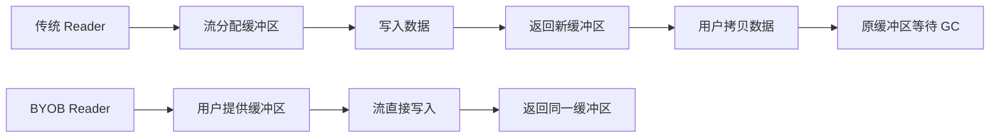
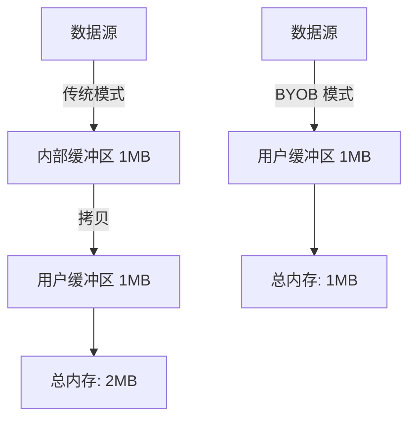
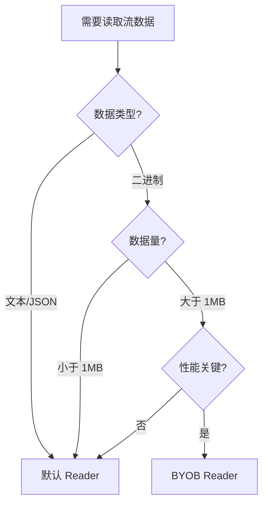

## 1. 本节内容

- BYOB Reader 的工作原理
- ReadableStreamBYOBReader 的获取方式
- 零拷贝（Zero-Copy）技术原理
- ArrayBufferView 与缓冲区管理
- BYOB 模式的性能优化效果
- BYOB Reader 的使用限制

## 2. 评价

BYOB（Bring Your Own Buffer）Reader 是 Web Streams API 中的高级特性，专为高性能二进制数据处理设计。它允许开发者提供自己的缓冲区，让流直接将数据写入该缓冲区，避免了额外的内存分配和数据拷贝。对于处理大量二进制数据（如视频流、大文件）的场景，BYOB Reader 能显著降低内存占用和 GC 压力。

学习 BYOB Reader 需要理解两个核心概念：零拷贝和缓冲区复用。零拷贝指数据从源头直接写入用户提供的缓冲区，而不是先分配临时缓冲区再拷贝；缓冲区复用则是重复使用同一块内存，减少频繁的分配释放。这两者结合，在处理流式二进制数据时能获得接近原生代码的性能。

使用 BYOB Reader 的门槛相对较高：必须使用字节流（type: 'bytes'），必须提供 ArrayBufferView 类型的缓冲区，且需要处理缓冲区的分离（detached）状态。对于普通文本或 JSON 数据处理，默认 Reader 已经足够；BYOB Reader 主要用于视频编解码、音频处理、大文件传输等对性能要求极高的场景。

## 3. BYOB（Bring Your Own Buffer）模式的核心优势是什么 ？

BYOB 模式的核心优势是减少内存拷贝，提升性能并降低内存占用。

### 3.1. 传统模式 vs BYOB 模式



### 3.2. 性能对比

| 对比项   | 默认 Reader                | BYOB Reader            |
| -------- | -------------------------- | ---------------------- |
| 内存分配 | 每次读取都分配新缓冲区     | 复用同一缓冲区         |
| 数据拷贝 | 流缓冲区 → 用户缓冲区      | 直接写入用户缓冲区     |
| GC 压力  | 高（频繁分配/释放）        | 低（缓冲区复用）       |
| 内存峰值 | 2 倍数据大小（双份缓冲区） | 1 倍数据大小           |
| 适用场景 | 文本、JSON 等小数据        | 视频、音频等大二进制流 |

### 3.3. 代码对比

```js
// 默认 Reader：每次读取产生新缓冲区
const reader = stream.getReader()
while (true) {
  const { value } = await reader.read() // ❌ value 是新分配的 Uint8Array
  process(value)
  // value 在下次循环时成为垃圾，等待 GC
}

// BYOB Reader：复用缓冲区
const buffer = new Uint8Array(1024)
const reader = stream.getReader({ mode: 'byob' })
let currentBuffer = buffer
while (true) {
  const { value } = await reader.read(currentBuffer) // ✅ 数据写入 currentBuffer
  process(value)
  currentBuffer = new Uint8Array(buffer.buffer) // 复用底层 ArrayBuffer
}
```

### 3.4. 实际收益

```js
// 场景：读取 100MB 视频流
// 假设每次读取 64KB

// 默认 Reader：
// - 分配 1600 次缓冲区（100MB / 64KB）
// - 内存峰值：128MB（数据 + 临时缓冲区）
// - GC 次数：约 1600 次

// BYOB Reader：
// - 分配 1 次缓冲区
// - 内存峰值：64KB + 数据处理所需内存
// - GC 次数：0（缓冲区复用）
```

BYOB 模式通过零拷贝和缓冲区复用，大幅降低了内存开销和 GC 压力。

## 4. 如何创建和使用 ReadableStreamBYOBReader ？

必须使用字节流（type: 'bytes'），然后通过 getReader({ mode: 'byob' }) 获取。

### 4.1. 创建字节流

```js
// ✅ 正确：指定 type: 'bytes'
const byteStream = new ReadableStream({
  type: 'bytes', // 必须指定
  pull(controller) {
    const chunk = new Uint8Array([1, 2, 3])
    controller.enqueue(chunk)
  },
})

// ❌ 错误：默认流无法使用 BYOB Reader
const defaultStream = new ReadableStream({
  pull(controller) {
    controller.enqueue('text')
  },
})

const reader = defaultStream.getReader({ mode: 'byob' })
// TypeError: This stream does not support BYOB readers
```

### 4.2. 获取 BYOB Reader

```js
const reader = byteStream.getReader({ mode: 'byob' })
console.log(reader.constructor.name) // ReadableStreamBYOBReader
```

### 4.3. 使用 BYOB Reader 读取数据

```js
const buffer = new Uint8Array(1024) // 提供缓冲区
let offset = 0

const reader = byteStream.getReader({ mode: 'byob' })

while (true) {
  // read() 接受一个 ArrayBufferView
  const { done, value } = await reader.read(buffer.subarray(offset))

  if (done) break

  console.log('读取了', value.byteLength, '字节')
  console.log('数据:', value)

  // value 是填充后的视图，可能不是整个 buffer
  offset += value.byteLength
}
```

### 4.4. 缓冲区复用模式

```js
// 创建可复用的缓冲区池
const bufferPool = {
  buffer: new ArrayBuffer(64 * 1024), // 64KB
  view: null,

  getView() {
    this.view = new Uint8Array(this.buffer)
    return this.view
  },
}

const reader = stream.getReader({ mode: 'byob' })

while (true) {
  const view = bufferPool.getView()
  const { done, value } = await reader.read(view)

  if (done) break

  processData(value) // 处理数据

  // ✅ 下次循环复用 bufferPool.buffer
}
```

### 4.5. 完整示例：读取文件

```js
async function readFileWithBYOB(file) {
  const stream = file.stream()
  const reader = stream.getReader({ mode: 'byob' })

  const buffer = new Uint8Array(1024 * 64) // 64KB 缓冲区
  let totalBytes = 0

  try {
    while (true) {
      const { done, value } = await reader.read(buffer)

      if (done) break

      totalBytes += value.byteLength
      console.log(`已读取 ${totalBytes} 字节`)

      // 处理数据
      await processChunk(value)

      // 如果 buffer 被分离，重新创建
      if (buffer.byteLength === 0) {
        buffer = new Uint8Array(1024 * 64)
      }
    }
  } finally {
    reader.releaseLock()
  }
}
```

关键：使用 BYOB Reader 必须创建字节流并提供 ArrayBufferView 类型的缓冲区。

## 5. 零拷贝读取如何减少内存开销 ？

零拷贝通过直接将数据写入用户缓冲区，避免了中间缓冲区的分配和数据拷贝。

### 5.1. 传统读取的内存流程

```js
// 默认 Reader 的内存操作
const reader = stream.getReader()
const { value } = await reader.read()

// 底层发生的事情：
// 1. 流内部分配缓冲区 A
// 2. 从数据源读取到缓冲区 A
// 3. 创建新的 Uint8Array（缓冲区 B）
// 4. 将缓冲区 A 的数据拷贝到缓冲区 B
// 5. 返回缓冲区 B 给用户
// 6. 缓冲区 A 等待 GC

// 结果：每次读取需要 2 倍内存
```

### 5.2. 零拷贝读取的内存流程

```js
// BYOB Reader 的内存操作
const buffer = new Uint8Array(1024)
const reader = stream.getReader({ mode: 'byob' })
const { value } = await reader.read(buffer)

// 底层发生的事情：
// 1. 用户提供缓冲区 buffer
// 2. 从数据源直接读取到 buffer
// 3. 返回 buffer 的视图（可能是 buffer 的一部分）

// 结果：只需要 1 倍内存，无拷贝操作
```

### 5.3. 内存开销对比图



### 5.4. 实际测量示例

```js
// 读取 10MB 数据的内存对比
async function measureMemory() {
  // 默认 Reader
  const defaultReader = stream.getReader()
  const chunks = []
  while (true) {
    const { done, value } = await defaultReader.read()
    if (done) break
    chunks.push(value) // 每个 value 都是新分配的
  }
  // 内存占用：约 20MB（10MB 数据 + 10MB 临时缓冲区）

  // BYOB Reader
  const buffer = new Uint8Array(1024 * 64)
  const byobReader = stream.getReader({ mode: 'byob' })
  while (true) {
    const { done, value } = await byobReader.read(buffer)
    if (done) break
    // 复用同一个 buffer
  }
  // 内存占用：约 64KB（只有用户缓冲区）
}
```

### 5.5. 减少 GC 压力

```js
// 默认 Reader：频繁 GC
for (let i = 0; i < 1000; i++) {
  const { value } = await reader.read()
  // 每次循环产生新对象，触发 GC
}

// BYOB Reader：几乎无 GC
const buffer = new Uint8Array(1024)
for (let i = 0; i < 1000; i++) {
  const { value } = await reader.read(buffer)
  // 复用 buffer，无新对象产生
}
```

零拷贝的本质是让数据只在内存中存在一份，消除不必要的拷贝操作。

## 6. BYOB Reader 对缓冲区有什么要求 ？

必须提供 ArrayBufferView（如 Uint8Array），且缓冲区不能是已分离状态。

### 6.1. 缓冲区类型要求

```js
const reader = stream.getReader({ mode: 'byob' })

// ✅ 正确：ArrayBufferView 类型
await reader.read(new Uint8Array(1024))
await reader.read(new Uint16Array(512))
await reader.read(new DataView(new ArrayBuffer(1024)))

// ❌ 错误：ArrayBuffer 不是 View
await reader.read(new ArrayBuffer(1024))
// TypeError: The provided value is not of type 'ArrayBufferView'

// ❌ 错误：普通数组
await reader.read([1, 2, 3])
// TypeError: The provided value is not of type 'ArrayBufferView'
```

### 6.2. 缓冲区不能是分离状态

```js
const buffer = new Uint8Array(1024)

// 第一次读取
const { value } = await reader.read(buffer)

// ⚠️ value 使用了 buffer 的 ArrayBuffer
// buffer 可能被"分离"（detached）
console.log(buffer.byteLength) // 可能是 0（已分离）

// ❌ 错误：无法再次使用已分离的缓冲区
await reader.read(buffer)
// TypeError: The provided ArrayBufferView is detached

// ✅ 正确：使用新缓冲区或复用 ArrayBuffer
const newBuffer = new Uint8Array(
  buffer.buffer.byteLength ? buffer.buffer : new ArrayBuffer(1024),
)
await reader.read(newBuffer)
```

### 6.3. 缓冲区大小要求

```js
// 流可能要求最小缓冲区大小
const reader = stream.getReader({ mode: 'byob' })

// ❌ 缓冲区太小可能无法读取
await reader.read(new Uint8Array(1))

// ✅ 通常使用 4KB - 64KB
await reader.read(new Uint8Array(64 * 1024))
```

### 6.4. 处理缓冲区分离的模式

```js
// 安全的缓冲区复用模式
let buffer = new Uint8Array(1024)

while (true) {
  try {
    const { done, value } = await reader.read(buffer)
    if (done) break

    processData(value)

    // 检查缓冲区是否被分离
    if (buffer.byteLength === 0) {
      // 重新创建缓冲区
      buffer = new Uint8Array(1024)
    } else {
      // 复用底层 ArrayBuffer
      buffer = new Uint8Array(buffer.buffer)
    }
  } catch (error) {
    if (error.name === 'TypeError') {
      // 缓冲区分离，重新创建
      buffer = new Uint8Array(1024)
    } else {
      throw error
    }
  }
}
```

### 6.5. 使用 DataView 提供灵活性

```js
const buffer = new ArrayBuffer(1024)
const view = new DataView(buffer)

const { value } = await reader.read(view)

// 可以从不同角度读取同一块内存
const uint8View = new Uint8Array(buffer)
const uint16View = new Uint16Array(buffer)
```

缓冲区必须是有效的 ArrayBufferView，并且在每次读取后检查是否被分离。

## 7. 什么场景下应该使用 BYOB Reader 而不是默认 Reader ？

处理大量二进制数据、对性能要求极高、需要精确控制内存的场景。

### 7.1. 适合使用 BYOB Reader 的场景

| 场景               | 原因                   | 收益               |
| ------------------ | ---------------------- | ------------------ |
| 视频流处理         | 大量连续二进制数据     | 减少 50%+ 内存占用 |
| 音频编解码         | 实时处理，低延迟要求   | 降低 GC 停顿       |
| 大文件上传/下载    | 数据量大，需要分块传输 | 内存占用恒定       |
| WebSocket 二进制流 | 高频数据传输           | 减少内存分配开销   |
| 二进制协议解析     | 需要精确控制缓冲区     | 提升解析性能       |
| 图像处理           | 像素数据量大           | 避免内存峰值       |

### 7.2. 不适合使用 BYOB Reader 的场景

| 场景          | 原因                       | 推荐方案    |
| ------------- | -------------------------- | ----------- |
| JSON API      | 文本数据，数据量小         | 默认 Reader |
| HTML 内容     | 需要文本解码               | TextDecoder |
| 小文件读取    | 性能差异不明显             | 默认 Reader |
| 事件流（SSE） | 行级处理，不需要缓冲区控制 | 异步迭代器  |

### 7.3. 决策流程



### 7.4. 实际案例对比

```js
// 场景1：读取小 JSON 文件（不推荐 BYOB）
const response = await fetch('/api/data.json')
const data = await response.json() // ✅ 简单直接

// 场景2：读取大视频文件（推荐 BYOB）
const response = await fetch('/video.mp4')
const reader = response.body.getReader({ mode: 'byob' })
const buffer = new Uint8Array(64 * 1024)

while (true) {
  const { done, value } = await reader.read(buffer)
  if (done) break
  await videoDecoder.decode(value) // ✅ 零拷贝，高性能
  buffer = new Uint8Array(
    buffer.buffer.byteLength ? buffer.buffer : new ArrayBuffer(64 * 1024),
  )
}
```

### 7.5. 性能对比测试

```js
// 测试：读取 50MB 文件

// 默认 Reader
console.time('default')
const defaultReader = stream.getReader()
while (true) {
  const { done } = await defaultReader.read()
  if (done) break
}
console.timeEnd('default') // 约 800ms，内存峰值 100MB

// BYOB Reader
console.time('byob')
const buffer = new Uint8Array(64 * 1024)
const byobReader = stream.getReader({ mode: 'byob' })
while (true) {
  const { done } = await byobReader.read(buffer)
  if (done) break
  buffer = new Uint8Array(buffer.buffer)
}
console.timeEnd('byob') // 约 500ms，内存峰值 64KB
```

优先使用默认 Reader，只在处理大量二进制数据且需要优化性能时才使用 BYOB Reader。

## 8. demos.1 - 使用 BYOB Reader 读取字节流

::: code-group

```html [1.html]
<!DOCTYPE html>
<html lang="zh-CN">
  <head>
    <meta charset="UTF-8" />
    <meta name="viewport" content="width=device-width, initial-scale=1.0" />
    <title>使用 BYOB Reader 读取字节流</title>
    <style>
      body {
        max-width: 900px;
        margin: 20px auto;
        padding: 20px;
      }
      .demo {
        margin: 20px 0;
        padding: 15px;
        border: 1px solid #ccc;
      }
      .output {
        border: 1px solid #ddd;
        padding: 10px;
        margin-top: 10px;
        min-height: 80px;
        max-height: 300px;
        overflow-y: auto;
      }
    </style>
  </head>
  <body>
    <h1>使用 BYOB Reader 读取字节流</h1>

    <div class="demo">
      <h3>示例1：基本 BYOB Reader 使用</h3>
      <p>创建字节流并使用 BYOB Reader 读取</p>
      <button onclick="demo1()">运行示例</button>
      <div class="output" id="output1"></div>
    </div>

    <div class="demo">
      <h3>示例2：缓冲区复用</h3>
      <p>演示如何复用同一块缓冲区</p>
      <button onclick="demo2()">运行示例</button>
      <div class="output" id="output2"></div>
    </div>

    <div class="demo">
      <h3>示例3：处理缓冲区分离</h3>
      <p>演示缓冲区分离的情况及处理方式</p>
      <button onclick="demo3()">运行示例</button>
      <div class="output" id="output3"></div>
    </div>

    <script src="1.js"></script>
  </body>
</html>
```

```js [1.js]
function log(id, msg) {
  const output = document.getElementById(id)
  output.innerHTML += msg + '<br>'
}

function clear(id) {
  document.getElementById(id).innerHTML = ''
}

// 创建一个字节流
function createByteStream(dataSize = 1000) {
  let bytesProduced = 0

  return new ReadableStream({
    type: 'bytes', // 必须指定为字节流

    pull(controller) {
      if (bytesProduced >= dataSize) {
        controller.close()
        return
      }

      // 每次生成 100 字节
      const chunkSize = Math.min(100, dataSize - bytesProduced)
      const chunk = new Uint8Array(chunkSize)

      for (let i = 0; i < chunkSize; i++) {
        chunk[i] = (bytesProduced + i) % 256
      }

      controller.enqueue(chunk)
      bytesProduced += chunkSize
    },
  })
}

// 示例1：基本 BYOB Reader 使用
async function demo1() {
  clear('output1')
  log('output1', '创建字节流...')

  const stream = createByteStream(500)

  // 获取 BYOB Reader
  const reader = stream.getReader({ mode: 'byob' })
  log('output1', '✅ 获取 BYOB Reader 成功')

  // 提供缓冲区
  const buffer = new Uint8Array(200)
  log('output1', `提供缓冲区大小: ${buffer.byteLength} 字节`)

  let totalBytes = 0
  let readCount = 0

  while (true) {
    const { done, value } = await reader.read(buffer)

    if (done) {
      log('output1', '✅ 读取完成')
      break
    }

    readCount++
    totalBytes += value.byteLength

    log(
      'output1',
      `第 ${readCount} 次读取: ${value.byteLength} 字节，数据: [${value
        .slice(0, 5)
        .join(', ')}...]`
    )
  }

  log('output1', `总共读取 ${totalBytes} 字节，读取 ${readCount} 次`)
}

// 示例2：缓冲区复用
async function demo2() {
  clear('output2')
  log('output2', '演示缓冲区复用...')

  const stream = createByteStream(300)
  const reader = stream.getReader({ mode: 'byob' })

  // 创建缓冲区
  let buffer = new Uint8Array(100)
  const bufferAddress = buffer.buffer

  log('output2', `初始缓冲区地址: ${getBufferID(bufferAddress)}`)

  let readCount = 0

  while (true) {
    const { done, value } = await reader.read(buffer)

    if (done) break

    readCount++
    log(
      'output2',
      `读取 ${readCount}: ${value.byteLength} 字节，缓冲区地址: ${getBufferID(
        value.buffer
      )}`
    )

    // 复用底层 ArrayBuffer
    if (buffer.byteLength > 0) {
      buffer = new Uint8Array(buffer.buffer)
      log(
        'output2',
        `✅ 复用了原缓冲区: ${
          getBufferID(buffer.buffer) === getBufferID(bufferAddress)
        }`
      )
    } else {
      buffer = new Uint8Array(100)
      log('output2', '⚠️ 缓冲区被分离，创建新缓冲区')
    }
  }

  log('output2', '读取完成')
}

// 示例3：处理缓冲区分离
async function demo3() {
  clear('output3')
  log('output3', '演示缓冲区分离处理...')

  const stream = createByteStream(400)
  const reader = stream.getReader({ mode: 'byob' })

  let buffer = new Uint8Array(150)
  let readCount = 0
  let recreateCount = 0

  while (true) {
    try {
      const { done, value } = await reader.read(buffer)

      if (done) {
        log('output3', '✅ 读取完成')
        break
      }

      readCount++
      log('output3', `读取 ${readCount}: ${value.byteLength} 字节`)
      log('output3', `缓冲区状态: byteLength=${buffer.byteLength}`)

      // 检查缓冲区是否被分离
      if (buffer.byteLength === 0) {
        buffer = new Uint8Array(150)
        recreateCount++
        log('output3', `⚠️ 缓冲区分离，重新创建（第 ${recreateCount} 次）`)
      } else {
        buffer = new Uint8Array(buffer.buffer)
        log('output3', '✅ 复用缓冲区')
      }
    } catch (error) {
      log('output3', `❌ 错误: ${error.message}`)
      buffer = new Uint8Array(150)
      recreateCount++
      log('output3', `重新创建缓冲区（第 ${recreateCount} 次）`)
    }
  }

  log('output3', `总共重新创建缓冲区 ${recreateCount} 次`)
}

// 辅助函数：获取缓冲区 ID（模拟地址）
function getBufferID(buffer) {
  if (!buffer._id) {
    buffer._id = Math.random().toString(36).slice(2, 8)
  }
  return buffer._id
}
```

:::

## 9. demos.2 - 对比 BYOB Reader 与默认 Reader 的内存使用

::: code-group

```html [1.html]
<!DOCTYPE html>
<html lang="zh-CN">
  <head>
    <meta charset="UTF-8" />
    <meta name="viewport" content="width=device-width, initial-scale=1.0" />
    <title>对比 BYOB Reader 与默认 Reader</title>
    <style>
      body {
        max-width: 1000px;
        margin: 20px auto;
        padding: 20px;
      }
      .comparison {
        display: grid;
        grid-template-columns: 1fr 1fr;
        gap: 20px;
        margin: 20px 0;
      }
      .panel {
        border: 1px solid #ccc;
        padding: 15px;
      }
      .output {
        border: 1px solid #ddd;
        padding: 10px;
        margin-top: 10px;
        min-height: 200px;
        max-height: 400px;
        overflow-y: auto;
      }
      .stats {
        background: #f0f0f0;
        padding: 10px;
        margin-top: 10px;
      }
    </style>
  </head>
  <body>
    <h1>BYOB Reader vs 默认 Reader 性能对比</h1>

    <div>
      <label>
        数据大小（KB）:
        <input type="number" id="dataSize" value="100" min="10" max="1000" />
      </label>
      <button onclick="runComparison()">开始对比测试</button>
    </div>

    <div class="comparison">
      <div class="panel">
        <h3>默认 Reader</h3>
        <div class="output" id="defaultOutput"></div>
        <div class="stats" id="defaultStats"></div>
      </div>

      <div class="panel">
        <h3>BYOB Reader</h3>
        <div class="output" id="byobOutput"></div>
        <div class="stats" id="byobStats"></div>
      </div>
    </div>

    <div class="stats" id="summary" style="margin-top: 20px"></div>

    <script src="1.js"></script>
  </body>
</html>
```

```js [1.js]
function log(id, msg) {
  const output = document.getElementById(id)
  output.innerHTML += msg + '<br>'
  output.scrollTop = output.scrollHeight
}

function clear(id) {
  document.getElementById(id).innerHTML = ''
}

// 创建大量字节数据流
function createLargeByteStream(sizeKB) {
  const totalBytes = sizeKB * 1024
  let bytesProduced = 0

  return new ReadableStream({
    type: 'bytes',

    pull(controller) {
      if (bytesProduced >= totalBytes) {
        controller.close()
        return
      }

      const chunkSize = Math.min(8192, totalBytes - bytesProduced) // 8KB chunks
      const chunk = new Uint8Array(chunkSize)

      // 填充随机数据
      for (let i = 0; i < chunkSize; i++) {
        chunk[i] = Math.floor(Math.random() * 256)
      }

      controller.enqueue(chunk)
      bytesProduced += chunkSize
    },
  })
}

// 使用默认 Reader 读取
async function testDefaultReader(sizeKB) {
  clear('defaultOutput')
  log('defaultOutput', '开始使用默认 Reader 读取...')

  const stream = createLargeByteStream(sizeKB)
  const reader = stream.getReader()

  const startTime = performance.now()
  let chunks = []
  let totalBytes = 0
  let readCount = 0

  while (true) {
    const { done, value } = await reader.read()

    if (done) break

    readCount++
    totalBytes += value.byteLength
    chunks.push(value) // 每个 chunk 都是新分配的内存

    if (readCount % 10 === 0) {
      log('defaultOutput', `已读取 ${readCount} 次，${totalBytes} 字节`)
    }
  }

  const endTime = performance.now()
  const duration = endTime - startTime

  log('defaultOutput', '✅ 读取完成')

  return {
    duration,
    totalBytes,
    readCount,
    chunksCount: chunks.length,
    avgChunkSize: totalBytes / chunks.length,
  }
}

// 使用 BYOB Reader 读取
async function testBYOBReader(sizeKB) {
  clear('byobOutput')
  log('byobOutput', '开始使用 BYOB Reader 读取...')

  const stream = createLargeByteStream(sizeKB)
  const reader = stream.getReader({ mode: 'byob' })

  const startTime = performance.now()
  let buffer = new Uint8Array(8192) // 8KB buffer
  let totalBytes = 0
  let readCount = 0

  while (true) {
    const { done, value } = await reader.read(buffer)

    if (done) break

    readCount++
    totalBytes += value.byteLength

    if (readCount % 10 === 0) {
      log('byobOutput', `已读取 ${readCount} 次，${totalBytes} 字节`)
    }

    // 复用缓冲区
    if (buffer.byteLength > 0) {
      buffer = new Uint8Array(buffer.buffer)
    } else {
      buffer = new Uint8Array(8192)
    }
  }

  const endTime = performance.now()
  const duration = endTime - startTime

  log('byobOutput', '✅ 读取完成')

  return {
    duration,
    totalBytes,
    readCount,
    bufferReused: true,
  }
}

// 运行对比测试
async function runComparison() {
  const sizeKB = parseInt(document.getElementById('dataSize').value)

  clear('defaultStats')
  clear('byobStats')
  clear('summary')

  // 测试默认 Reader
  const defaultStats = await testDefaultReader(sizeKB)

  document.getElementById('defaultStats').innerHTML = `
    <strong>统计数据:</strong><br>
    耗时: ${defaultStats.duration.toFixed(2)} ms<br>
    读取次数: ${defaultStats.readCount}<br>
    总字节数: ${defaultStats.totalBytes}<br>
    平均块大小: ${defaultStats.avgChunkSize.toFixed(0)} 字节<br>
    内存分配: ${defaultStats.chunksCount} 个新缓冲区
  `

  // 等待一下再测试 BYOB
  await new Promise((r) => setTimeout(r, 100))

  // 测试 BYOB Reader
  const byobStats = await testBYOBReader(sizeKB)

  document.getElementById('byobStats').innerHTML = `
    <strong>统计数据:</strong><br>
    耗时: ${byobStats.duration.toFixed(2)} ms<br>
    读取次数: ${byobStats.readCount}<br>
    总字节数: ${byobStats.totalBytes}<br>
    缓冲区复用: ✅ 是<br>
    内存分配: 1 个缓冲区（复用）
  `

  // 总结对比
  const speedup = (
    (defaultStats.duration / byobStats.duration - 1) *
    100
  ).toFixed(1)
  const memoryReduction = (
    ((defaultStats.chunksCount - 1) / defaultStats.chunksCount) *
    100
  ).toFixed(1)

  document.getElementById('summary').innerHTML = `
    <strong>性能对比总结:</strong><br>
    ${
      speedup > 0
        ? `BYOB Reader 快 ${speedup}%`
        : `默认 Reader 快 ${Math.abs(speedup)}%`
    }<br>
    内存分配减少: ${memoryReduction}%（从 ${
    defaultStats.chunksCount
  } 个缓冲区降至 1 个）<br>
    <br>
    <strong>结论:</strong> BYOB Reader 通过零拷贝和缓冲区复用，显著降低了内存分配开销。
  `
}
```

:::

## 10. demos.3 - 实现高效的二进制文件解析器

::: code-group

```html [1.html]
<!DOCTYPE html>
<html lang="zh-CN">
  <head>
    <meta charset="UTF-8" />
    <meta name="viewport" content="width=device-width, initial-scale=1.0" />
    <title>二进制文件解析器</title>
    <style>
      body {
        max-width: 900px;
        margin: 20px auto;
        padding: 20px;
      }
      .demo {
        margin: 20px 0;
        padding: 15px;
        border: 1px solid #ccc;
      }
      .output {
        border: 1px solid #ddd;
        padding: 10px;
        margin-top: 10px;
        min-height: 100px;
        max-height: 400px;
        overflow-y: auto;
      }
      .file-info {
        background: #f0f0f0;
        padding: 10px;
        margin: 10px 0;
      }
    </style>
  </head>
  <body>
    <h1>高效二进制文件解析器</h1>
    <p>使用 BYOB Reader 解析二进制文件头</p>

    <div class="demo">
      <h3>选择文件进行解析</h3>
      <input type="file" id="fileInput" accept="*/*" />
      <button onclick="parseFile()">解析文件</button>
      <div class="file-info" id="fileInfo"></div>
      <div class="output" id="output"></div>
    </div>

    <div class="demo">
      <h3>模拟解析二进制数据</h3>
      <p>解析自定义格式的二进制数据（模拟图片文件头）</p>
      <button onclick="simulateParse()">模拟解析</button>
      <div class="output" id="simulateOutput"></div>
    </div>

    <script src="1.js"></script>
  </body>
</html>
```

```js [1.js]
// 文件头签名定义
const FILE_SIGNATURES = {
  PNG: [0x89, 0x50, 0x4e, 0x47, 0x0d, 0x0a, 0x1a, 0x0a],
  JPEG: [0xff, 0xd8, 0xff],
  GIF: [0x47, 0x49, 0x46, 0x38],
  PDF: [0x25, 0x50, 0x44, 0x46],
  ZIP: [0x50, 0x4b, 0x03, 0x04],
}

// 解析用户选择的文件
async function parseFile() {
  const fileInput = document.getElementById('fileInput')
  const file = fileInput.files[0]

  if (!file) {
    alert('请选择文件')
    return
  }

  const fileInfo = document.getElementById('fileInfo')
  fileInfo.innerHTML = `文件名：${file.name}<br>大小：${
    file.size
  } 字节<br>类型：${file.type || '未知'}`

  const output = document.getElementById('output')
  output.innerHTML = '<p>正在解析...</p>'

  try {
    const stream = file.stream()
    const reader = stream.getReader({ mode: 'byob' })

    const buffer = new Uint8Array(512)
    const { value, done } = await reader.read(buffer)

    if (done) {
      output.innerHTML = '<p>文件为空</p>'
      return
    }

    const fileType = detectFileType(value)
    const hexDump = createHexDump(value.slice(0, 128))

    output.innerHTML = `
      <h4>检测结果</h4>
      <p>文件类型：${fileType}</p>
      <h4>文件头（前 128 字节）</h4>
      <pre style="font-family: monospace; font-size: 12px;">${hexDump}</pre>
    `

    reader.cancel()
  } catch (error) {
    output.innerHTML = `<p style="color: red;">解析失败：${error.message}</p>`
  }
}

// 检测文件类型
function detectFileType(bytes) {
  for (const [type, signature] of Object.entries(FILE_SIGNATURES)) {
    if (matchesSignature(bytes, signature)) {
      return type
    }
  }
  return '未知格式'
}

// 检查签名是否匹配
function matchesSignature(bytes, signature) {
  if (bytes.length < signature.length) return false
  return signature.every((byte, i) => bytes[i] === byte)
}

// 创建十六进制转储
function createHexDump(bytes) {
  let dump = 'Offset  00 01 02 03 04 05 06 07 08 09 0A 0B 0C 0D 0E 0F  ASCII\n'
  dump +=
    '------  -----------------------------------------------  ----------------\n'

  for (let i = 0; i < bytes.length; i += 16) {
    const offset = i.toString(16).padStart(6, '0').toUpperCase()
    let hex = ''
    let ascii = ''

    for (let j = 0; j < 16; j++) {
      if (i + j < bytes.length) {
        const byte = bytes[i + j]
        hex += byte.toString(16).padStart(2, '0').toUpperCase() + ' '
        ascii += byte >= 32 && byte <= 126 ? String.fromCharCode(byte) : '.'
      } else {
        hex += '   '
        ascii += ' '
      }
    }

    dump += `${offset}  ${hex} ${ascii}\n`
  }

  return dump
}

// 模拟解析自定义格式的二进制数据
async function simulateParse() {
  const output = document.getElementById('simulateOutput')
  output.innerHTML = '<p>正在生成模拟数据...</p>'

  const mockData = createMockBinaryData()
  const stream = new ReadableStream({
    type: 'bytes',
    pull(controller) {
      controller.enqueue(mockData)
      controller.close()
    },
  })

  const reader = stream.getReader({ mode: 'byob' })
  const buffer = new Uint8Array(64)

  try {
    const { value } = await reader.read(buffer)
    const parsed = parseMockFormat(value)

    output.innerHTML = `
      <h4>模拟数据结构</h4>
      <pre>魔数（4字节）：标识符
版本（2字节）：主版本号.次版本号
宽度（4字节）：图片宽度
高度（4字节）：图片高度
通道数（1字节）：RGB通道数
数据（剩余）：像素数据</pre>
      <h4>解析结果</h4>
      <pre>${JSON.stringify(parsed, null, 2)}</pre>
      <h4>原始数据（十六进制）</h4>
      <pre style="font-family: monospace; font-size: 12px;">${createHexDump(
        value
      )}</pre>
    `
  } catch (error) {
    output.innerHTML = `<p style="color: red;">解析失败：${error.message}</p>`
  }
}

// 创建模拟的二进制数据（自定义图片格式）
function createMockBinaryData() {
  const buffer = new ArrayBuffer(64)
  const view = new DataView(buffer)

  view.setUint8(0, 0x4d) // 魔数 'M'
  view.setUint8(1, 0x49) // 魔数 'I'
  view.setUint8(2, 0x4d) // 魔数 'M'
  view.setUint8(3, 0x47) // 魔数 'G'

  view.setUint8(4, 1) // 主版本号
  view.setUint8(5, 0) // 次版本号

  view.setUint32(6, 1920, false) // 宽度（大端序）
  view.setUint32(10, 1080, false) // 高度（大端序）

  view.setUint8(14, 3) // 通道数（RGB）

  for (let i = 15; i < 64; i++) {
    view.setUint8(i, Math.floor(Math.random() * 256))
  }

  return new Uint8Array(buffer)
}

// 解析模拟格式
function parseMockFormat(bytes) {
  const view = new DataView(bytes.buffer)

  const magic = String.fromCharCode(bytes[0], bytes[1], bytes[2], bytes[3])
  const majorVersion = view.getUint8(4)
  const minorVersion = view.getUint8(5)
  const width = view.getUint32(6, false)
  const height = view.getUint32(10, false)
  const channels = view.getUint8(14)

  return {
    magic,
    version: `${majorVersion}.${minorVersion}`,
    dimensions: { width, height },
    channels,
    dataOffset: 15,
    dataLength: bytes.length - 15,
  }
}
```

:::

## 11. 引用

- [Streams API - Web APIs | MDN][1]
- [ReadableStreamBYOBReader - Web APIs | MDN][2]
- [Using readable byte streams - MDN][3]

[1]: https://developer.mozilla.org/zh-CN/docs/Web/API/Streams_API
[2]: https://developer.mozilla.org/zh-CN/docs/Web/API/ReadableStreamBYOBReader
[3]: https://developer.mozilla.org/en-US/docs/Web/API/Streams_API/Using_readable_byte_streams
