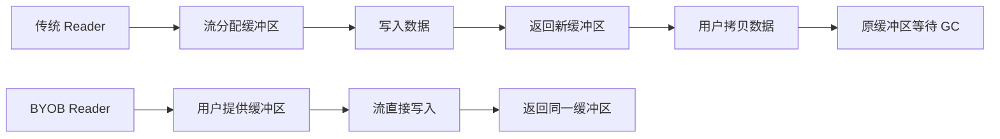
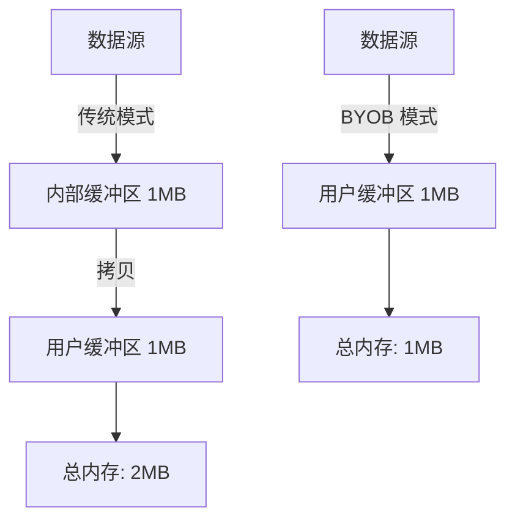
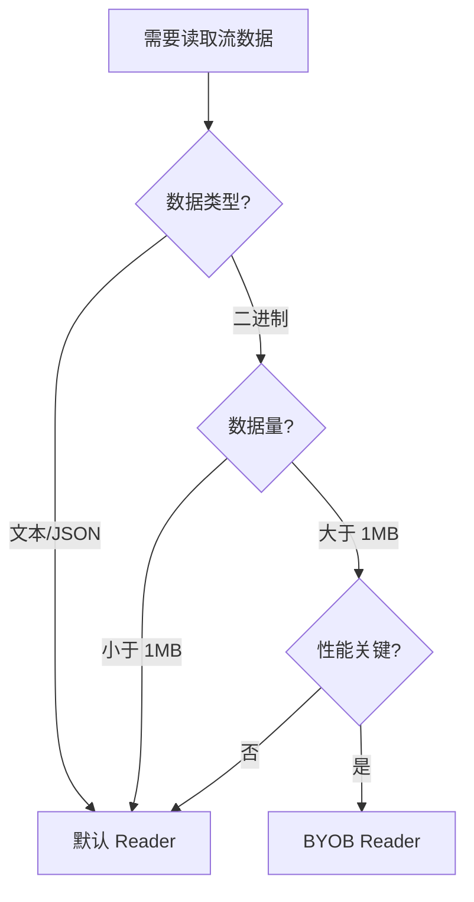

# [0140. BYOB Reader 与零拷贝读取](https://github.com/tnotesjs/TNotes.javascript/tree/main/notes/0140.%20BYOB%20Reader%20%E4%B8%8E%E9%9B%B6%E6%8B%B7%E8%B4%9D%E8%AF%BB%E5%8F%96)

<!-- region:toc -->

- [1. 🎯 本节内容](#1--本节内容)
- [2. 🫧 评价](#2--评价)
- [3. 🤔 BYOB（Bring Your Own Buffer）模式的核心优势是什么 ？](#3--byobbring-your-own-buffer模式的核心优势是什么-)
  - [3.1. 传统模式 vs BYOB 模式](#31-传统模式-vs-byob-模式)
  - [3.2. 性能对比](#32-性能对比)
  - [3.3. 代码对比](#33-代码对比)
  - [3.4. 实际收益](#34-实际收益)
- [4. 🤔 如何创建和使用 ReadableStreamBYOBReader ？](#4--如何创建和使用-readablestreambyobreader-)
  - [4.1. 创建字节流](#41-创建字节流)
  - [4.2. 获取 BYOB Reader](#42-获取-byob-reader)
  - [4.3. 使用 BYOB Reader 读取数据](#43-使用-byob-reader-读取数据)
  - [4.4. 缓冲区复用模式](#44-缓冲区复用模式)
  - [4.5. 完整示例：读取文件](#45-完整示例读取文件)
- [5. 🤔 零拷贝读取如何减少内存开销 ？](#5--零拷贝读取如何减少内存开销-)
  - [5.1. 传统读取的内存流程](#51-传统读取的内存流程)
  - [5.2. 零拷贝读取的内存流程](#52-零拷贝读取的内存流程)
  - [5.3. 内存开销对比图](#53-内存开销对比图)
  - [5.4. 实际测量示例](#54-实际测量示例)
  - [5.5. 减少 GC 压力](#55-减少-gc-压力)
- [6. 🤔 BYOB Reader 对缓冲区有什么要求 ？](#6--byob-reader-对缓冲区有什么要求-)
  - [6.1. 缓冲区类型要求](#61-缓冲区类型要求)
  - [6.2. 缓冲区不能是分离状态](#62-缓冲区不能是分离状态)
  - [6.3. 缓冲区大小要求](#63-缓冲区大小要求)
  - [6.4. 处理缓冲区分离的模式](#64-处理缓冲区分离的模式)
  - [6.5. 使用 DataView 提供灵活性](#65-使用-dataview-提供灵活性)
- [7. 🤔 什么场景下应该使用 BYOB Reader 而不是默认 Reader ？](#7--什么场景下应该使用-byob-reader-而不是默认-reader-)
  - [7.1. 适合使用 BYOB Reader 的场景](#71-适合使用-byob-reader-的场景)
  - [7.2. 不适合使用 BYOB Reader 的场景](#72-不适合使用-byob-reader-的场景)
  - [7.3. 决策流程](#73-决策流程)
  - [7.4. 实际案例对比](#74-实际案例对比)
  - [7.5. 性能对比测试](#75-性能对比测试)
- [8. 💻 demos.1 - 使用 BYOB Reader 读取字节流](#8--demos1---使用-byob-reader-读取字节流)
- [9. 💻 demos.2 - 对比 BYOB Reader 与默认 Reader 的内存使用](#9--demos2---对比-byob-reader-与默认-reader-的内存使用)
- [10. 💻 demos.3 - 实现高效的二进制文件解析器](#10--demos3---实现高效的二进制文件解析器)
- [11. 🔗 引用](#11--引用)

<!-- endregion:toc -->

## 1. 🎯 本节内容

- BYOB Reader 的工作原理
- ReadableStreamBYOBReader 的获取方式
- 零拷贝（Zero-Copy）技术原理
- ArrayBufferView 与缓冲区管理
- BYOB 模式的性能优化效果
- BYOB Reader 的使用限制

## 2. 🫧 评价

BYOB（Bring Your Own Buffer）Reader 是 Web Streams API 中的高级特性，专为高性能二进制数据处理设计。它允许开发者提供自己的缓冲区，让流直接将数据写入该缓冲区，避免了额外的内存分配和数据拷贝。对于处理大量二进制数据（如视频流、大文件）的场景，BYOB Reader 能显著降低内存占用和 GC 压力。

学习 BYOB Reader 需要理解两个核心概念：零拷贝和缓冲区复用。零拷贝指数据从源头直接写入用户提供的缓冲区，而不是先分配临时缓冲区再拷贝；缓冲区复用则是重复使用同一块内存，减少频繁的分配释放。这两者结合，在处理流式二进制数据时能获得接近原生代码的性能。

使用 BYOB Reader 的门槛相对较高：必须使用字节流（type: 'bytes'），必须提供 ArrayBufferView 类型的缓冲区，且需要处理缓冲区的分离（detached）状态。对于普通文本或 JSON 数据处理，默认 Reader 已经足够；BYOB Reader 主要用于视频编解码、音频处理、大文件传输等对性能要求极高的场景。

## 3. 🤔 BYOB（Bring Your Own Buffer）模式的核心优势是什么 ？

BYOB 模式的核心优势是减少内存拷贝，提升性能并降低内存占用。

### 3.1. 传统模式 vs BYOB 模式



### 3.2. 性能对比

| 对比项   | 默认 Reader                | BYOB Reader            |
| -------- | -------------------------- | ---------------------- |
| 内存分配 | 每次读取都分配新缓冲区     | 复用同一缓冲区         |
| 数据拷贝 | 流缓冲区 → 用户缓冲区      | 直接写入用户缓冲区     |
| GC 压力  | 高（频繁分配/释放）        | 低（缓冲区复用）       |
| 内存峰值 | 2 倍数据大小（双份缓冲区） | 1 倍数据大小           |
| 适用场景 | 文本、JSON 等小数据        | 视频、音频等大二进制流 |

### 3.3. 代码对比

```js
// 默认 Reader：每次读取产生新缓冲区
const reader = stream.getReader()
while (true) {
  const { value } = await reader.read() // ❌ value 是新分配的 Uint8Array
  process(value)
  // value 在下次循环时成为垃圾，等待 GC
}

// BYOB Reader：复用缓冲区
const buffer = new Uint8Array(1024)
const reader = stream.getReader({ mode: 'byob' })
let currentBuffer = buffer
while (true) {
  const { value } = await reader.read(currentBuffer) // ✅ 数据写入 currentBuffer
  process(value)
  currentBuffer = new Uint8Array(buffer.buffer) // 复用底层 ArrayBuffer
}
```

### 3.4. 实际收益

```js
// 场景：读取 100MB 视频流
// 假设每次读取 64KB

// 默认 Reader：
// - 分配 1600 次缓冲区（100MB / 64KB）
// - 内存峰值：128MB（数据 + 临时缓冲区）
// - GC 次数：约 1600 次

// BYOB Reader：
// - 分配 1 次缓冲区
// - 内存峰值：64KB + 数据处理所需内存
// - GC 次数：0（缓冲区复用）
```

BYOB 模式通过零拷贝和缓冲区复用，大幅降低了内存开销和 GC 压力。

## 4. 🤔 如何创建和使用 ReadableStreamBYOBReader ？

必须使用字节流（type: 'bytes'），然后通过 getReader({ mode: 'byob' }) 获取。

### 4.1. 创建字节流

```js
// ✅ 正确：指定 type: 'bytes'
const byteStream = new ReadableStream({
  type: 'bytes', // 必须指定
  pull(controller) {
    const chunk = new Uint8Array([1, 2, 3])
    controller.enqueue(chunk)
  },
})

// ❌ 错误：默认流无法使用 BYOB Reader
const defaultStream = new ReadableStream({
  pull(controller) {
    controller.enqueue('text')
  },
})

const reader = defaultStream.getReader({ mode: 'byob' })
// TypeError: This stream does not support BYOB readers
```

### 4.2. 获取 BYOB Reader

```js
const reader = byteStream.getReader({ mode: 'byob' })
console.log(reader.constructor.name) // ReadableStreamBYOBReader
```

### 4.3. 使用 BYOB Reader 读取数据

```js
const buffer = new Uint8Array(1024) // 提供缓冲区
let offset = 0

const reader = byteStream.getReader({ mode: 'byob' })

while (true) {
  // read() 接受一个 ArrayBufferView
  const { done, value } = await reader.read(buffer.subarray(offset))

  if (done) break

  console.log('读取了', value.byteLength, '字节')
  console.log('数据:', value)

  // value 是填充后的视图，可能不是整个 buffer
  offset += value.byteLength
}
```

### 4.4. 缓冲区复用模式

```js
// 创建可复用的缓冲区池
const bufferPool = {
  buffer: new ArrayBuffer(64 * 1024), // 64KB
  view: null,

  getView() {
    this.view = new Uint8Array(this.buffer)
    return this.view
  },
}

const reader = stream.getReader({ mode: 'byob' })

while (true) {
  const view = bufferPool.getView()
  const { done, value } = await reader.read(view)

  if (done) break

  processData(value) // 处理数据

  // ✅ 下次循环复用 bufferPool.buffer
}
```

### 4.5. 完整示例：读取文件

```js
async function readFileWithBYOB(file) {
  const stream = file.stream()
  const reader = stream.getReader({ mode: 'byob' })

  const buffer = new Uint8Array(1024 * 64) // 64KB 缓冲区
  let totalBytes = 0

  try {
    while (true) {
      const { done, value } = await reader.read(buffer)

      if (done) break

      totalBytes += value.byteLength
      console.log(`已读取 ${totalBytes} 字节`)

      // 处理数据
      await processChunk(value)

      // 如果 buffer 被分离，重新创建
      if (buffer.byteLength === 0) {
        buffer = new Uint8Array(1024 * 64)
      }
    }
  } finally {
    reader.releaseLock()
  }
}
```

关键：使用 BYOB Reader 必须创建字节流并提供 ArrayBufferView 类型的缓冲区。

## 5. 🤔 零拷贝读取如何减少内存开销 ？

零拷贝通过直接将数据写入用户缓冲区，避免了中间缓冲区的分配和数据拷贝。

### 5.1. 传统读取的内存流程

```js
// 默认 Reader 的内存操作
const reader = stream.getReader()
const { value } = await reader.read()

// 底层发生的事情：
// 1. 流内部分配缓冲区 A
// 2. 从数据源读取到缓冲区 A
// 3. 创建新的 Uint8Array（缓冲区 B）
// 4. 将缓冲区 A 的数据拷贝到缓冲区 B
// 5. 返回缓冲区 B 给用户
// 6. 缓冲区 A 等待 GC

// 结果：每次读取需要 2 倍内存
```

### 5.2. 零拷贝读取的内存流程

```js
// BYOB Reader 的内存操作
const buffer = new Uint8Array(1024)
const reader = stream.getReader({ mode: 'byob' })
const { value } = await reader.read(buffer)

// 底层发生的事情：
// 1. 用户提供缓冲区 buffer
// 2. 从数据源直接读取到 buffer
// 3. 返回 buffer 的视图（可能是 buffer 的一部分）

// 结果：只需要 1 倍内存，无拷贝操作
```

### 5.3. 内存开销对比图



### 5.4. 实际测量示例

```js
// 读取 10MB 数据的内存对比
async function measureMemory() {
  // 默认 Reader
  const defaultReader = stream.getReader()
  const chunks = []
  while (true) {
    const { done, value } = await defaultReader.read()
    if (done) break
    chunks.push(value) // 每个 value 都是新分配的
  }
  // 内存占用：约 20MB（10MB 数据 + 10MB 临时缓冲区）

  // BYOB Reader
  const buffer = new Uint8Array(1024 * 64)
  const byobReader = stream.getReader({ mode: 'byob' })
  while (true) {
    const { done, value } = await byobReader.read(buffer)
    if (done) break
    // 复用同一个 buffer
  }
  // 内存占用：约 64KB（只有用户缓冲区）
}
```

### 5.5. 减少 GC 压力

```js
// 默认 Reader：频繁 GC
for (let i = 0; i < 1000; i++) {
  const { value } = await reader.read()
  // 每次循环产生新对象，触发 GC
}

// BYOB Reader：几乎无 GC
const buffer = new Uint8Array(1024)
for (let i = 0; i < 1000; i++) {
  const { value } = await reader.read(buffer)
  // 复用 buffer，无新对象产生
}
```

零拷贝的本质是让数据只在内存中存在一份，消除不必要的拷贝操作。

## 6. 🤔 BYOB Reader 对缓冲区有什么要求 ？

必须提供 ArrayBufferView（如 Uint8Array），且缓冲区不能是已分离状态。

### 6.1. 缓冲区类型要求

```js
const reader = stream.getReader({ mode: 'byob' })

// ✅ 正确：ArrayBufferView 类型
await reader.read(new Uint8Array(1024))
await reader.read(new Uint16Array(512))
await reader.read(new DataView(new ArrayBuffer(1024)))

// ❌ 错误：ArrayBuffer 不是 View
await reader.read(new ArrayBuffer(1024))
// TypeError: The provided value is not of type 'ArrayBufferView'

// ❌ 错误：普通数组
await reader.read([1, 2, 3])
// TypeError: The provided value is not of type 'ArrayBufferView'
```

### 6.2. 缓冲区不能是分离状态

```js
const buffer = new Uint8Array(1024)

// 第一次读取
const { value } = await reader.read(buffer)

// ⚠️ value 使用了 buffer 的 ArrayBuffer
// buffer 可能被"分离"（detached）
console.log(buffer.byteLength) // 可能是 0（已分离）

// ❌ 错误：无法再次使用已分离的缓冲区
await reader.read(buffer)
// TypeError: The provided ArrayBufferView is detached

// ✅ 正确：使用新缓冲区或复用 ArrayBuffer
const newBuffer = new Uint8Array(
  buffer.buffer.byteLength ? buffer.buffer : new ArrayBuffer(1024)
)
await reader.read(newBuffer)
```

### 6.3. 缓冲区大小要求

```js
// 流可能要求最小缓冲区大小
const reader = stream.getReader({ mode: 'byob' })

// ❌ 缓冲区太小可能无法读取
await reader.read(new Uint8Array(1))

// ✅ 通常使用 4KB - 64KB
await reader.read(new Uint8Array(64 * 1024))
```

### 6.4. 处理缓冲区分离的模式

```js
// 安全的缓冲区复用模式
let buffer = new Uint8Array(1024)

while (true) {
  try {
    const { done, value } = await reader.read(buffer)
    if (done) break

    processData(value)

    // 检查缓冲区是否被分离
    if (buffer.byteLength === 0) {
      // 重新创建缓冲区
      buffer = new Uint8Array(1024)
    } else {
      // 复用底层 ArrayBuffer
      buffer = new Uint8Array(buffer.buffer)
    }
  } catch (error) {
    if (error.name === 'TypeError') {
      // 缓冲区分离，重新创建
      buffer = new Uint8Array(1024)
    } else {
      throw error
    }
  }
}
```

### 6.5. 使用 DataView 提供灵活性

```js
const buffer = new ArrayBuffer(1024)
const view = new DataView(buffer)

const { value } = await reader.read(view)

// 可以从不同角度读取同一块内存
const uint8View = new Uint8Array(buffer)
const uint16View = new Uint16Array(buffer)
```

缓冲区必须是有效的 ArrayBufferView，并且在每次读取后检查是否被分离。

## 7. 🤔 什么场景下应该使用 BYOB Reader 而不是默认 Reader ？

处理大量二进制数据、对性能要求极高、需要精确控制内存的场景。

### 7.1. 适合使用 BYOB Reader 的场景

| 场景               | 原因                   | 收益               |
| ------------------ | ---------------------- | ------------------ |
| 视频流处理         | 大量连续二进制数据     | 减少 50%+ 内存占用 |
| 音频编解码         | 实时处理，低延迟要求   | 降低 GC 停顿       |
| 大文件上传/下载    | 数据量大，需要分块传输 | 内存占用恒定       |
| WebSocket 二进制流 | 高频数据传输           | 减少内存分配开销   |
| 二进制协议解析     | 需要精确控制缓冲区     | 提升解析性能       |
| 图像处理           | 像素数据量大           | 避免内存峰值       |

### 7.2. 不适合使用 BYOB Reader 的场景

| 场景          | 原因                       | 推荐方案    |
| ------------- | -------------------------- | ----------- |
| JSON API      | 文本数据，数据量小         | 默认 Reader |
| HTML 内容     | 需要文本解码               | TextDecoder |
| 小文件读取    | 性能差异不明显             | 默认 Reader |
| 事件流（SSE） | 行级处理，不需要缓冲区控制 | 异步迭代器  |

### 7.3. 决策流程



### 7.4. 实际案例对比

```js
// 场景1：读取小 JSON 文件（不推荐 BYOB）
const response = await fetch('/api/data.json')
const data = await response.json() // ✅ 简单直接

// 场景2：读取大视频文件（推荐 BYOB）
const response = await fetch('/video.mp4')
const reader = response.body.getReader({ mode: 'byob' })
const buffer = new Uint8Array(64 * 1024)

while (true) {
  const { done, value } = await reader.read(buffer)
  if (done) break
  await videoDecoder.decode(value) // ✅ 零拷贝，高性能
  buffer = new Uint8Array(
    buffer.buffer.byteLength ? buffer.buffer : new ArrayBuffer(64 * 1024)
  )
}
```

### 7.5. 性能对比测试

```js
// 测试：读取 50MB 文件

// 默认 Reader
console.time('default')
const defaultReader = stream.getReader()
while (true) {
  const { done } = await defaultReader.read()
  if (done) break
}
console.timeEnd('default') // 约 800ms，内存峰值 100MB

// BYOB Reader
console.time('byob')
const buffer = new Uint8Array(64 * 1024)
const byobReader = stream.getReader({ mode: 'byob' })
while (true) {
  const { done } = await byobReader.read(buffer)
  if (done) break
  buffer = new Uint8Array(buffer.buffer)
}
console.timeEnd('byob') // 约 500ms，内存峰值 64KB
```

优先使用默认 Reader，只在处理大量二进制数据且需要优化性能时才使用 BYOB Reader。

## 8. 💻 demos.1 - 使用 BYOB Reader 读取字节流

::: code-group

<<< ./demos/1/1.html

<<< ./demos/1/1.js

:::

## 9. 💻 demos.2 - 对比 BYOB Reader 与默认 Reader 的内存使用

::: code-group

<<< ./demos/2/1.html

<<< ./demos/2/1.js

:::

## 10. 💻 demos.3 - 实现高效的二进制文件解析器

::: code-group

<<< ./demos/3/1.html

<<< ./demos/3/1.js

:::

## 11. 🔗 引用

- [Streams API - Web APIs | MDN][1]
- [ReadableStreamBYOBReader - Web APIs | MDN][2]
- [Using readable byte streams - MDN][3]

[1]: https://developer.mozilla.org/zh-CN/docs/Web/API/Streams_API
[2]: https://developer.mozilla.org/zh-CN/docs/Web/API/ReadableStreamBYOBReader
[3]: https://developer.mozilla.org/en-US/docs/Web/API/Streams_API/Using_readable_byte_streams
