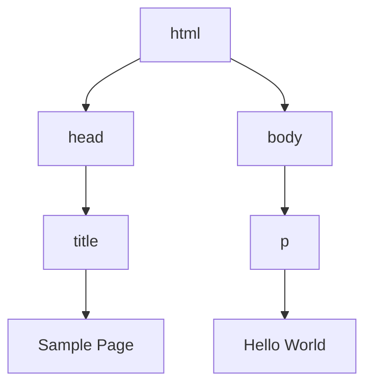

# [0158. JavaScript实现](https://github.com/tnotesjs/TNotes.javascript/tree/main/notes/0158.%20JavaScript%E5%AE%9E%E7%8E%B0)

<!-- region:toc -->

- [1. 🎯 本节内容](#1--本节内容)
- [2. 🫧 评价](#2--评价)
- [3. 🤔 完整的 JavaScript 实现由哪几部分组成？](#3--完整的-javascript-实现由哪几部分组成)
- [4. 🤔 ECMAScript 定义了什么？](#4--ecmascript-定义了什么)
- [5. 🤔 DOM 是什么？](#5--dom-是什么)
- [6. 🤔 BOM 是什么？](#6--bom-是什么)
- [7. 🤔 为什么要区分 ECMAScript、DOM 和 BOM？](#7--为什么要区分-ecmascriptdom-和-bom)

<!-- endregion:toc -->

## 1. 🎯 本节内容

- ECMAScript
- 文档对象模型
- 浏览器对象模型
- 宿主环境扩展
- JavaScript 完整实现

## 2. 🫧 评价

JavaScript 的完整实现不是单一标准能解释完的。把 ECMAScript、DOM 和 BOM 分开看，是理解浏览器中 JavaScript 能力来源的关键。

## 3. 🤔 完整的 JavaScript 实现由哪几部分组成？

在浏览器环境下，一个完整的 JavaScript 实现通常由以下三部分组成：

| 组成部分   | 负责内容   | 典型能力                                   |
| ---------- | ---------- | ------------------------------------------ |
| ECMAScript | 语言核心   | 语法、类型、对象、函数、模块等             |
| DOM        | 文档交互   | 查询节点、修改元素、处理页面结构           |
| BOM        | 浏览器交互 | 操作窗口、地址、历史、屏幕及浏览器相关信息 |

这三部分常常同时出现，因此初学者容易混淆。举例来说：

- `Array.prototype.map()` 属于 ECMAScript 能力
- `document.querySelector()` 属于 DOM 能力
- `location.href` 则属于浏览器环境提供的 BOM 能力

简而言之：

- ECMAScript 让 JavaScript 成为一门完整的语言
- DOM 让 JavaScript 能够操作网页内容
- BOM 让 JavaScript 能够与浏览器窗口及其状态进行交互

::: tip 学习 DOM、BOM 相关章节时需要注意

你所接触到的很多「管理网页的能力」和「管理浏览器的能力」，它们并非由 ECMAScript 语言本身定义，而是由浏览器这个宿主环境提供的。

:::

## 4. 🤔 ECMAScript 定义了什么？

ECMAScript 是由 `ECMA-262` 标准定义的语言规范。它并不局限于 Web 浏览器，也不直接定义页面、网络、文件系统或用户界面相关内容。

从语言核心层面来看，ECMAScript 主要定义了以下内容：

- 语法
- 类型
- 语句
- 关键字
- 保留字
- 操作符
- 全局对象

可以这样理解：ECMAScript 是 JavaScript 的语言地基。浏览器、Node.js 或其他宿主环境都可以在这套地基之上构建自己的扩展能力。

例如，同样是基于 ECMAScript：

- 浏览器可以提供 `document` 对象
- Node.js 可以提供 `process` 对象和文件系统 API

这些扩展并不属于 ECMAScript 语言核心，而是宿主环境赋予的额外能力。

形象类比：ECMAScript 定义的是“怎么说话”的标准，定义的是语法规则。

- 在浏览器中用 ECMAScript 说话，你就能操作页面和浏览器能力，这就是我们所说的 JavaScript。
- 在服务端用 ECMAScript 说话，你就能操作文件系统和网络，这就是我们所说的 Node.js。

## 5. 🤔 DOM 是什么？

DOM 是文档对象模型，也就是 `Document Object Model`。它把 HTML 或 XML 文档抽象成一棵节点树，让程序可以访问和修改页面结构。

下面这个页面：

```html
<html>
  <head>
    <title>Sample Page</title>
  </head>
  <body>
    <p>Hello World!</p>
  </body>
</html>
```

在 DOM 里可以理解成这样的层级：



有了 DOM，JavaScript 才能完成这些事情：

- 查询页面元素
- 修改文本和属性
- 创建、删除、替换节点
- 监听用户事件
- 根据数据变化更新页面内容

早期浏览器各自实现动态 HTML 能力，差异很大。DOM 标准的出现，就是为了解决网页结构操作缺少统一接口的问题。

## 6. 🤔 BOM 是什么？

BOM 是浏览器对象模型（Browser Object Model）的缩写，它面向的是浏览器窗口以及浏览器提供的环境能力。

常见的 BOM 相关能力包括：

- `window` 对象
- `navigator` 对象
- `location` 对象
- `history` 对象
- `screen` 对象
- 弹窗、窗口尺寸、浏览器导航等功能

与 DOM 相比，BOM 的历史标准化程度较低。在很长一段时间里，不同浏览器都按照各自的方式实现 BOM。不过，随着 HTML5 及后续 HTML 标准的发展，许多浏览器环境能力已逐渐被纳入规范。

## 7. 🤔 为什么要区分 ECMAScript、DOM 和 BOM？

区分这三者有助于快速判断问题的来源和归属。

| 问题                               | 更可能属于   |
| ---------------------------------- | ------------ |
| `const`、箭头函数、类语法能不能用  | ECMAScript   |
| 为什么查不到某个页面元素           | DOM          |
| 地址栏、历史记录、窗口尺寸如何处理 | BOM          |
| 某个能力在 Node.js 中为什么不存在  | 宿主环境差异 |

这也是后续学习的一张基本地图：

- 语言基础、变量、函数、对象、类、模块等内容主要归属于 ECMAScript
- DOM、事件、表单、动画和浏览器相关 API 则更多依赖于浏览器环境
