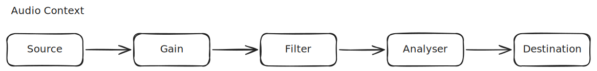

# [0166. Web Audio API - 基础知识](https://github.com/tnotesjs/TNotes.javascript/tree/main/notes/0166.%20Web%20Audio%20API%20-%20%E5%9F%BA%E7%A1%80%E7%9F%A5%E8%AF%86)

<!-- region:toc -->

- [1. 🎯 本节内容](#1--本节内容)
- [2. 🫧 评价](#2--评价)
- [3. 🤔 使用 `<audio>` 都有哪些局限性？为什么还需要 Web Audio API？](#3--使用-audio-都有哪些局限性为什么还需要-web-audio-api)
  - [3.1. 历史背景](#31-历史背景)
  - [3.2. `<audio>` 的本质](#32-audio-的本质)
  - [3.3. Web Audio API 做了什么？](#33-web-audio-api-做了什么)
  - [3.4. 什么时候用 `<audio>` 就够了？](#34-什么时候用-audio-就够了)
  - [3.5. 小结](#35-小结)
- [4. 🤔 `AudioContext` 是什么？](#4--audiocontext-是什么)
  - [4.1. 如何创建音频上下文？](#41-如何创建音频上下文)
  - [4.2. `AudioContext` 都具备哪些功能？](#42-audiocontext-都具备哪些功能)
    - [管理音频硬件](#管理音频硬件)
    - [提供时间基准](#提供时间基准)
    - [作为节点的工厂和注册中心](#作为节点的工厂和注册中心)
    - [管理解码和加载](#管理解码和加载)
  - [4.3. 注意：浏览器的自动播放策略](#43-注意浏览器的自动播放策略)
  - [4.4. 小结](#44-小结)
- [5. 🤔 Web Audio API 中有哪些节点？](#5--web-audio-api-中有哪些节点)
  - [5.1. 源节点（Source）](#51-源节点source)
  - [5.2. 效果/处理节点（Effect）](#52-效果处理节点effect)
  - [5.3. 分析节点（Analysis）](#53-分析节点analysis)
  - [5.4. 路由/工具节点（Utility）](#54-路由工具节点utility)
  - [5.5. 终点节点（Destination）](#55-终点节点destination)
- [6. 🤔 节点之间如何连接与断开？](#6--节点之间如何连接与断开)
- [7. 🤔 `OfflineAudioContext` 是什么？](#7--offlineaudiocontext-是什么)
  - [7.1. 它是什么](#71-它是什么)
  - [7.2. 为什么需要它](#72-为什么需要它)
  - [7.3. 怎么用](#73-怎么用)
  - [7.4. 总结](#74-总结)
- [8. 🤔 数字音频需要理解哪些基础概念？](#8--数字音频需要理解哪些基础概念)
  - [8.1. 采样率（Sample Rate）](#81-采样率sample-rate)
  - [8.2. 采样（Sample）](#82-采样sample)
  - [8.3. 采样数（Sample Count / Frame Count）](#83-采样数sample-count--frame-count)
  - [8.4. 位深度（Bit Depth）](#84-位深度bit-depth)
  - [8.5. 声道数（Channels）](#85-声道数channels)
  - [8.6. AudioBuffer 对象](#86-audiobuffer-对象)
  - [8.7. 这些概念之间的关系](#87-这些概念之间的关系)
  - [8.8. 总结](#88-总结)
- [9. 🤔 如何加载并播放一段声音？](#9--如何加载并播放一段声音)
  - [9.1. `AudioBuffer` 和 `AudioBufferSourceNode`](#91-audiobuffer-和-audiobuffersourcenode)
  - [9.2. 小结](#92-小结)
- [10. 🤔 为什么要用模块化路由组织声音？](#10--为什么要用模块化路由组织声音)
- [11. 🔗 引用](#11--引用)

<!-- endregion:toc -->

## 1. 🎯 本节内容

- 了解 Web 上音频能力的发展：从早期标签、Flash、`<audio>` 到 Web Audio API
- 理解 `AudioContext`、音频图和 `AudioNode` 的基本模型
- 掌握常见音频节点类型：源节点、处理节点、分析节点和目标节点
- 学会用 `connect()`、`disconnect()` 组织音频路由
- 理解声音数字化的基础概念：采样率、位深、PCM、`AudioBuffer` 和音频编码格式
- 掌握加载、解码和播放音频文件的基本流程
- 了解多路音频、主音量和模块化路由在游戏、交互应用中的价值

## 2. 🫧 评价

这是 Web Audio API 的入口章节，重点不是记 API 名称，而是建立“音频图”的思维方式。只要理解声音会从源节点一路流向目标节点，后面的滤波、混音、分析和空间化都会顺很多。同时也要注意一些基础的数字音频概念，这些是理解 Web Audio API 基本使用所必要的前置知识。

## 3. 🤔 使用 `<audio>` 都有哪些局限性？为什么还需要 Web Audio API？

### 3.1. 历史背景

早期网页播放声音主要依赖浏览器私有标签或插件，例如 `bgsound`、`embed` 和 Flash。HTML5 的 `<audio>` 让浏览器原生支持音频播放，这是一个很大的进步，但它更适合播放一段音频，不擅长复杂交互。

如果你在做游戏、音乐工具、音频可视化或实时交互应用，常常会遇到这些需求：

- 精确控制声音在未来某个时间点播放
- 同时播放大量短音效
- 提前加载并解码音频，避免触发时才等待网络和解码
- 对声音做实时滤波、混响、压缩、空间化等处理
- 分析音频数据，用于波形、频谱或节奏可视化

上述提到的这些需求，是无法直接通过 `<audio>` 实现的。Web Audio API 的出现解决了上述提到的这些问题。

### 3.2. `<audio>` 的本质

`<audio>` 是一个黑盒播放器，它的设计目标很朴素 => 播放一段音频，通过 `<audio>` 你可以：

- 播放、暂停、跳转
- 调整音量（整体）
- 获取当前播放进度

但你无法触及音频内部。音频数据流过一个密封管道，直接送到扬声器，中间你什么都干预不了。

### 3.3. Web Audio API 做了什么？

Web Audio API 把这条密封管道拆开，暴露成一个可编程的音频节点图：Source -> Gain -> Filter -> Analyser -> Destination（扬声器）



其中：

- `Source` 负责产生声音
- `Gain` 负责控制音量或增益
- `Filter` 负责改变频率响应
- `Analyser` 负责读取音频数据，但不改变声音
- `Destination` 是音频图的最终输出终点，音频到达这里后交给操作系统输出到物理设备

每一个节点你都可以自由插入、替换、移除。这意味着我们可以实现以下功能：（这些功能是 `<audio>` 无法实现的）

| 功能 | Web Audio API 的关键节点/机制 | `<audio>` 的局限性 |
| --- | --- | --- |
| 合成声音 | `OscillatorNode`，可直接生成正弦、方波、锯齿波、三角波等波形，无需任何音频文件。 | 只能播放已有的音频文件，无法凭空生成声音。 |
| 实时效果处理 | `BiquadFilterNode`、`ConvolverNode`、`DynamicsCompressorNode` 等，可插入滤波器、混响、压缩器、失真、延迟等效果节点，像一个虚拟调音台。 | 无法在音频输出链路中插入任何效果处理，只能直接播放原始音频。 |
| 音频分析 | `AnalyserNode`，可实时获取频率数据和时域数据，是音频可视化的基础。 | 不暴露音频数据，无法获取频率、波形等底层信息。 |
| 精确时间调度 | `AudioContext.currentTime`、`start(when)`，精确安排声音在毫秒级时间点播放，适合音乐应用。 | 只能控制播放/暂停/跳转，时间精度受限于浏览器实现，无法精确调度多个音源的时间点。 |
| 空间音频 | `PannerNode`、`AudioListener`，可将声音定位到 3D 空间中的任意位置，配合耳机可产生空间感。 | 没有空间定位能力，声音只能以立体声的形式直接输出。 |
| 多源混音 | `GainNode` + 节点图连接，多个音频源可各自独立处理，最后混合输出到扬声器。 | 每个 `<audio>` 元素独立输出，无法在混合前对各音源分别施加不同处理。 |

### 3.4. 什么时候用 `<audio>` 就够了？

不是所有场景都需要 Web Audio API，如果你的需求就是“播一段语音”或“播放一首歌”，`<audio>` 完全胜任，没必要非得用 Web Audio API。

Web Audio API 的价值在于：让你更细粒度地控制音频，这些能力是 `<audio>` 不具备的。

### 3.5. 小结

- `<audio>` 可以处理长音频、流式播放和浏览器控件，但它不是一个完整的音频处理系统。
- Web Audio API 提供的是一套独立的音频图模型，你可以把声音源、效果器、分析器和输出设备像积木一样接起来。

|          | `<audio>`      | Web Audio API      |
| -------- | -------------- | ------------------ |
| 类比     | CD 播放器      | 录音棚             |
| 你能做的 | 按播放/暂停    | 编曲、混音、加效果 |
| 音频数据 | 看不到、摸不到 | 逐采样可编程       |

::: tip 两者之间的关系

值得一提的是，两者并非互斥关系。通过 `MediaElementAudioSourceNode`，可以把一个 `<audio>` 元素接入 Web Audio API 的节点图，在保留 `<audio>` 的加载和播放控制的同时，获得 Web Audio API 的效果处理和分析能力。当你需要播放较长的音频（如完整的音乐文件）同时又想对它做滤波、混响或可视化时，这种桥接方式非常实用。

:::

## 4. 🤔 `AudioContext` 是什么？

`AudioContext` 是 Web Audio API 的核心容器。所有音频操作都必须在一个 `AudioContext` 内进行 => 它管理着整个音频图的生命周期、时间基准和音频硬件的连接。你可以把它理解为一个音频工作台：里面包含一张有向的音频图，声音从源节点流出，经过一个或多个处理节点，最后到达目标节点。

| 类比项         | `AudioContext` 的对应关系                 |
| -------------- | ----------------------------------------- |
| 录音棚的调音台 | 所有音频信号都流经它                      |
| 项目的时钟     | 所有时间调度都以它的 `currentTime` 为基准 |
| 工作区         | 所有节点都在它内部创建和连接              |

### 4.1. 如何创建音频上下文？

创建 `AudioContext` 是使用 Web Audio API 的第一步，没有 `AudioContext`，后续所有节点都无法创建、所有音频操作都无法进行，它是一切的起点。

现代浏览器中通常这样创建音频上下文：

```js
const AudioContextClass = window.AudioContext || window.webkitAudioContext

if (!AudioContextClass) {
  throw new Error('当前浏览器不支持 Web Audio API')
}

const audioContext = new AudioContextClass()
```

实际项目里，一般一个音频应用只需要一个 `AudioContext`，它可以承载多个声音源和复杂的节点图。

### 4.2. `AudioContext` 都具备哪些功能？

#### 管理音频硬件

创建 `AudioContext` 时，浏览器会请求音频输出设备（通常是扬声器或耳机）。`Destination` 节点就是由它提供的。

#### 提供时间基准

```javascript
const ctx = new AudioContext()
console.log(ctx.currentTime) // 从 context 启动起经过的秒数，精度极高
```

`currentTime` 是一个持续增长的浮点数（单位：秒），精度可以达到微秒级别。所有节点的时间调度都以它为基准，比如 `oscillator.start(ctx.currentTime + 0.5)` 表示“在 0.5 秒后开始播放”。

#### 作为节点的工厂和注册中心

所有音频节点都通过它创建，所有节点的连接都在它的管辖范围内：

```javascript
const ctx = new AudioContext()

// 通过 ctx 创建节点
const osc = ctx.createOscillator()
const gain = ctx.createGain()

// 节点连接
osc.connect(gain)
gain.connect(ctx.destination) // destination 也来自 ctx
```

#### 管理解码和加载

音频文件的解码也由它负责：`const buffer = await ctx.decodeAudioData(arrayBuffer)`

### 4.3. 注意：浏览器的自动播放策略

浏览器有自动播放策略。`AudioContext` 创建后可能处于 `suspended` 状态，需要在用户交互（点击、按键等）后手动恢复：

```javascript
const ctx = new AudioContext()

document.getElementById('play').addEventListener('click', () => {
  if (ctx.state === 'suspended') {
    ctx.resume()
  }
  // 在这里创建和连接节点，播放音频
})
```

这是浏览器为了防止页面自动播放声音打扰用户而设定的限制，不是 `AudioContext` 本身的问题。

### 4.4. 小结

- `AudioContext` 是所有 Web Audio API 操作的入口和容器
- 它负责管理音频硬件连接、提供精确时间基准、创建和调度音频节点
- 通常一个页面只需要一个 `AudioContext`，大多数场景下不需要创建多个

## 5. 🤔 Web Audio API 中有哪些节点？

创建完 `AudioContext`，下一步就是往里面添加节点、连接节点图了。

Web Audio API 的节点可以按角色分为四大类：

```
Source (Oscillator / AudioBuffer / MediaElement / MediaStream)
  │
  ▼
Effect (Gain -> BiquadFilter -> Delay -> Convolver -> DynamicsCompressor ...)
  │
  ▼
Analysis (Analyser) ← 读取数据但不改变信号
  │
  ▼
Utility (ChannelSplitter / ChannelMerger，按需使用)
  │
  ▼
Destination (扬声器 / MediaStream)
```

不需要每个项目都用到所有节点，常见的组合比如：

- 最简：OscillatorNode -> GainNode -> Destination
- 音乐播放+可视化：MediaElementAudioSourceNode -> AnalyserNode -> Destination
- 游戏音效：AudioBufferSourceNode -> GainNode -> PannerNode -> Destination

### 5.1. 源节点（Source）

负责产生或引入音频信号，是节点图的起点。

| 编号 | 节点 | 说明 |
| --- | --- | --- |
| 1 | `OscillatorNode` | 生成波形（正弦、方波、锯齿波、三角波） |
| 2 | `AudioBufferSourceNode` | 播放预先解码好的 `AudioBuffer` 数据，播放一次后自动销毁 |
| 3 | `MediaElementAudioSourceNode` | 把 `<audio>` 或 `<video>` 元素接入音频图 |
| 4 | `MediaStreamAudioSourceNode` | 把 `MediaStream`（如麦克风）接入音频图 |
| 5 | `ConstantSourceNode` | 输出一个恒定的音频信号，常用于调制参数 |

::: code-group

```js [1]
const osc = audioContext.createOscillator() // OscillatorNode

osc.type = 'sine' // sine | square | sawtooth | triangle
osc.frequency.value = 440 // 频率，单位 Hz
osc.start()
```

```js [2]
// 先准备 AudioBuffer（通常从文件解码而来）
const response = await fetch('audio.mp3')
const arrayBuffer = await response.arrayBuffer()
const audioBuffer = await audioContext.decodeAudioData(arrayBuffer)

const source = audioContext.createBufferSource() // AudioBufferSourceNode
source.buffer = audioBuffer
source.start()
// 注意：
// AudioBufferSourceNode 是一次性的
// 调用 start() 后无法再次播放，需要重新创建
```

```js [3]
const audio = document.querySelector('audio') // 或 <video>

const source = audioContext.createMediaElementSource(audio) // MediaElementAudioSourceNode
source.connect(audioContext.destination)

audio.play() // 仍然通过 <audio> 元素控制播放
// 这是 <audio> 与 Web Audio API 的桥接方式
// 接入后，<audio> 的音频输出会走音频图，而不是直接输出到扬声器
```

```js [4]
// 获取麦克风
const stream = await navigator.mediaDevices.getUserMedia({ audio: true })

const source = audioContext.createMediaStreamSource(stream) // MediaStreamAudioSourceNode

// source.connect(audioContext.destination) // ⚠️ 慎重，会产生回声
// 通常不会直接连到 destination，而是连到 AnalyserNode 做分析。

// 连到 AnalyserNode 做分析：
const analyser = audioContext.createAnalyser()
source.connect(analyser)
// 从 analyser 读取数据，做可视化
```

```js [5]
const constant = audioContext.createConstantSource() // ConstantSourceNode
// ConstantSourceNode 节点比较特殊，它输出的不是声音，而是一个恒定的数值信号
constant.offset.value = 0.5 // 输出恒定值
constant.start()

// 通常用来调制其他节点的参数：
const gain = audioContext.createGain()
constant.connect(gain.gain) // 用恒定信号控制增益
```

:::

### 5.2. 效果/处理节点（Effect）

负责改变音频信号（改变声音），可以串联多个形成效果链。

| 编号 | 节点 | 说明 |
| --- | --- | --- |
| 1 | `GainNode` | 控制音量（增益） |
| 2 | `BiquadFilterNode` | 滤波器，支持低通、高通、带通、陷波等多种类型 |
| 3 | `DynamicsCompressorNode` | 动态压缩，防止音量过大产生削波 |
| 4 | `ConvolverNode` | 卷积混响，可用于模拟房间声学效果 |
| 5 | `DelayNode` | 延迟效果，音频信号延迟指定时间后输出 |
| 6 | `WaveShaperNode` | 波形整形，常用于失真/过载效果 |
| 7 | `StereoPannerNode` | 简单的左右声道平移 |
| 8 | `PannerNode` | 3D 空间定位，支持 HRTF |

::: code-group

```js [1]
const gain = audioContext.createGain() // GainNode

// 设置音量为 50%
gain.gain.value = 0.5

// 也可以随时间变化音量
gain.gain.linearRampToValueAtTime(1.0, audioContext.currentTime + 2) // 2秒内从当前值渐变到 1.0
```

```js [2]
const filter = audioContext.createBiquadFilter() // BiquadFilterNode

filter.type = 'lowpass' // lowpass | highpass | bandpass | notch | allpass | peaking | lowshelf | highshelf
filter.frequency.value = 1000 // 截止频率，单位 Hz
filter.Q.value = 1 // 品质因数，影响频率响应的尖锐程度
filter.gain.value = 0 // 仅对 peaking、lowshelf、highshelf 有效
```

```js [3]
const compressor = audioContext.createDynamicsCompressor() // DynamicsCompressorNode

compressor.threshold.value = -24 // 阈值（dB），超过此值开始压缩
compressor.knee.value = 30 // 膝部（dB），压缩过渡的平滑程度
compressor.ratio.value = 12 // 压缩比
compressor.attack.value = 0.003 // 启动时间（秒），信号超过阈值后多久开始压缩
compressor.release.value = 0.25 // 释放时间（秒），信号低于阈值后多久停止压缩
```

```js [4]
// 卷积混响需要一个脉冲响应（Impulse Response）音频文件
const response = await fetch('ir-hall.wav')
const arrayBuffer = await response.arrayBuffer()
const irBuffer = await audioContext.decodeAudioData(arrayBuffer)

const convolver = audioContext.createConvolver() // ConvolverNode
convolver.buffer = irBuffer // 设置脉冲响应缓冲区
// 脉冲响应文件描述了特定空间的声学特性，加载后即可模拟该空间的混响效果
```

```js [5]
const delay = audioContext.createDelay(5) // DelayNode，参数为最大延迟时间（秒）

delay.delayTime.value = 0.5 // 延迟 0.5 秒
// delayTime 也可以动态调整
delay.delayTime.linearRampToValueAtTime(1.0, audioContext.currentTime + 3) // 3秒内渐变到 1.0 秒
```

```js [6]
const waveshaper = audioContext.createWaveShaper() // WaveShaperNode

// 通过 Float32Array 定义失真曲线
function makeDistortionCurve(amount) {
  const samples = 44100
  const curve = new Float32Array(samples)
  for (let i = 0; i < samples; i++) {
    const x = (i * 2) / samples - 1
    curve[i] =
      ((3 + amount) * x * 20 * (Math.PI / 180)) /
      (Math.PI + amount * Math.abs(x))
  }
  return curve
}

waveshaper.curve = makeDistortionCurve(50) // amount 越大，失真越强
waveshaper.oversample = '4x' // 过采样，减少混叠伪影：'none' | '2x' | '4x'
```

```js [7]
const panner = audioContext.createStereoPanner() // StereoPannerNode

panner.pan.value = -1 // -1（最左）到 1（最右），0 为居中
```

```js [8]
const panner = audioContext.createPanner() // PannerNode

panner.panningModel = 'HRTF' // 'HRTF'（基于头部相关传输函数，更真实）| 'equalpower'（简单算法）

// 设置声源在 3D 空间中的位置（笛卡尔坐标）
panner.setPosition(3, 0, -2) // x=3, y=0, z=-2（右侧，稍远）

// 设置声源的朝向
panner.setOrientation(0, 0, 1) // 面向 z 轴正方向

// 距离衰减模型
panner.distanceModel = 'inverse' // 'linear' | 'inverse' | 'exponential'
panner.refDistance = 1 // 参考距离
panner.maxDistance = 10000 // 最大距离
panner.rolloffFactor = 1 // 衰减速率
```

:::

### 5.3. 分析节点（Analysis）

负责读取音频数据但不改变信号。

| 编号 | 节点           | 说明                                          |
| ---- | -------------- | --------------------------------------------- |
| 1    | `AnalyserNode` | 提供频率数据（FFT）和时域波形数据，用于可视化 |

::: code-group

```js [1]
const analyser = audioContext.createAnalyser() // AnalyserNode

analyser.fftSize = 2048 // FFT 窗口大小，必须是 2 的幂（32 ~ 32768）
// fftSize 越大，频率分辨率越高，但时间分辨率越低

const bufferLength = analyser.frequencyBinCount // 频率数据的数量，等于 fftSize / 2

// 获取频率数据（频谱）
const freqData = new Uint8Array(bufferLength)
analyser.getByteFrequencyData(freqData) // 值域 0 ~ 255，每个元素对应一个频率区间的能量

// 获取时域数据（波形）
const timeData = new Uint8Array(bufferLength)
analyser.getByteTimeDomainData(timeData) // 值域 0 ~ 255，128 为静音

// 也可以获取浮点精度的数据（用于更精确的分析）
const floatFreqData = new Float32Array(bufferLength)
analyser.getFloatFrequencyData(floatFreqData) // 值域为 dB

const floatTimeData = new Float32Array(bufferLength)
analyser.getFloatTimeDomainData(floatTimeData) // 值域 -1.0 ~ 1.0

// 平滑时间常数，控制数据变化的平滑程度
analyser.smoothingTimeConstant = 0.8 // 0（无平滑）到 1（最大平滑），默认 0.8
```

:::

### 5.4. 路由/工具节点（Utility）

负责拆分、合并或转换通道。

| 编号 | 节点                  | 说明                               |
| ---- | --------------------- | ---------------------------------- |
| 1    | `ChannelSplitterNode` | 将多声道信号拆分成单独的单声道线路 |
| 2    | `ChannelMergerNode`   | 将多个单声道线路合并成多声道信号   |

::: code-group

```js [1]
// 将立体声拆分为左右两个独立的单声道
const splitter = audioContext.createChannelSplitter(2) // 参数为输出通道数

source.connect(splitter)

// splitter.numberOfOutputs === 2
// output 0 = 左声道，output 1 = 右声道

// 分别对左右声道做不同处理
const leftGain = audioContext.createGain()
const rightGain = audioContext.createGain()

splitter.connect(leftGain, 0) // 从输出端口 0（左声道）连接
splitter.connect(rightGain, 1) // 从输出端口 1（右声道）连接
```

```js [2]
// 将多个单声道信号合并为多声道
const merger = audioContext.createChannelMerger(2) // 参数为输入通道数

// 将两个独立的音源分别送入左右声道
const sourceA = audioContext.createOscillator()
const sourceB = audioContext.createOscillator()

sourceA.connect(merger, 0, 0) // 连接到 merger 的输入端口 0（左声道）
sourceB.connect(merger, 0, 1) // 连接到 merger 的输入端口 1（右声道）

merger.connect(audioContext.destination)
// sourceA 只从左声道输出，sourceB 只从右声道输出
```

:::

### 5.5. 终点节点（Destination）

节点图的终点，信号从这里离开音频图。

| 编号 | 节点 | 说明 |
| --- | --- | --- |
| 1 | `AudioDestinationNode` | 默认输出终点（扬声器/耳机），通过 `ctx.destination` 访问 |
| 2 | `MediaStreamAudioDestinationNode` | 输出到 `MediaStream`，可用于录制或 WebRTC 传输 |

::: code-group

```js [1]
// AudioDestinationNode 通过 ctx.destination 直接访问，无需手动创建
const destination = audioContext.destination

console.log(destination.maxChannelCount) // 输出设备支持的最大声道数
console.log(destination.channelCount) // 当前使用的声道数，默认等于 maxChannelCount

// 连接到它，声音就从扬声器输出
gain.connect(destination)
```

```js [2]
// 创建一个输出到 MediaStream 的目的地
const dest = audioContext.createMediaStreamDestination() // MediaStreamAudioDestinationNode

// 把音频源连到它
source.connect(dest)

// dest.stream 是一个 MediaStream，可以用于录制
const recorder = new MediaRecorder(dest.stream, { mimeType: 'audio/webm' })
recorder.start()

// 也可以用于 WebRTC 传输
// peerConnection.addTrack(dest.stream.getAudioTracks()[0])
```

:::

## 6. 🤔 节点之间如何连接与断开？

这些节点通过 `connect()` 连接，通过 `disconnect()` 断开。

::: code-group

```js [connect]
source.connect(destination) // source 的输出 -> destination 的输入

// connect() 可以链式调用：
source.connect(gain).connect(filter).connect(audioContext.destination)

// 等价于：
source.connect(gain)
gain.connect(filter)
filter.connect(audioContext.destination)

// 节点图：source -> gain -> filter -> destination

// 分支连接：一个节点可以同时连接到多个节点。
// source 同时连到 gain1 和 gain2
source.connect(gain1)
source.connect(gain2)
// 节点图：
//         ┌-> gain1 -> destination
// source ─┤
//         └-> gain2 -> destination

// 指定输出/输入端口：对于多通道节点（如 ChannelSplitterNode、ChannelMergerNode），可以指定连接的端口。
// connect(目标节点, 输出端口, 输入端口)
splitter.connect(leftGain, 0, 0) // 输出端口 0 -> 输入端口 0
splitter.connect(rightGain, 1, 0) // 输出端口 1 -> 输入端口 0
// 普通节点的端口默认都是 0，大多数情况下不需要指定。

// 多个节点可以连接到同一个节点，Web Audio API 会把输入信号混合起来。
gain1.connect(destination)
gain2.connect(destination)
// 节点图：
//         ┌-> gain1 -> destination
// source ─┤
//         └-> gain2 -> destination
```

```js [disconnect]
source.disconnect() // 断开 source 的所有连接
source.disconnect(gain) // 只断开 source -> gain 这一条

// 断开后可以重新连接到其他节点：
source.disconnect(gain) // 断开旧连接
source.connect(filter) // 接到新节点
```

:::

| 方法                 | 作用           | 示例                      |
| -------------------- | -------------- | ------------------------- |
| `connect(target)`    | 连接到目标节点 | `source.connect(gain)`    |
| `disconnect()`       | 断开所有连接   | `source.disconnect()`     |
| `disconnect(target)` | 断开指定连接   | `source.disconnect(gain)` |

连接和断开都是即时生效的，不需要额外调用 `start()` 或刷新。

示例：建立一条非常常见的路径 => AudioBufferSourceNode -> GainNode -> Destination，音频缓冲区作为声音源，经过 `GainNode` 调整音量，再输出到扬声器：

```js
const source = audioContext.createBufferSource() // AudioBufferSourceNode（源节点）
const gain = audioContext.createGain() // GainNode（效果节点）

source.buffer = audioBuffer // 给源节点指定音频数据
gain.gain.value = 0.5 // 设置音量为 50%

source.connect(gain) // source -> gain
gain.connect(audioContext.destination) // gain -> destination（扬声器）
source.start() // 开始播放
```

如果你想绕过中间节点，可以断开后重新连接：

```js
source.disconnect()
gain.disconnect()
source.connect(audioContext.destination)
```

这种“可重新布线”的模型，就是 Web Audio API 比 `<audio>` 灵活得多的关键。

## 7. 🤔 `OfflineAudioContext` 是什么？

`OfflineAudioContext` 是一个特殊的 `AudioContext`。

### 7.1. 它是什么

`OfflineAudioContext` 和普通 `AudioContext` 的角色一样，都是音频图的容器。区别在于：

|      | `AudioContext` | `OfflineAudioContext`        |
| ---- | -------------- | ---------------------------- |
| 输出 | 实时送到扬声器 | 渲染到内存中的 `AudioBuffer` |
| 速度 | 实时（1:1）    | 可以比实时更快               |
| 用途 | 播放、交互     | 离线处理、预渲染、导出       |

### 7.2. 为什么需要它

有些场景不需要实时播放，而需要把音频处理的结果拿到手：

- 提前渲染一段混响效果，保存为文件
- 把多个音轨混合导出
- 对音频做离线分析

### 7.3. 怎么用

```javascript
// 参数：声道数、采样数、采样率
const offline = new OfflineAudioContext(2, 44100 * 5, 44100) // 5秒，双声道

const osc = offline.createOscillator()
osc.frequency.value = 440
osc.connect(offline.destination)
osc.start(0)
osc.stop(5)

// 开始渲染，完成后拿到 AudioBuffer
const buffer = await offline.startRendering()

console.log(buffer) // AudioBuffer，包含处理后的音频数据
```

渲染过程中，所有节点和连接方式与普通 `AudioContext` 完全一致，只是最终输出不是扬声器，而是一个 `AudioBuffer`。

### 7.4. 总结

- `OfflineAudioContext` 是 `AudioContext` 的离线版本
- 它内部可以使用和普通 `AudioContext` 完全相同的节点
- 输出的是 `AudioBuffer`，而不是实时音频流

## 8. 🤔 数字音频需要理解哪些基础概念？

真实世界中的声音是空气中的压力波。麦克风会把这种压力变化转换成电信号，计算机再把连续变化的模拟信号采样成一串数字。

### 8.1. 采样率（Sample Rate）

采样率（Sample Rate）表示把连续的声音波形转成数字信号时，每秒需要测量多少次。

采样率 = 44100 Hz -> 每秒测量 44100 次

| 常见采样率 | 用途                          |
| ---------- | ----------------------------- |
| 44100 Hz   | CD 音质，许多系统的默认采样率 |
| 48000 Hz   | 视频/电影行业标准             |
| 22050 Hz   | 语音，对音质要求不高的场景    |
| 96000 Hz   | 专业录音，高保真              |

```js
const ctx = new AudioContext()
console.log(ctx.sampleRate) // 实际值取决于系统，可能是 44100 或 48000
```

采样率越高，能记录的频率范围越广。根据 [奈奎斯特–香农采样定理][1]，采样率能记录的最高频率是它的一半，44100 Hz 的采样率最高能记录 22050 Hz 的声音，覆盖了人耳的听觉范围（20 Hz ~ 20000 Hz）。

### 8.2. 采样（Sample）

一个采样就是某一个时刻记录下来的一个振幅值。

- 单声道：一帧 = 一个采样 = 一个数值
- 双声道：一帧 = 两个采样 = 两个数值（左 + 右）

一段音频的本质就是一长串采样值：`[-0.12, 0.45, 0.78, 0.33, -0.56, ...]`（数万个这样的数值）

::: tip “采样（sample）” vs “帧（frame）”

在严格术语中，单个通道的一个值叫“采样（sample）”，同一时刻所有通道的值合在一起叫“帧（frame）”。

日常使用中这两个术语经常混用。

:::

### 8.3. 采样数（Sample Count / Frame Count）

一段音频包含多少个采样点。

假设采样率是 44100 Hz，持续 5 秒 -> 44100 × 5 = 220500 个采样。

创建 `OfflineAudioContext` 时需要指定的就是这个值：

```javascript
new OfflineAudioContext(
  2, // 通道数
  220500, // 采样数 44100 × 5
  44100, // 采样率
)

// 也有对象形式，可读性更好：
new OfflineAudioContext({
  numberOfChannels: 2,
  length: 220500, // 44100 × 5
  sampleRate: 44100,
})
```

### 8.4. 位深度（Bit Depth）

每次采样用多少个二进制位来记录振幅值。位深度 = 16 bit -> 每个采样值有 $2^{16} = 65536$ 个级别。

| 常见位深度     | 说明                             |
| -------------- | -------------------------------- |
| 16 bit         | CD 音质，动态范围约 96 dB        |
| 32 bit（浮点） | Web Audio API 内部处理使用的精度 |

位深度越高，振幅的精度越高，噪底越低。Web Audio API 内部用 32 位浮点数处理，确保中间计算不会损失精度。

```js
// 无论源文件是 8 bit、16 bit、24 bit 还是 32 bit
// 解码后全部变成 Float32Array
const channelData = audioBuffer.getChannelData(0)
console.log(channelData.constructor.name) // "Float32Array"
// 你拿到的永远是一个 Float32Array，后续的增益、滤波、混响等处理完全不关心原始位深度
// 不同位深度的文件解码后，在使用 web audio api 来处理时，做法都是一样的，没有本质区别
```

解码是把原始采样值映射到 Float32 的范围内（-1.0 到 1.0），不同位深度的源文件在这个映射中保留的精度不同：

| 原始位深度 | 每个采样点的原始精度 | 映射到 Float32 后                        |
| ---------- | -------------------- | ---------------------------------------- |
| 8 bit      | 256 级               | 精度充裕，无损                           |
| 16 bit     | 65,536 级            | 精度充裕，无损                           |
| 24 bit     | ~1677 万级           | Float32 有效尾数 24 位，刚好能容纳       |
| 32 bit int | ~43 亿级             | Float32 有效尾数只有 24 位，会有精度损失 |

位深度（Bit Depth）不同对 web audio api 的影响维度主要体现在精度层面：

| 维度 | 是否有区别 |
| --- | --- |
| 使用层面：API 使用方式 | 无区别 |
| 使用层面：音频处理流程 | 无区别 |
| 精度层面：解码后数据精度 | 有区别，源文件位深度越高，Float32 中承载的有效信息越多 |

### 8.5. 声道数（Channels）

- 单声道：1 个通道
- 双声道：2 个通道（左 + 右），左右声道可以包含不同的信息，用来产生空间感
- 多声道：5.1 环绕声通常是 6 个通道（左前、右前、中央、低频、左后、右后）

Web Audio API 支持最多 32 个通道。

### 8.6. AudioBuffer 对象

当你调用 `decodeAudioData()` 时，得到的 `AudioBuffer` 会暴露 `sampleRate`、`numberOfChannels`、`length`、`duration` 这几个属性：

```js
const context = new AudioContext()
const response = await fetch('audio.wav')
const arrayBuffer = await response.arrayBuffer()
const audioBuffer = await context.decodeAudioData(arrayBuffer)

console.log(audioBuffer.sampleRate) // 采样率（Sample Rate）
console.log(audioBuffer.numberOfChannels) // 声道数（Channels）
console.log(audioBuffer.length) // 总帧数（Sample Count）
console.log(audioBuffer.duration) // 时长（Duration）
```

你可以直接访问和修改每个通道的采样数据：

```javascript
const channelData = audioBuffer.getChannelData(0) // Float32Array，左声道
console.log(channelData[0]) // 第一个采样值，范围 -1.0 ~ 1.0
```

### 8.7. 这些概念之间的关系

- $一个声道的采样数 = 时长 \times 采样率$
- $总采样点数 = 一个声道的采样数 \times 声道数$
- $文件大小（位） = 采样率 \times 位深度 \times 声道数 \times 时长$

以一首 CD 音质的歌为例：（WAV 格式）

```
44100 Hz × 16 bit × 2 通道 × 300 秒（5分钟）
= 44100 × 16 × 2 × 300
= 423,360,000 bit
≈ 50 MB（未压缩）
```

可见一首未压缩的 CD 音质歌曲文件是非常大的，这也解释了为什么音乐文件通常需要压缩编码（MP3/AAC 有损压缩）。

### 8.8. 总结

| 概念 | 含义 | 类比 | Web Audio API 中的体现 |
| --- | --- | --- | --- |
| 采样率 | 每秒采集多少次声音样本，常见值是 `44100Hz` 或 `48000Hz`。 | 每秒拍多少张照片 | `audioBuffer.sampleRate`，采样率 |
| 采样 | 每次采集的声音样本值，通常是一个浮点数，范围大致是 `-1` 到 `1`。 | 一张照片 | `Float32Array` 中的一个数值，比如 `audioBuffer.getChannelData(0)[0]` |
| 位深度 | 每个样本用多少位保存，位深越高，可表示的动态范围越大。 | 每张照片的分辨率 | 内部 32 位浮点处理 |
| PCM | 把声音表示成样本数组的常见数字音频方式。 |  |  |
| `AudioBuffer` | Web Audio API 中保存 PCM 音频数据的对象。 | 存放照片的相册 | `audioBuffer`，存放采样数据的容器 |
| 声道数 | 一段音频可以有一个或多个声道，例如单声道、双声道。 | 摄像机的数量 | `audioBuffer.numberOfChannels` |

在 Web Audio API 中，`AudioBuffer` 内部的数据通常是归一化的浮点数，范围大致是 `-1` 到 `1`。如果信号超过这个范围，输出时就可能削波，听起来会失真。

音频文件本身通常不会直接保存原始 PCM（WAV/AIFF），因为体积很大。音频文件通常会使用压缩编码来减小体积，例如 MP3、AAC、OGG 等有损格式，或 FLAC 等无损压缩格式。WAV/AIFF 通常直接存储未压缩的 PCM 数据，音质最好但文件也最大。浏览器能否解码某种格式，取决于浏览器和平台支持情况。

理解了这些，后面看到 `decodeAudioData`、`AudioBuffer`、`AnalyserNode` 返回的数据时，就知道它们到底在给你什么东西了。

## 9. 🤔 如何加载并播放一段声音？

### 9.1. `AudioBuffer` 和 `AudioBufferSourceNode`

Web Audio API 把“音频资源”和“播放状态”分开看待：

- `AudioBuffer` -> 是数据（存放音频采样值的容器）
- `AudioBufferSourceNode` -> 是播放器（从 `AudioBuffer` 读取数据并发送到音频图的节点）

把 AudioBuffer 想象成一张 CD，AudioBufferSourceNode 想象成一台 CD 播放器：

- CD `AudioBuffer` -> 静态的数据，可以反复使用
- CD 播放器 `AudioBufferSourceNode` -> 消耗品，播一次就报废

一张 CD 可以放进不同的播放器，这意味着同一个 `AudioBuffer` 可以被多个 `AudioBufferSourceNode` 同时播放。游戏里的碰撞音效、枪声音效、按键反馈都很依赖这个模式。

现代写法通常使用 `fetch()` 加载音频，再用 `decodeAudioData()` 解码：

```js
// AudioBuffer - 存储数据
const response = await fetch('music.mp3')
const arrayBuffer = await response.arrayBuffer()
const audioBuffer = await ctx.decodeAudioData(arrayBuffer)
// audioBuffer 是 AudioBuffer，数据已经在这里面了
```

播放时，每次都创建新的 `AudioBufferSourceNode`：

```js
// AudioBufferSourceNode - 用来播放
const source = ctx.createBufferSource()
source.buffer = audioBuffer // 把数据“放进去”
source.connect(ctx.destination)
source.start()
```

::: tip

这里有一个很容易踩的点：`AudioBufferSourceNode` 是一次性的。调用 `start()` 播放完之后，这个 source 不能再次播放。如果要重复播放同一个声音，你应该复用 `AudioBuffer`，但重新创建 source。

:::

如果要循环播放背景音乐，可以设置 `loop`：

```js
function playLoop(audioContext, audioBuffer) {
  const source = audioContext.createBufferSource()
  source.buffer = audioBuffer
  source.loop = true
  source.connect(audioContext.destination)
  source.start()

  return source
}
```

### 9.2. 小结

| 维度 | AudioBuffer | AudioBufferSourceNode |
| --- | --- | --- |
| 本质 | 数据容器 | 音频图中的节点 |
| 类比 | CD 光盘 | CD 播放器 |
| 通过什么创建 | `decodeAudioData()` / `new AudioBuffer()` | `ctx.createBufferSource()` |
| 可重复使用 | ✅ 可以 | ❌ 只能用一次 |

典型的使用流程：

```
decodeAudioData()          -> AudioBuffer（数据，可复用）
    ↓
createBufferSource()       -> AudioBufferSourceNode（播放器，用一次）
source.buffer = audioBuffer   建立关联
source.connect(destination)   连接到音频图
source.start()                开始播放
    ↓
播放结束                    -> AudioBufferSourceNode 销毁，AudioBuffer 仍在
```

## 10. 🤔 为什么要用模块化路由组织声音？

Web Audio API 的设计借鉴了硬件音频设备的理念。想象一下音乐工作室里那些实体设备：

- 麦克风 -> 前置放大器 -> 均衡器 -> 压缩器 -> 混响器 -> 音箱
- 吉他 -> 效果器1 -> 效果器2 -> 功放 -> 音箱

每台设备只做一件事，通过线缆自由连接。Web Audio API 把这个模式搬到了代码里：`SourceNode` -> `GainNode` -> `BiquadFilterNode` -> `ConvolverNode` -> `DestinationNode`

一个真实应用往往不是只播放一条声音，比如游戏中可能同时有：

- 背景音乐
- 角色动作音效
- UI 点击反馈
- 环境声
- 语音聊天
- ……

如果所有声音都直接连到 `context.destination`，后续很难单独控制。更好的方式是给不同声音通道配置独立的 `GainNode`，再汇总到一个主音量节点。

```js
const musicGain = audioContext.createGain()
const effectsGain = audioContext.createGain()
const uiGain = audioContext.createGain()
const masterGain = audioContext.createGain()

musicGain.connect(masterGain)
effectsGain.connect(masterGain)
uiGain.connect(masterGain)
masterGain.connect(audioContext.destination)

musicGain.gain.value = 0.6
effectsGain.gain.value = 0.8
uiGain.gain.value = 0.4
masterGain.gain.value = 0.9
```

这种模块化路由组织的方式，可以实现：

- 可以让用户关闭背景音乐，但保留关键提示音
- 可以在游戏暂停、切换场景或进入菜单时统一压低整体音量

Web Audio API 的强大之处不只是“能播放声音”，而是你可以像设计一套信号处理管线一样设计声音系统。

## 11. 🔗 引用

- [wikipedia - 奈奎斯特–香农采样定理][1]

[1]: https://zh.wikipedia.org/wiki/%E9%87%87%E6%A0%B7%E5%AE%9A%E7%90%86
