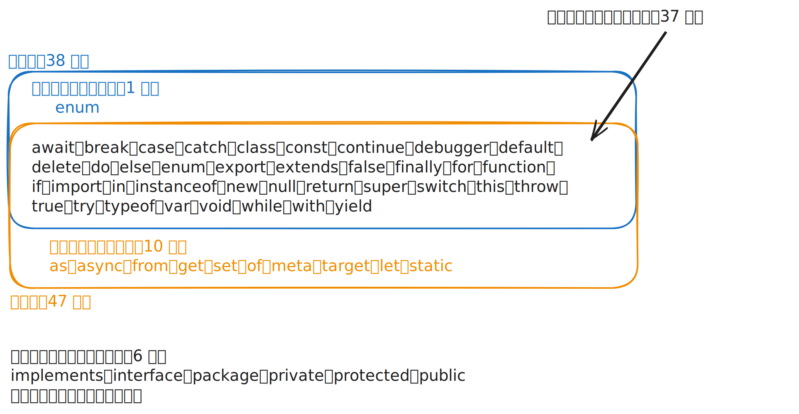

# [0169. 保留字、关键字、未来保留字](https://github.com/tnotesjs/TNotes.javascript/tree/main/notes/0169.%20%E4%BF%9D%E7%95%99%E5%AD%97%E3%80%81%E5%85%B3%E9%94%AE%E5%AD%97%E3%80%81%E6%9C%AA%E6%9D%A5%E4%BF%9D%E7%95%99%E5%AD%97)

<!-- region:toc -->

- [1. 本节内容](#1-本节内容)
- [2. 评价](#2-评价)
- [3. 保留字、关键字、未来保留字，这些术语的官方定义是？](#3-保留字关键字未来保留字这些术语的官方定义是)
  - [3.1. 保留字 `Reserved Words` 的定义](#31-保留字-reserved-words-的定义)
  - [3.2. 关键字 `Keywords` 的定义](#32-关键字-keywords-的定义)
  - [3.3. 未来保留字 `Future Reserved Words` 的定义](#33-未来保留字-future-reserved-words-的定义)
  - [3.4. 关键字和保留字之间的关系是？](#34-关键字和保留字之间的关系是)
    - [保留字（38 个）](#保留字38-个)
    - [既是关键字，又是保留字（37 个）](#既是关键字又是保留字37-个)
    - [是保留字，但不是关键字（1 个）](#是保留字但不是关键字1-个)
    - [既不是关键字也不是保留字，但在严格模式下是未来保留字（6 个）](#既不是关键字也不是保留字但在严格模式下是未来保留字6-个)
    - [是关键字，但不是保留字（10 个）](#是关键字但不是保留字10-个)
  - [3.5. 小结](#35-小结)
- [4. 常见的关键字具体都有哪些？关键字不能用作标识符吗？](#4-常见的关键字具体都有哪些关键字不能用作标识符吗)
  - [4.1. 关键字和标识符](#41-关键字和标识符)
  - [4.2. 常见的关键字](#42-常见的关键字)
  - [4.3. 细节补充：关于 `await` 和 `yield`](#43-细节补充关于-await-和-yield)
  - [4.4. 细节补充：关于上下文关键字](#44-细节补充关于上下文关键字)
  - [4.5. 细节验证](#45-细节验证)
- [5. 引用](#5-引用)

<!-- endregion:toc -->

## 1. 本节内容

- 保留字的定义
- 关键字的定义
- 未来保留字的定义

## 2. 评价

这一节笔记写得挺蛋疼的，明明感觉很简单的一篇笔记但是写了很长时间。因为看到很多教程中对于“保留字、关键字、未来保留字”的描述差异很大，不清楚谁说的是对的，然后就对着 ECMAScript 规范原文一行一行地分析了它们的定义。在记录这篇笔记的过程中，也发现 ECMAScript 规范的一些历史遗留问题，导致了这些术语之间的关系非常混乱，随着后续规范版本的迭代，可能有些词的所属关系又要变了。

如果单论对开发的实际影响的话，我们其实只需要知道有些比较特殊的词不要用来命名就完事儿了，没必要深究这些术语的定义和它们之间的关系。

## 3. 保留字、关键字、未来保留字，这些术语的官方定义是？

::: tip

保留字、关键字、未来保留字，这些术语在很多教程中都有提到，在介绍它们概念的时候往往会混淆不清，甚至直接把它们等同起来了。为了彻底理清它们的关系，我们需要回到 ECMAScript 规范的原文来看看它们的官方定义。

以下提到的官方原文，是目前（2026.05.27）从 ECMAScript 官方规范原文中 `12.7.2 Keywords and Reserved Words` 章节下的内容。

:::

### 3.1. 保留字 `Reserved Words` 的定义

官方原话：A reserved word is an `IdentifierName` that cannot be used as an identifier.

规范在这里非常严谨地定义了 `Reserved Word` 与 `Identifier` 的互斥关系。它明确指出，如果一个词被定性为保留字，它的唯一特征就是丧失了作为标识符（即变量名、函数名等）的资格。

### 3.2. 关键字 `Keywords` 的定义

官方原话：A keyword is a token that matches `IdentifierName`, but also has a syntactic use; that is, it appears literally, in a fixed width font, in some syntactic production.

这里的重点在于 syntactic use（语法用途）。规范认为，只要这个词在代码的“语法产生式”（Syntactic Production）里出现了，它就是一个关键字。它强调的是这个词在 JS 解析引擎眼中的“功能性”，而不是它能不能被命名。

### 3.3. 未来保留字 `Future Reserved Words` 的定义

官方原话：`enum` is not currently used as a keyword in this specification. It is a future reserved word, set aside for use as a keyword in future language extensions.

规范通过对 `enum` 的注释说明了“未来保留字”的本质：

1. 未来保留字现在不是关键字
2. 未来保留字是为了未来扩展而提前预留的
3. `enum` 被归类为 `ReservedWord`，因此禁止用作标识符

注意：未来保留字 ≠ 保留字

### 3.4. 关键字和保留字之间的关系是？

官方原话：Many keywords are reserved words, but some are not, and some are reserved only in certain contexts.

它们的关系不是简单的子集关系，而是一个有交叉的集合关系：



#### 保留字（38 个）

1. `await`
2. `break`
3. `case`
4. `catch`
5. `class`
6. `const`
7. `continue`
8. `debugger`
9. `default`
10. `delete`
11. `do`
12. `else`
13. `enum`
14. `export`
15. `extends`
16. `false`
17. `finally`
18. `for`
19. `function`
20. `if`
21. `import`
22. `in`
23. `instanceof`
24. `new`
25. `null`
26. `return`
27. `super`
28. `switch`
29. `this`
30. `throw`
31. `true`
32. `try`
33. `typeof`
34. `var`
35. `void`
36. `while`
37. `with`
38. `yield`

#### 既是关键字，又是保留字（37 个）

除了上述的 `enum` 之外的 37 个都是。

进一步细分：

- 无条件既是关键字又是保留字：35 个
- 有条件既是关键字又是保留字：`await`、`yield` 2 个

官方原话：All tokens in the ReservedWord list below, except for await and yield, are unconditionally reserved.

它们只在特定上下文中受限制（`async` 函数/模块中 `await` 受限，生成器函数中 `yield` 受限），其余情况可用作标识符。

#### 是保留字，但不是关键字（1 个）

`enum` 是唯一的无条件的未来保留字。

#### 既不是关键字也不是保留字，但在严格模式下是未来保留字（6 个）

1. `implements`
2. `interface`
3. `package`
4. `private`
5. `protected`
6. `public`

#### 是关键字，但不是保留字（10 个）

1. `as`
2. `async`
3. `from`
4. `get`
5. `set`
6. `of`
7. `meta`
8. `target`
9. `let`
10. `static`

### 3.5. 小结

- 如果 x 是保留字，那么 x 不能用作标识符
- 如果 x 是关键字，那么 x 在某些语法结构中有特殊用途
- 如果 x 是未来保留字，那么 x 在严格模式下不能用作标识符（`enum` 除外，它在任何模式下都不能用作标识符，因为它在 `ReservedWord` 列表中）

## 4. 常见的关键字具体都有哪些？关键字不能用作标识符吗？

::: tip

本节的“细节补充”内容不重要，你可以选择性阅读，甚至完全跳过。

“关键字不能被用作标识符”，这句话本身是错误的。如果你想要了解一些相关细节，倒是可以看看“细节补充”部分。

:::

### 4.1. 关键字和标识符

关键字是 ECMAScript 语法已经占用的词。它们有明确用途，常用于控制流程、声明变量、定义类、导入导出模块或执行特定操作。

- ❌ 错误说法：关键字不能用作标识符（变量名、函数名、参数名等）
- ✅ 正确说法：关键字不推荐作标识符（变量名、函数名、参数名等）
  - 如果这个关键字同时也是保留字，那么它不能用作标识符
  - 如果这个关键字不是保留字，那么它可以用作标识符，但不推荐这么做

```js
// ❌ 语法错误（return 是保留字）
const return = 1

// ⚠️ 语法合法，但不推荐（as 是关键字，但非保留字，因此它可以作为标识符使用）
const as = 1
```

如果一个词已经被语言语法占用，你就应该把它看作“不能拿来命名”的词。

### 4.2. 常见的关键字

| Keyword      | 描述                                                     |
| ------------ | -------------------------------------------------------- |
| `await`      | 等待 Promise 解析，只能在 async 函数或模块顶层使用       |
| `break`      | 立即终止当前循环或 `switch` 语句                         |
| `case`       | 定义 `switch` 语句的一个分支条件                         |
| `catch`      | 捕获 `try` 块中抛出的异常                                |
| `class`      | 声明一个类                                               |
| `const`      | 声明一个块级作用域的常量绑定                             |
| `continue`   | 跳过当前循环迭代，进入下一次迭代                         |
| `debugger`   | 触发调试断点                                             |
| `default`    | 定义 `switch` 的默认分支，或指定模块的默认导出/导入      |
| `delete`     | 删除对象的属性                                           |
| `do`         | 构成 `do…while` 循环，先执行后判断                       |
| `else`       | 定义 `if` 条件不满足时的执行分支                         |
| `export`     | 从模块中导出命名或默认成员                               |
| `extends`    | 建立类的原型继承关系                                     |
| `finally`    | 定义 `try…catch` 结构中无论是否异常都会执行的收尾块      |
| `for`        | 创建循环结构（`for`、`for…in`、`for…of`）                |
| `function`   | 声明函数或函数表达式                                     |
| `if`         | 根据条件判断执行相应代码块                               |
| `import`     | 从其他模块导入绑定                                       |
| `in`         | 检查属性是否存在于对象中（运算符），或用于 `for…in` 循环 |
| `instanceof` | 检查构造函数的 `prototype` 是否出现在对象的原型链中      |
| `let`        | 声明一个块级作用域的变量绑定                             |
| `new`        | 创建构造函数的实例                                       |
| `return`     | 终止函数执行并返回一个值                                 |
| `super`      | 引用父类的构造函数或原型方法                             |
| `switch`     | 根据表达式的值进行多分支匹配                             |
| `this`       | 引用当前执行上下文的对象                                 |
| `throw`      | 抛出一个用户自定义的异常                                 |
| `try`        | 包裹可能抛出异常的代码块                                 |
| `typeof`     | 返回操作数类型的字符串表示                               |
| `var`        | 声明一个函数作用域（或全局）的变量                       |
| `void`       | 计算表达式并返回 `undefined`                             |
| `while`      | 在条件为真时重复执行代码块                               |
| `with`       | 扩展当前作用域链（已弃用，严格模式下禁用）               |
| `yield`      | 暂停生成器函数并返回一个值                               |

### 4.3. 细节补充：关于 `await` 和 `yield`

`await` 和 `yield` 是正式的 `Keywords`，但规范在特定场景之外允许它们作为标识符：

- `await` 仅在模块代码或 `async` 函数内受限，在普通脚本（非模块）的其他位置可以当作变量名
- `yield` 仅在严格模式或生成器函数内受限，在非严格模式且非生成器的其他位置可以当作变量名

这些例外非常依赖上下文，实际开发中绝对不要把它们当作变量名使用。

### 4.4. 细节补充：关于上下文关键字

像 `async`、`get`、`set`、`of`、`from` 等词不属于严格意义上的关键字或未来保留字。它们只在特定语法结构中有特殊含义（如 `async function`、`get prop()`、`for...of`），在其他地方完全可以合法用作变量名（例如 `const async = 1`）。

### 4.5. 细节验证

你可以在浏览器控制台直接执行以下程序加以验证：

```js
const async = 1
const get = 1
const set = 1
const of = 1
const from = 1
const yield = 1
console.log(async, get, set, of, from, yield)
// 1 1 1 1 1 1
```


不过有一点需要注意，如果 `await` 会比较特殊：「`await` 仅在模块代码或 `async` 函数内受限，在普通脚本（非模块）的其他位置可以当作变量名」 <= 这句话在规范层面是对的，但在浏览器控制台这个具体场景下，大概率会报错。

| 场景 | 执行上下文 | `const await = 1` 是否合法 |
| --- | --- | --- |
| 规范中的普通 `<script>` 标签 | `Script`（非 `Module`） | ✅ 合法 |
| 规范中的 `<script type="module">` | `Module` | ❌ 语法错误 |
| 现代浏览器控制台（Chrome/Firefox/Edge） | 模拟模块/顶层 await 上下文 | ❌ 大概率报错 |

现代浏览器控制台为了支持顶层 await（如直接输入 `await fetch('/')`），通常会把你的输入代码当作模块代码处理，或者包裹在一个隐式的 async 环境中。因此，在控制台里 `await` 实际上是被当作关键字保留的。


但在一个普通的 HTML 文件里的普通 `<script>` 标签中是合法的：

```html
<!doctype html>
<html>
  <head></head>
  <body>
    <script>
      const await = 1 // ✅ 不会报错（在非模块脚本中）
      console.log(await)
    </script>
  </body>
</html>
```


## 5. 引用

- [ECMAScript - Lexical Grammar - Names and Keywords][1]

[1]: https://tc39.es/ecma262/#sec-names-and-keywords
