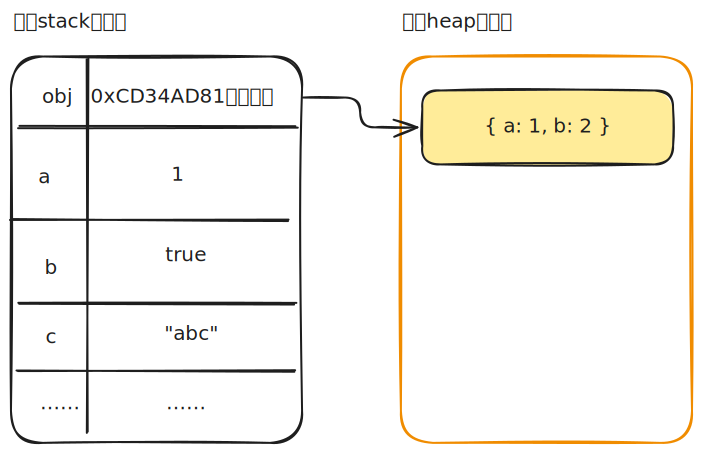

# [0170. 变量](https://github.com/tnotesjs/TNotes.javascript/tree/main/notes/0170.%20%E5%8F%98%E9%87%8F)

<!-- region:toc -->

- [1. 🎯 本节内容](#1--本节内容)
- [2. 🫧 评价](#2--评价)
- [3. 💡 笔记知识点小结](#3--笔记知识点小结)
- [4. 🤔 内存、变量、值，三者之间的关系是？](#4--内存变量值三者之间的关系是)
- [5. 🤔 JavaScript 变量为什么说是松散类型的？](#5--javascript-变量为什么说是松散类型的)
- [6. 🤔 `var` 是什么？](#6--var-是什么)
  - [6.1. `var` 关键字](#61-var-关键字)
  - [6.2. `var` 关键字的作用域特性](#62-var-关键字的作用域特性)
  - [6.3. 小结](#63-小结)
- [7. 🤔 `let` 是什么？](#7--let-是什么)
  - [7.1. let 关键字](#71-let-关键字)
  - [7.2. 块级作用域](#72-块级作用域)
- [8. 🤔 用 `var` 声明的循环变量在循环中会出现什么问题？为什么使用 `let` 可以就可以解决此问题？【经典历史闭包陷阱问题】](#8--用-var-声明的循环变量在循环中会出现什么问题为什么使用-let-可以就可以解决此问题经典历史闭包陷阱问题)
- [9. 🤔 `const` 是什么？](#9--const-是什么)
  - [9.1. const 关键字](#91-const-关键字)
  - [9.2. const 的 “常量约束” 本质](#92-const-的-常量约束-本质)
    - [原始类型](#原始类型)
    - [引用类型](#引用类型)
    - [栈内存、堆内存](#栈内存堆内存)
- [10. 🤔 现代开发应该使用哪个（`const`、`let`、`var`）来声明变量？](#10--现代开发应该使用哪个constletvar来声明变量)
- [11. 💼 面试题：请谈谈 `var`、`let`、`const`](#11--面试题请谈谈-varletconst)
- [12. 💻 demos.1 - `var` - 理解变量和值](#12--demos1---var---理解变量和值)
- [13. 💻 demos.2 - `var` - 区分大小写](#13--demos2---var---区分大小写)
- [14. 💻 demos.3 - `var` - 变量的声明、赋值](#14--demos3---var---变量的声明赋值)
- [15. 💻 demos.4 - `var` - 仅声明未赋值为 undefined](#15--demos4---var---仅声明未赋值为-undefined)
- [16. 💻 demos.5 - `var` - 隐式创建全局变量](#16--demos5---var---隐式创建全局变量)
- [17. 💻 demos.6 - `var` - 使用未声明的变量会报错](#17--demos6---var---使用未声明的变量会报错)
- [18. 💻 demos.7 - `var` - 可一次声明多个变量](#18--demos7---var---可一次声明多个变量)
- [19. 💻 demos.8 - `var` - 理解“动态”类型](#19--demos8---var---理解动态类型)
- [20. 💻 demos.9 - `var` - 变量重复声明无效](#20--demos9---var---变量重复声明无效)
- [21. 💻 demos.10 - `var` - 变量重复声明并重新赋值](#21--demos10---var---变量重复声明并重新赋值)
- [22. 💻 demos.11 - `var` - 作用域特性](#22--demos11---var---作用域特性)
- [23. 💻 demos.12 - `let` - 块级作用域](#23--demos12---let---块级作用域)
- [24. 💻 demos.13 - `let` - 使用 var、let 定义 for 循环的循环变量](#24--demos13---let---使用-varlet-定义-for-循环的循环变量)
- [25. 💻 demos.14 - `let` - let 暂时性死区](#25--demos14---let---let-暂时性死区)
- [26. 💻 demos.15 - `let` - 函数参数默认值中的死区](#26--demos15---let---函数参数默认值中的死区)
- [27. 💻 demos.16 - `let` - 其他奇怪的报错](#27--demos16---let---其他奇怪的报错)
- [28. 💻 demos.17 - `let` - 同一作用域内不允许重复声明](#28--demos17---let---同一作用域内不允许重复声明)
- [29. 💻 demos.18 - `let` - for 循环的特别之处](#29--demos18---let---for-循环的特别之处)
- [30. 💻 demos.19 - `let` - let 出现之前的一些历史问题](#30--demos19---let---let-出现之前的一些历史问题)
- [31. 💻 demos.20 - 常量不允许重新赋值](#31--demos20---常量不允许重新赋值)
- [32. 💻 demos.21 - 声明的同时完成初始化赋值](#32--demos21---声明的同时完成初始化赋值)
- [33. 💻 demos.22 - 引用类型，确保地址不变](#33--demos22---引用类型确保地址不变)
- [34. 💻 demos.23 - 对象冻结](#34--demos23---对象冻结)

<!-- endregion:toc -->

## 1. 🎯 本节内容

- 变量
- 内存
- 值
- 动态类型
- `var`
- `let`
- `const`
- 经典的“闭包陷阱”问题
- 块级作用域
- 暂时性死区（TDZ）
- 对象冻结 `Object.freeze`
- 对象深度冻结（递归方式）
- 栈内存
- 堆内存

## 2. 🫧 评价

变量这一节最值得抓住的不是“怎么声明”，而是“声明后这个名字在哪儿有效、什么时候可访问、能不能重新赋值”。`var`、`let`、`const` 的差异，本质上都是作用域和可变性差异。

---

var 关键字和变量：

- 本节主要介绍“变量”相关的基础知识点，比如内存、变量、值的概念，以及 var 关键字的使用。
- 内存、变量、值，这些概念是基础的通识，在学习其他编程语言时也一样会接触到。
- “思维导图”部分对本节的核心内容做了汇总，可以全屏放大后搂一眼，了解笔记的大致内容。
- 文中还提到了 let、const 关键字，有关它们的介绍请见后续笔记内容。
- 🤔 如何看待 var？
  - 虽然说 var 关键字已经退出历史舞台了，但是在一些开源项目中，还是会看到 var 的身影，所以还是 有必要了解 var 关键字的一些基本特性，目的是为了能读懂别人用到 var 的程序。
  - 可能会看到 var 的场景：
    - 项目起步时间比较早，年代比较久远；
    - 项目中的核心语言并非 js，只需要用 js 实现很简单的脚本逻辑即可，var 这些被我们看似“弊端”的灵活特性，正是脚本所需要的。

## 3. 💡 笔记知识点小结

- 核心概念
  - 变量的本质
    - 变量可以看作是内存空间的引用，它代表了一个存储在内存中的数据值。
    - 每个变量都关联一个特定的内存位置，这个位置存储了变量的值。
    - 任何可以书写数值的地方，都可以书写变量。
  - 定义变量的本质
    - 定义变量实际上是告诉计算机在内存中为该变量分配一定的空间。
  - 给变量赋值的本质
    - 赋值操作是将某个数据值存储在变量关联的内存空间中。之后，每当我们引用这个变量，计算机就会到内存空间中读取其中的值。
- 自动回收 ♻️
  - 若一个空间没有变量指向它，那么这块空间将被 JS 视作垃圾，会被自动回收。
- 语法糖
  - 变量可以在声明的时候同时完成赋值操作（语法糖）。
  - 本质上是两步操作 —— 声明 + 赋值
- 定义变量
  - var
    - 使用 var 关键字声明的变量的值是可变的，变量可以被重新赋值，新的值会覆盖原来的值。
    - 还有很多细节……（不过不太重要，现阶段来看它已经 out 了，推荐使用 let、const 来声明变量。）
    - var 不推荐
  - let
    - 有块级作用域
    - 有暂时性死区
    - 声明的变量可以被重新赋值
    - let 推荐
  - const
    - 有块级作用域
    - 有暂时性死区
    - 声明的变量可以被赋值，但一旦赋值后不可更改，可以作为“常量”。
    - const 推荐
- 访问不存在的变量
  - 若使用一个未声明（不存在）的变量，会导致错误。
  - 特殊情况：使用 typeof 检测变量的数据类型时，可以是未声明的变量，得到的结果是 "undefined"。
- 声明提升
  - 变量和函数的声明在代码执行前会被移动到它们所在作用域的顶部。
  - 这种提升不会超越脚本块的顶端。

## 4. 🤔 内存、变量、值，三者之间的关系是？

在编程中，变量（门牌号）指向内存中的特定位置（房间），这个位置中存储的内容（房间里的东西）就是值。

- 内存 👉🏻 酒店 -> 内存就像一栋酒店，有很多房间（存储空间）供客人使用。
- 变量 👉🏻 门牌 -> 变量就像房间的门牌号，用来标识和找到特定的房间。
- 值 👉🏻 房间里的东西 -> 值就像房间里的东西，可以是家具、家电等，是实际存储在房间（内存）里的内容。

::: swiper


:::

## 5. 🤔 JavaScript 变量为什么说是松散类型的？

JavaScript 变量是松散类型的（也称“动态类型”）。变量本身不固定绑定某一种数据类型，它只是某个值的名字。

也就是说，同一个变量可以先保存字符串，再保存数值：

```js
let message = 'hi'
message = 100
```

这种写法是合法的，但不推荐随意改变同一个变量保存的值类型。因为变量名通常承载语义，如果 `message` 一会儿是字符串、一会儿是数字，读代码的人很难判断它到底代表什么。

## 6. 🤔 `var` 是什么？

### 6.1. `var` 关键字

`var` 是早期 ECMAScript 中声明变量的主要方式。它有两个非常重要的特征：函数作用域和声明提升。

使用 `var` 在函数内部声明变量时，这个变量属于当前函数：

```js
function test() {
  var message = 'hi'
}

test()
console.log(message) // ❌ ReferenceError: message is not defined
```

如果省略 `var` 直接赋值，在非严格模式下可能意外创建全局变量：

```js
function test() {
  message = 'hi'
}

test()
console.log(message) // 'hi'
```

这是非常不推荐的写法。严格模式下，给未声明变量赋值会抛出错误。

`var` 还有声明提升行为：

```js
console.log(age) // undefined
var age = 26
```

在变量环境的创建阶段，变量绑定已建立，初始值为 `undefined`，执行阶段才执行赋值。

运行时可以把它理解成：

```js
var age
console.log(age)
age = 26
```

声明被提升了，赋值没有提升。这就是很多 `var` 代码容易让人误读的原因。

### 6.2. `var` 关键字的作用域特性

- 函数作用域：当 `var` 在函数内部声明时，它的作用域仅限于该函数内。这意味着只能在声明它的函数内部访问该变量。
- 全局作用域：如果 `var` 在任何函数外部声明，则它具有全局作用域，可以在代码的任何地方访问该变量，甚至在浏览器环境中会成为 `window` 对象的属性。
- 提前初始化（Hoisting）：`var` 声明会被提升到其作用域的顶部，但赋值不会被提升。因此，在声明之前访问变量会导致其值为 `undefined` 而不是报错。
- 可重复声明：在同一作用域中可以多次使用 `var` 声明同名变量，后面的声明不会报错
  - 如果后面的声明没有赋值，则不会覆盖之前的声明，相当于后面的声明不存在
  - 如果后面的声明有赋值，依旧不会覆盖之前的声明，声明还是只有一个，后面的声明相当于修改了变量的值，在该声明之后访问变量时，得到的是更新之后的值

### 6.3. 小结

对 `var` 关键字有个简单的了解即可，`var` 基本算是退出历史舞台了。

ES6 推出了两个新的用于定义变量的关键字 `let`、`const`，它们解决了 `var` 关键字在定义变量时的诸多“问题”。为了方便相关知识点的介绍，后续部分笔记中依旧会刻意使用 `var` 来声明变量。但是，在实际工作中，不推荐使用 `var` 来声明变量，应该使用 `let`、`const`。

到底什么时候使用 `let`、什么时候使用 `const`，这些在后面的笔记中都会介绍到。这里可以简单提一嘴：

- `let` 用来声明“变”量 -> 也就是那些可能会被重新赋值的变量。
- `const` 用来声明“常”量 -> 就是那些在初始化好之后，咱们不会再去改变它的值的变量。

## 7. 🤔 `let` 是什么？

### 7.1. let 关键字

在 let、const 关键字出现之前，定义变量只能使用 var 关键字，var 这玩意儿存在不少问题，有很多经典的历史问题在 let、const 出现之后都引刃而解了。

let 具有块级作用域，声明的变量有暂时性死区，虽然变量声明提升了，但无法在声明语句之前访问变量，更加符合直觉。

::: tip

块级作用域和暂时性死区也是 `const` 关键字具有的的特性。

:::

### 7.2. 块级作用域

`let` 和 `var` 都可以声明变量，但 `let` 是块级作用域。

```js
if (true) {
  let age = 26
}

console.log(age) // ❌ ReferenceError: age is not defined
```

块级作用域让变量的有效范围更小，也更贴近实际使用位置。

`let` 还不允许在同一个块作用域中重复声明同名变量：

```js
let count = 1
let count = 2 // ❌ SyntaxError: Identifier 'count' has already been declared
```

另一个重要概念是暂时性死区。在 `let` 声明执行之前，即使 JavaScript 引擎已经知道这个变量会被声明，也不能访问它：

```js
console.log(age) // ❌ ReferenceError: age is not defined
let age = 26
```

这能避免很多“声明前读取到 `undefined`”的隐蔽问题。

## 8. 🤔 用 `var` 声明的循环变量在循环中会出现什么问题？为什么使用 `let` 可以就可以解决此问题？【经典历史闭包陷阱问题】

`var` 声明的循环变量会泄漏到循环外部：

```js
for (var i = 0; i < 5; i++) {}
console.log(i) // 5
```

使用 `let` 后，循环变量只存在于循环块内部：

```js
for (let i = 0; i < 5; i++) {}
console.log(i) // ❌ ReferenceError: i is not defined
```

`let` 还能解决经典的异步循环变量问题：

```js
// 如果使用 var
for (var i = 0; i < 3; i++) {
  setTimeout(() => console.log(i), 0)
}
// 依次输出：3、3、3
// setTimeout 的回调函数形成了闭包，它们共享同一个 i 变量，循环结束时 i 的值是 3，所以回调函数中访问到的 i 都是 3。

for (let i = 0; i < 3; i++) {
  setTimeout(() => console.log(i), 0)
}

// 依次输出：0、1、2
// let 具有块级作用域，每次迭代都会创建新的绑定，因此每个回调函数捕获的是当次迭代自己的 i，而不是共享同一个变量。
```

## 9. 🤔 `const` 是什么？

### 9.1. const 关键字

- const 声明的变量是一个只读的常量。一旦声明，常量的值就不能改变。
- const 声明的变量，必须在声明的同时完成初始化赋值。
- const 声明的变量具有块级作用域。
- const 声明的变量具有暂时性死区。
- const 不能重复声明同名变量。

### 9.2. const 的 “常量约束” 本质

const 实际上保证的，并不是变量的值不得改动，而是变量指向的那个内存地址所保存的数据不得改动。

- 对于“原始类型”的数据（数值、字符串、布尔值），值就保存在变量指向的那个内存地址，因此等同于常量。
- 对于“引用类型”的数据（主要是对象和数组），变量指向的内存地址，保存的只是一个指向实际数据的指针，const 只能保证这个指针是固定的（即总是指向另一个固定的地址），至于它指向的数据结构是不是可变的，就完全不能控制了。

#### 原始类型

`const` 声明的变量必须在声明时初始化，并且之后不能重新赋值：

```js
const age = 26
age = 36 // ❌ TypeError: Assignment to constant variable.
```

#### 引用类型

`const` 限制的是变量绑定本身，不是对象内部内容。

```js
const person = {}
person.name = 'Ada'

console.log(person.name) // 'Ada'
```

这里没有重新给 `person` 赋一个新对象，只是修改了它引用的对象内容，因此是允许的。

如果希望对象本身也不能被修改，可以考虑 `Object.freeze()`，但这属于对象层面的限制，不是 `const` 自己提供的能力。

#### 栈内存、堆内存

数据类型分为：

- 原始数据类型（也叫基本数据类型），比如：String、Number、Boolean、Null、Undefined、Symbol、BigInt，直接存储在栈（stack）中的数据。
- 引用数据类型，比如：Object、Array、Function，真实的数据存放在堆（heap）内存里，在栈中存储的是该对象在堆的引用。

这里之所以要介绍“栈内存”和“堆内存”，是为了更好地理解 `const` 的“常量约束”本质。使用 `const` 声明的变量，我们不能修改的是它的栈内存中的数据。

<!--  -->



- 原始数据类型的“值”直接存储在栈内存中，因此对于原始数据类型而言，`const` 声明的变量就是常量，a、b、c 都不能修改。
- 引用数据类型的“值”存储在堆内存中，在栈中存储的是指向堆内存的指针（该指针指向堆中该实体的起始地址），因此 `obj = xxx` 不允许，但是 `obj.a = xxx`、`obj.b = xxx` 是允许的（因为这并没有改变栈内存中的值）。

## 10. 🤔 现代开发应该使用哪个（`const`、`let`、`var`）来声明变量？

现代 JavaScript 的常见实践是：`const` 优先，`let` 次之，尽量不用 `var`。

可以这样判断：

| 场景                     | 推荐声明   |
| ------------------------ | ---------- |
| 声明后不会重新赋值       | `const`    |
| 后续需要重新赋值         | `let`      |
| 维护旧代码或理解历史行为 | 了解 `var` |

`const` 优先的好处是让变量意图更明确。读者看到 `const`，就知道这个变量绑定不会被重新指向其他值；如果后面有人误赋值，运行时也会尽早报错。

## 11. 💼 面试题：请谈谈 `var`、`let`、`const`

相同点：`var`、`let`、`const` 三者都可以声明变量。

差异：

- `var` 基本算是淘汰了，现在主要使用 `let`、`const` 来声明变量。
- `var`、`let` 允许我们先声明，后赋值。但是，`const` 必须在声明变量的同时完成初始化。

|         | 作用     | 作用域     | 暂时性死区 | 重复声明变量 | 全局属性 |
| ------- | -------- | ---------- | ---------- | ------------ | -------- |
| `const` | 声明常量 | 块级作用域 | ✅         | ❌           | ❌       |
| `let`   | 声明变量 | 块级作用域 | ✅         | ❌           | ❌       |
| `var`   | 声明变量 | 函数作用域 | ❌         | ✅           | ✅       |

函数作用域、重复声明、全局属性：

- 当 `var` 在函数内部声明时，它的作用域仅限于该函数内。这意味着只能在声明它的函数内部访问该变量。
- 如果 `var` 在任何函数外部声明（相当于在全局函数中声明），则它具有全局作用域，可以在代码的任何地方访问该变量，甚至在浏览器环境中会成为 `window` 对象的属性。

```javascript
function example() {
  console.log(x) // undefined
  var x = 10
  if (true) {
    var x = 20 // 重新声明同一变量
    console.log(x) // 20
  }
  console.log(x) // 20
}

example()
```

- 暂时性死区：Temporal dead zone（TDZ）

```javascript
// -- let 或者 const --
console.log(person) // 会报错

let person = {
  name: 'Lucy',
}
// 从一个代码块的开始直到代码执行到声明变量的行之前，
// let 或 const 声明的变量都处于“暂时性死区中。
// 使用 const 声明变量，如果在声明前使用，表现与 let 一致。
// 简单理解：let 或 const 只能先声明再访问。

// -- var --
console.log(person2) // 不会报错

var person2 = {
  name: 'Lucy',
}
// var 声明的全局变量会进行变量提升
```

- 全局属性：是否会被添加到 `window` 或 `globalThis` 等对象中

```javascript
var name = 'Lucy'
console.log(window.name) // Lucy
console.log(globalThis.name) // Lucy

const age = 12
console.log(window.age) // undefined
console.log(globalThis.age) // undefined

let gender = 'female'
console.log(window.gender) // undefined
console.log(globalThis.gender) // undefined

// var 声明的变量会被添加到全局对象中，
// 可以使用 window 和 globalThis 访问。

// let 和 const 声明的全局变量则不会添加到全局对象中。
```

## 12. 💻 demos.1 - `var` - 理解变量和值

```js
var a = 1

/*
如何理解变量和值？
变量是对“值”的具名引用。
变量就是为“值”起名，然后引用这个名字，就等同于引用这个值。
变量的名字就是变量名。

var a = 1; 如何理解这行代码？
代码先声明变量 a
然后在变量 a 与数值 1 之间建立引用关系
称为将数值 1 “赋值” 给变量 a
之后引用变量名 a 就会得到数值 1

var a = 1; 这行代码中，最前面的 var 是什么？
最前面的 var 是变量声明命令。
var 表示通知解释引擎，要创建一个变量 a。
*/
```

## 13. 💻 demos.2 - `var` - 区分大小写

```js
var a = 1
var A = 2

console.log(a)
// 1

console.log(A)
// 2

/*
js 的变量名区分大小写
A 和 a 是两个不同的变量
*/
```

## 14. 💻 demos.3 - `var` - 变量的声明、赋值

```js
// var a = 1
var a
a = 1

/*
变量的声明和赋值，是分开的两个步骤。

var a = 1;

上面的代码将它们合在了一起，实际的步骤是下面这样。

var a;
a = 1;
*/
```

## 15. 💻 demos.4 - `var` - 仅声明未赋值为 undefined

```js
var a
console.log(a)
// undefined

/*
如果只是声明变量而没有赋值，则该变量的值是 undefined。
undefined 是一个特殊的值，表示“无定义”。
*/
```

## 16. 💻 demos.5 - `var` - 隐式创建全局变量

```js
// var a = 1;
a = 1

/*
JS 是很灵活的，在声明变量的时候，如果忘记了 var 命令，JS 会自动创建一个全局变量。

写法 1：
var a = 1;

写法 2：
a = 1;

上述两种写法，基本等效。
但是，写法 2 会创建一个全局变量，而写法 1 不会。
切记，你几乎没有任何理由使用【写法 2】这种写法，因为它会创建一个全局变量，这是非常危险的。
*/
```

## 17. 💻 demos.6 - `var` - 使用未声明的变量会报错

```js
a // ❌ ReferenceError: a is not defined

/*
如果一个变量没有声明就直接使用，js 会报错，告诉你变量未定义。
如果直接使用不存在的变量 a，系统将会报错，告诉你变量 a 没有声明。
*/
```

## 18. 💻 demos.7 - `var` - 可一次声明多个变量

```js
var a, b, c, d

/*
可以在同一条 var 命令中声明多个变量。
多个变量之间用逗号分隔。
*/
```

## 19. 💻 demos.8 - `var` - 理解“动态”类型

```js
var a = 1
a = 'hello' // ok

/*
JavaScript 是一种动态类型语言。
变量的类型没有限制，变量可以随时更改类型。

var a = 1
a = 'hello'

上述写法是 ok 的
一开始 a 存放的值是一个数字类型
然后修改变量 a 的值，改为一个字符串类型
*/
```

## 20. 💻 demos.9 - `var` - 变量重复声明无效

```js
var x = 1
var x // 该语句相当于不存在

console.log(x) // 1

/*
如果使用 var 重新声明一个已经存在的变量，是无效的。
你可以认为重复声明的语句不存在。

var x = 1
var x

你可以认为第二次声明 x 的语句不存在
*/
```

## 21. 💻 demos.10 - `var` - 变量重复声明并重新赋值

```js
var x = 1

console.log(x)
// 1

var x = 2

console.log(x)
// 2

/*
如果使用 var 重复声明同一个变量
并且重复声明的时候还进行了赋值
那么重复声明则会覆盖掉前面的语句

var x = 1
var x = 2

第二次声明时进行了赋值操作（声明的同时进行初始化操作）
赋的值会覆盖先前的值

下面两种写法是等效的。

【写法 1】
var x = 1
var x = 2

【写法 2】
var x = 1
var x // 相当于不存在
x = 2
*/
```

## 22. 💻 demos.11 - `var` - 作用域特性

```js {3,6}
function example() {
  console.log(x) // undefined
  var x = 10
  console.log(x) // 10
  if (true) {
    var x = 20 // 重新声明同一变量
    console.log(x) // 20
  }
  console.log(x) // 20
}

example()
// undefined
// 10
// 20
// 20
```

在这个例子中，`x` 的值在函数范围内始终可见，并且在 `if` 块中再次声明 `x` 不会创建新的变量，而是修改同一个变量。

上述写法相当于：

```js
function example() {
  var x
  console.log(x) // undefined
  x = 10
  console.log(x) // 10
  if (true) {
    x = 20 // 修改同一变量
    console.log(x) // 20
  }
  console.log(x) // 20
}
example()
// undefined
// 10
// 20
// 20
```

## 23. 💻 demos.12 - `let` - 块级作用域

```js
{
  let a = 10
  var b = 1
}

// console.log(a) // ❌ ReferenceError: a is not defined.
console.log(b) // 1

// let 具有块级作用域

// ES6 新增了 let 命令，用来声明变量。
// let 的用法类似于 var，但是所声明的变量，只在 let 命令所在的代码块内有效。

// 上面代码在代码块之中，分别用 let 和 var 声明了两个变量。
// 然后在代码块之外调用这两个变量，结果 let 声明的变量报错，var 声明的变量返回了正确的值。
// 这表明，let 声明的变量只在它所在的代码块有效。
```

## 24. 💻 demos.13 - `let` - 使用 var、let 定义 for 循环的循环变量

::: code-group

```js [1]
for (let i = 0; i < 10; i++) {
  // ...
  // 在这里可以正常访问 i
}

// 出了块级作用域之后，将无法访问到 i。
// console.log(i)
// ❌ ReferenceError: i is not defined

// for 循环的计数器，就很合适使用 let 命令。
// 上面代码中，计数器 i 只在 for 循环体内有效，在循环体外引用就会报错。
// 这种行为，也是更加符合我们认知的。
```

```js [2]
var a = []
for (var i = 0; i < 10; i++) {
  a[i] = function () {
    console.log(i)
  }
}
a[6]() // 10
console.log(i) // 10

// 如果使用 var，最后输出的是 10。

// 原因分析：

// 来看下下面这段等效代码，你立刻就明白了。
/*
var i // 这个 i 相当于是在全局声明的一个变量。
var a = []
for (i = 0; i < 10; i++) {
  a[i] = function () {
    console.log(i)
  }
}
a[6]() // 10
console.log(i) // 10
*/

// 变量 i 是 var 命令声明的，在全局范围内都有效，所以全局只有一个变量 i。
// 每一次循环，变量 i 的值都会发生改变，而循环内被赋给数组 a 的函数内部的 console.log(i)，里面的 i 指向的就是全局的 i。
// 也就是说，所有数组 a 的成员里面的 i，指向的都是同一个 i，导致运行时输出的是最后一轮的 i 的值，也就是  10。
```

```js [3]
var a = []
for (let i = 0; i < 10; i++) {
  a[i] = function () {
    console.log(i)
  }
}
a[6]() // 6

// 如果使用 let，声明的变量仅在块级作用域内有效，最后输出的是 6。

// 上面代码中，变量 i 是 let 声明的，当前的 i 只在本轮循环有效，所以每一次循环的 i 其实都是一个新的变量，所以最后输出的是 6。
// 这里其实用到了 闭包。
```

:::

## 25. 💻 demos.14 - `let` - let 暂时性死区

::: code-group

```js [1]
// 写法 1：var 的情况
console.log(foo) // undefined
var foo = 2

// 由于 var 声明的变量提升，所以 foo 变量声明提升到顶部，所以 foo 变量在声明之前就存在，值为 undefined。
/*
上述写法 1，等效于下面这种写法：
var foo
console.log(foo)
foo = 2
*/

// 写法 2：let 的情况
console.log(bar) // ❌ 报错 ReferenceError
let bar = 2

// let 声明的变量有暂时性死区，虽然变量声明提升了，但无法在声明语句之前访问变量。
```

```js [2]
var tmp = 123

if (true) {
  tmp = 'abc' // ❌ ReferenceError
  let tmp
}

// 只要块级作用域内存在 let 命令，它所声明的变量就“绑定”（binding）这个区域，不再受外部的影响。
// 虽然存在全局变量 tmp，但是块级作用域内 let 又声明了一个局部变量 tmp，
// 这意味着在 if 语句块内，起作用的是块级作用域内的 let 声明的 tmp，和全局的没有关系，你可以认为全局的 var tmp = 123 这一条语句不存在。
// 因此，在 let 声明变量前，对 tmp 赋值会报错。
```

```js [3]
if (true) {
  // TDZ 开始
  tmp = 'abc' // ❌ ReferenceError
  console.log(tmp) // ❌ ReferenceError
  typeof tmp // ❌ ReferenceError

  let tmp // TDZ 结束
  console.log(tmp) // undefined

  tmp = 123
  console.log(tmp) // 123
}

// 上面代码中，在 let 命令声明变量 tmp 之前，都属于变量 tmp 的“死区”。

// ES6 明确规定，如果区块中存在 let 和 const 命令，这个区块对这些命令声明的变量，从一开始就形成了封闭作用域。凡是在声明之前就使用这些变量，就会报错。
// 在代码块内，使用 let 命令声明变量之前，该变量都是不可用的。
// 这在语法上，称为“暂时性死区”（temporal dead zone，简称 TDZ）。

// typeof undeclared_variable // "undefined"
// 虽然使用 typeof 可以去检测一个还没有声明的变量。（得到结果是 undefined）
// 但是在 “暂时性死区” 中，typeof 是会报错的。
```

```js [4]
if (true) {
  console.log(typeof tmp) // ✅ 不会报错，可以正常打印出 undefined
}

if (true) {
  console.log(typeof tmp) // ❌ ReferenceError: Cannot access 'tmp' before initialization
  let tmp
}

// typeof undeclared_variable // "undefined"
// 虽然使用 typeof 可以去检测一个还没有声明的变量。（得到结果是 undefined）
// 但是在 “暂时性死区” 中，typeof 是会报错的。
```

:::

## 26. 💻 demos.15 - `let` - 函数参数默认值中的死区

```js
function bar(x = y, y = 2) {
  console.log([x, y])
}

bar() // ❌ 报错

function foo(x = 2, y = x) {
  console.log([x, y])
}
foo() // [2, 2]

// 有些“死区”比较隐蔽，不太容易发现。
// 上面代码中，调用 bar 函数之所以报错，是因为参数 x 默认值等于另一个参数 y，而此时 y 还没有声明，属于“死区”。
// 如果 y 的默认值是 x，就不会报错，因为此时 x 已经声明了。
```

## 27. 💻 demos.16 - `let` - 其他奇怪的报错

```js
var x1 = x1 // ok
let x2 = x2 // ❌ ReferenceError: x2 is not defined

// 上面代码报错，也是因为暂时性死区。
// 使用 let 声明变量时，只要变量在还没有声明完成前使用，就会报错。
// 上面这行就属于这个情况，在变量 x2 的声明语句还没有执行完成前，就去取 x 的值，导致报错“”。
```

## 28. 💻 demos.17 - `let` - 同一作用域内不允许重复声明

```js
// 写法 1 ❌ 执行前就会报错
// function func() {
//   let a = 10
//   var a = 1
// }

// 写法 2 ❌ 执行前就会报错
// function func() {
//   let a = 10
//   let a = 1
// }

// 写法 3
// function func(arg) {
//   let arg;
// }
// func() // ❌ 执行时报错

// 写法 4 ok
function func(arg) {
  // 这里相当于新开了一个块作用域
  {
    let arg
  }
}
func() // ok

// let 不允许在相同作用域内，重复声明同一个变量。
// 这也意味着不能在函数内部重新声明参数。
```

## 29. 💻 demos.18 - `let` - for 循环的特别之处

```js
for (let i = 0; i < 3; i++) {
  let i = 'abc'
  console.log(i)
}
// abc
// abc
// abc

// for 循环还有一个特别之处，就是设置循环变量的那部分是一个父作用域，而循环体内部是一个单独的子作用域。
// 上面代码正确运行，输出了 3 次 abc。
// 这表明函数内部的变量 i 与循环变量 i 不在同一个作用域，有各自单独的作用域。
// 同一个作用域不可使用 let 重复声明同一个变量，否则会报错。
```

## 30. 💻 demos.19 - `let` - let 出现之前的一些历史问题

```html
<!DOCTYPE html>
<html lang="en">
  <head>
    <meta charset="UTF-8" />
    <meta name="viewport" content="width=device-width, initial-scale=1.0" />
    <title>Var Example</title>
  </head>
  <body>
    <ul id="var-list">
      <li>Item 1</li>
      <li>Item 2</li>
      <li>Item 3</li>
      <li>Item 4</li>
      <li>Item 5</li>
    </ul>
    <script>
      var listItems = document.querySelectorAll('#var-list li')
      for (var i = 0; i < listItems.length; i++) {
        // 错误写法
        listItems[i].addEventListener('click', function () {
          alert('Item ' + (i + 1) + ' clicked')
        })

        // 正确写法1
        // ;(function (currentIndex) {
        //   listItems[currentIndex].addEventListener('click', function () {
        //     alert('Item ' + (currentIndex + 1) + ' clicked')
        //   })
        // })(i)

        // 正确写法还有很多种，这里介绍的是其中一种使用 IIFE 的方法
      }
    </script>
  </body>
</html>
<!--
需求：点击第几个 li 就弹出几。

这是一个经典的“闭包陷阱”问题。

如果使用的是这种错误的写法，无论点击哪个 li，最终都会提示是第 6 个被点击了。
循环中的事件处理函数引用了变量 i，当点击事件触发时，所有函数访问的 i 都是循环结束后的最终值 6，导致所有事件都显示相同的索引值。
正确的做法是确保每次循环迭代时创建一个新的作用域来保存当前的 i 值。可以通过立即执行函数表达式（IIFE）来实现这一点。
虽然问题能够解决，不过写起来会感觉很别扭。
-->
```

- 
- 

```html
<!DOCTYPE html>
<html lang="en">
  <head>
    <meta charset="UTF-8" />
    <meta name="viewport" content="width=device-width, initial-scale=1.0" />
    <title>Let Example</title>
  </head>
  <body>
    <ul id="let-list">
      <li>Item 1</li>
      <li>Item 2</li>
      <li>Item 3</li>
      <li>Item 4</li>
      <li>Item 5</li>
    </ul>
    <script>
      var listItems = document.querySelectorAll('#let-list li')
      for (let i = 0; i < listItems.length; i++) {
        listItems[i].addEventListener('click', function () {
          alert('Item ' + (i + 1) + ' clicked')
        })
      }
    </script>
  </body>
</html>
<!--
只需要把 var 改为 let 即可。
接下来在写 for 循环的时候，都使用 let 关键字来定义循环变量名。
在开发项目时，要求你必须使用 var 关键字的场景是很难遇到的。
-->
```

## 31. 💻 demos.20 - 常量不允许重新赋值

```js
const PI = 3.1415
console.log(PI) // 3.1415

PI = 3 // ❌ TypeError: Assignment to constant variable.

// 上面代码表明改变常量的值会报错。
```

## 32. 💻 demos.21 - 声明的同时完成初始化赋值

```js
const foo // ❌ SyntaxError: Missing initializer in const declaration

// const 声明的变量不得改变值
// 这意味着，const 一旦声明变量，就必须立即初始化，不能留到以后赋值。

// 对于 const 来说，只声明不赋值，就会报错。
```

## 33. 💻 demos.22 - 引用类型，确保地址不变

::: code-group

```js [1]
const foo = {}

console.log(foo) // {}

foo.prop = 123 // 为 foo 添加一个属性，可以成功，因为地址没变。

console.log(foo) // { prop: 123 }

foo = {} // ❌ TypeError: "foo" is read-only

/*
const foo = {}

foo = {}
将 foo 指向另一个对象，就会报错

上面代码中，常量 foo 储存的是一个地址，这个地址指向一个对象。
不可变的只是这个地址，即不能把 foo 指向另一个地址，但对象本身是可变的，所以依然可以为其添加新属性。
*/
```

```js [2]
const arr = []
arr.push('Hello') // ✅ 因为地址没变
arr.length = 0 // ✅ 因为地址没变
arr = ['Dave'] // ❌ 因为地址变了

/*
上面代码中，常量 arr 是一个数组类型。
arr 数组本身是可写的，但是如果将另一个新数组赋值给 arr 就会报错，因为新数组的地址和原数组的地址不同。

补充：数组类型本该是定长的，但是在 js 中，我们可以自由改变数组长度（JS 解释器会帮我们自动完成扩容等行为）。
*/
```

:::

## 34. 💻 demos.23 - 对象冻结

::: code-group

```js [1]
// 'use strict'
const foo = Object.freeze({})

console.log(foo) // {}

foo.prop = 123 // 严格模式会报错
// ❌ TypeError: Cannot add property prop, object is not extensible

console.log(foo) // {}

/*
const foo = Object.freeze({})
如果真的想将对象冻结，应该使用 Object.freeze 方法。

foo.prop = 123
常规模式时，这一行不起作用；严格模式时，该行会报错。

'use strict'
在文件头部加上这个语句，就可以进入严格模式。

上面代码中，常量 foo 指向一个冻结的对象，所以添加新属性不起作用，严格模式时还会报错。
*/
```

```js [2]
var constantize = (obj) => {
  Object.freeze(obj)
  Object.keys(obj).forEach((key, i) => {
    if (typeof obj[key] === 'object') {
      // 是引用类型
      constantize(obj[key]) // 递归
    }
  })
}

// 除了将对象本身冻结，对象的属性也应该冻结。
// 通过上述做法，可以将一个对象彻底冻结。
```

:::
